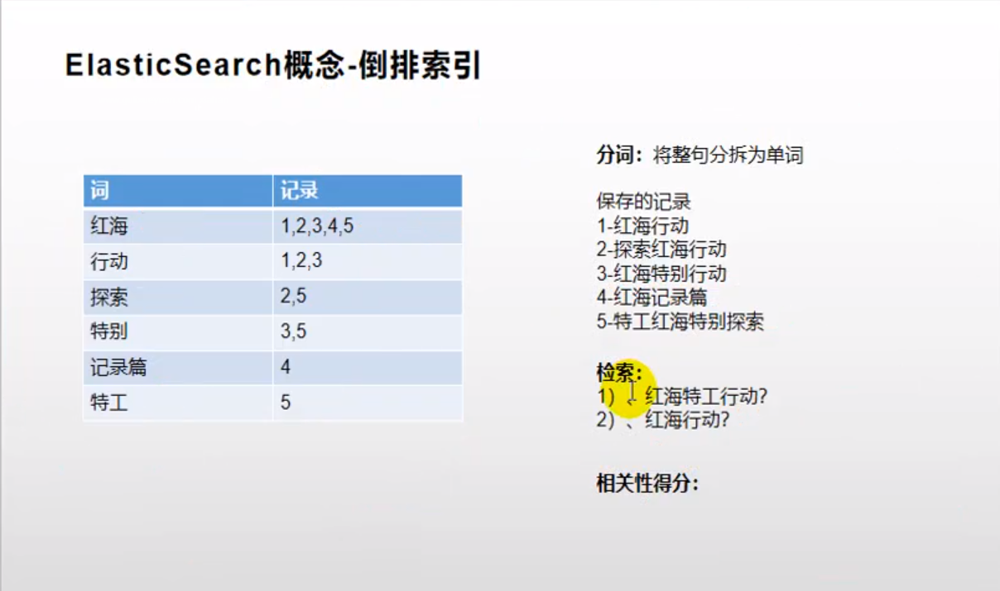

ElasticSearch

# 一：与MySql对比

|      | MySQL | ElasticSearch |
| ---- | ----- | ------------- |
|      | 库    | 索引          |
|      | 表    | 类型          |
|      | 一行  | 文档          |
|      | 列    | 属性          |

# 二：为什么快？



# 三：下载&安装

## 1. docker 下载

```shell
## elasticsearch镜像
[root@localhost ~]# docker pull elasticsearch:7.4.2
## 可视化界面镜像
[root@localhost ~]# docker pull kibana:7.4.2

## free -m
[root@localhost ~]# free -m
  一、从系统层面分析
    Mem:内存的使用情况总览表。
    totel:机器总的物理内存 单位为：M
    used：用掉的内存。
    free:空闲的物理内存。
    注：物理内存(totel)=系统看到的用掉的内存(used)+系统看到空闲的内存(free)
      我们平时看内存的使用也就看这些。
  二、从程序的角度分析
    shared:多个进程共享的内存总和，当前废弃不用。
    buffers：缓存内存数。
    cached:  缓存内存数。
    注：程序预留的内存=buffers+cache
```

## 2. 安装

```shell
## 安装elasticsearch
[root@localhost opt]# mkdir -p /opt/elasticsearch/config
[root@localhost opt]# mkdir -p /opt/elasticsearch/data
[root@localhost opt]# mkdir -p /opt/elasticsearch/plugins
[root@localhost opt]# echo "http.host: 0.0.0.0">>/opt/elasticsearch/config/elasticsearch.yml
[root@localhost config]# docker run --name elasticsearch -p 9200:9200 -p 9300:9300 -e "discovery.type=single-node" -e ES_JAVA_OPTS="-Xms64m -Xmx512m" --privileged=true -v /opt/elasticsearch/config/elasticsearch.yml:/usr/share/elasticsearch/config/elasticsearch.yml -v /opt/elasticsearch/data:/usr/share/elasticsearch/data -v /opt/elasticsearch/plugins:/usr/share/elasticsearch/plugins -d elasticsearch:7.4.2
## 解释
--privileged=true 提高权限，便于文件挂载
-p 9200:9200 http请求
-p 9300:9300 分布式节点下，通信端口
-e "discovery.type=single-node" 单节点运行
-e ES_JAVA_OPTS="-Xms64m -Xmx128m" 初始化 64M 最大化128M。不然启动就会占用所有内存
## 出错解决（权限问题）：Caused by: java.nio.file.AccessDeniedException: /usr/share/elasticsearch/data/nodes",
[root@localhost config]# chmod -R 777 /opt/elasticsearch/
[root@localhost config]# cd /opt/elasticsearch/
[root@localhost elasticsearch]# ll
total 0
drwxrwxrwx. 2 root root 31 Oct 19 05:28 config
drwxrwxrwx. 2 root root  6 Oct 19 05:06 data
drwxrwxrwx. 2 root root  6 Oct 19 05:14 plugins
## 重新启动
[root@localhost elasticsearch]# docker start 95b691a313f2
## 验证：浏览器输入 192.168.110.100:9200
{
  "name" : "95b691a313f2",
  "cluster_name" : "elasticsearch",
  "cluster_uuid" : "zSyrR0J5RWeomjlxSIzOjA",
  "version" : {
    "number" : "7.4.2",
    "build_flavor" : "default",
    "build_type" : "docker",
    "build_hash" : "2f90bbf7b93631e52bafb59b3b049cb44ec25e96",
    "build_date" : "2019-10-28T20:40:44.881551Z",
    "build_snapshot" : false,
    "lucene_version" : "8.2.0",
    "minimum_wire_compatibility_version" : "6.8.0",
    "minimum_index_compatibility_version" : "6.0.0-beta1"
  },
  "tagline" : "You Know, for Search"
}

## 安装kibana
[root@localhost elasticsearch]# docker run --name kibana -e ELASTICSEARCH_HOSTS=http://192.168.110.100:9200 -p 5601:5601 -d kibana:7.4.2
## 修改主机
http://192.168.110.100:9200  一定要将主机修改

## 之前并没有开机自启，现在update 命令修改
[root@localhost ~]# docker update 95b691a313f2 --restart=always
[root@localhost ~]# docker update 5946bc1821f5 --restart=always
```

# 四：基本命令

## 1. 初步探索

### 1）_cat：查看 ES 节点信息

> GET /_cat/nodes：查看所有节点
>
> GET /_cat/health：查看es健康状态
>
> GET /_cat/master：查看主节点
>
> GET /_cat/indices：查看所有索引 show databases;

### 2）索引一个文档（保存）

> 保存一数据，保存在哪个索引，哪个类型下，指定用哪一个唯一标识
> 
> PUT customer/external/1，在customer索引下external类型下保存1 号数据
>
> {
> 
> ​	"name":"xiahan"
> 
> }
>
> PUT 和POST 都可以：
> 
> POST新增：如果不指定ID，会自动生成ID，指定ID 则会修改这个数据，并更改版本号
> 
> PUT：可以新增，可以修改。PUT必须指定ID，由于PUT 需要指定ID ，一般用来修改操作，不指定ID 会报错
> 

### 3）查询文档

> GET customer/external/1
>
> {
>
>   "_index": "customer",		// 在那个索引
>
>   "_type": "external",			// 在那个类型
>
>   "_id": "1",						// 记录ID
>
>   "_version": 1,					// 版本号
>
>   "_seq_no": 1,					// 并发控制字段，每次更新就会加 1 ，用来做乐观锁 
>
>   "_primary_term": 1,			// 同上，主分片重新分配，如重启就会变化
>
>   "found": true,					// 是否找到
>
>   "_source": {					// 真正的数据
>
> ​    "name": "chongguo"
>
>   }
>
> }
>
> 更新携带：GET customer/external/1?if_seq_no=0&if_primary_term=1 来实现乐观锁

### 4）更新文档

> POST customer/external/1/_update			// 会对比原来的数据，相同则任何数据（_version、seq_no）都不改变
>
> {	"doc":{		"name":"ZH"	} }
>
> 或者
>
> POST customer/external/1				// 不断更新，不断叠加版本号
>
> {"name":"ZH"}
>
> 或者
>
> PUT customer/external/1				// 不断更新，不断叠加版本号
>
> {"name":"ZH"}
>
> 总结：对于大并发更新：不带_update；	对于大并发查询偶尔更新，带update
>
> 同时更新增加属性：PUT和 POST（不带_update）也可以
>
> POST customer/external/1/_update
>
> {"name":"QH", "age":"30"}

### 5）删除文档&索引

> 没有提供删除类型的接口。直接删除索引/删除所有的文档即可
>
> DELETE customer/external/1
>
> DELETE customer

### 6）bulk批量API

> 1. 增加两条记录
> POST customer/external/_bulk
> {"index":{"_id":"1"}}
> {"name":"xiahan"}
> {"index":{"_id":"2"}}
> {"name":"beijing"}
>
> 2. 复杂的批量操作
>
>    POST /_bulk
>    {"delete":{"_index":"website","_type":"blog","_id":"123"}}			// 删除操作，删除 website索引，blog类型 123id 数据
>    {"create":{"_index":"website","_type":"blog","_id":"123"}}		// 新增操作，位置 website索引，blog类型 123id 数据
>    {"title":"My first blog post"}													// 新增操作数据
>    {"index":{"_index":"website","_type":"blog"}}						// 保存记录
>    {"title":"My second blog post"}											// 数据				
>    _{"update":{"_index":"website","_type":"blog","_id":"123"}}		// 更新操作
>    {"doc":{"title":"My updated blog post"}}									// 更新数据
>
>    执行结果：
>
>    .png)
>
> 3. 官网给的数据
>
>     https://github.com/elastic/elasticsearch/blob/master/docs/src/test/resources/accounts.json 
>
>    ```shell
>    POST /bank/account/_bulk
>    
>    ```
>    
>    
>    

# 五：进阶检索

## 1. SearchAPI

> ES支持两种基本方式索引：
> 一个是通过使用REST request URL发送参数（URL+ 检索参数）
> 另一个是通过REST Request Body 发送参数（URL + 请求体）
>
> 官网 API 介绍：https://www.elastic.co/guide/en/elasticsearch/reference/current/getting-started-search.html
>
> 1. 请求参数
>
> GET bank/_search?q=*&sort=account_number:asc
>
> "took" : 31,		// ES 执行搜索时间
>   "timed_out" : false,		// ES 执行是否超时
>   "_shards" : {					//	告诉我们多少个被分片索引，以及统计了失败/成功的搜索分片
>     "total" : 1,
>     "successful" : 1,
>     "skipped" : 0,
>     "failed" : 0
>   },
>   "hits" : {						// 搜索结果
>     "total" : {					// 搜索结果
>       "value" : 1000,
>       "relation" : "eq"
>     },
>     "max_score" : null,
>     "hits" : [						// 实际的搜索结果数组（默认为前十的文档）
>       {
>         "_index" : "bank",
>         "_type" : "account",
>         "_id" : "0",
>         "_score" : null,
>         "_source" : {
>           "account_number" : 0,
>           "balance" : 16623,
>           "firstname" : "Bradshaw",
>           "lastname" : "Mckenzie",
>           "age" : 29,
>           "gender" : "F",
>           "address" : "244 Columbus Place",
>           "employer" : "Euron",
>           "email" : "bradshawmckenzie@euron.com",
>           "city" : "Hobucken",
>           "state" : "CO"
>         },
>         "sort" : [					// 结果的排序 key（键），（没有则按score 排序）
>           0
>         ]
>       },
>
> score 和 max_score 相关性得分和最高分（全文检索用）
>
> 2. 请求体
>
>    GET /bank/_search
>    {
>      "query": { "match_all": {} },
>      "sort": [
>        { "account_number": "asc" }
>      ]
>    }

## 2. QueryDSL & MearchAll

```shell
GET bank/_search
{
  "query": {
    "match_all": {}
  },
  "sort": [
    {
      "balance": {
        "order": "desc"
      }
    }
  ],
  "from": 0,
  "size": 20,
  "_source": ["address", "age", "account_number"]
}

## 相当于SQL select address, age, account_number from bank order by balance desc limit 0, 20(排序，第一个开始 取20个)
```

## 3. match 全文检索

```shell
## 检索 address 中含有 mill lane 的，按照评分排序，检索条件也会进行分词匹配。有点像SQL like
## 还可以使用 address.keyword 来精确匹配。相当于 = 而不是 like
GET /bank/_search
{
  "query": { "match": { "address": "mill lane" } }
}
```

## 4. match_phrase(短语匹配)

> 将需要匹配的词当成一个整体单词，不进行分词。直接进行检索

```shell
GET bank/_search
{
  "query": {
    "match_phrase": {
      "address": "mill road"
    }
  }
}
```

## 5. multi_match(多字段匹配)

```shell
## 匹配stage 或者 address 包含 mill，该方式也会检索词（query:"xia han"）分词(分成"xia", "han")
GET bank/_search
{
  "query": {
    "multi_match": {
      "query": "mill",
      "fields": [ "state", "address" ]
    }
  }
}
```

## 6. bool (符合查询)

> bool用来做符合查询：符合语句可以合并任何其他的查询语句，包含复合语句。这就意味着;复合语句之前可以相互嵌套，可以表达非常复杂的逻辑

```shell
## must：必须满足  must_not:必须不是		should: 有最好。（有会影响得分，没有也能被检索出来）
GET bank/_search
{
  "query": {
    "bool": {
      "must": [
        {
          "match": {
            "address": "mill"
          }
        }
      ],
      "must_not": [
        {
          "match": {
            "gender": "F"
          }
        }
      ],
      "should": [
        {
          "match": {
            "lastname": "Bond"
          }
        }
      ]
    }
  }
}
```

## 7. filter过滤

> 不计算分数。

```shell
## 查询 年龄在 18 - 30 之间的数据
GET bank/_search
{
  "query": {
    "bool": {
      "must": [
        {
          "range": {
            "age": {
              "gte": 18,
              "lte": 30
            }
          }
        }
      ]
    }
  }
}
## 下面的 filter。与上面不同仅仅是 一个是must 一个是filter。但是结果 score 不同。must有大小，而filter却是0.0
GET bank/_search
{
  "query": {
    "bool": {
      "filter": [
        {
          "range": {
            "age": {
              "gte": 18,
              "lte": 30
            }
          }
        }
      ]
    }
  }
}
```

## 8. term

> 和match 一样，匹配某个属性的值，全文检索字段用 match，其他非 text 字段使用 term

```shell
GET /bank/_search
{
  "query": { "term": { "age": 28 } }
}
```

## 9. aggregations(执行聚合)

> 聚合提供了从数据中分组和提取数据的能力。最简单的聚合方法大致等于 SQL GROUP BY 和 SQL 聚合函数，在ES 中，有执行搜索返回hits（命中结果）并且同时返回聚合结果，吧一个响应中的所有hits（命中结果）分隔开的能力。这是非常强大和有效的。可以执行和查询多个聚合，并且在一次使用中得到各自（任何一个）的返回结果。使用一次简洁和简化的API 来避免网络往返。

```shell
 ## 搜索 address 中包含 mill 的所有年龄分布以及平均年龄，但不显示这些人的详情（最后添加："size": 0 即不显示）（多个聚合并列）
 GET /bank/_search
{
  "query": {
    "match": {
      "address": "mill"
    }
  },
  "aggs": {
    "age-range": {
      "terms": {
        "field": "age"
      },
      "aggs": {
        "avg-age-n":{
          "avg": {
            "field": "age"
          }
        }
      }
    }
  },
  "size": 0
}
 ## 搜索 address 中包含 mill 的所有年龄分布以及平均年龄，但不显示这些人的详情（子聚合）
 GET /bank/_search
{
  "query": {
    "match": {
      "address": "mill"
    }
  },
  "aggs": {
    "age-range": {
      "terms": {
        "field": "age"
      },
      "aggs": {
        "avg-age-n":{
          "avg": {
            "field": "age"
          }
        }
      }
    }
  }
}
## 查出所有年龄分布，并且在写年龄段中 M 的平均薪资和 F的平均工资以及这个年龄段的总体平均薪资
GET bank/_search
{
  "query": {
    "match_all": {}
  },
  "aggs": {
    "age-range": {
      "terms": {
        "field": "age",
        "size": 100
      },
      "aggs": {
        "gender-range": {
          "terms": {
            "field": "gender.keyword",
            "size": 10
          },
          "aggs": {
            "balance-age-m-f": {
              "avg": {
                "field": "balance"
              }
            }
          }
        },
        "agg-balance":{
          "avg": {
            "field": "balance"
          }
        }
        
      }
    }
  },
  "size": 0
}
```

## 10. mapping（映射）

> 映射类似于 mysql 中的varchar、int 等
>
> 在版本 7.0 后，建议不适用类型，直接使用索引、文档

```shell
## 查看已有索引的映射
GET bank/_mapping

## 创建索引时，指定映射
PUT my_index
{
  "mappings": {
    "properties": {
      "age":{"type": "integer"},		// 整数
      "email":{"type": "keyword"},		// 不会分词
      "name":{"type": "text"}			// 会分词
    }
  }
}
## 添加新的索引
PUT /my_index/_mapping
{
  "properties":{
    "employee_id":{
      "type":"keyword",
      "index":false			// index默认为 true，设为false，即后面不会检索到。冗余。
    }
  }
}

## 对于已存在的映射字段，不能更改。必须要更改只能创建新的索引，然后迁移数据

## 迁移数据
	## 1. 创建新的 索引
PUT /newbank
{
  "mappings": {
    "properties": {
      "account_number": {
        "type": "integer"
      },
      "address": {
        "type": "keyword"
      },
      "age": {
        "type": "integer"
      },
      "balance": {
        "type": "integer"
      },
      "city": {
        "type": "text",
        "fields": {
          "keyword": {
            "type": "keyword",
            "ignore_above": 256
          }
        }
      },
      "email": {
        "type": "keyword"
      },
      "employer": {
        "type": "text",
        "fields": {
          "keyword": {
            "type": "keyword",
            "ignore_above": 256
          }
        }
      },
      "firstname": {
        "type": "keyword"
      },
      "gender": {
        "type": "keyword"
      },
      "lastname": {
        "type": "text",
        "fields": {
          "keyword": {
            "type": "keyword",
            "ignore_above": 256
          }
        }
      },
      "state": {
        "type": "keyword"
      }
    }
  }
}
	## 2.迁移
POST _reindex
{
  "source": {
    "index": "bank",
    "type": "account"		// 源索引没有类型的话，就不需要这个
  },
  "dest": {
    "index": "newbank"
  }
}
```

## 11. IK分词器

> 中文分词：IK
>
> 1. 下载，找到对应 ES 的版本： https://github.com/medcl/elasticsearch-analysis-ik/releases
>
> 2. 解压后，上传到服务器。
>
> 3. 修改权限:chmod -R 777 elasticsearch-analysis-ik-7.4.2/
>
> 4. 重命名：[root@localhost plugins]# ll
> 			total 0
> 			drwxr-xr-x. 3 root root 243 Oct 26 00:01 elasticsearch-analysis-ik-7.4.2
> 		[root@localhost plugins]# mv elasticsearch-analysis-ik-7.4.2/ ik
> 	
> 5. 重启：[root@localhost plugins]# docker restart 95b691a313f2 
>
> 6. 检验是否安装好IK 分词器：
>
> 	GET my_index/_analyze
> 	{
> 		"text": "我是中国人"
> 	}
> 		
> 	GET my_index/_analyze
> 	{
> 	  "analyzer": "ik_smart",
> 	  "text": "我是中国人"
> 	}
> 	
> 	GET my_index/_analyze
> 	{
> 	  "analyzer": "ik_max_word",
> 	  "text": "我是中国人"
> 	}
> 	
> 7. 自定义词库
>
>      修改：/usr/share/elasticsearch/plugins/ik/config/IKAnalyzer.cfg.xml (挂载在外面的，修改外面的配置)
>
>      ```shell
>      ## nginx 操作
>      [root@localhost www]# pwd
>      /opt/nginx/www
>      [root@localhost www]# mkdir ik
>      [root@localhost ik]# vim myword.txt
>      [root@localhost ik]# cat myword.txt 
>      尚硅谷
>      乔碧萝
>      ## IK 操作
>      [root@localhost config]# pwd
>      /opt/elasticsearch/plugins/ik/config
>      [root@localhost config]# vim IKAnalyzer.cfg.xml 
>           <!--用户可以在这里配置远程扩展字典 nginx（/opt/nginx/www/ik） 下面-->
>           <entry key="remote_ext_dict">http://192.168.110.100:8083/ik/myword.txt</entry>
>      ## 重启 ES
>      [root@localhost config]# docker restart 95b691a313f2
>      ## 测试
>      GET my_index/_analyze
>      {
>        "analyzer": "ik_smart",
>        "text": "乔碧萝殿下"
>      }
>      ```

# 六：ES-Rest-Client

> 1. 9300 TCP
>
>    spring-data-elasticsearch:transport-api.jar
>
>    ​	springboot 版本不同，transport-api.jar 不同，不能适配ES 版本
>
>    ​	7.X 已经不建议使用，8 以后就要废弃
>
> 2. 9200 HTTP
>
>    ​	JestClient：非官方。更新慢
>
>    ​	RestTemplate：模拟发送HTTP请求，ES 很多操作需要自己封装，麻烦
>
>    ​	HttpClient：同上
>
>    ​	Elasticsearch-Rest-Client：官方RestClient，封装了ES 操作。API 层次分明，上手简单。
>
> 

```shell
## pom.xml
## springboot 自己也有个es 版本，在properties加上这个后，全都统一为 7.4.2
<elasticsearch.version>7.4.2</elasticsearch.version>

<dependency>
	<groupId>org.elasticsearch.client</groupId>
	<artifactId>elasticsearch-rest-high-level-client</artifactId>
	<version>7.4.2</version>
</dependency>

API：https://www.elastic.co/guide/en/elasticsearch/client/java-rest/current/java-rest-high.html
```

# 七： 设计

> 1. 对于一些冗余字段(不需要检索，也不需要分析)。并不是很重要，只是会在结果展示出来。比如：商品链接。分析他没用。只是最后展示需要。这类的字段全部设计为:{"index":false, "doc_values":false}
> 2. es 数组扁平化处理。会出现结果不正确。出现了没有的数据。需要使用：nested