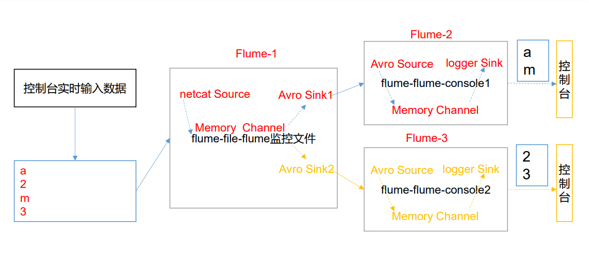

# Flume安装

## 一.安装地址

>1.  Flume 官网地址 
>
>    http://flume.apache.org/ 
>
>2.  文档查看地址 
>
>    http://flume.apache.org/FlumeUserGuide.html
>
>3. 下载地址 
>
>   http://archive.apache.org/dist/flume/ 

## 二.  安装部署 

```shell
## 将 apache-flume-1.7.0-bin.tar.gz 上传到 linux 的/opt/backup 目录下
## 解压 apache-flume-1.7.0-bin.tar.gz 到/opt目录下
[root@hadoop0-110 backup]# tar -zxvf apache-flume-1.7.0-bin.tar.gz -C /opt/
## 将 flume/conf 下的 flume-env.sh.template 文件修改为 flume-env.sh，并配置 flume-env.sh 文件
[root@hadoop0-110 conf]# mv flume-env.sh.template flume-env.sh
[root@hadoop0-110 conf]# vim flume-env.sh 
	export JAVA_HOME=/opt/jdk1.8.0_201
```

## 三.  Flume 入门案例 

### 1. 监控端口数据官方案例 

> 案例需求： 使用 Flume 监听一个端口，收集该端口数据，并打印到控制台。 

```shell
## 安装 netcat 工具 
[root@hadoop0-110 conf]# yum install -y nc
## 判断 44444 端口是否被占用 
[root@hadoop0-110 conf]# netstat -tunlp | grep 44444
## 创建 Flume Agent 配置文件 flume-netcat-logger.conf
	## 在 flume 目录下创建 job 文件夹并进入 job 文件夹
	[root@hadoop0-110 apache-flume-1.7.0-bin]# mkdir job
	[root@hadoop0-110 apache-flume-1.7.0-bin]# cd job/
	## 在 job 文件夹下创建 Flume Agent 配置文件 flume-netcat-logger.conf。
	## 注：配置文件来源于官方手册 http://flume.apache.org/FlumeUserGuide.html
	[root@hadoop0-110 job]# vim flume-netcat-logger.conf
    
        #添加内容如下：
        # Name the components on this agent   a1表示agent的名称
        a1.sources = r1				## r1表示a1的source的名称
        a1.sinks = k1				## k1表示a1的sink的名称	
        a1.channels = c1			## c1表示a1的channels的名称

        # Describe/configure the source
        a1.sources.r1.type = netcat		## 表示a1的输入类型为netcat端口类型
        a1.sources.r1.bind = localhost	## 表示a1监听的主机	
        a1.sources.r1.port = 44444		## 表示a1监听的端口号 

        # Describe the sink
        a1.sinks.k1.type = logger		## 表示 a1的输出目的地是控制台logger 类型

        # Use a channel which buffers events in memory
        a1.channels.c1.type = memory	## 表示a1 的channels 类型是memory 内存型
        a1.channels.c1.capacity = 1000	## 表示a1 的channels 总容量1000 个event
        a1.channels.c1.transactionCapacity = 100	## 表示a1 的channels 传输时收集到了100 条event 以后再去提交事务

        # Bind the source and sink to the channel
        a1.sources.r1.channels = c1		## 表示将r1 和 c1连接起来
        a1.sinks.k1.channel = c1		## 表示将k1 和c1 连接起来
        
        
## 先开启 flume 监听端口 下面两种写法都可以，一种简洁，一种直观
 [root@hadoop0-110 apache-flume-1.7.0-bin]# bin/flume-ng agent --conf conf/ --name a1 --conf-file job/flume-netcat-logger.conf -Dflume.root.logger=INFO,console
 [root@hadoop0-110 apache-flume-1.7.0-bin]# bin/flume-ng agent -c conf/ -n a1 -f job/flume-netcat-logger.conf -Dflume.root.logger=INFO,console
	## 参数说明
    参数说明：
    --conf/-c：表示配置文件存储在 conf/目录
    --name/-n：表示给 agent 起名为 a1
    --conf-file/-f：flume 本次启动读取的配置文件是在 job 文件夹下的 flume-telnet.conf 文件。
    -Dflume.root.logger=INFO,console ：-D 表示 flume 运行时动态修改 flume.root.logger 参数属性值，并将控制台日志打印级别设置为 INFO 级别。日志级别包括:log、info、warn、error。


## 使用 netcat 工具向本机的 44444 端口发送内容 
[root@hadoop0-110 ~]# nc localhost 44444
	你好啊，靓仔^H^H^H
## 在 Flume 监听页面观察接收数据情况
2020-05-31 19:58:42,613 (SinkRunner-PollingRunner-DefaultSinkProcessor) [INFO - org.apache.flume.sink.LoggerSink.process(LoggerSink.java:95)] Event: { headers:{} body: E4 BD A0 E5 A5 BD E5 95 8A EF BC 8C E9 9D 93 E4 ................ }

```

```shell
## netcat 工具
## 具有服务、客户端，先启动服务端，再启动客户端即可完成通行
## 在hadoop1-111 上启动服务端，然后就会在这里阻塞住
[root@hadoop1-111 ~]# nc -lk 55555

## 在hadoop2-112 上启动客户端，然后也会在这里阻塞住
[root@hadoop2-112 ~]# nc hadoop1-111 55555

## 此时即可完成两者的通信
```

### 2. 实时监控单个追加文件 

>  案例需求：实时监控 flume-file-hdfs.log 文件，并上传到 HDFS 中  

```shell
## Flume 要想将数据输出到 HDFS，须持有 Hadoop 相关 jar 包 
## 拷贝到/opt/module/flume/lib 文件夹下。
    commons-configuration-1.6.jar、
    hadoop-auth-2.7.2.jar、
    hadoop-common-2.7.2.jar、
    hadoop-hdfs-2.7.2.jar、
    commons-io-2.4.jar、
    htrace-core-3.1.0-incubating.jar
## 创建 flume-file-hdfs.conf 文件,增加下面的内容
[root@hadoop0-110 job]# touch flume-file-hdfs.conf
	# Name the components on this agent
    a2.sources = r2		## 定义source
    a2.sinks = k2		## 定义sink
    a2.channels = c2		## 定义channels
    # Describe/configure the source
    a2.sources.r2.type = exec		## 定义source类型为exec 可执行命令
    a2.sources.r2.command = tail -F /opt/apache-flume-1.7.0-bin/job/flume-file-hdfs.log		## F 参数失败重试
    a2.sources.r2.shell = /bin/bash 		## 定义可执行脚本的绝对路径	
    # Describe the sink
    a2.sinks.k2.type = hdfs
    a2.sinks.k2.hdfs.path = hdfs://hadoop0-110:9000/flume/%Y%m%d/%H		## namenode的ip 后面是 年 月 日 时
    #上传文件的前缀
    a2.sinks.k2.hdfs.filePrefix = logs-
    #是否按照时间滚动文件夹
    a2.sinks.k2.hdfs.round = true
    #多少时间单位创建一个新的文件夹
    a2.sinks.k2.hdfs.roundValue = 1
    #重新定义时间单位
    a2.sinks.k2.hdfs.roundUnit = hour
    #是否使用本地时间戳
    a2.sinks.k2.hdfs.useLocalTimeStamp = true		## 这里使用了时间来命名文件夹需要本地时间
    #积攒多少个 Event 才 flush 到 HDFS 一次
    a2.sinks.k2.hdfs.batchSize = 1000
    #设置文件类型，可支持压缩
    a2.sinks.k2.hdfs.fileType = DataStream
    #多久生成一个新的文件
    a2.sinks.k2.hdfs.rollInterval = 30
    #设置每个文件的滚动大小
    a2.sinks.k2.hdfs.rollSize = 134217700		## 尽量设置为一个快的大小
    #文件的滚动与 Event 数量无关
    a2.sinks.k2.hdfs.rollCount = 0
    # Use a channel which buffers events in memory
    a2.channels.c2.type = memory
    a2.channels.c2.capacity = 1000
    a2.channels.c2.transactionCapacity = 100
    # Bind the source and sink to the channel
    a2.sources.r2.channels = c2
    a2.sinks.k2.channel = c2
## 开启namenode、resourcemanager等hadoop
## hadoop0-110 上开启hdfs
[root@hadoop0-110 hadoop-2.7.2]# sbin/start-dfs.sh
## hadoop1-111 上开启yarn
[root@hadoop1-111 hadoop-2.7.2]# sbin/start-yarn.sh

## 运行 Flume
[root@hadoop0-110 apache-flume-1.7.0-bin]# bin/flume-ng agent -c conf -f job/flume-file-hdfs.conf -n a2
```


```shell
# Name the components on this agent
a2.sources = r2
a2.sinks = k2
a2.channels = c2
# Describe/configure the source
a2.sources.r2.type = exec
a2.sources.r2.command = tail -F /opt/apache-flume-1.7.0-bin/job/flume-file-hdfs.log
# Describe the sink
a2.sinks.k2.type = hdfs
a2.sinks.k2.hdfs.path = hdfs://hadoop0-110:9000/flume/%Y%m%d/%H
#上传文件的前缀
a2.sinks.k2.hdfs.filePrefix = logs-
#是否按照时间滚动文件夹
a2.sinks.k2.hdfs.round = true
#多少时间单位创建一个新的文件夹
a2.sinks.k2.hdfs.roundValue = 1
#重新定义时间单位
a2.sinks.k2.hdfs.roundUnit = hour
#是否使用本地时间戳
a2.sinks.k2.hdfs.useLocalTimeStamp = true
#积攒多少个 Event 才 flush 到 HDFS 一次
a2.sinks.k2.hdfs.batchSize = 1000
#设置文件类型，可支持压缩
a2.sinks.k2.hdfs.fileType = DataStream
#多久生成一个新的文件
a2.sinks.k2.hdfs.rollInterval = 30
#设置每个文件的滚动大小
a2.sinks.k2.hdfs.rollSize = 134217700
#文件的滚动与 Event 数量无关
a2.sinks.k2.hdfs.rollCount = 0
# Use a channel which buffers events in memory
a2.channels.c2.type = memory
a2.channels.c2.capacity = 1000
a2.channels.c2.transactionCapacity = 100
# Bind the source and sink to the channel
a2.sources.r2.channels = c2
a2.sinks.k2.channel = c2

## 注意：对于所有与时间相关的转义序列，Event Header 中必须存在以 “timestamp”的 key（除非hdfs.useLocalTimeStamp 设置为 true，此方法会使用 TimestampInterceptor 自动添加timestamp）。a3.sinks.k3.hdfs.useLocalTimeStamp = true
```

### 3. 实时监控目录下多个新文件 

>  案例需求：使用 Flume 监听整个目录的文件，并上传至 HDFS

```shell
[root@hadoop0-110 job]# vim flume-dir-hdfs.conf
## 创建配置文件 flume-dir-hdfs.conf
a3.sources = r3
a3.sinks = k3
a3.channels = c3
# Describe/configure the source
a3.sources.r3.type = spooldir
a3.sources.r3.spoolDir = /opt/apache-flume-1.7.0-bin/job/flume-dir-hdfs
a3.sources.r3.fileSuffix = .COMPLETED
a3.sources.r3.fileHeader = true
#忽略所有以.tmp 结尾的文件，不上传
a3.sources.r3.ignorePattern = ([^ ]*\.tmp)
# Describe the sink
a3.sinks.k3.type = hdfs
a3.sinks.k3.hdfs.path = hdfs://hadoop0-110:9000/flume/upload/%Y%m%d/%H
#上传文件的前缀
a3.sinks.k3.hdfs.filePrefix = upload-
#是否按照时间滚动文件夹
a3.sinks.k3.hdfs.round = true
#多少时间单位创建一个新的文件夹
a3.sinks.k3.hdfs.roundValue = 1
#重新定义时间单位
a3.sinks.k3.hdfs.roundUnit = hour
#是否使用本地时间戳
a3.sinks.k3.hdfs.useLocalTimeStamp = true
#积攒多少个 Event 才 flush 到 HDFS 一次
a3.sinks.k3.hdfs.batchSize = 100
#设置文件类型，可支持压缩
a3.sinks.k3.hdfs.fileType = DataStream
#多久生成一个新的文件
a3.sinks.k3.hdfs.rollInterval = 60
#设置每个文件的滚动大小大概是 128M
a3.sinks.k3.hdfs.rollSize = 134217700
#文件的滚动与 Event 数量无关
a3.sinks.k3.hdfs.rollCount = 0
# Use a channel which buffers events in memory
a3.channels.c3.type = memory
a3.channels.c3.capacity = 1000
a3.channels.c3.transactionCapacity = 100
# Bind the source and sink to the channel
a3.sources.r3.channels = c3
a3.sinks.k3.channel = c3

## 说明：在使用 Spooling Directory Source 时不要在监控目录中创建并持续修改文件上传完成的文件会以.COMPLETED 结尾被监控文件夹每 500 毫秒扫描一次文件变动
## 启动
bin/flume-ng agent --conf conf/ --name a3 --conf-file job/flume-dir-hdfs.conf
bin/flume-ng agent -c conf/ -f job/flume-dir-hdfs.conf -n a3
```

### 4. 实时监控目录下的多个追加文件 

>  Exec source 适用于监控一个实时追加的文件，但不能保证数据不丢失；Spooldir Source 能够保证数据不丢失，且能够实现断点续传，但延迟较高，不能实时监控；而 Taildir Source 既能够实现断点续传，又可以保证数据不丢失，还能够进行实时监控。 
>
> 1）案例需求：使用 Flume 监听整个目录的实时追加文件，并上传至 HDFS  

```shell
## 创建配置文件 flume-taildir-hdfs.conf
[root@hadoop0-110 job]# vim flume-taildir-hdfs.conf
## 添加如下内容
a3.sources = r3
a3.sinks = k3
a3.channels = c3
# Describe/configure the source
a3.sources.r3.type = TAILDIR
a3.sources.r3.positionFile = /opt/apache-flume-1.7.0-bin/tail_dir.json
a3.sources.r3.filegroups = f1
a3.sources.r3.filegroups.f1 = /opt/apache-flume-1.7.0-bin/files/file.*
# Describe the sink
a3.sinks.k3.type = hdfs
a3.sinks.k3.hdfs.path = hdfs://hadoop0-110:9000/flume/upload/%Y%m%d/%H
#上传文件的前缀
a3.sinks.k3.hdfs.filePrefix = upload-
#是否按照时间滚动文件夹
a3.sinks.k3.hdfs.round = true
#多少时间单位创建一个新的文件夹
a3.sinks.k3.hdfs.roundValue = 1
#重新定义时间单位
a3.sinks.k3.hdfs.roundUnit = hour
#是否使用本地时间戳
a3.sinks.k3.hdfs.useLocalTimeStamp = true
#积攒多少个 Event 才 flush 到 HDFS 一次
a3.sinks.k3.hdfs.batchSize = 100
#设置文件类型，可支持压缩
a3.sinks.k3.hdfs.fileType = DataStream
#多久生成一个新的文件
a3.sinks.k3.hdfs.rollInterval = 60
#设置每个文件的滚动大小大概是 128M
a3.sinks.k3.hdfs.rollSize = 134217700
#文件的滚动与 Event 数量无关
a3.sinks.k3.hdfs.rollCount = 0
# Use a channel which buffers events in memory
a3.channels.c3.type = memory
a3.channels.c3.capacity = 1000
a3.channels.c3.transactionCapacity = 100
# Bind the source and sink to the channel
a3.sources.r3.channels = c3
a3.sinks.k3.channel = c3

## 启动命令
[root@hadoop0-110 job]# bin/flume-ng agent --conf conf/ --name a3 --conf-file job/flume-taildir-hdfs.conf

```

>  Taildir 说明：Taildir Source 维护了一个 json 格式的 position File，其会定期的往 position File中更新每个文件读取到的最新的位置，因此能够实现断点续传。Position File 的格式如下：
>
> ```shell
> {"inode":2496272,"pos":12,"file":"/opt/module/flume/files/file1.txt"}
> {"inode":2496275,"pos":12,"file":"/opt/module/flume/files/file2.txt"}
> ```
> 
>  注：Linux 中储存文件元数据的区域就叫做 inode，每个 inode 都有一个号码，操作系统 用 inode 号码来识别不同的文件，Unix/Linux 系统内部不使用文件名，而使用 inode 号码来识别文件。 

## 四 :Flume 进阶 

	事务


> 内部原理


###  1. 复制 

>  使用 Flume-1 监控文件变动，Flume-1 将变动内容传递给 Flume-2，Flume-2 负责存储 到 HDFS。同时 Flume-1 将变动内容传递给 Flume-3，Flume-3 负责输出到 Local FileSystem。 


#### a. flume-file-flume.conf

>  配置 1 个接收日志文件的 source 和两个 channel、两个 sink，分别输送给 flume-flume-hdfs 和 flume-flume-dir。 

```shell
# Name the components on this agent
a1.sources = r1
a1.sinks = k1 k2
a1.channels = c1 c2
# 将数据流复制给所有 channel
a1.sources.r1.selector.type = replicating
# Describe/configure the source
a1.sources.r1.type = exec
a1.sources.r1.command = tail -F /opt/module/hive/logs/hive.log
a1.sources.r1.shell = /bin/bash -c
# Describe the sink
# sink 端的 avro 是一个数据发送者
a1.sinks.k1.type = avro
a1.sinks.k1.hostname = hadoop102
a1.sinks.k1.port = 4141
a1.sinks.k2.type = avro
a1.sinks.k2.hostname = hadoop102
a1.sinks.k2.port = 4142
# Describe the channel
a1.channels.c1.type = memory
a1.channels.c1.capacity = 1000
a1.channels.c1.transactionCapacity = 100
a1.channels.c2.type = memory
a1.channels.c2.capacity = 1000
a1.channels.c2.transactionCapacity = 100
# Bind the source and sink to the channel
a1.sources.r1.channels = c1 c2
a1.sinks.k1.channel = c1
a1.sinks.k2.channel = c2
```

#### b.  flume-flume-hdfs.conf 

> 配置上级 Flume 输出的 Source，输出是到 HDFS 的 Sink。 

```shell
# Name the components on this agent
a2.sources = r1
a2.sinks = k1
a2.channels = c1
# Describe/configure the source
# source 端的 avro 是一个数据接收服务
a2.sources.r1.type = avro
a2.sources.r1.bind = hadoop102
a2.sources.r1.port = 4141
# Describe the sink
a2.sinks.k1.type = hdfs
a2.sinks.k1.hdfs.path = hdfs://hadoop102:9000/flume2/%Y%m%d/%H
#上传文件的前缀
a2.sinks.k1.hdfs.filePrefix = flume2-
#是否按照时间滚动文件夹
a2.sinks.k1.hdfs.round = true
#多少时间单位创建一个新的文件夹
a2.sinks.k1.hdfs.roundValue = 1
#重新定义时间单位
a2.sinks.k1.hdfs.roundUnit = hour
#是否使用本地时间戳
a2.sinks.k1.hdfs.useLocalTimeStamp = true
#积攒多少个 Event 才 flush 到 HDFS 一次
a2.sinks.k1.hdfs.batchSize = 100
#设置文件类型，可支持压缩
a2.sinks.k1.hdfs.fileType = DataStream
#多久生成一个新的文件
a2.sinks.k1.hdfs.rollInterval = 600
#设置每个文件的滚动大小大概是 128M
a2.sinks.k1.hdfs.rollSize = 134217700
#文件的滚动与 Event 数量无关
a2.sinks.k1.hdfs.rollCount = 0
# Describe the channel
a2.channels.c1.type = memory
a2.channels.c1.capacity = 1000
a2.channels.c1.transactionCapacity = 100
# Bind the source and sink to the channel
a2.sources.r1.channels = c1
a2.sinks.k1.channel = c1
```

#### c.  flume-flume-dir.conf  

>  配置上级 Flume 输出的 Source，输出是到本地目录的 Sink。  

```shell
# Name the components on this agent
a3.sources = r1
a3.sinks = k1
a3.channels = c2
# Describe/configure the source
a3.sources.r1.type = avro
a3.sources.r1.bind = hadoop102
a3.sources.r1.port = 4142
# Describe the sink
a3.sinks.k1.type = file_roll
a3.sinks.k1.sink.directory = /opt/module/data/flume3
# Describe the channel
a3.channels.c2.type = memory
a3.channels.c2.capacity = 1000
a3.channels.c2.transactionCapacity = 100
# Bind the source and sink to the channel
a3.sources.r1.channels = c2
a3.sinks.k1.channel = c2
```

<span style="color:red"> 提示：输出的本地目录必须是已经存在的目录，如果该目录不存在，并不会创建新的目录。  </span>

####  d. 执行配置文件

> 分别启动对应的 flume 进程：flume-flume-dir，flume-flume-hdfs，flume-file-flume。 

```shell
[atguigu@hadoop102 flume]$ bin/flume-ng agent --conf conf/ --name a3 --conf-file job/group1/flume-flume-dir.conf
[atguigu@hadoop102 flume]$ bin/flume-ng agent --conf conf/ --name a2 --conf-file job/group1/flume-flume-hdfs.conf
[atguigu@hadoop102 flume]$ bin/flume-ng agent --conf conf/ --name a1 --conf-file job/group1/flume-file-flume.conf
```

### 2.  故障转移 

>  使用 Flume1 监控一个端口，其 sink 组中的 sink 分别对接 Flume2 和 Flume3，采用 FailoverSinkProcessor，实现故障转移的功能。 


#### a. flume-netcat-flume.conf

>  配置 1 个 netcat source 和 1 个 channel、1 个 sink group（2 个 sink），分别输送给 flumeflume-console1 和 flume-flume-console2。

```shell
# Name the components on this agent
a1.sources = r1
a1.channels = c1
a1.sinkgroups = g1
a1.sinks = k1 k2
# Describe/configure the source
a1.sources.r1.type = netcat
a1.sources.r1.bind = localhost
a1.sources.r1.port = 44444
a1.sinkgroups.g1.processor.type = failover
a1.sinkgroups.g1.processor.priority.k1 = 5
a1.sinkgroups.g1.processor.priority.k2 = 10
a1.sinkgroups.g1.processor.maxpenalty = 10000
# Describe the sink
a1.sinks.k1.type = avro
a1.sinks.k1.hostname = hadoop102
a1.sinks.k1.port = 4141
a1.sinks.k2.type = avro
a1.sinks.k2.hostname = hadoop102
a1.sinks.k2.port = 4142
# Describe the channel
a1.channels.c1.type = memory
a1.channels.c1.capacity = 1000
a1.channels.c1.transactionCapacity = 100
# Bind the source and sink to the channel
a1.sources.r1.channels = c1
a1.sinkgroups.g1.sinks = k1 k2
a1.sinks.k1.channel = c1
a1.sinks.k2.channel = c1
```

#### b.  flume-flume-console1.conf

>  配置上级 Flume 输出的 Source，输出是到本地控制台。 

```shell
# Name the components on this agent
a2.sources = r1
a2.sinks = k1
a2.channels = c1
# Describe/configure the source
a2.sources.r1.type = avro
a2.sources.r1.bind = hadoop102
a2.sources.r1.port = 4141
# Describe the sink
a2.sinks.k1.type = logger
# Describe the channel
a2.channels.c1.type = memory
a2.channels.c1.capacity = 1000
a2.channels.c1.transactionCapacity = 100
# Bind the source and sink to the channel
a2.sources.r1.channels = c1
a2.sinks.k1.channel = c1
```

#### c.   flume-flume-console2.conf

>  配置上级 Flume 输出的 Source，输出是到本地控制台。 

```shell
# Name the components on this agent
a3.sources = r1
a3.sinks = k1
a3.channels = c2
# Describe/configure the source
a3.sources.r1.type = avro
a3.sources.r1.bind = hadoop102
a3.sources.r1.port = 4142
# Describe the sink
a3.sinks.k1.type = logger
# Describe the channel
a3.channels.c2.type = memory
a3.channels.c2.capacity = 1000
a3.channels.c2.transactionCapacity = 100
# Bind the source and sink to the channel
a3.sources.r1.channels = c2
a3.sinks.k1.channel = c2
```

#### d.  执行配置文件 

```shell
[atguigu@hadoop102 flume]$ bin/flume-ng agent --conf conf/ --name a3 --conf-file job/group2/flume-flume-console2.conf - 
Dflume.root.logger=INFO,console
[atguigu@hadoop102 flume]$ bin/flume-ng agent --conf conf/ --name a2 --conf-file job/group2/flume-flume-console1.conf -
Dflume.root.logger=INFO,console
[atguigu@hadoop102 flume]$ bin/flume-ng agent --conf conf/ --name a1 --conf-file job/group2/flume-netcat-flume.conf
```

##### e.验证

```shell
## 使用 netcat 工具向本机的 44444 端口发送内容 
[atguigu@hadoop102 flume]$ nc localhost 44444
## 查看 Flume2 及 Flume3 的控制台打印日志

## 将 Flume2 kill，观察 Flume3 的控制台打印情况。 

## 注：使用 jps -ml 查看 Flume 进程。 
```

### 3. 聚合 

>  hadoop102 上的 Flume-1 监控文件/opt/module/data/group.log， 
>
> hadoop103 上的 Flume-2 监控某一个端口的数据流， 
>
> Flume-1 与 Flume-2 将数据发送给 hadoop104 上的 Flume-3，Flume-3 将最终数据打印到控 制台。 


#### a. flume1-logger-flume.conf 

> hadoop102 上编辑配置文件
>
> 配置 Source 用于监控 hive.log 文件，配置 Sink 输出数据到下一级 Flume。  

```shell
# Name the components on this agent
a1.sources = r1
a1.sinks = k1
a1.channels = c1
# Describe/configure the source
a1.sources.r1.type = exec
a1.sources.r1.command = tail -F /opt/module/group.log
a1.sources.r1.shell = /bin/bash -c
# Describe the sink
a1.sinks.k1.type = avro
a1.sinks.k1.hostname = hadoop104
a1.sinks.k1.port = 4141
# Describe the channel
a1.channels.c1.type = memory
a1.channels.c1.capacity = 1000
a1.channels.c1.transactionCapacity = 100
# Bind the source and sink to the channel
a1.sources.r1.channels = c1
a1.sinks.k1.channel = c1
```

#### b.  flume2-netcat-flume.conf  

> hadoop103 上编辑配置文件 
>
> 配置 Source 监控端口 44444 数据流，配置 Sink 数据到下一级 Flume

```shell
# Name the components on this agent
a2.sources = r1
a2.sinks = k1
a2.channels = c1
# Describe/configure the source
a2.sources.r1.type = netcat
a2.sources.r1.bind = hadoop103
a2.sources.r1.port = 44444
# Describe the sink
a2.sinks.k1.type = avro
a2.sinks.k1.hostname = hadoop104
a2.sinks.k1.port = 4141
# Use a channel which buffers events in memory
a2.channels.c1.type = memory
a2.channels.c1.capacity = 1000
a2.channels.c1.transactionCapacity = 100
# Bind the source and sink to the channel
a2.sources.r1.channels = c1
a2.sinks.k1.channel = c1
```

#### c. flume3-flume-logger.conf 

> 在 hadoop104 上编辑配置文件 
>
>  配置 source 用于接收 flume1 与 flume2 发送过来的数据流，最终合并后 sink 到控制台。 

```shell
# Name the components on this agent
a3.sources = r1
a3.sinks = k1
a3.channels = c1
# Describe/configure the source
a3.sources.r1.type = avro
a3.sources.r1.bind = hadoop104
a3.sources.r1.port = 4141
# Describe the sink
# Describe the sink
a3.sinks.k1.type = logger
# Describe the channel
a3.channels.c1.type = memory
a3.channels.c1.capacity = 1000
a3.channels.c1.transactionCapacity = 100
# Bind the source and sink to the channel
a3.sources.r1.channels = c1
a3.sinks.k1.channel = c1
```

#### d. 执行配置文件 

> 执行上面有着顺序，arvo source为服务端，需要先启动，一般先启动下游服务，在启动上游服务

```shell
[atguigu@hadoop104 flume]$ bin/flume-ng agent --conf conf/ --name a3 --conf-file job/group3/flume3-flume-logger.conf -
Dflume.root.logger=INFO,console
[atguigu@hadoop102 flume]$ bin/flume-ng agent --conf conf/ --name a2 --conf-file job/group3/flume1-logger-flume.conf
[atguigu@hadoop103 flume]$ bin/flume-ng agent --conf conf/ --name a1 --conf-file job/group3/flume2-netcat-flume.conf

```

### 4. 自定义 Interceptor 

>  在实际的开发中，一台服务器产生的日志类型可能有很多种，不同类型的日志可能需要 发送到不同的分析系统。此时会用到 Flume 拓扑结构中的 Multiplexing 结构，Multiplexing 的原理是，根据 event 中 Header 的某个 key 的值，将不同的 event 发送到不同的 Channel 中，所以我们需要自定义一个 Interceptor，为不同类型的 event 的 Header 中的 key 赋予 不同的值。 在该案例中，我们以端口数据模拟日志，以数字（单个）和字母（单个）模拟不同类型 的日志，我们需要自定义 interceptor 区分数字和字母，将其分别发往不同的分析系统 （Channel）。  



#### a. 实现步骤 

```shell
## 创建一个 maven 项目，并引入以下依赖
<dependency>
 <groupId>org.apache.flume</groupId>
 <artifactId>flume-ng-core</artifactId>
 <version>1.7.0</version>
</dependency>
## 定义 CustomInterceptor 类并实现 Interceptor 接口。
package com.atguigu.flume.interceptor;
import org.apache.flume.Context;
import org.apache.flume.Event;
import org.apache.flume.interceptor.Interceptor;
import java.util.List;
public class CustomInterceptor implements Interceptor {
 @Override
 public void initialize() {
 }@Override
 public Event intercept(Event event) {
 byte[] body = event.getBody();
 if (body[0] < 'z' && body[0] > 'a') {
 event.getHeaders().put("type", "letter");
 } else if (body[0] > '0' && body[0] < '9') {
 event.getHeaders().put("type", "number");
 }
 return event;
 }
 @Override
 public List<Event> intercept(List<Event> events) {
 for (Event event : events) {
 intercept(event);
 }
 return events;
 }
 @Override
 public void close() {
 }
 public static class Builder implements Interceptor.Builder {
 @Override
 public Interceptor build() {
 return new CustomInterceptor();
 }
 @Override
 public void configure(Context context) {
 }
 }
}
```

#### b. hadoop102 

>  为 hadoop102 上的 Flume1 配置 1 个 netcat source，1 个 sink group（2 个 avro sink）， 并配置相应的 ChannelSelector 和 interceptor。  

```shell
# Name the components on this agent
a1.sources = r1
a1.sinks = k1 k2
a1.channels = c1 c2
# Describe/configure the source
a1.sources.r1.type = netcat
a1.sources.r1.bind = localhost
a1.sources.r1.port = 44444
a1.sources.r1.interceptors = i1
a1.sources.r1.interceptors.i1.type =
com.atguigu.flume.interceptor.CustomInterceptor$Builder
a1.sources.r1.selector.type = multiplexing
a1.sources.r1.selector.header = type
a1.sources.r1.selector.mapping.letter = c1
a1.sources.r1.selector.mapping.number = c2
# Describe the sink
a1.sinks.k1.type = avro
a1.sinks.k1.hostname = hadoop103
a1.sinks.k1.port = 4141
a1.sinks.k2.type=avro
a1.sinks.k2.hostname = hadoop104
a1.sinks.k2.port = 4242
# Use a channel which buffers events in memory
a1.channels.c1.type = memory
a1.channels.c1.capacity = 1000
a1.channels.c1.transactionCapacity = 100
# Use a channel which buffers events in memory
a1.channels.c2.type = memory
a1.channels.c2.capacity = 1000
a1.channels.c2.transactionCapacity = 100
# Bind the source and sink to the channel
a1.sources.r1.channels = c1 c2
a1.sinks.k1.channel = c1
a1.sinks.k2.channel = c2
```

#### c.  hadoop103 

>  为 hadoop103 上的 Flume2 配置一个 avro source 和一个 logger sink。 

```shell
a1.sources = r1
a1.sinks = k1
a1.channels = c1
a1.sources.r1.type = avro
a1.sources.r1.bind = hadoop103
a1.sources.r1.port = 4141
a1.sinks.k1.type = logger
a1.channels.c1.type = memory
a1.channels.c1.capacity = 1000
a1.channels.c1.transactionCapacity = 100
a1.sinks.k1.channel = c1
a1.sources.r1.channels = c1
```

#### d. hadoop104 

>  为 hadoop104 上的 Flume3 配置一个 avro source 和一个 logger sink。  

```shell
a1.sources = r1
a1.sinks = k1
a1.channels = c1
a1.sources.r1.type = avro
a1.sources.r1.bind = hadoop104
a1.sources.r1.port = 4242
a1.sinks.k1.type = logger
a1.channels.c1.type = memory
a1.channels.c1.capacity = 1000
a1.channels.c1.transactionCapacity = 100
a1.sinks.k1.channel = c1
a1.sources.r1.channels = c1
```

#### e.启动

```shell
## 分别在 hadoop102，hadoop103，hadoop104 上启动 flume 进程，注意先后顺序。
```


### 5. 自定义 Source 

>  使用 flume 接收数据，并给每条数据添加前缀，输出到控制台。前缀可从 flume 配置文 件中配置。 


#### a. 编码 

```shell
## 导入 pom 依赖 
<dependency>
 <groupId>org.apache.flume</groupId>
 <artifactId>flume-ng-core</artifactId>
 <version>1.7.0</version>
</dependency>
### 编写代码
package com.atguigu;
import org.apache.flume.Context;
import org.apache.flume.EventDeliveryException;
import org.apache.flume.PollableSource;
import org.apache.flume.conf.Configurable;
import org.apache.flume.event.SimpleEvent;
import org.apache.flume.source.AbstractSource;
import java.util.HashMap;
public class MySource extends AbstractSource implements
Configurable, PollableSource {
 //定义配置文件将来要读取的字段
 private Long delay;
 private String field;
 //初始化配置信息
 @Override
 public void configure(Context context) {
 delay = context.getLong("delay");
 field = context.getString("field", "Hello!");
 }
 @Override
 public Status process() throws EventDeliveryException {
 try {
 //创建事件头信息
 HashMap<String, String> hearderMap = new HashMap<>();
 //创建事件
 SimpleEvent event = new SimpleEvent();
 //循环封装事件
 for (int i = 0; i < 5; i++) {
 //给事件设置头信息
 event.setHeaders(hearderMap);
 //给事件设置内容
 event.setBody((field + i).getBytes());
 //将事件写入 channel
 getChannelProcessor().processEvent(event);
 Thread.sleep(delay);
 }
 } catch (Exception e) {
 e.printStackTrace();
 return Status.BACKOFF;
 }
 return Status.READY;
 }
 @Override
 public long getBackOffSleepIncrement() {
 return 0;
 }
 @Override
 public long getMaxBackOffSleepInterval() {
 return 0;
  }
}
```

#### b. 配置文件 

```shell
# Name the components on this agent
a1.sources = r1
a1.sinks = k1
a1.channels = c1
# Describe/configure the source
a1.sources.r1.type = com.atguigu.MySource
a1.sources.r1.delay = 1000
#a1.sources.r1.field = atguigu
# Describe the sink
a1.sinks.k1.type = logger
# Use a channel which buffers events in memory
a1.channels.c1.type = memory
a1.channels.c1.capacity = 1000
a1.channels.c1.transactionCapacity = 100
# Bind the source and sink to the channel
a1.sources.r1.channels = c1
a1.sinks.k1.channel = c1
```

#### c.启动

```shell
[atguigu@hadoop102 flume]$ bin/flume-ng agent -c conf/ -f job/mysource.conf -n a1 -Dflume.root.logger=INFO,console
```


### 6. 自定义 Sink 

>  使用 flume 接收数据，并在 Sink 端给每条数据添加前缀和后缀，输出到控制台。前后 缀可在 flume 任务配置文件中配置。 

#### a.编码

```shell
package com.atguigu;
import org.apache.flume.*;
import org.apache.flume.conf.Configurable;
import org.apache.flume.sink.AbstractSink;
import org.slf4j.Logger;
import org.slf4j.LoggerFactory;
public class MySink extends AbstractSink implements Configurable {
 //创建 Logger 对象
 private static final Logger LOG =
LoggerFactory.getLogger(AbstractSink.class);
 private String prefix;
 private String suffix;
 @Override
 public Status process() throws EventDeliveryException {
 //声明返回值状态信息
 Status status;
 //获取当前 Sink 绑定的 Channel
 Channel ch = getChannel();
 //获取事务
 Transaction txn = ch.getTransaction();
 //声明事件
 Event event;
 //开启事务
 txn.begin();
 //读取 Channel 中的事件，直到读取到事件结束循环
 while (true) {
 event = ch.take();
 if (event != null) {
 break;
 }
 }
 try {
 //处理事件（打印）
 LOG.info(prefix + new String(event.getBody()) + suffix);
 //事务提交
 txn.commit();
 status = Status.READY;
 } catch (Exception e) {
 //遇到异常，事务回滚
 txn.rollback();
 status = Status.BACKOFF;
 } finally {
 //关闭事务
 txn.close();
 }
 return status;
 }
 @Override
 public void configure(Context context) {
  //读取配置文件内容，有默认值
 prefix = context.getString("prefix", "hello:");
 //读取配置文件内容，无默认值
 suffix = context.getString("suffix");
 }
}

```

#### b. 配置文件 

```shell
# Name the components on this agent
a1.sources = r1
a1.sinks = k1
a1.channels = c1
# Describe/configure the source
a1.sources.r1.type = netcat
a1.sources.r1.bind = localhost
a1.sources.r1.port = 44444
# Describe the sink
a1.sinks.k1.type = com.atguigu.MySink
#a1.sinks.k1.prefix = atguigu:
a1.sinks.k1.suffix = :atguigu
# Use a channel which buffers events in memory
a1.channels.c1.type = memory
a1.channels.c1.capacity = 1000
a1.channels.c1.transactionCapacity = 100
# Bind the source and sink to the channel
a1.sources.r1.channels = c1
a1.sinks.k1.channel = c1
```

#### c.启动

```shell
[atguigu@hadoop102 flume]$ bin/flume-ng agent -c conf/ -f job/mysink.conf -n a1 -Dflume.root.logger=INFO,console
```

## 五： Flume 数据流监控 

### 1. Ganglia 的安装与部署 

```shell
## 安装 httpd 服务与 php 
[root@localhost ~]# yum -y install httpd php
## 安装其他依赖
[root@localhost ~]# yum -y install rrdtool perl-rrdtool rrdtool-devel
[root@localhost ~]# yum -y install apr-devel

## 安装 ganglia
[root@localhost ~]# rpm -Uvh http://dl.fedoraproject.org/pub/epel/6/x86_64/epel-release-6-8.noarch.rpm
[root@localhost ~]# yum -y install ganglia-gmetad  ## 不成功，缺少依赖，可百度安装这个
[root@localhost ~]# yum -y install ganglia-web
[root@localhost ~]# yum -y install ganglia-gmond

```


