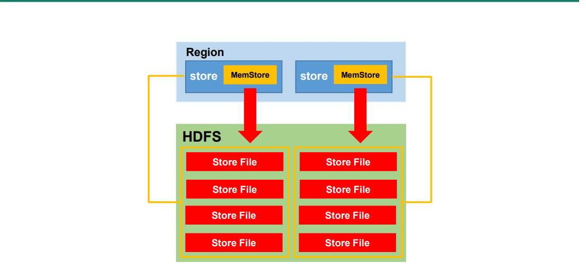

# 一：HBase 简介

## 1. HBase定义

>  HBase 是一种分布式、可扩展、支持海量数据存储的 NoSQL 数据库。 

## 2.HBase 数据模型

> 逻辑上，HBase 的数据模型同关系型数据库很类似，数据存储在一张表中，有行有列。 但从 HBase 的底层物理存储结构（K-V）来看，HBase 更像是一个 multi-dimensional map。 

###  2.1 HBase 逻辑结构 


### 2.2  HBase 物理存储结构 


### 2.3  数据模型

> ### 1）Name Space  :
>  命名空间，类似于关系型数据库的 DatabBase 概念，每个命名空间下有多个表。HBase 有两个自带的命名空间，分别是 hbase 和 default，hbase 中存放的是 HBase 内置的表， default 表是用户默认使用的命名空间。 
>
> ###  2）Region
>  类似于关系型数据库的表概念。不同的是，HBase 定义表时只需要声明列族即可，不需 要声明具体的列。这意味着，往 HBase 写入数据时，字段可以动态、按需指定。因此，和关 系型数据库相比，HBase 能够轻松应对字段变更的场景。 
>  
> ###  3）Row 
>  HBase 表中的每行数据都由一个 RowKey 和多个 Column（列）组成，数据是按照 RowKey 的字典顺序存储的，并且查询数据时只能根据 RowKey 进行检索，所以 RowKey 的设计十分重 要。  
>
> ###  4）Column 
>  HBase 中的每个列都由 Column Family(列族)和 Column Qualifier（列限定符）进行限 定，例如 info：name，info：age。建表时，只需指明列族，而列限定符无需预先定义。 
>
> ###  5）Time Stamp 
>  用于标识数据的不同版本（version），每条数据写入时，如果不指定时间戳，系统会 自动为其加上该字段，其值为写入 HBase 的时间。 
>
> ###  6）Cell 
>  由{rowkey, column Family：column Qualifier, time Stamp} 唯一确定的单元。cell 中的数 据是没有类型的，全部是字节码形式存贮。 
>
> 

# 二： HBase 快速入门 

## 1. HBase 安装部署 

### 1.1 Zookeeper 正常部署 

```shell
## 首先保证 Zookeeper 集群的正常部署，并启动之：
[root@hadoop0-110 bin]# /opt/zookeeper-3.4.10/bin/zkServer.sh start
[root@hadoop1-111 bin]# /opt/zookeeper-3.4.10/bin/zkServer.sh start
[root@hadoop2-112 bin]# /opt/zookeeper-3.4.10/bin/zkServer.sh start
```

### 1.2 Hadoop 正常部署 

```shell
## Hadoop 集群的正常部署并启动：

## NameNode在 hadoop0-110 所以在这上面启动HDFS
[root@hadoop0-110 hadoop-2.7.2]# sbin/start-dfs.sh 
## NameNode在 hadoop1-111 所以在这上面启动YARN
[root@hadoop1-111 hadoop-2.7.2]# sbin/start-yarn.sh 
```

### 1.3 HBase 的解压 

```shell
## HBase 的解压
[root@hadoop0-110 backup]# tar -zxvf hbase-1.3.1-bin.tar.gz -C /opt/
```

> ### 1. hbase-env.sh 修改内容： 
>
> ```shell
> ## jdk 位置
> export JAVA_HOME=/opt/jdk1.8.0_201
> ## 不适用hbase 自带的 ZK
> export HBASE_MANAGES_ZK=false
> ```
>
> ### 2. hbase-site.xml 修改内容： 
>
> ```xml
> <configuration>
>     <!-- namenode id + port 后面HBase 存储在hdfs 的路径-->
>     <property>
>         <name>hbase.rootdir</name>
>         <value>hdfs://hadoop0-110:9000/HBase</value>
>     </property>
>     <!-- 分布式？ -->
>     <property>
>         <name>hbase.cluster.distributed</name>
>         <value>true</value>
>     </property>
>      <!-- 0.98 后的新变动，之前版本没有.port,默认端口为 60000 -->
>     <property>
>         <name>hbase.master.port</name>
>         <value>16000</value>
>     </property>
>     <!-- ZK IP -->
>     <property>
>         <name>hbase.zookeeper.quorum</name>
>          <value>hadoop0-110,hadoop1-111,hadoop2-112</value>
>     </property>
>     <!-- ZK 数据 -->
>     <property>
>         <name>hbase.zookeeper.property.dataDir</name>
>          <value>/opt/zookeeper-3.4.10/zkData</value>
>     </property>
> </configuration>
> ```
>
> ### 3. regionservers： 
>
> ```shell
> [root@hadoop0-110 conf]# vim regionservers
>     hadoop0-110
>     hadoop1-111
>     hadoop2-112
> ```
>
> ### 4. 软连接 hadoop 配置文件到 HBase：
>
> ```shell
> [root@hadoop0-110 conf]# ln -s /opt/hadoop-2.7.2/etc/hadoop/core-site.xml /opt/hbase-1.3.1/conf/core-site.xml
> [root@hadoop0-110 conf]# ln -s /opt/hadoop-2.7.2/etc/hadoop/hdfs-site.xml /opt/hbase-1.3.1/conf/hdfs-site.xml
> ```
>
> ### 5. HBase 远程发送到其他集群 
>
> ```shell
> [root@hadoop0-110 opt]# xsync /opt/hbase-1.3.1/
> ```
>
> ### 6.  HBase 服务的启动 
>
> ```shell
> ## 查看三台机器的时间，差距比较大的话，会导致regionserver 无法启动，抛出ClockOutOfSyncException 异常。修复提示：同步时间服务
> [root@hadoop0-110 hbase-1.3.1]# date
> Sun Jun 21 23:35:24 CST 2020
> ## 统一手动设置时间
> [root@hadoop0-110 hbase-1.3.1]# date -s "2020-06-30 21:23:00"
> ## 分别启动
> [root@hadoop0-110 hbase-1.3.1]# bin/hbase-daemon.sh start master
> [root@hadoop1-111 hbase-1.3.1]# bin/hbase-daemon.sh start master
> [root@hadoop2-112 hbase-1.3.1]# bin/hbase-daemon.sh start master
> [root@hadoop0-110 hbase-1.3.1]# bin/hbase-daemon.sh start regionserver
> [root@hadoop1-111 hbase-1.3.1]# bin/hbase-daemon.sh start regionserver
> [root@hadoop2-112 hbase-1.3.1]# bin/hbase-daemon.sh start regionserver
> 
> ## 群起
> [root@hadoop0-110 hbase-1.3.1]# bin/start-hbase.sh
> 
> [root@hadoop0-110 hbase-1.3.1]# bin/stop-hbase.sh
> ```
>
> ### 7.  查看 HBase 页面 
>
>  http://hadoop0-110:16010/master-status 

## 2.  HBase Shell 操作  

> HBase里面的操作
>
> 1. 单分号，双分号都无所谓。
> 2. 每行结束不需要逗号，使用了逗号，输入两次英文单引号即可回来。
> 3. 退格和delete两个用法有点不和常理，外加ctrl 符合常理

### 2.1 基本操作 

> ###  1．进入 HBase 客户端命令行 
>
> ```shell
> [root@hadoop0-110 hbase-1.3.1]# bin/hbase shell
> ```
>
> ### 2. 查看帮助命令 
>
> ```shell
> hbase(main):001:0> ghelp
> ```
>
> ###  3．查看当前数据库中有哪些表  
>
> ```shell
> hbase(main):003:0> list
> TABLE                                                                                                                              
> 0 row(s) in 0.2520 seconds
> 
> => []
> ```

###  2.2 表的操作 

> 常见的操作关键字：alter，create，describe，drop，list
>
> ###  1. 创建表  
>
> ```shell
> hbase(main):004:0> create 'student','info'
> 0 row(s) in 1.4010 seconds
> 
> => Hbase::Table - student
> ```
>
> ###  2. 插入数据到表  
>
> ```shell
> hbase(main):015:0> put 'student','1000','info:name','xiahan'
> ```
>
> ### 3.  查看表结构
>
> ```shell
> hbase(main):012:0> describe 'student'
> ```
>
> ### 4. 修改表结构
>
> ```shell
> ## 修改 student 表的version 为 3，保存三个最新的数据
> hbase(main):016:0> alter 'student',{NAME=>'info',VERSIONS=>3}
> ```
>
> ### 5. 删除表
>
> ```shell
> ## 先禁用
> hbase(main):018:0> disable 'student'
> 0 row(s) in 2.2500 seconds
> ## 在删除
> hbase(main):019:0> drop 'student'
> 0 row(s) in 1.2470 seconds
> ```
>
> ### 6. 查看所有的表
>
> ```shell
> hbase(main):021:0> create 'stu','info'
> 0 row(s) in 1.2230 seconds
> 
> => Hbase::Table - stu
> hbase(main):022:0> list
> TABLE      
> stu                                                                                                                                
> 1 row(s) in 0.0060 seconds
> => ["stu"]
> ```
>
> 

### 2.3 数据操作

> 常见的操作关键字：delete，deleteall，get，put，scan，truncate
>
> ### 1. 插入数据
>
> ```shell
> ## HBase其实是以最新的时间戳来取数据，修改其实就是将插入的时候，将type 改了
> 
> ## 插入一条数据 
> hbase(main):038:0> put 'stu','1000','info:name','xiahan'
> 0 row(s) in 0.0170 seconds
> hbase(main):051:0> put 'stu','1000','info:addr','zh'
> 0 row(s) in 0.0080 seconds
> hbase(main):052:0> put 'stu','1000','info:addr','zh'
> 0 row(s) in 0.0100 seconds
> hbase(main):041:0> put 'stu','10001','info:name','xiahan'
> 0 row(s) in 0.0090 seconds
> hbase(main):042:0> put 'stu','1001','info:age','30'
> 0 row(s) in 0.0060 seconds
> hbase(main):043:0> put 'stu','1002','info:sex','man'
> 0 row(s) in 0.0110 seconds
> ```
>
> ### 2. 查询数据
>
> ```shell
> ## 查看所有的表数据，含多个 rowkey
> hbase(main):053:0> scan 'stu'
> ROW                               COLUMN+CELL     
>  1000                             column=info:addr, timestamp=1592753675367, value=zh   
>  1000                             column=info:age, timestamp=1592753634485, value=40   
>  1000                             column=info:name, timestamp=1592753219801, value=xiahan  
>  10001                            column=info:name, timestamp=1592753441067, value=xiahan 
>  1001                             column=info:age, timestamp=1592753460159, value=30   
>  1002                             column=info:sex, timestamp=1592753472879, value=man   
> 4 row(s) in 0.0170 seconds 
> 
> ## 查询一条数据，只能是一个 rowkey
> hbase(main):054:0> get 'stu','1000'
> COLUMN                            CELL    
>  info:addr                        timestamp=1592753675367, value=zh    
>  info:age                         timestamp=1592753634485, value=40  
>  info:name                        timestamp=1592753219801, value=xiahan  
> 1 row(s) in 0.0040 seconds
> 
> ## 查询某一列的数据
> hbase(main):055:0> get 'stu','1000','info:name'
> COLUMN                            CELL  
>  info:name                        timestamp=1592753219801, value=xiahan  
> 1 row(s) in 0.0160 seconds
> 
> ## 查询某一列簇的数据
> hbase(main):056:0> get 'stu','1000','info'
> COLUMN                            CELL    
>  info:addr                        timestamp=1592753675367, value=zh 
>  info:age                         timestamp=1592753634485, value=40  
>  info:name                        timestamp=1592753219801, value=xiahan  
> 1 row(s) in 0.0050 seconds
> 
> ## 查询某一范围数据(左开右闭)
> hbase(main):057:0> scan 'stu',{STARTROW=>'1000',STOPROW=>'1002'}
> ROW                               COLUMN+CELL   
>  1000                             column=info:addr, timestamp=1592753675367, value=zh   
>  1000                             column=info:age, timestamp=1592753634485, value=40  
>  1000                             column=info:name, timestamp=1592753219801, value=xiahan 
>  10001                            column=info:name, timestamp=1592753441067, value=xiahan 
>  1001                             column=info:age, timestamp=1592753460159, value=30  
> 3 row(s) in 0.0250 seconds
> ## 只有左
> hbase(main):058:0> scan 'stu',{STARTROW=>'1000'}
> ROW                               COLUMN+CELL
>  1000                             column=info:addr, timestamp=1592753675367, value=zh  
>  1000                             column=info:age, timestamp=1592753634485, value=40 
>  1000                             column=info:name, timestamp=1592753219801, value=xiahan   
>  10001                            column=info:name, timestamp=1592753441067, value=xiahan 
>  1001                             column=info:age, timestamp=1592753460159, value=30  
>  1002                             column=info:sex, timestamp=1592753472879, value=man  
> 4 row(s) in 0.0080 seconds
> ## 只有右
> hbase(main):059:0> scan 'stu',{STOPROW=>'1002'}
> ROW                               COLUMN+CELL   
>  1000                             column=info:addr, timestamp=1592753675367, value=zh 
>  1000                             column=info:age, timestamp=1592753634485, value=40
>  1000                             column=info:name, timestamp=1592753219801, value=xiahan 
>  10001                            column=info:name, timestamp=1592753441067, value=xiahan 
>  1001                             column=info:age, timestamp=1592753460159, value=30
> 3 row(s) in 0.0120 seconds
> ```
>
> ### 3.修改数据
>
> ```shell
> hbase(main):060:0> scan 'stu'
> ROW                               COLUMN+CELL  
>  1000                             column=info:addr, timestamp=1592753675367, value=zh   
>  1000                             column=info:age, timestamp=1592753634485, value=40 
>  1000                             column=info:name, timestamp=1592753219801, value=xiahan
>  10001                            column=info:name, timestamp=1592753441067, value=xiahan  
>  1001                             column=info:age, timestamp=1592753460159, value=30  
>  1002                             column=info:sex, timestamp=1592753472879, value=man
> 4 row(s) in 0.0150 seconds
> 
> hbase(main):061:0> put 'stu','1000','info:age','20'
> 0 row(s) in 0.0070 seconds
> 
> hbase(main):062:0> scan 'stu'
> ROW                               COLUMN+CELL   
>  1000                             column=info:addr, timestamp=1592753675367, value=zh  
>  1000                             column=info:age, timestamp=1592754328029, value=20  
>  1000                             column=info:name, timestamp=1592753219801, value=xiahan  
>  10001                            column=info:name, timestamp=1592753441067, value=xiahan 
>  1001                             column=info:age, timestamp=1592753460159, value=30  
>  1002                             column=info:sex, timestamp=1592753472879, value=man 
> 4 row(s) in 0.0190 seconds
> 
> ## 历史数据，也能查询出来，1000的 age 属性
> hbase(main):066:0> scan 'stu',{RAW=>true,VERSIONS=>10}
> ROW                               COLUMN+CELL     
>  1000                             column=info:addr, timestamp=1592753675367, value=zh  
>  1000                             column=info:addr, timestamp=1592753658534, value=zh  
>  1000                             column=info:age, timestamp=1592754384593, value=200 
>  1000                             column=info:age, timestamp=1592754380108, value=100 
>  1000                             column=info:age, timestamp=1592754376053, value=50 
>  1000                             column=info:age, timestamp=1592754328029, value=20 
>  1000                             column=info:age, timestamp=1592753634485, value=40 
>  1000                             column=info:name, timestamp=1592753219801, value=xiahan  
>  10001                            column=info:name, timestamp=1592753441067, value=xiahan 
>  1001                             column=info:age, timestamp=1592753460159, value=30 
>  1002                             column=info:sex, timestamp=1592753472879, value=man 
> 4 row(s) in 0.0190 seconds
> 
> ## 修改了数据，但是时间戳小了，查询无结果。说明HBase 和时间戳有着明显的联系，所以需要同步linux 和本地开发机器的时间
> hbase(main):069:0> get 'stu','1000','info'
> COLUMN                            CELL     
>  info:addr                        timestamp=1592753675367, value=zh    
>  info:age                         timestamp=1592754384593, value=200  
>  info:name                        timestamp=1592753219801, value=xiahan 
> 1 row(s) in 0.0040 seconds
> 
> hbase(main):070:0> put 'stu','1000','info:name','han',1592753219800
> 0 row(s) in 0.0100 seconds
> 
> hbase(main):071:0> get 'stu','1000','info'
> COLUMN                            CELL   
>  info:addr                        timestamp=1592753675367, value=zh  
>  info:age                         timestamp=1592754384593, value=200 
>  info:name                        timestamp=1592753219801, value=xiahan  
> 1 row(s) in 0.0090 seconds
> 
> hbase(main):072:0> scan 'stu',{RAW=>true,VERSIONS=>10}
> ROW                               COLUMN+CELL     
>  1000                             column=info:addr, timestamp=1592753675367, value=zh  
>  1000                             column=info:addr, timestamp=1592753658534, value=zh 
>  1000                             column=info:age, timestamp=1592754384593, value=200 
>  1000                             column=info:age, timestamp=1592754380108, value=100 
>  1000                             column=info:age, timestamp=1592754376053, value=50
>  1000                             column=info:age, timestamp=1592754328029, value=20 
>  1000                             column=info:age, timestamp=1592753634485, value=40 
>  1000                             column=info:name, timestamp=1592753219801, value=xiahan  
>  
>  1000                             column=info:name, timestamp=1592753219800, value=han                                             
>  10001                            column=info:name, timestamp=1592753441067, value=xiahan  
>  1001                             column=info:age, timestamp=1592753460159, value=30  
>  1002                             column=info:sex, timestamp=1592753472879, value=man  
> 4 row(s) in 0.0240 seconds
> ```
>
> ### 4. 删除某一条数据
>
> ```shell
> hbase(main):074:0> get 'stu','1000'
> COLUMN                            CELL  
>  info:addr                        timestamp=1592753675367, value=zh    
>  info:age                         timestamp=1592754384593, value=200  
>  info:name                        timestamp=1592753219801, value=xiahan  
> 1 row(s) in 0.0040 seconds
> 
> hbase(main):076:0> delete 'stu','1000','info:addr'
> 0 row(s) in 0.0200 seconds
> 
> hbase(main):077:0> get 'stu','1000'
> COLUMN                            CELL 
>  info:age                         timestamp=1592754384593, value=200   
>  info:name                        timestamp=1592753219801, value=xiahan  
> 1 row(s) in 0.0070 seconds
> 
> ## 查看删除后的数据变化,  type=DeleteColumn 
> hbase(main):078:0> scan 'stu',{RAW=>true,VERSION=>10}
> ROW                               COLUMN+CELL                                                                                      
>  1000                             column=info:addr, timestamp=1592754860482, type=DeleteColumn                                     
>  1000                             column=info:addr, timestamp=1592753675367, value=zh 
>  1000                             column=info:age, timestamp=1592754384593, value=200
>  1000                             column=info:name, timestamp=1592753219801, value=xiahan  
>  10001                            column=info:name, timestamp=1592753441067, value=xiahan 
>  1001                             column=info:age, timestamp=1592753460159, value=30  
>  1002                             column=info:sex, timestamp=1592753472879, value=man 
> 4 row(s) in 0.0200 seconds
> 
> ## 删除一个rowkey
> hbase(main):078:0> scan 'stu',{RAW=>true,VERSION=>10}
> ROW                               COLUMN+CELL     
>  1000                             column=info:addr, timestamp=1592754860482, type=DeleteColumn   
>  1000                             column=info:addr, timestamp=1592753675367, value=zh   
>  1000                             column=info:age, timestamp=1592754384593, value=200 
>  1000                             column=info:name, timestamp=1592753219801, value=xiahan    
>  10001                            column=info:name, timestamp=1592753441067, value=xiahan  
>  1001                             column=info:age, timestamp=1592753460159, value=30 
>  1002                             column=info:sex, timestamp=1592753472879, value=man  
> 4 row(s) in 0.0200 seconds
> 
> hbase(main):081:0> scan 'stu'
> ROW                               COLUMN+CELL  
>  10001                            column=info:name, timestamp=1592753441067, value=xiahan 
>  1001                             column=info:age, timestamp=1592753460159, value=30
>  1002                             column=info:sex, timestamp=1592753472879, value=man  
> 3 row(s) in 0.0100 seconds
> 
> ## 清空数据
> hbase(main):082:0> truncate 'stu'
> Truncating 'stu' table (it may take a while):
>  - Disabling table...
>  - Truncating table...
> 0 row(s) in 3.3890 seconds
> 
> hbase(main):083:0> scan 'stu'
> ROW                               COLUMN+CELL   
> 0 row(s) in 0.1190 seconds
> ```
>
> ### 5. get 时，指定 versions 的值
>
> ```shell
> hbase(main):092:0> describe 'stu'
> Table stu is ENABLED   
> stu       
> COLUMN FAMILIES DESCRIPTION    
> {NAME => 'info', BLOOMFILTER => 'ROW', VERSIONS => '1', IN_MEMORY => 'false', KEEP_DELETED_CELLS => 'FALSE', DATA_BLOCK_ENCODING => 'NONE', TTL => 'FOREVER', COMPRESSION => 'NONE', MIN_VERSIONS => '0', BLOCKCACHE => 'true', BLOCKSIZE => '65536', REPLICATION_SCOPE => '0'} 
> 1 row(s) in 0.0170 seconds
> 
> hbase(main):093:0> get 'stu','1000',{COLUMN=>'info:name',VERSIONS=>10}
> COLUMN                            CELL   
>  info:name                        timestamp=1592755415769, value=xia    
> 1 row(s) in 0.0040 seconds
> 
> ## 修改表 stu 属性 versions 的值
> hbase(main):094:0> alter 'stu',{NAME=>'info',VERSIONS=>3}
> Updating all regions with the new schema...
> 1/1 regions updated.
> Done.
> 0 row(s) in 2.1450 seconds
> 
> hbase(main):095:0> describe 'stu'
> Table stu is ENABLED  
> stu            
> COLUMN FAMILIES DESCRIPTION      
> {NAME => 'info', BLOOMFILTER => 'ROW', VERSIONS => '3', IN_MEMORY => 'false', KEEP_DELETED_CELLS => 'FALSE', DATA_BLOCK_ENCODING => 'NONE', TTL => 'FOREVER', COMPRESSION => 'NONE', MIN_VERSIONS => '0', BLOCKCACHE => 'true', BLOCKSIZE => '65536', REPLICATION_SCOPE => '0'}      
> 1 row(s) in 0.0110 seconds
> ## 之前的数据并无变化
> hbase(main):096:0> get 'stu','1000',{COLUMN=>'info:name',VERSIONS=>10}
> COLUMN                            CELL    
>  info:name                        timestamp=1592755415769, value=xia 
> 1 row(s) in 0.0100 seconds
> ## 插入一条数据
> hbase(main):097:0> put 'stu','1000','info:name','xiahan222'
> 0 row(s) in 0.0080 seconds
> ## 再次查看，多了一条数据，说明改了之后的数据会显示出来的。但是改了之前的数据是不会显示的
> hbase(main):098:0> get 'stu','1000',{COLUMN=>'info:name',VERSIONS=>10}
> COLUMN                            CELL 
>  info:name                        timestamp=1592755631231, value=xiahan222 
>  info:name                        timestamp=1592755415769, value=xia 
> 1 row(s) in 0.0140 seconds
> ```
>
> 

### 2.4 命名空间操作

> 常见的操作关键字：alter_namespace，create_namespace，describe_namespace，drop_namespace，list_namespace,list_namespace_tables
>
> ### 1. 查询所有的命名空间
>
> ```shell
> hbase(main):023:0> list_namespace
> NAMESPACE                                                                                                                  
> default                                                                                                                         
> hbase
> ```
>
> ### 2. 创建一个namespace
>
> ```shell
> hbase(main):024:0> create_namespace 'bigdata'
> 0 row(s) in 0.8740 seconds
> 
> hbase(main):025:0> list_namespace
> NAMESPACE  
> bigdata  
> default   
> hbase
> ```
>
> ### 3. 使用namespace
>
> ```shell
> ## 在创建表的使用使用，namespace不存在会报错
> hbase(main):026:0> create 'bigdata:stu','info'
> 0 row(s) in 1.2240 seconds
> 
> => Hbase::Table - bigdata:stu
> hbase(main):027:0> list
> TABLE    
> bigdata:stu 
> stu                                                                                                                                
> 2 row(s) in 0.0090 seconds
> => ["bigdata:stu", "stu"]
> ```
>
> ### 4. 删除namespace
>
> ```shell
> ## 先禁止表 bigdata:stu
> hbase(main):032:0> disable 'bigdata:stu'
> 0 row(s) in 2.2400 seconds
> ## 删除表 bigdata:stu
> hbase(main):033:0> drop 'bigdata:stu'
> 0 row(s) in 1.2320 seconds
> ## 删除 namespace bigdata
> hbase(main):034:0> drop_namespace 'bigdata' 
> 0 row(s) in 0.8700 seconds
> ## 查看结果
> hbase(main):035:0> list_namespace
> NAMESPACE   
> default
> hbase
> ```

# 三： HBase 进阶

## 1. 架构原理 


> ### 1. StoreFile 
> 保存实际数据的物理文件，StoreFile 以 HFile 的形式存储在 HDFS 上。每个 Store 会有 一个或多个 StoreFile（HFile），数据在每个 StoreFile 中都是有序的。 
>
> ### 2.  MemStore
> 写缓存，由于 HFile 中的数据要求是有序的，所以数据是先存储在 MemStore 中，排好序后，等到达刷写时机才会刷写到 HFile，每次刷写都会形成一个新的 HFile。 
>
> ### 3.  WAL 
> 由于数据要经 MemStore 排序后才能刷写到 HFile，但把数据保存在内存中会有很高的 概率导致数据丢失，为了解决这个问题，数据会先写在一个叫做 Write-Ahead logfile 的文件 中，然后再写入 MemStore 中。所以在系统出现故障的时候，数据可以通过这个日志文件重 建。  

## 2.  写流程 


> ### 1.  写流程： 
>
> 1）Client 先访问 zookeeper，获取 hbase:meta 表位于哪个 Region Server。 
>
> 2）访问对应的 Region Server，获取 hbase:meta 表，根据读请求的 namespace:table/rowkey， 查询出目标数据位于哪个 Region Server 中的哪个 Region 中。并将该 table 的 region 信息以 及 meta 表的位置信息缓存在客户端的 meta cache，方便下次访问。
> 
> 3）与目标 Region Server 进行通讯； 
> 
> 4）将数据顺序写入（追加）到 WAL； 
> 
> 5）将数据写入对应的 MemStore，数据会在 MemStore 进行排序； 
> 
> 6）向客户端发送 ack； 
> 
> 7）等达到 MemStore 的刷写时机后，将数据刷写到 HFile。 

## 3.  MemStore Flush 



> ### 1.  MemStore 刷写时机： 
>
> 1.当某个 memstroe 的大小达到了 hbase.hregion.memstore.flush.size（默认值 128M）， 其所在 region 的所有 memstore 都会刷写。 当 memstore 的大小达到了 hbase.hregion.memstore.flush.size（默认值 128M） * hbase.hregion.memstore.block.multiplier（默认值 4） 时，会阻止继续往该 memstore 写数据。 
>
> 2.当 region server 中 memstore 的总大小达到 java_heapsize *hbase.regionserver.global.memstore.size（默认值 0.4） *hbase.regionserver.global.memstore.size.lower.limit（默认值 0.95）， region 会按照其所有 memstore 的大小顺序（由大到小）依次进行刷写。直到 region server 中所有 memstore 的总大小减小到上述值以下。 当 region server 中 memstore 的总大小达到 java_heapsize*hbase.regionserver.global.memstore.size（默认值 0.4） 时，会阻止继续往所有的 memstore 写数据。 
>
> 3.到达自动刷写的时间，也会触发 memstore flush。自动刷新的时间间隔由该属性进行 配置 hbase.regionserver.optionalcacheflushinterval（默认 1 小时）。 
>
> 4.当 WAL 文件的数量超过 hbase.regionserver.max.logs，region 会按照时间顺序依次进 行刷写，直到 WAL 文件数量减小到 hbase.regionserver.max.log 以下（该属性名已经废弃， 现无需手动设置，最大值为 32）。 

## 4.  读流程 


> ### 1.  读流程 
>
>  1）Client 先访问 zookeeper，获取 hbase:meta 表位于哪个 Region Server。 
>
> 2）访问对应的 Region Server，获取 hbase:meta 表，根据读请求的 namespace:table/rowkey， 查询出目标数据位于哪个 Region Server 中的哪个 Region 中。并将该 table 的 region 信息以 及 meta 表的位置信息缓存在客户端的 meta cache，方便下次访问。 
>
> 3）与目标 Region Server 进行通讯； 
>
> 4）分别在 Block Cache（读缓存），MemStore 和 Store File（HFile）中查询目标数据，并将 查到的所有数据进行合并。此处所有数据是指同一条数据的不同版本（time stamp）或者不 同的类型（Put/Delete）。 
>
> 5） 将从文件中查询到的数据块（Block，HFile 数据存储单元，默认大小为 64KB）缓存到 Block Cache。 
>
> 6）将合并后的最终结果返回给客户端。 

## 5.  StoreFile Compaction 


> 由于memstore每次刷写都会生成一个新的HFile，且同一个字段的不同版本（timestamp） 和不同类型（Put/Delete）有可能会分布在不同的 HFile 中，因此查询时需要遍历所有的 HFile。为了减少 HFile 的个数，以及清理掉过期和删除的数据，会进行 StoreFile Compaction。 
>
> Compaction 分为两种，分别是 Minor Compaction 和 Major Compaction。Minor Compaction 会将临近的若干个较小的 HFile 合并成一个较大的 HFile，但不会清理过期和删除的数据。 Major Compaction 会将一个 Store 下的所有的 HFile 合并成一个大 HFile，并且会清理掉过期 和删除的数据。  

## 6.  Region Split 


>  默认情况下，每个 Table 起初只有一个 Region，随着数据的不断写入，Region 会自动进 行拆分。刚拆分时，两个子 Region 都位于当前的 Region Server，但处于负载均衡的考虑， HMaster 有可能会将某个 Region 转移给其他的 Region Server。 
>
> Region Split 时机： 
>
> ​	1.当1个region中的某个Store下所有StoreFile的总大小超过hbase.hregion.max.filesize， 该 Region 就会进行拆分（0.94 版本之前）。 
>
> ​	2.当 1 个 region 中 的 某 个 Store 下所有 StoreFile 的 总 大 小 超 过 Min(R^2 * "hbase.hregion.memstore.flush.size",hbase.hregion.max.filesize")，该 Region 就会进行拆分，其 中 R 为当前 Region Server 中属于该 Table 的个数（0.94 版本之后）。 

# 四： MapReduce 

>  通过 HBase 的相关 JavaAPI，我们可以实现伴随 HBase 操作的 MapReduce 过程，比如使用 MapReduce 将数据从本地文件系统导入到 HBase 的表中，比如我们从 HBase 中读取一些原 始数据后使用 MapReduce 做数据分析。 

## 1.  官方 HBase-MapReduce 

> ### 1.  查看 HBase 的 MapReduce 任务的执行 
>
> ```shell
> [root@hadoop0-110 hbase-1.3.1]# bin/hbase mapredcp
> 
> SLF4J: Class path contains multiple SLF4J bindings.
> SLF4J: Found binding in [jar:file:/opt/hbase-1.3.1/lib/slf4j-log4j12-1.7.5.jar!/org/slf4j/impl/StaticLoggerBinder.class]
> SLF4J: Found binding in [jar:file:/opt/hadoop-2.7.2/share/hadoop/common/lib/slf4j-log4j12-1.7.10.jar!/org/slf4j/impl/StaticLoggerBinder.class]
> SLF4J: See http://www.slf4j.org/codes.html#multiple_bindings for an explanation.
> SLF4J: Actual binding is of type [org.slf4j.impl.Log4jLoggerFactory]
> ## 即为所需的 jar
> /opt/hbase-1.3.1/lib/hbase-protocol-1.3.1.jar:/opt/hbase-1.3.1/lib/guava-12.0.1.jar:/opt/hbase-1.3.1/lib/netty-all-4.0.23.Final.jar:/opt/hbase-1.3.1/lib/hbase-client-1.3.1.jar:/opt/hbase-1.3.1/lib/metrics-core-2.2.0.jar:/opt/hbase-1.3.1/lib/hbase-prefix-tree-1.3.1.jar:/opt/hbase-1.3.1/lib/htrace-core-3.1.0-incubating.jar:/opt/hbase-1.3.1/lib/hbase-common-1.3.1.jar:/opt/hbase-1.3.1/lib/zookeeper-3.4.6.jar:/opt/hbase-1.3.1/lib/protobuf-java-2.5.0.jar:/opt/hbase-1.3.1/lib/hbase-hadoop-compat-1.3.1.jar:/opt/hbase-1.3.1/lib/hbase-server-1.3.1.jar
> ```
>
> ## 2. 环境变量的导入 
>
> ```shell
> ## 修改环境变量 /etc/profile
> [root@hadoop0-110 hbase-1.3.1]# vim /etc/profile
> ## HBase
> export HBASE_HOME=/opt/hbase-1.3.1
> ## hadoop
> export HADOOP_HOME=/opt/hadoop-2.7.2
> export PATH=$PATH:$HADOOP_HOME/bin
> export PATH=$PATH:$HADOOP_HOME/sbin
> 
> ## hadoop 配置
> [root@hadoop0-110 hadoop]# pwd
> /opt/hadoop-2.7.2/etc/hadoop
> ## 在 for 循环后面添加
> [root@hadoop0-110 hadoop]# vim hadoop-env.sh 
> export HADOOP_CLASSPATH=$HADOOP_CLASSPATH:/opt/hbase-1.3.1/lib/*
> ```
>
> ### 3. 运行官方的 MapReduce 任务 
>
> ```shell
> ## 案例一：统计 Student 表中有多少行数据.
> ## 在 HBase 中运行 MR 程序
> hbase(main):001:0> list
> TABLE                                                                                                                           
> han:xiahan 
> stu    
> 2 row(s) in 0.1940 seconds
> => ["han:xiahan", "stu"]
> hbase(main):002:0> scan 'stu'
> ROW                               COLUMN+CELL  
>  1000                             column=info:name, timestamp=1593528565538, value=han   
>  1000                             column=info:sex, timestamp=1593528586945, value=man   
> 1 row(s) in 0.1360 seconds
> 
> [root@hadoop0-110 hbase-1.3.1]# pwd
> /opt/hbase-1.3.1
> [root@hadoop0-110 hbase-1.3.1]# /opt/hadoop-2.7.2/bin/yarn jar lib/hbase-server-1.3.1.jar rowcounter stu
> 
> ```
>
> ```shell
> ## 案例二：使用 MapReduce 将本地数据导入到 HBase
> ## 在 MR 中操作 HBase，以下都是在 HBase 下进行的
> ## 1.在本地创建一个 tsv 格式的文件：fruit.tsv
> [root@hadoop0-110 hbase-1.3.1]# touch fruit.tsv
> [root@hadoop0-110 hbase-1.3.1]# vim fruit.tsv 
> 1001	Apple	Red
> 1002	Pear	Yellow
> 1003	Pineapple	Yellow
> ## 2.创建 Hbase 表
> hbase(main):005:0>  create 'fruit','info'
> 0 row(s) in 1.3150 seconds
> => Hbase::Table - fruit
> ## 3.在 HDFS 中创建 input_fruit 文件夹并上传 fruit.tsv 文件
> [root@hadoop0-110 hbase-1.3.1]# /opt/hadoop-2.7.2/bin/hdfs dfs -mkdir /input_fruit/
> [root@hadoop0-110 hbase-1.3.1]# /opt/hadoop-2.7.2/bin/hdfs dfs -put fruit.tsv /input_fruit/
> ## 4.执行 MapReduce 到 HBase 的 fruit 表中
> /opt/hadoop-2.7.2/bin/yarn jar lib/hbase-server-1.3.1.jar importtsv \
> -Dimporttsv.columns=HBASE_ROW_KEY,info:name,info:color fruit \
> hdfs://hadoop0-110:9000/input_fruit
> ## 5.使用 scan 命令查看导入后的结果
> hbase(main):008:0> scan 'fruit'
> ```
>

## 2. 自定义  Hbase-MapReduce1

> ### 1. 目标：将 fruit 表中的一部分数据，通过 MR 迁入到 fruit_mr 表中。 
>
> ```java
> // mapper
> package com.xiahan.hbase.hadoop.mr1;
> 
> import org.apache.hadoop.io.LongWritable;
> import org.apache.hadoop.io.Text;
> import org.apache.hadoop.mapreduce.Mapper;
> 
> import java.io.IOException;
> 
> /**
>  * @Auther: xiahan
>  * @Date: 2020/7/5 16:31
>  * @Description:
>  */
> public class FruitMapper extends Mapper<LongWritable, Text, LongWritable, Text> {
> 
>     @Override
>     protected void map(LongWritable key, Text value, Context context) throws IOException, InterruptedException {
>         context.write(key, value);
> 
>     }
> }
> ```
>
> ```java
> // reducer
> package com.xiahan.hbase.hadoop.mr1;
> 
> import org.apache.hadoop.hbase.client.Put;
> import org.apache.hadoop.hbase.mapreduce.TableReducer;
> import org.apache.hadoop.hbase.util.Bytes;
> import org.apache.hadoop.io.LongWritable;
> import org.apache.hadoop.io.NullWritable;
> import org.apache.hadoop.io.Text;
> 
> import java.io.IOException;
> 
> /**
>  * @Auther: xiahan
>  * @Date: 2020/7/5 16:31
>  * @Description:
>  */
> public class FruitReducer extends TableReducer<LongWritable, Text, NullWritable> {
> 
>     @Override
>     protected void reduce(LongWritable key, Iterable<Text> values, Context context) throws IOException, InterruptedException {
>         // key  name  color
>         // 1001	Apple	Red
>         for (Text value : values) {
>             String[] split = value.toString().split("\t");
>             Put put = new Put(Bytes.toBytes(split[0]));
>             put.addColumn(Bytes.toBytes("info"), Bytes.toBytes("name"), Bytes.toBytes(split[1]));
>             put.addColumn(Bytes.toBytes("info"), Bytes.toBytes("color"), Bytes.toBytes(split[1]));
>             context.write(NullWritable.get(), put);
>         }
>     }
> }
> ```
>
> ```java
> // driver
> package com.xiahan.hbase.hadoop.mr1;
> 
> import org.apache.hadoop.conf.Configuration;
> import org.apache.hadoop.fs.Path;
> import org.apache.hadoop.hbase.mapreduce.TableMapReduceUtil;
> import org.apache.hadoop.io.LongWritable;
> import org.apache.hadoop.io.Text;
> import org.apache.hadoop.mapreduce.Job;
> import org.apache.hadoop.mapreduce.lib.input.FileInputFormat;
> import org.apache.hadoop.util.Tool;
> import org.apache.hadoop.util.ToolRunner;
> 
> /**
>  * @Auther: xiahan
>  * @Date: 2020/7/5 16:31
>  * @Description:
>  */
> public class FruitDriver implements Tool {
> 
>     Configuration configuration = null;
> 
>     @Override
>     public int run(String[] args) throws Exception {
>         Job job = Job.getInstance(configuration);
> 
>         job.setJarByClass(FruitDriver.class);
>         job.setMapperClass(FruitMapper.class);
> 
>         // 这里使用另一种方式直接和 hbase 对接。同时还直接设置了输出路径
>         // job.setReducerClass(FruitReducer.class);
>         TableMapReduceUtil.initTableReducerJob(args[1], FruitReducer.class, job);
> 
> 
>         job.setMapOutputKeyClass(LongWritable.class);
>         job.setMapOutputValueClass(Text.class);
> 
>         FileInputFormat.setInputPaths(job, new Path(args[0]));
> 
>         boolean wait = job.waitForCompletion(true);
> 
>         return wait ? 0 : 1;
>     }
> 
>     @Override
>     public void setConf(Configuration configuration) {
>         this.configuration = configuration;
>     }
> 
>     @Override
>     public Configuration getConf() {
>         return configuration;
>     }
> 
>     public static void main(String[] args) {
>         try {
>             Configuration configuration = new Configuration();
>             int run = ToolRunner.run(configuration, new FruitDriver(), args);
>             System.exit(run);
>         } catch (Exception e) {
>             e.printStackTrace();
>         }
>     }
> }
> ```
>
> 打包 HBase-1.0-SNAPSHOT.jar ，放在HBase 目录下
>
> ```shell
> ## 查看当前目录下的 jar 包
> [root@hadoop0-110 hbase-1.3.1]# pwd
> /opt/hbase-1.3.1
> [root@hadoop0-110 hbase-1.3.1]# ll
> total 368
> drwxr-xr-x.  4 root root   4096 Apr  5  2017 bin
> -rw-r--r--.  1 root root 148959 Apr  7  2017 CHANGES.txt
> drwxr-xr-x.  2 root root    220 Jun 21 23:28 conf
> drwxr-xr-x. 12 root root   4096 Apr  7  2017 docs
> -rw-r--r--.  1 root root     54 Jul  1 21:42 fruit.tsv
> -rw-r--r--.  1 root root   9915 Jul  5 17:15 HBase-1.0-SNAPSHOT.jar
> drwxr-xr-x.  7 root root     80 Apr  7  2017 hbase-webapps
> -rw-r--r--.  1 root root    261 Apr  7  2017 LEGAL
> drwxr-xr-x.  3 root root   8192 Jun 21 23:07 lib
> -rw-r--r--.  1 root root 130696 Apr  7  2017 LICENSE.txt
> drwxr-xr-x.  2 root root   4096 Jul  5 16:27 logs
> -rw-r--r--.  1 root root  43258 Apr  7  2017 NOTICE.txt
> -rw-r--r--.  1 root root   1477 Sep 21  2016 README.txt
> 
> ## hbase 先将表 fruit1 创建
> hbase(main):002:0> create 'fruit1','info'
> 0 row(s) in 1.5250 seconds
> => Hbase::Table - fruit1
> hbase(main):003:0> list
> TABLE                     
> fruit                     
> fruit1                    
> han:xiahan                
> stu                       
> 4 row(s) in 0.0200 seconds
> => ["fruit", "fruit1", "han:xiahan", "stu"]
> hbase(main):004:0> scan 'fruit1'
> ROW                               COLUMN+CELL     
> 0 row(s) in 0.0860 seconds
> 
> ## 命令行操作
> [root@hadoop0-110 hbase-1.3.1]# pwd
> /opt/hbase-1.3.1
> [root@hadoop0-110 hbase-1.3.1]# /opt/hadoop-2.7.2/bin/yarn jar HBase-1.0-SNAPSHOT.jar com.xiahan.hbase.hadoop.mr1.FruitDriver /input_fruit/fruit.tsv fruit1
> 
> ## 查看结果
> hbase(main):005:0> scan 'fruit1'
> ROW                               COLUMN+CELL       
>  1001                             column=info:color, timestamp=1593941251303, value=Apple  
>  1001                             column=info:name, timestamp=1593941251303, value=Apple  
>  1002                             column=info:color, timestamp=1593941251303, value=Pear   
>  1002                             column=info:name, timestamp=1593941251303, value=Pear 
>  1003                             column=info:color, timestamp=1593941251303, value=Pineapple  
>  1003                             column=info:name, timestamp=1593941251303, value=Pineapple  
> 3 row(s) in 0.0350 seconds
> 
> ```

## 3. 自定义 Hbase-MapReduce2

> ### 1. 目标：将 Hbase 表Fruit1中的数据读取出来，只是取 name 列。然后储存到 fruit2 表中
>
> ```java
> // driver
> package com.xiahan.hbase.hadoop.mr2;
> 
> import org.apache.hadoop.conf.Configuration;
> import org.apache.hadoop.hbase.HBaseConfiguration;
> import org.apache.hadoop.hbase.client.Put;
> import org.apache.hadoop.hbase.client.Scan;
> import org.apache.hadoop.hbase.io.ImmutableBytesWritable;
> import org.apache.hadoop.hbase.mapreduce.TableMapReduceUtil;
> import org.apache.hadoop.mapreduce.Job;
> import org.apache.hadoop.util.Tool;
> import org.apache.hadoop.util.ToolRunner;
> 
> /**
>  * @Auther: xiahan
>  * @Date: 2020/7/5 17:48
>  * @Description: 将 Hbase 表Fruit1中的数据读取出来，只是取 name 列。然后储存到 fruit2 表中
>  * <p>
>  * 直接在本地调试
>  * 1. Configuration conf = new Configuration(); 改成 Configuration conf = HBaseConfiguration.create();
>  * 2. 在 resources 中，增加一个配置文件： hbase-site.xml 名字不要随便改，类容就是 /opt/hbase-1.3.1/conf/hbase-site.xml
>  */
> public class Fruit2Driver implements Tool {
> 
>     Configuration configuration = null;
> 
>     @Override
>     public int run(String[] args) throws Exception {
>         Job job = Job.getInstance(configuration);
> 
>         job.setJarByClass(Fruit2Driver.class);
>         TableMapReduceUtil.initTableMapperJob(args[0], new Scan(),
>                 Fruit2Mapper.class, ImmutableBytesWritable.class, Put.class, job);
>         TableMapReduceUtil.initTableReducerJob(args[1], Fruit2Reducer.class, job);
> 
>         boolean wait = job.waitForCompletion(true);
> 
>         return wait ? 0 : 1;
>     }
> 
>     @Override
>     public void setConf(Configuration configuration) {
>         this.configuration = configuration;
>     }
> 
>     @Override
>     public Configuration getConf() {
>         return configuration;
>     }
> 
>     public static void main(String[] args) {
>         // 本地调试
>         args = new String[]{"fruit1", "fruit2"};
> 
>         try {
> //            Configuration conf = new Configuration();
>             // 直接使用本地调试，使用这个。它会加载默认的一些配置
>             Configuration conf = HBaseConfiguration.create();
>             int run = ToolRunner.run(conf, new Fruit2Driver(), args);
>             System.exit(run);
>         } catch (Exception e) {
>             e.printStackTrace();
>         }
>     }
> }
> ```
>
> ```java
> // mapper
> package com.xiahan.hbase.hadoop.mr2;
> 
> import org.apache.hadoop.hbase.Cell;
> import org.apache.hadoop.hbase.CellUtil;
> import org.apache.hadoop.hbase.client.Put;
> import org.apache.hadoop.hbase.client.Result;
> import org.apache.hadoop.hbase.io.ImmutableBytesWritable;
> import org.apache.hadoop.hbase.mapreduce.TableMapper;
> import org.apache.hadoop.hbase.util.Bytes;
> 
> import java.io.IOException;
> import java.util.Objects;
> 
> /**
>  * @Auther: xiahan
>  * @Date: 2020/7/5 17:48
>  * @Description:
>  * public abstract class TableMapper<KEYOUT, VALUEOUT> extends Mapper<ImmutableBytesWritable, Result, KEYOUT, VALUEOUT>
>  * 泛型只是输出的 k v
>  */
> public class Fruit2Mapper extends TableMapper<ImmutableBytesWritable, Put> {
> 
>     @Override
>     protected void map(ImmutableBytesWritable key, Result value, Context context) throws IOException, InterruptedException {
> 
>         Put put = new Put(key.get());
>         for (Cell cell : value.rawCells()) {
>             if(Objects.equals("name", Bytes.toString(CellUtil.cloneQualifier(cell)))){
>                 System.out.println(CellUtil.cloneValue(cell));
>                 put.add(cell);
>             }
>         }
>         context.write(key, put);
>     }
> }
> ```
>
> ```java
> // reducer
> package com.xiahan.hbase.hadoop.mr2;
> 
> import org.apache.hadoop.hbase.client.Put;
> import org.apache.hadoop.hbase.io.ImmutableBytesWritable;
> import org.apache.hadoop.hbase.mapreduce.TableReducer;
> import org.apache.hadoop.io.NullWritable;
> 
> import java.io.IOException;
> 
> /**
>  * @Auther: xiahan
>  * @Date: 2020/7/5 17:48
>  * @Description:
>  */
> public class Fruit2Reducer extends TableReducer<ImmutableBytesWritable, Put, NullWritable> {
>     @Override
>     protected void reduce(ImmutableBytesWritable key, Iterable<Put> values, Context context) throws IOException, InterruptedException {
>         for (Put put : values) {
>             context.write(NullWritable.get(), put);
>         }
>     }
> }
> ```
>
> > 这次是以本地调试启动的，
> >
> > 1. 首先将 Fruit2Driver main 中创建 Configuration 方法改成 Configuration conf = HBaseConfiguration.create();它会有默认设置
> >
> > 2. 在 sources 目录下创建 hbase-site.xml 文件（必须为这个名字），将服务器上的 /opt/hbase-1.3.1/conf/hbase-site.xml 复制到此处
> >
> > 3. 在 sources 目录下创建 log4j.properties 文件（必须为这个名字）
> >
> >    ```shell
> >    log4j.rootLogger=INFO,A1
> >    
> >    log4j.appender.A1=org.apache.log4j.ConsoleAppender
> >    log4j.appender.A1.layout=org.apache.log4j.PatternLayout
> >    log4j.appender.A1.layout.ConversionPattern=%-d{yyyy-MM-dd HH:mm:ss,SSS} [%t] [%c]-[%p] %m%n
> >    ```
> >
> > 4. 直接调试即可。

# 五： 与 Hive 的集成 

## 1.   HBase 与 Hive 的对比 

>  1．Hive 
>
> ​	(1) 数据仓库 Hive 的本质其实就相当于将 HDFS 中已经存储的文件在 Mysql 中做了一个双射关系，以 方便使用 HQL 去管理查询。 
>
> ​	(2) 用于数据分析、清洗 Hive 适用于离线的数据分析和清洗，延迟较高。 
>
> ​	(3) 基于 HDFS、MapReduce Hive 存储的数据依旧在 DataNode 上，编写的 HQL 语句终将是转换为 MapReduce 代码执 行。 
>
>  2．HBase
>
>  	(1) 数据库 是一种面向列族存储的非关系型数据库。
>
> ​	 (2) 用于存储结构化和非结构化的数据 适用于单表非关系型数据的存储，不适合做关联查询，类似 JOIN 等操作。
>
> ​	 (3) 基于 HDFS 数据持久化存储的体现形式是 HFile，存放于 DataNode 中，被 ResionServer 以 region 的形 式进行管理。
>
> ​	 (4) 延迟较低，接入在线业务使用 面对大量的企业数据，HBase 可以直线单表大量数据的存储，同时提供了高效的数据访问 速度。 

## 2.  HBase 与 Hive 集成使用 

>  尖叫提示：HBase 与 Hive 的集成在最新的两个版本中无法兼容。只能自己重新编译(hive-hbase-handler-1.2.1.jar)
>
> ```shell
> [root@hadoop0-110 lib]# pwd
> /opt/apache-hive-1.2.1-bin/lib
> [root@hadoop0-110 lib]# rm -rf hive-hbase-handler-1.2.1.jar
> ## 上传自己编译的 jar 包
> ```
>
> 

>  环境准备 : 因为我们后续可能会在操作 Hive 的同时对 HBase 也会产生影响，所以 Hive 需要持有操作 HBase 的 Jar，那么接下来拷贝 Hive 所依赖的 Jar 包（或者使用软连接的形式）。 
>
> ```shell
> export HBASE_HOME=/opt/module/hbase
> export HIVE_HOME=/opt/module/hive
> ln -s $HBASE_HOME/lib/hbase-common-1.3.1.jar $HIVE_HOME/lib/hbase-common-1.3.1.jar
> ln -s $HBASE_HOME/lib/hbase-server-1.3.1.jar $HIVE_HOME/lib/hbaseserver-1.3.1.jar
> ln -s $HBASE_HOME/lib/hbase-client-1.3.1.jar $HIVE_HOME/lib/hbase-client-1.3.1.jar
> ln -s $HBASE_HOME/lib/hbase-protocol-1.3.1.jar $HIVE_HOME/lib/hbase-protocol-1.3.1.jar
> ln -s $HBASE_HOME/lib/hbase-it-1.3.1.jar $HIVE_HOME/lib/hbase-it1.3.1.jar
> ln -s $HBASE_HOME/lib/htrace-core-3.1.0-incubating.jar $HIVE_HOME/lib/htrace-core-3.1.0-incubating.jar
> ln -s $HBASE_HOME/lib/hbase-hadoop2-compat-1.3.1.jar $HIVE_HOME/lib/hbase-hadoop2-compat-1.3.1.jar
> ln -s $HBASE_HOME/lib/hbase-hadoop-compat-1.3.1.jar $HIVE_HOME/lib/hbase-hadoop-compat-1.3.1.jar
> ## 同时在 hive-site.xml 中修改 zookeeper 的属性，如下：
> <property>
>  <name>hive.zookeeper.quorum</name>
>  <value>hadoop0-110,hadoop1-111,hadoop2-112</value>
>  <description>The list of ZooKeeper servers to talk to. This is only needed for read/write locks.</description>
> </property>
> <property>
>  <name>hive.zookeeper.client.port</name>
>  <value>2181</value>
>  <description>The port of ZooKeeper servers to talk to. This is only needed for read/write locks.</description>
> </property>
> ```
>
> qweq
>
> ## 案例一： 
>
> ### 目标：建立 Hive 表，关联 HBase 表，插入数据到 Hive 表的同时能够影响 HBase 表。 
>
> ```shell
> ## (1) 在 Hive 中创建表同时关联 HBase
> CREATE TABLE hive_hbase_emp_table(
> empno int,
> ename string,
> job string,
> mgr int,
> hiredate string,
> sal double,
> comm double,
> deptno int)
> STORED BY 'org.apache.hadoop.hive.hbase.HBaseStorageHandler'
> WITH SERDEPROPERTIES ("hbase.columns.mapping" = ":key,info:ename,info:job,info:mgr,info:hiredate,info:sal,info:comm,info:deptno")
> TBLPROPERTIES ("hbase.table.name" = "hbase_emp_table");
> ## 提示：完成之后，可以分别进入 Hive 和 HBase 查看，都生成了对应的表
> 
> ## (2)在 Hive 中创建临时中间表，用于 load 文件中的数据
> ## 提示：不能将数据直接 load 进 Hive 所关联 HBase 的那张表中
> CREATE TABLE emp(
> empno int,
> ename string,
> job string,
> mgr int,
> hiredate string,
> sal double,
> comm double,
> deptno int)
> row format delimited fields terminated by '\t';
> 
> ## (3)向 Hive 中间表中 load 数据
> hive> load data local inpath '/home/admin/softwares/data/emp.txt' into table emp;
> 
> ## (4)通过 insert 命令将中间表中的数据导入到 Hive 关联 Hbase 的那张表中
> hive> insert into table hive_hbase_emp_table select * from emp;
> ## (5) 查看 Hive 以及关联的 HBase 表中是否已经成功的同步插入了数据
> ## hive
> hive> select * from hive_hbase_emp_table;
> ## hbase
> Hbase> scan ‘hbase_emp_table’
> ```
>
> ## 案例二：
>
>  ### 目标：在 HBase 中已经存储了某一张表 hbase_emp_table，然后在 Hive 中创建一个外部表来 关联 HBase 中的 hbase_emp_table 这张表，使之可以借助 Hive 来分析 HBase 这张表中的数 据。 注：该案例 2 紧跟案例 1 的脚步，所以完成此案例前，请先完成案例 1。 
>
> ```shell
> ## (1) 在 Hive 中创建外部表
> CREATE EXTERNAL TABLE relevance_hbase_emp(
> empno int,
> ename string,
> job string,
> mgr int,
> hiredate string,
> sal double,
> comm double,
> deptno int)
> STORED BY
> 'org.apache.hadoop.hive.hbase.HBaseStorageHandler'
> WITH SERDEPROPERTIES ("hbase.columns.mapping" = ":key,info:ename,info:job,info:mgr,info:hiredate,info:sal,info:comm,info:deptno")
> TBLPROPERTIES ("hbase.table.name" = "hbase_emp_table");
> 
> ## (2) 关联后就可以使用 Hive 函数进行一些分析操作了
> hive (default)> select * from relevance_hbase_emp;
> ```

# 六： HBase 优化 

## 1. 高可用 

>  在 HBase 中 HMaster 负责监控 HRegionServer 的生命周期，均衡 RegionServer 的负载， 如果 HMaster 挂掉了，那么整个 HBase 集群将陷入不健康的状态，并且此时的工作状态并 不会维持太久。所以 HBase 支持对 HMaster 的高可用配置。 
>
> ```shell
> ## 1．关闭 HBase 集群（如果没有开启则跳过此步）
> [root@hadoop0-110 hbase-1.3.1]# bin/stop-hbase.sh
> ## 2．在 conf 目录下创建 backup-masters 文件
> [root@hadoop0-110 hbase-1.3.1]# touch conf/backup-masters
> [root@hadoop0-110 hbase-1.3.1]# vim conf/backup-masters
>     hadoop1-111
>     hadoop2-112
> ## 3．将conf 目录下 backup-masters 文件分发到其他节点
> [root@hadoop0-110 hbase-1.3.1]# bin/start-hbase.sh
> 
> ## 检查页面
> http://hadoop0-110:16010/master-status
> ```
>
> 

## 2. 预分区 

>  每一个 region 维护着 StartRow 与 EndRow，如果加入的数据符合某个 Region 维护的 RowKey 范围，则该数据交给这个 Region 维护。那么依照这个原则，我们可以将数据所要 投放的分区提前大致的规划好，以提高 HBase 性能。 
>
> ```shell
> ## 1. 手动设定预分区
> Hbase> create 'staff1','info','partition1',SPLITS => ['1000','2000','3000','4000']
> 
> ## 2. 生成 16 进制序列预分区
> create 'staff2','info','partition2',{NUMREGIONS => 15, SPLITALGO => 'HexStringSplit'}
> 
> ## 3. 按照文件中设置的规则预分区
> 	## 1)创建 splits.txt 文件内容如下：
> 	aaaa
>     bbbb
>     cccc
>     dddd
>     ## 2)然后执行：
>     create 'staff3','partition3',SPLITS_FILE => 'splits.txt'
>     
> ## 4. 使用 JavaAPI 创建预分区
> 	## 1)自定义算法，产生一系列 hash 散列值存储在二维数组中
>     byte[][] splitKeys = 某个散列值函数
>     ## 2)创建 HbaseAdmin 实例
>     HBaseAdmin hAdmin = new HBaseAdmin(HbaseConfiguration.create());
>     ## 3)创建 HTableDescriptor 实例
>     HTableDescriptor tableDesc = new HTableDescriptor(tableName);
>     ## 4)通过 HTableDescriptor 实例和散列值二维数组创建带有预分区的 Hbase 表
>     hAdmin.createTable(tableDesc, splitKeys);
> ```

## 3.  RowKey 设计 

>  一条数据的唯一标识就是 RowKey，那么这条数据存储于哪个分区，取决于 RowKey 处 于哪个一个预分区的区间内，设计 RowKey 的主要目的 ，就是让数据均匀的分布于所有的 region 中，在一定程度上防止数据倾斜。接下来我们就谈一谈 RowKey 常用的设计方案。 
>
> ```shell
> ## 1. 生成随机数、hash、散列值
> 比如：
> 原本 rowKey 为 1001 的 ， SHA1 后 变 成 ：dd01903921ea24941c26a48f2cec24e0bb0e8cc7
> 原 本 rowKey 为 3001 的 ， SHA1 后 变 成 ：49042c54de64a1e9bf0b33e00245660ef92dc7bd
> 原 本 rowKey 为 5001 的 ， SHA1 后 变 成 ：7b61dec07e02c188790670af43e717f0f46e8913
> 在做此操作之前，一般我们会选择从数据集中抽取样本，来决定什么样的 rowKey 来 Hash 后作为每个分区的临界值。
> ## 2. 字符串反转(时间戳最好)
> 20170524000001 转成 10000042507102
> 20170524000002 转成 20000042507102
> ## 3. 字符串拼接
> 20170524000001_a12e
> 20170524000001_93i7
> ```

## 4.  内存优化 

>  HBase 操作过程中需要大量的内存开销，毕竟 Table 是可以缓存在内存中的，一般会分 配整个可用内存的 70%给 HBase 的 Java 堆。但是不建议分配非常大的堆内存，因为 GC 过 程持续太久会导致 RegionServer 处于长期不可用状态，一般 16~48G 内存就可以了，如果因 为框架占用内存过高导致系统内存不足，框架一样会被系统服务拖死。 

## 5.  基础优化 

> ## 1．允许在 HDFS 的文件中追加内容 
>
> ```shell
> ## hdfs-site.xml、hbase-site.xml
> 属性：dfs.support.append
> 解释：开启 HDFS 追加同步，可以优秀的配合 HBase 的数据同步和持久化。默认值为 true。
> ```
>
> ##  2．优化 DataNode 允许的最大文件打开数 
>
> ```shell
> ## hdfs-site.xml
> 属性：dfs.datanode.max.transfer.threads
> 解释：HBase 一般都会同一时间操作大量的文件，根据集群的数量和规模以及数据动作，设置为 4096 或者更高。默认值：4096
> ```
>
> ##  3．优化延迟高的数据操作的等待时间 
>
> ```shell
> ## hdfs-site.xml
> 属性：dfs.image.transfer.timeout
> 解释：如果对于某一次数据操作来讲，延迟非常高，socket 需要等待更长的时间，建议把该值设置为更大的值（默认 60000 毫秒），以确保 socket 不会被 timeout 掉。
> ```
>
> ##  4．优化数据的写入效率 
>
> ```shell
> ## mapred-site.xml
> 属性：
> mapreduce.map.output.compress
> mapreduce.map.output.compress.codec
> 解释：开启这两个数据可以大大提高文件的写入效率，减少写入时间。第一个属性值修改为true，第二个属性值修改为：org.apache.hadoop.io.compress.GzipCodec 或者其他压缩方式。
> ```
>
> ##  5．设置 RPC 监听数量 
>
> ```shell
> ## hbase-site.xml
> 属性：Hbase.regionserver.handler.count
> 解释：默认值为 30，用于指定 RPC 监听的数量，可以根据客户端的请求数进行调整，读写请求较多时，增加此值。
> ```
>
> ##  6．优化 HStore 文件大小 
>
> ```shell
> ## hbase-site.xml
> 属性：hbase.hregion.max.filesize
> 解释：默认值 10737418240（10GB），如果需要运行 HBase 的 MR 任务，可以减小此值，因为一个 region 对应一个 map 任务，如果单个 region 过大，会导致 map 任务执行时间过长。该值的意思就是，如果 HFile 的大小达到这个数值，则这个 region 会被切分为两个 Hfile。
> ```
>
> ##  7．优化 HBase 客户端缓存 
>
> ```shell
> ## hbase-site.xml
> 属性：hbase.client.write.buffer
> 解释：用于指定 Hbase 客户端缓存，增大该值可以减少 RPC 调用次数，但是会消耗更多内存，反之则反之。一般我们需要设定一定的缓存大小，以达到减少 RPC 次数的目的。
> ```
>
> ##  8．指定 scan.next 扫描 HBase 所获取的行数 
>
> ```shell
> ## hbase-site.xml
> 属性：hbase.client.scanner.caching
> 解释：用于指定 scan.next 方法获取的默认行数，值越大，消耗内存越大。
> ```
>
> ##  9．flush、compact、split 机制 
>
>  当 MemStore 达到阈值，将 Memstore 中的数据 Flush 进 Storefile；compact 机制则是把 flush 出来的小文件合并成大的 Storefile 文件。split 则是当 Region 达到阈值，会把过大的 Region 一分为二。  
>
> ```shell
> ##  涉及属性： 即：128M 就是 Memstore 的默认阈值 
> hbase.hregion.memstore.flush.size：134217728
> ## 即：这个参数的作用是当单个 HRegion 内所有的 Memstore 大小总和超过指定值时，flush该 HRegion 的所有 memstore。RegionServer 的 flush 是通过将请求添加一个队列，模拟生产消费模型来异步处理的。那这里就有一个问题，当队列来不及消费，产生大量积压请求时，可能会导致内存陡增，最坏的情况是触发 OOM。
> hbase.regionserver.global.memstore.upperLimit：0.4
> hbase.regionserver.global.memstore.lowerLimit：0.38
> ## 即：当 MemStore 使用内存总量达到hbase.regionserver.global.memstore.upperLimit 指定值时，将会有多个 MemStores flush 到文件中，MemStore flush 顺序是按照大小降序执行的，直到刷新到 MemStore 使用内存略小于 lowerLimit
> ```
>
> 


