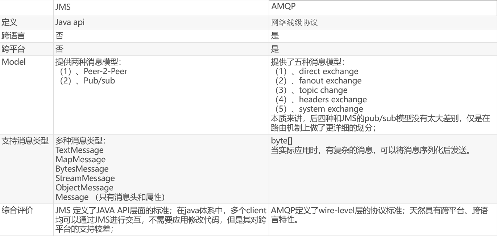
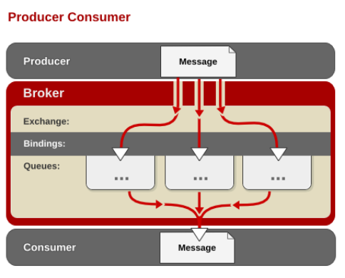
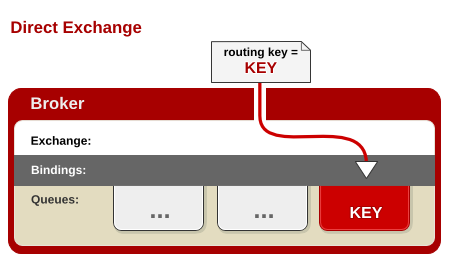
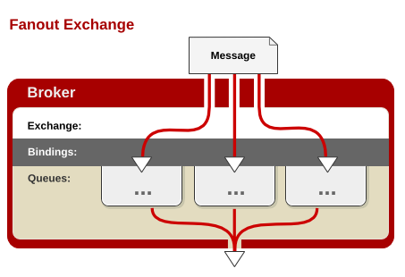
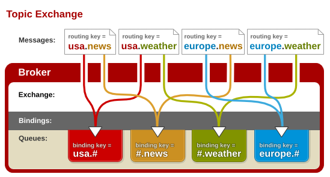
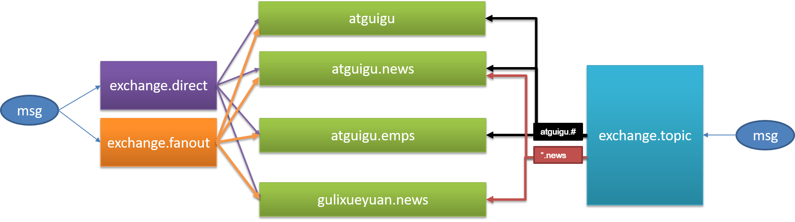

# 一：概述

> 1. 大多应用中，可通过消息服务中间件来提升系统异步通信、扩展解耦能力
>
> 2. 消息服务中两个重要概念：
>
>    ​    消息代理（message broker）和目的地（destination）
>
> 3. 消息队列主要有两种形式的目的地
>
>    1.队列（queue）：点对点消息通信（point-to-point）
>
>    2.主题（topic）：发布（publish）/订阅（subscribe）消息通信
>
> 4. 点对点式：
>
>    –消息发送者发送消息，消息代理将其放入一个队列中，消息接收者从队列中获取消息内容，消息读取后被移出队列
>
>    –消息只有唯一的发送者和接受者，但并不是说只能有一个接收者.但是只能被消费一次！
>
> 5. 发布订阅式：发送者（发布者）发送消息到主题，多个接收者（订阅者）监听（订阅）这个主题，那么就会在消息到达时同时收到消息
>
> 6. JMS（Java Message Service）JAVA消息服务：基于JVM消息代理的规范。ActiveMQ、HornetMQ是JMS实现
>
> 7. 4.AMQP（Advanced Message Queuing Protocol）：高级消息队列协议，也是一个消息代理的规范，兼容JMS。RabbitMQ是AMQP的实现
>
> 8. Spring支持
>
>    –**spring-** **jms** **提供了对** **JMS** **的支持**
>
>    –**spring-rabbit** **提供了对** **AMQP** **的支持**
>
>    –**需要** **ConnectionFactory** **的实现来连接消息代理**
>
>    –**提供** **JmsTemplate** **、** **RabbitTemplate** **来发送消息**
>
>    –**@** **JmsListener** **（ ** **JMS** **）、** **@** **RabbitListener** **（** **AMQP** **）注解在方法上监听消息代理发布的消息**
>
>    –**@** **EnableJms** **、** **@** **EnableRabbit** **开启支持**
>
> 9. Spring Boot自动配置
>
>    –**JmsAutoConfiguration**
>
>    –**RabbitAutoConfiguration**



# 二:简介

> **RabbitMQ** **简介：**RabbitMQ是一个由erlang开发的AMQP(Advanved Message Queue Protocol)的开源实现。
>
> **Message**:消息，消息是不具名的，它由消息头和消息体组成。消息体是不透明的，而消息头则由一系列的可选属性组成，这些属性包括routing-key（路由键）、priority（相对于其他消息的优先权）、delivery-mode（指出该消息可能需要持久性存储）等。
>
> **Publisher**:消息的生产者，也是一个向交换器发布消息的客户端应用程序。
>
> **Exchange**:交换器，用来接收生产者发送的消息并将这些消息路由给服务器中的队列。
>
> Exchange有4种类型：direct(默认)，fanout, topic, 和headers(几乎不用)，不同类型的Exchange转发消息的策略有所区别
>
> **Queue**：消息队列，用来保存消息直到发送给消费者。它是消息的容器，也是消息的终点。一个消息可投入一个或多个队列。消息一直在队列里面，等待消费者连接到这个队列将其取走。
>
> **Binding**：绑定，用于消息队列和交换器之间的关联。一个绑定就是基于路由键将交换器和消息队列连接起来的路由规则，所以可以将交换器理解成一个由绑定构成的路由表。Exchange 和Queue的绑定可以是多对多的关系。
>
> **Connection**：网络连接，比如一个TCP连接。
>
> **Channel**：信道，多路复用连接中的一条独立的双向数据流通道。信道是建立在真实的TCP连接内的虚拟连接，AMQP 命令都是通过信道发出去的，不管是发布消息、订阅队列还是接收消息，这些动作都是通过信道完成。因为对于操作系统来说建立和销毁 TCP 都是非常昂贵的开销，所以引入了信道的概念，以复用一条 TCP 连接。
>
> **Consumer**：消息的消费者，表示一个从消息队列中取得消息的客户端应用程序。
>
> **Virtual Host**：虚拟主机，表示一批交换器、消息队列和相关对象。虚拟主机是共享相同的身份认证和加密环境的独立服务器域。每个 vhost 本质上就是一个 mini 版的 RabbitMQ 服务器，拥有自己的队列、交换器、绑定和权限机制。vhost 是 AMQP 概念的基础，必须在连接时指定，RabbitMQ 默认的 vhost 是 / 。
>
> **Broker**：表示消息队列服务器实体


# 三：RabbitMQ运行机制

> •AMQP 中消息的路由过程和 Java 开发者熟悉的 JMS 存在一些差别，AMQP 中增加了 **Exchange** 和 **Binding** 的角色。生产者把消息发布到 Exchange 上，消息最终到达队列并被消费者接收，而 Binding 决定交换器的消息应该发送到那个队列。




## 1. Exchange 类型

> •**Exchange**分发消息时根据类型的不同分发策略有区别，目前共四种类型：**direct** **、** **fanout** **、** **topic** **、** **headers** 。headers 匹配 AMQP 消息的 header 而不是路由键， headers 交换器和 direct 交换器完全一致，但性能差很多，目前几乎用不到了，所以直接看另外三种类型：

## 2. direct
> 消息中的路由键（routing key）如果和 Binding 中的 binding key 一致， 交换器就将消息发到对应的队列中。路由键与队列名完全匹配，如果一个队列绑定到交换机要求路由键为“dog”，则只转发 routing key 标记为“dog”的消息，不会转发“dog.puppy”，也不会转发“dog.guard”等等。它是完全匹配、单播的模式。



## 3. fanout 

> 每个发到 fanout 类型交换器的消息都会分到所有绑定的队列上去。fanout 交换器不处理路由键，只是简单的将队列绑定到交换器上，每个发送到交换器的消息都会被转发到与该交换器绑定的所有队列上。很像子网广播，每台子网内的主机都获得了一份复制的消息。fanout 类型转发消息是最快的。



## 4. topic

> topic 交换器通过模式匹配分配消息的路由键属性，将路由键和某个模式进行匹配，此时队列需要绑定到一个模式上。它将路由键和绑定键的字符串切分成单词，这些**单词之间用点隔开**。它同样也会识别两个通配符：符号“#”和符号“*”。**#**匹配**0**个或多个单词**，*匹配一个单词。



# 四：下载

> docker 下载带 management版本的镜像。这样才会有管理界面
>
> 

```shell
带web页面：
[root@localhost ~]# docker pull rabbitmq:management
[root@localhost ~]# docker run -p 5672:5672 -p 15672:15672 -d --name rabbitmq --privileged=true -v /opt/rabbitmq/data:/var/lib/rabbitmq --hostname myRabbit -e RABBITMQ_DEFAULT_VHOST=/  -e RABBITMQ_DEFAULT_USER=admin -e RABBITMQ_DEFAULT_PASS=admin rabbitmq:management
##命令解说
-d 后台运行容器；
--name 指定容器名；
-p 指定服务运行的端口（5672：应用访问端口；15672：控制台Web端口号）；
-v 映射目录或文件；
--hostname  主机名（RabbitMQ的一个重要注意事项是它根据所谓的 “节点名称” 存储数据，默认为主机名）；
-e 指定环境变量；（RABBITMQ_DEFAULT_VHOST：默认虚拟机名；RABBITMQ_DEFAULT_USER：默认的用户名；RABBITMQ_DEFAULT_PASS：默认用户名的密码）
```

# 五：编程

```java
// pom.xml添加依赖
<dependency>
    <groupId>org.springframework.boot</groupId>
    <artifactId>spring-boot-starter-amqp</artifactId>
</dependency>
    
// 填写配置：参考。    
spring.rabbitmq.host=localhost
spring.rabbitmq.port=5672
spring.rabbitmq.username=guest
spring.rabbitmq.password=guest
// 开启confirms回调 P -> Exchange
spring.rabbitmq.publisher-confirms=true
// 开启returnedMessage回调 Exchange -> Queue
spring.rabbitmq.publisher-returns=true
// 设置手动确认(ack) Queue -> C
spring.rabbitmq.listener.simple.acknowledge-mode=manual
spring.rabbitmq.listener.simple.prefetch=100     
```

```shell
## 配置文件。默认使用的是 JDK 序列化。这里使用的是 jackson，可以使用fastjson。详情见代码
@Configuration
public class MyAMQPConfig {

    @Bean
    public MessageConverter messageConverter(){
        return new Jackson2JsonMessageConverter();
    }
}
```

```shell
## 监听 queues。当 queues 有消息时，触发
@Service
public class BookService {

    @RabbitListener(queues = "atguigu.news")
    public void receive(Book book){
        System.out.println("收到消息："+book);
    }

## 可以取到消息头。特殊处理
    @RabbitListener(queues = "atguigu")
    public void receive02(Message message){
        System.out.println(message.getBody());
        System.out.println(message.getMessageProperties());
    }
}
```

```shell
## 启动类添加开启rabbitmq注解：@EnableRabbit
/**
 * 自动配置
 *  1、RabbitAutoConfiguration
 *  2、有自动配置了连接工厂ConnectionFactory；
 *  3、RabbitProperties 封装了 RabbitMQ的配置
 *  4、 RabbitTemplate ：给RabbitMQ发送和接受消息；
 *  5、 AmqpAdmin ： RabbitMQ系统管理功能组件;
 *  	AmqpAdmin：创建和删除 Queue，Exchange，Binding
 *  6、@EnableRabbit +  @RabbitListener 监听消息队列的内容
 *
 */
@EnableRabbit  //开启基于注解的RabbitMQ模式
@SpringBootApplication
public class Springboot02AmqpApplication {

	public static void main(String[] args) {
		SpringApplication.run(Springboot02AmqpApplication.class, args);
	}
}
```

```java
// 测试.Binding配置如下图
import com.atguigu.amqp.bean.Book;
import org.junit.Test;
import org.junit.runner.RunWith;
import org.springframework.amqp.core.AmqpAdmin;
import org.springframework.amqp.core.Binding;
import org.springframework.amqp.core.DirectExchange;
import org.springframework.amqp.core.Queue;
import org.springframework.amqp.rabbit.core.RabbitTemplate;
import org.springframework.beans.factory.annotation.Autowired;
import org.springframework.boot.test.context.SpringBootTest;
import org.springframework.test.context.junit4.SpringRunner;

import java.util.Arrays;
import java.util.HashMap;
import java.util.Map;

@RunWith(SpringRunner.class)
@SpringBootTest
public class Springboot02AmqpApplicationTests {

	@Autowired
	RabbitTemplate rabbitTemplate;

	@Autowired
	AmqpAdmin amqpAdmin;

	@Test
	public void createExchange(){

//		amqpAdmin.declareExchange(new DirectExchange("amqpadmin.exchange"));
//		System.out.println("创建完成");

//		amqpAdmin.declareQueue(new Queue("amqpadmin.queue",true));
		//创建绑定规则

//		amqpAdmin.declareBinding(new Binding("amqpadmin.queue", Binding.DestinationType.QUEUE,"amqpadmin.exchange","amqp.haha",null));

		//amqpAdmin.de
	}

	/**
	 * 1、单播（点对点）
	 */
	@Test
	public void contextLoads() {
		//Message需要自己构造一个;定义消息体内容和消息头
		//rabbitTemplate.send(exchage,routeKey,message);

		//object默认当成消息体，只需要传入要发送的对象，自动序列化发送给rabbitmq；
		//rabbitTemplate.convertAndSend(exchage,routeKey,object);
		Map<String,Object> map = new HashMap<>();
		map.put("msg","这是第一个消息");
		map.put("data", Arrays.asList("helloworld",123,true));
		//对象被默认序列化以后发送出去
		rabbitTemplate.convertAndSend("exchange.direct","atguigu.news",new Book("西游记","吴承恩"));

	}

	//接受数据,如何将数据自动的转为json发送出去
	@Test
	public void receive(){
		Object o = rabbitTemplate.receiveAndConvert("atguigu.news");
		System.out.println(o.getClass());
		System.out.println(o);
	}

	/**
	 * 广播
	 */
	@Test
	public void sendMsg(){
		rabbitTemplate.convertAndSend("exchange.fanout","",new Book("红楼梦","曹雪芹"));
	}

}
```

