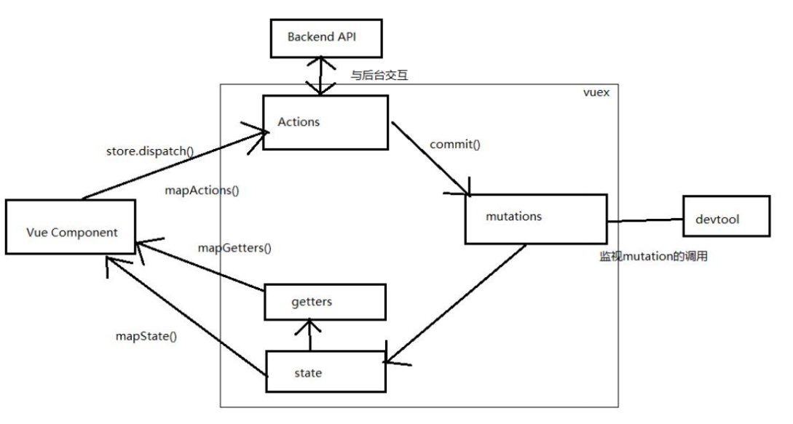

> 1. ~~ajax请求    vue-resource~~ 
> 2. ~~路由使用   -    vue-router~~
> 4. ~~打包、上线~~
> 5. ~~脚手架创建项目~~
> 6. ~~时间处理~~
> 7. ~~本地存储数据~~
> 8. ~~UI组件~~
> 9.  vue 组件间通信方式 
>    1.  props 	
>    2.  vue 的自定义事件 
>    3.  消息订阅与发布(如: pubsub 库) 
>    4.  slot 
>    5.  vuex(后面单独讲) 

# 一：安装CNPM

```shell
npm install -g cnpm --registry=https://registry.npm.taobao.org
```

# 二：VUE-CLI创建创建项目

## 1.  创建 vue 项目 

```shell
## 第一次先全局安装 vue-cli
## 后面就不需要每次安装
cnpm install -g vue-cli
## 创建vue 项目，项目名为：vue-base
vue init webpack vue-base
## 进入 vue-base
cd vue-base
## 安装依赖
cnpm install
## 运行
cnpm run dev
## 打开网址
http://localhost:8080
```

## 2. 相关设置

```shell
## .eslintignore: 指令检查忽略的文件
*.js 
*.vue
```

## 3. 项目打包

```shell
## 项目的打包与发布,放在Tomcat 下，CSS等不能正常读取
cnpm run build
## 修改配置: webpack.prod.conf.js
output: {
	publicPath: '/xiahan/' //打包文件夹的名称
}
## 重新打包:
cnpm run build
## 修改 dist 文件夹为项目名称: xxx
## 将 xxx 拷贝到运行的 tomcat 的 webapps 目录下
http://localhost:8080/xiahan/index.html

## 如果访问地址 不需要 /xiahan,可以使用默认的配置打包
```

# 三：时间处理

```shell
## 安装moment 插件
cnpm install moment --save
## 全局导入，在main.js中引入
import Moment from 'moment'
## 本地手动导入：<script type="text/javascript" src="https://cdn.bootcss.com/moment.js/2.19.0/moment.js"></script>

// 注册过滤器
Vue.filter('dateStr', function (value, format) {
  return Moment(value).format(format || 'YYYY-MM-DD HH:mm:ss')
})
## 组件中使用
data() {
	return {
		name: new Date(),
	};
}

<h1>{{name}}</h1>
<h1>{{name | dateStr}}</h1>
<h1>{{name | dateStr('YYYY-MM-DD')}}</h1>
<h1>{{name | dateStr('HH:mm:ss')}}</h1>
```

# 四：本地存储数据

```shell
## localStorage 用于长久保存整个网站的数据，保存的数据没有过期时间，直到手动去除。
## sessionStorage 用于临时保存同一窗口(或标签页)的数据，在关闭窗口或标签页之后将会删除这些数据。
```

| 方法                        | 描述                                               |
| --------------------------- | -------------------------------------------------- |
| getItem(*keyname*)          | 返回指定键的值                                     |
| setItem(*keyname*, *value*) | 添加键和值，如果对应的值存在，则更新该键对应的值。 |
| removeItem(*keyname*)       | 移除键                                             |
| clear()                     | 清除存储对象中所有的键                             |

```js
// utils 文件内容
export default{
    // sessionStorage 基本操作
    getItem_session(){
        return JSON.parse(window.sessionStorage.getItem(key) || '[]')
    },
    setItem_session(){
        window.sessionStorage.setItem(key, JSON.stringify(value))
    },
    removeItem_session(){
        window.sessionStorage.removeItem(key)
    },
    clear_session(){
        window.sessionStorage.clear()
    },

    // localStorage 基本操作
    getItem_local(key){
        return JSON.parse(window.localStorage.getItem(key) || '[]')
    },
    setItem_local(key, value){
        window.localStorage.setItem(key, JSON.stringify(value))
    },
    removeItem_local(key){
        window.localStorage.removeItem(key)
    },
    clear_local(){
        window.localStorage.clear()
    },
}

// vue 中使用
methods: {
    localSetTest(){
        storageUtil.setItem_local('msg', '我爱你中国');
    },
        localGetTest(){
            this.msg = storageUtil.getItem_local('msg');
        },
            localRemoveTest(){
                storageUtil.removeItem_local('msg');
            }
}
```

# 五： 使用 Mint UI 

```shell
## 下载
cnpm install --save mint-ui
## 移动端meta
<meta name="viewport" content="width=device-width, initial-scale=1, maximum-scale=1, minimum-scale=1, user-scalable=no" />
## 移动端延迟点击处理
<script src="https://as.alipayobjects.com/g/component/fastclick/1.0.6/fastclick.js"></script>
<script>
  if ('addEventListener' in document) {
    document.addEventListener('DOMContentLoaded', function () {
      FastClick.attach(document.body);
    }, false);
  }
  if (!window.Promise) {
    document.writeln('<script src="https://as.alipayobjects.com/g/component/es6-promise/3.2.2/es6-promise.min.js" ' + '>' + '<' + '/' + 'script>');
  }
</script>

## main.js
import {Button} from 'mint-ui'
    ## 注册
    Vue.component(Button.name, Button)
## App.vue
<template>
	<mt-button @click="handleClick" type="primary" style="width: 100%">Test</mt-button>
</template>

<script>
    import {Toast} from 'mint-ui'
        export default {
            methods: {
                handleClick () {
                Toast('点击了测试');
            }
        }
    }
</script>

```

```shell
## 实现按需打包
cnpm install --save-dev babel-plugin-component
## 修改 babel 配置
"plugins": 
["transform-runtime",
	[
		"component",
        {
          "libraryName": "mint-ui",
          "style": true
        }
	]
]
```

# 六：ajax请求

> 1)  created()/mounted(): 发送 ajax 请求, 启动定时器等异步任务 
>
> 2)  beforeDestory(): 做收尾工作, 如: 清除定时器 
>
> 参考文档：
>
>  https://www.jianshu.com/p/f959366fadb8 
>
>  https://www.jianshu.com/p/7a9fbcbb1114 

```shell
## 文档
https://github.com/pagekit/vue-resource/blob/develop/docs/http.md
## 下载
cnpm install axios --save

##-------------------局部------------------------------
## 局部引入模块
import axios from 'axios'
## 使用：axios.get();
##-------------------全局------------------------------
Vue.prototype.$axios = axios;
## 使用：this.$axios.get();


## 发送请求,默认get 方式
axios('http://rap2api.taobao.org/app/mock/121145/get', {
  params: {
    name: '小月'
  }
}).then(res => {
  console.log('请求结果：', res);
})
.catch(error => {
	console.log(error.message)
});

## 请求方式
axios.get(url, [config])
axios.post(url, [data], [config])
axios.delete(url, [config])
axios.put(url, [data], [config])

## GET带参数
axios.get('http://rap2api.taobao.org/app/mock/23080/resources/search',{
    params: {
    	id: 5
    }
})
.then(res => {
    console.log('数据是:', res);
    this.ajaxTest = res
})
.catch((e) => {
	console.log('获取数据失败');
});
## POST 带参数
axios.post("http://rap2api.taobao.org/app/mock/121145/post", {
	name: "小月",
})
## 箭头函数，需要注意
.then(res => {
	console.log(res);
	this.ajaxTest = res
})
// 使用箭头函数可以使用 this.ajaxTest，否则找不到 ajaxTest
.catch(function (err) {
	console.log('error', err);
});

axios.get('')
.then(response => {
	console.log(response.data) // 得到返回结果数据
})
.catch(error => {
	console.log(error.message)
})

```

```js
// 更多的选项
{
    method：'请求方法',
    baseURL：'如果路径不是绝对路径，就会在路径前自动添加此路径',
    transformRequest: [(data, header)=>{}], //在发送请求之前修改数据，适用于post、put、patch
    transformResponse:  [(data)=>{
        return JSON.parse(data).data;
    }], //在收到的数据传到then之前修改数据，注意这里data是个字符串类型。
    header: {'X-Requested-With': 'XMLHttpRequest'}, //请求头
    params: {}, //请求参数
    paramsSerializer: (params)=>{
        return qs.stringify(params); //name=xiaohong&id=1
    } //可选函数，可以把参数拼接成字符串
    data: {}, // post类方法的请求体参数
    timeout: 0, //请求延时事件，如果超时请求终止
    withCredentials: false, //是否时跨站点请求
    onUploadProgress: (progressEvent)=>{
        //可以通过progressEvent拿到上传的进度
    },
    onDownloadProgress: ()=>{},//和onUploadProgress一样，获取下载的进度
    responseType: json,  // 返回的数据格式
    maxContentLength: 2000, //相应内容的最大尺寸
    validateStatus: (validateStatus)=>{
        return validateStatus >= 200; //限制相应状态码，如果不满足就拒绝
    },
    cancelToken: new cancelToken(function(cancel){}) // 指定一个取消请求标识，下面会用到
}

{
  // `url` 是请求的接口地址
  url: '/user',

  // `method` 是请求的方法
  method: 'get', // 默认值

  // 如果url不是绝对路径，那么会将baseURL和url拼接作为请求的接口地址
  // 用来区分不同环境，建议使用
  baseURL: 'https://some-domain.com/api/',

  // 用于请求之前对请求数据进行操作
  // 只用当请求方法为‘PUT’，‘POST’和‘PATCH’时可用
  // 最后一个函数需return出相应数据
  // 可以修改headers
  transformRequest: [function (data, headers) {
    // 可以对data做任何操作

    return data;
  }],

  // 用于对相应数据进行处理
  // 它会通过then或者catch
  transformResponse: [function (data) {
    // 可以对data做任何操作

    return data;
  }],

  // `headers` are custom headers to be sent
  headers: {'X-Requested-With': 'XMLHttpRequest'},

  // URL参数
  // 必须是一个纯对象或者 URL参数对象
  params: {
    ID: 12345
  },

  // 是一个可选的函数负责序列化`params`
  // (e.g. https://www.npmjs.com/package/qs, http://api.jquery.com/jquery.param/)
  paramsSerializer: function(params) {
    return Qs.stringify(params, {arrayFormat: 'brackets'})
  },

  // 请求体数据
  // 只有当请求方法为'PUT', 'POST',和'PATCH'时可用
  // 当没有设置`transformRequest`时，必须是以下几种格式
  // - string, plain object, ArrayBuffer, ArrayBufferView, URLSearchParams
  // - Browser only: FormData, File, Blob
  // - Node only: Stream, Buffer
  data: {
    firstName: 'Fred'
  },

  // 请求超时时间（毫秒）
  timeout: 1000,

  // 是否携带cookie信息
  withCredentials: false, // default

  // 统一处理request让测试更加容易
  // 返回一个promise并提供一个可用的response
  // 其实我并不知道这个是干嘛的！！！！
  // (see lib/adapters/README.md).
  adapter: function (config) {
    /* ... */
  },

  // `auth` indicates that HTTP Basic auth should be used, and supplies credentials.
  // This will set an `Authorization` header, overwriting any existing
  // `Authorization` custom headers you have set using `headers`.
  auth: {
    username: 'janedoe',
    password: 's00pers3cret'
  },

  // 响应格式
  // 可选项 'arraybuffer', 'blob', 'document', 'json', 'text', 'stream'
  responseType: 'json', // 默认值是json

  // `xsrfCookieName` is the name of the cookie to use as a value for xsrf token
  xsrfCookieName: 'XSRF-TOKEN', // default

  // `xsrfHeaderName` is the name of the http header that carries the xsrf token value
  xsrfHeaderName: 'X-XSRF-TOKEN', // default

  // 处理上传进度事件
  onUploadProgress: function (progressEvent) {
    // Do whatever you want with the native progress event
  },

  // 处理下载进度事件
  onDownloadProgress: function (progressEvent) {
    // Do whatever you want with the native progress event
  },

  // 设置http响应内容的最大长度
  maxContentLength: 2000,

  // 定义可获得的http响应状态码
  // return true、设置为null或者undefined，promise将resolved,否则将rejected
  validateStatus: function (status) {
    return status >= 200 && status < 300; // default
  },

  // `maxRedirects` defines the maximum number of redirects to follow in node.js.
  // If set to 0, no redirects will be followed.
  // 最大重定向次数？没用过不清楚
  maxRedirects: 5, // default

  // `httpAgent` and `httpsAgent` define a custom agent to be used when performing http
  // and https requests, respectively, in node.js. This allows options to be added like
  // `keepAlive` that are not enabled by default.
  httpAgent: new http.Agent({ keepAlive: true }),
  httpsAgent: new https.Agent({ keepAlive: true }),

  // 'proxy' defines the hostname and port of the proxy server
  // Use `false` to disable proxies, ignoring environment variables.
  // `auth` indicates that HTTP Basic auth should be used to connect to the proxy, and
  // supplies credentials.
  // This will set an `Proxy-Authorization` header, overwriting any existing
  // `Proxy-Authorization` custom headers you have set using `headers`.
  // 代理
  proxy: {
    host: '127.0.0.1',
    port: 9000,
    auth: {
      username: 'mikeymike',
      password: 'rapunz3l'
    }
  },

  // `cancelToken` specifies a cancel token that can be used to cancel the request
  // (see Cancellation section below for details)
  // 用于取消请求？又是一个不知道怎么用的配置项
  cancelToken: new CancelToken(function (cancel) {
  })
}

```

# 七：路由 vue-router

```shell
## 安装
cnpm install vue-router --save

## VueRouter(): 用于创建路由器的构建函数
new VueRouter({
## 多个配置项
})
## 路由配置
routes: [
    { ##  一般路由
    	path: '/about', component: About
    },{ ## 自动跳转路由
    	path: '/', redirect: '/about' 
    }
]
## 注册路由器
import router from './router' 
new Vue({
	router
})
## 使用路由组件标签
	## 1. <router-link>: 用来生成路由链接
    <router-link to="/xxx">Go to XXX</router-link>
    ## 2. <router-view>: 用来显示当前路由组件界面
    <router-view></router-view>

## 向路由组件传递数据
	## 方式 1: 路由路径携带参数(param/query)
        ## 配置路由
        children: [
            {
                path: 'mdetail/:id', 
                component: MessageDetail
            }
        ]
        ## 路由路径
		<router-link :to="'/home/message/mdetail/'+m.id">{{m.title}}</router-link>
		## 路由组件中读取请求参数
		this.$route.params.id
	## 方式 2: <router-view>属性携带数据
		<router-view :msg="msg"></router-view>

## 缓存路由组件对象
## 1) 默认情况下, 被切换的路由组件对象会死亡释放, 再次回来时是重新创建的
## 2) 如果可以缓存路由组件对象, 可以提高用户体验
## 编码实现
<keep-alive>
	<router-view></router-view>
</keep-alive>
```

```shell
## 实例

## /src/router/index.js
import Vue from 'vue'
import Router from 'vue-router'
import HelloWorld from '@/components/HelloWorld.vue'
import About from '@/components/About.vue'
import Home from '@/components/Home.vue'
import Message from '@/components/Message.vue'
import MessageDetail from '@/components/MessageDetail.vue'
import News from '@/components/News.vue'

Vue.use(Router)
export default new Router({
  routes: [
    {
      path: '/about',
      component: About
    },
    {
      path: '/home',
      component: Home,
      children: [
        {
          path: '/home/news',
          component: News
        },
        {
          path: 'message',
          component: Message,
          children: [
            {
              path:'detail/:id',
              component: MessageDetail
            }
          ]
        },
        {
          path: '',
          redirect: '/home/news'
        }
      ]
    },
    {
      path: '/',
      redirect: '/about'
    }
  ]
})

## \src\components\About.vue
<template>
  <div>
    <h2>About</h2>
    <p>{{msg}}</p>
    <input type="text" v-model= 'msg'/>
  </div>
</template>
<script>
export default {
  props: {
    msg: String,
  },
};
</script>
<style>
</style>
## src\components\Home.vue
<template>
  <div>
    <h2>Home</h2>
    <div>
      <ul class="nav nav-tabs">
        <li>
          <router-link to="/home/news">News123</router-link>
        </li>
        <li>
          <router-link to="/home/message">Message123</router-link>
        </li>
      </ul>
      <router-view></router-view>
    </div>
  </div>
</template>
<script>
export default {};
</script>
<style>
</style>
## \src\components\Message.vue
<template>
  <div>
    <ul>
      <li v-for="m in message" :key="m.id">
        <router-link :to="`/home/message/detail/${m.id}`">{{m.title}}</router-link>
        <button @click="pushShow(m.id)">push 查看</button>
        <button @click="replaceShow(m.id)">replace 查看</button>
      </li>
    </ul>
    <button @click="$router.back()">回退</button>
    <hr />
    <router-view></router-view>
  </div>
</template>
<script>
export default {
  data() {
    return {
      message: [],
    };
  },
  mounted() {
    setTimeout(() => {
      const message = [
        { id: 1, title: "Message001" },
        { id: 2, title: "Message002" },
        { id: 3, title: "Message003" },
      ];
      this.message = message;
    }, 1000);
  },
  methods: {
    pushShow(id) {
      this.$router.push(`/home/message/detail/${id}`);
    },
    replaceShow(id) {
      this.$router.replace(`/home/message/detail/${id}`);
    },
  },
};
</script>
<style>
</style>
## src\components\MessageDetail.vue
<template>
  <div>
    <ul>
      <li>id: {{$route.params.id}}</li>
      <li>title: {{detail.title}}</li>
      <li>content:{{detail.content}}</li>
    </ul>
  </div>
</template>
<script>
const messageDetails = [
  { id: 1, title: "Message001", content: "message content00111...." },
  { id: 3, title: "Message003", content: "message content00222...." },
  { id: 5, title: "Message005", content: "message content00333...." },
];
export default {
  data() {
    return {
      detail: [],
    };
  },
  mounted() {
    // 改变当前路由组件参数数据时, 不会重新创建组件对象, mounted不会重新执行
    const id = this.$route.params.id;
    this.detail = messageDetails.find((detail) => detail.id === id * 1);
  },
  watch: {
    $route: function () {
      // 改变当前路由组件参数数据时自动调用
      console.log("$route()");
      const id = this.$route.params.id;
      this.detail = messageDetails.find((detail) => detail.id === id * 1);
    },
  },
};
</script>
<style>
</style>
## src\components\News.vue
<template>
  <div>
    <h2>About</h2>
    <p>{{msg}}</p>
    <input type="text" />
  </div>
</template>
<script>
export default {
  props: {
    msg: String,
  },
};
</script>
<style>
</style>
## App.vue
<template>
  <div>
    <div class="row">
      <div class="col-xs-offset-2 col-xs-8">
        <div class="page-header"><h2>Router Test</h2></div>
      </div>
    </div>
    <div class="row">
      <div class="col-xs-2 col-xs-offset-2">
        <div class="list-group">
          <!--生成路由链接-->
          <router-link to="/about" class="list-group-item">About</router-link>
          <router-link to="/home" class="list-group-item">Home</router-link>
        </div>
      </div>
      <div class="col-xs-6">
        <div class="panel">
          <div class="panel-body">
            <!--显示当前组件-->
            <keep-alive>
              <router-view msg="abc"></router-view>
            </keep-alive>
          </div>
        </div>
      </div>
    </div>
  </div>
</template>
<script>
  export default {}
</script>
<style>
</style>
```

# 八：vue 组件间通信方式

## 1.  props

```shell
## 父标签上传值
<my-component name='tom' :age='3' :set-name='setName'></my-component>
##子标签上接收，在组件内声明所有的 props。而后像常规data 数据使用
    ## 方式一: 只指定名称
    props: ['name', 'age', 'setName']
    ## 方式二: 指定名称和类型
    props: {
        name: String, age: Number, setNmae: Function
    }
    ## 方式三: 指定名称/类型/必要性/默认值
    props: {
        name: {type: String, required: true, default:xxx}
    }
## 注意事项
    ## 1. 此方式用于父组件向子组件传递数据
    ## 2. 所有标签属性都会成为组件对象的属性, 模板页面可以直接引用
    ## 3. 问题:
        ## a. 如果需要向非子后代传递数据必须多层逐层传递
        ## b. 兄弟组件间也不能直接 props 通信, 必须借助父组件才可以
```

## 2.  vue 的自定义事件

```shell
## 子组件中 触发事件(只能在父组件中接收)
this.$emit('deleteTodoData', data)
## 父组件
## 方式一: 通过 v-on 绑定
@deleteTodoData="deleteTodo"
## 方式二: 通过$on()
this.$refs.xxx.$on('deleteTodoData', function (todo) {
	this.deleteTodo(todo)
})
## deleteTodoData: 只是一个标识符  deleteTodo：实实在在的函数，处理删除逻辑

## 此方式只用于子组件向父组件发送消息(数据)
## 问题: 隔代组件或兄弟组件间通信此种方式不合适
```

## 3.  消息订阅与发布(如: pubsub 库)

```shell
## 下载
cnpm install --save pubsub-js
## 发布消息.只有数据，就是页面点击后在点击函数使用
PubSub.publish('msg', data)
## 订阅消息。在 mounted 里面监听
PubSub.subscribe('msg', function(msg, data){})

## 优点: 此方式可实现任意关系组件间通信(数据)
```

```shell
## 事件的 2 个重要操作(总结)
    ## 1) 绑定事件监听 (订阅消息)
        目标: 标签元素 <button>
        事件名(类型): click/focus
        回调函数: function(event){}
    ## 2) 触发事件 (发布消息)
        DOM 事件: 用户在浏览器上对应的界面上做对应的操作
        自定义: 编码手动触发
```

## 4.  slot

```shell
## 此方式用于父组件向子组件传递`标签数据`
## 子组件: Child.vue, 使用 slot 占位
<template>
    <div>
        <slot name="xxx">不确定的标签结构 1</slot>
        <div>组件确定的标签结构</div>
        <slot name="yyy">不确定的标签结构 2</slot>
    </div>
</template>
## 父组件: Parent.vue ，传入标签，可以不传。则不显示
<child>
    <div slot="xxx">xxx 对应的标签结构</div>
    <div slot="yyy">yyyy 对应的标签结构</div>
</child>
```

## 5.  vuex

```shell
## 下载: 
cnpm install vuex --save
## vuex 结构分析如下图

## 1. state
	## vuex 管理的状态对象
	## 它应该是唯一的
    const state = {
    	xxx: initValue
    }
## 2. mutations    
    ## 包含多个直接更新 state 的方法(回调函数)的对象
    ## 谁来触发: action 中的 commit('mutation 名称')
    ## 只能包含同步的代码, 不能写异步代码
    const mutations = {
        yyy (state, {data1}) {
        // 更新 state 的某个属性
        }
    }
## 3. actions    
    ## 包含多个事件回调函数的对象
    ## 通过执行: commit()来触发 mutation 的调用, 间接更新 state
    ## 谁来触发: 组件中: $store.dispatch('action 名称', data1) // 'zzz' 4) 可以包含异步代码(定时器, ajax)
    const actions = {
        zzz ({commit, state}, data1) {
            commit('yyy', {data1})
        }
    }
## 4. getters
    ## 包含多个计算属性(get)的对象
    ## 谁来读取: 组件中: $store.getters.xxx
    const getters = {
        mmm (state) {
            return ...
        }
    }
## 向外暴露 store 对象
export default new Vuex.Store({
	state, 
	mutations, 
	actions, 
	getters
})
## 组件中
import {mapState, mapGetters, mapActions} from 'vuex' export default {
    computed: {
    	...mapState(['xxx']), ...mapGetters(['mmm'])
    }
    methods: mapActions(['zzz'])
}
{{xxx}} {{mmm}} @click="zzz(data)"
## 映射 store
import store from './store' new Vue({
	store
})
## store 对象
## 所有用 vuex 管理的组件中都多了一个属性$store, 它就是一个 store 对象
## 属性:
    ## state: 注册的 state 对象
    ## getters: 注册的 getters 对象
## 方法:
	dispatch(actionName, data): 分发调用 action
```

> # 一个示例
>
> ## 1. main.js
> ```js
> 
> <template>
>   <div>
>     <p>click {{count}} times, count is {{evenOrOdd}}</p>
>     <button @click="increment">+</button>
>     <button @click="decrement">-</button>
>     <button @click="incrementIfOdd">increment if odd</button>
>     <button @click="incrementAsync">increment async</button>
>   </div>
> </template>
> 
> <script>
>   // <div>
>   //   <p>click {{$store.state.count}} times, count is {{$store.getters.evenOrOdd}}</p>
>   //   <button @click="increment">+</button>
>   //   <button @click="decrement">-</button>
>   //   <button @click="incrementIfOdd">increment if odd</button>
>   //   <button @click="incrementAsync">increment async</button>
>   // </div>
> import {mapState, mapGetters, mapActions  } from 'vuex'
> export default {
>   
>   data() {
>     return {};
>   },
>   components: {},
>   computed:{
>     ...mapState(['count']),
>     ...mapGetters(['evenOrOdd'])
>   },
>   methods: {
>     ...mapActions(['increment', 'decrement', 'incrementIfOdd', 'incrementAsync'])
>       // increment(){
>       //     this.$store.dispatch('increment')
>       // },
>       // decrement(){
>       //     this.$store.dispatch('decrement')
>       // },
>       // incrementIfOdd(){
>       //     this.$store.dispatch('incrementIfOdd')
>       // },
>       // incrementAsync(){
>       //     this.$store.dispatch('incrementAsync')
>       // },
>   },
>   mounted() {},
> };
> </script>
> 
> <style>
> </style>
> ```
>
> ##  2. main.js
> ```js 
> 
> // The Vue build version to load with the `import` command
> // (runtime-only or standalone) has been set in webpack.base.conf with an alias.
> import Vue from 'vue'
> import App from './App'
> import store from './store'
> 
> 
> /* eslint-disable no-new */
> new Vue({
>   el: '#app',
>   components: { App },
>   template: '<App/>',
>   store
> })
> 
> ```
>
> ##  3. store.js
> ```js
> 
> import Vue from 'vue'
> import Vuex from 'vuex'
> 
> Vue.use(Vuex)
> 
> const state= {
>     count : 0
> }
> 
> const mutations ={
>     INCREMENT(state){
>         state.count++
>     },
>     DECREMENT(state){
>         state.count--
>     }
> 
> }
> 
> const actions ={
>     increment({commit}){
>         commit('INCREMENT')
>     },
>     decrement({commit}){
>         commit('DECREMENT')
>     },
>     incrementIfOdd({commit, state}){
>         if(state.count%2===1) {
>             // 提交一个mutation请求
>             commit('INCREMENT')
>           }
>     },
>     incrementAsync ({commit}) {
>         setTimeout(() => {
>           // 提交一个mutation请求
>           commit('INCREMENT')
>         }, 1000)
>       },
> 
> }
> 
> const getters={
>     evenOrOdd(state){
>         return state.count%2===0 ? '偶数' : '奇数'
>     }
> }
> 
> export default new Vuex.Store({
>     state,
>     mutations,
>     actions,
>     getters
> })
> ```
>
> 




