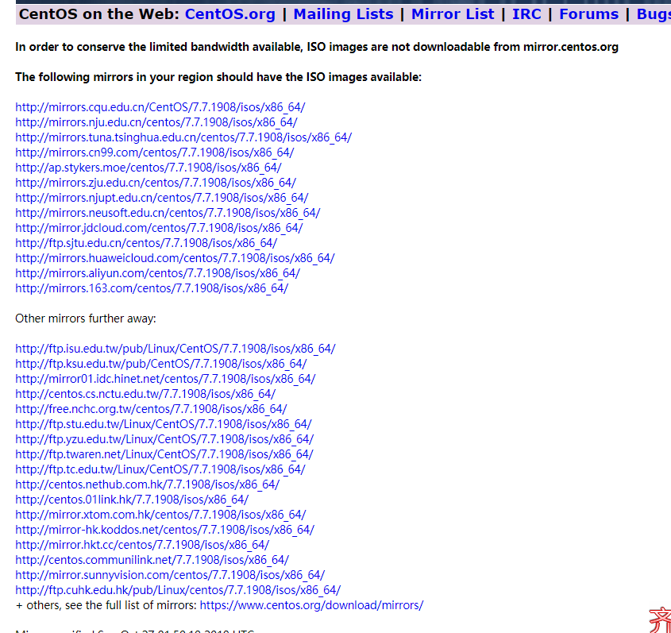

# centos 7 下载

# 一. 官网下载

## 1. [官网]( http://isoredirect.centos.org/centos/ )

> The following mirrors in your region should have the ISO images available: 国内源>
>
> Other mirrors further away: 其他源。
>
> 选择国内，速度快。这里选择阿里源

# 二. 阿里下载

## 1.阿里centos 7

[阿里]( http://mirrors.aliyun.com/centos/ )：这里有其他的版本。

> 这里选择最新的centos 7：选择版本，进入isos，进入x86_64

>以下针对各个版本的ISO镜像文件，进行一一说明：
>
>CentOS-7-x86_64-DVD-X.iso        标准安装版，一般下载这个就可以了（推荐）
>
>CentOS-7-x86_64-NetInstall-X.iso    网络安装镜像（从网络安装或者救援系统）  
>
>CentOS-7-x86_64-Everything-X.iso    对完整版安装盘的软件进行补充，集成所有软件。（包含centos7的一套完整的软件包，可以用来安装系统或者填充本地镜像）
>
>CentOS-7-x86_64-LiveGNOME-X.iso     GNOME桌面版  
>
>CentOS-7-x86_64-LiveKDE-X.iso      KDE桌面版  
>
>CentOS-7-x86_64-Minimal-X.iso      精简版，自带的软件最少
>

## 2. 下载centos 7

>这里下载DVD

