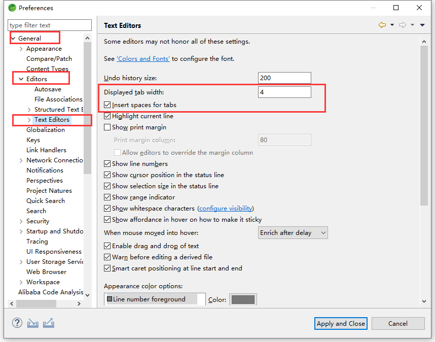
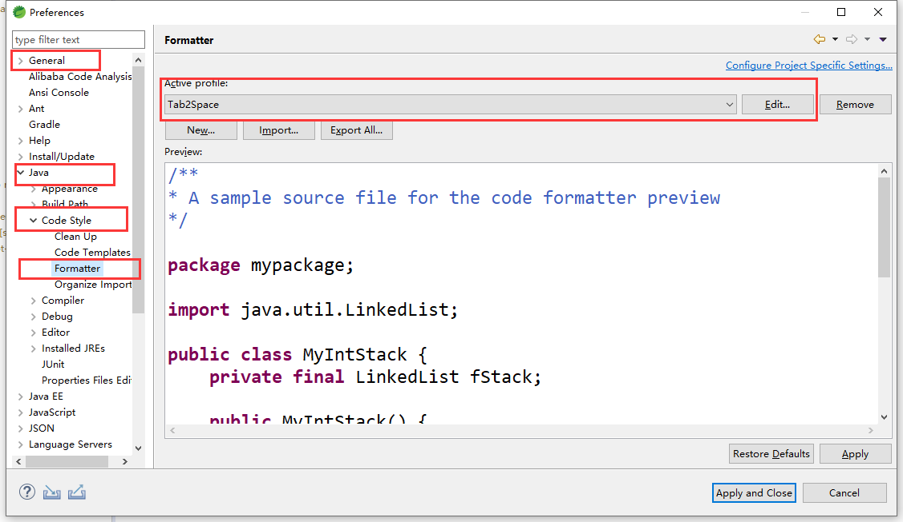
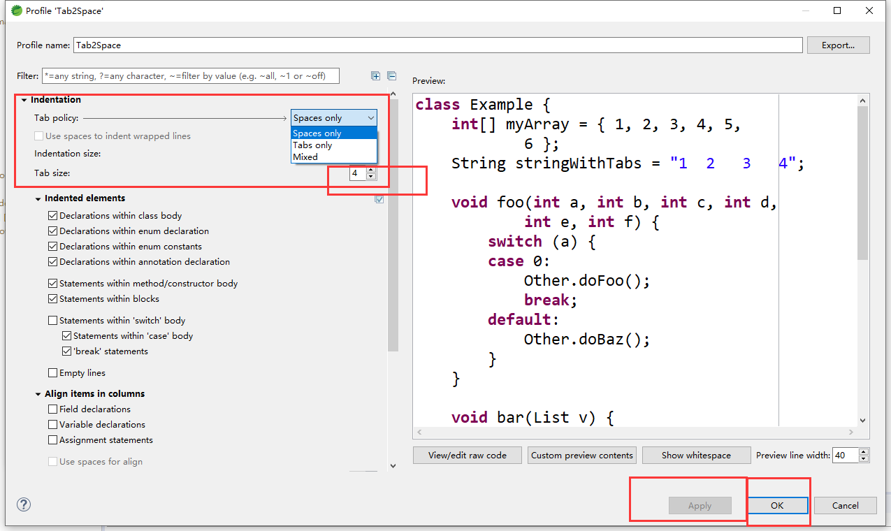
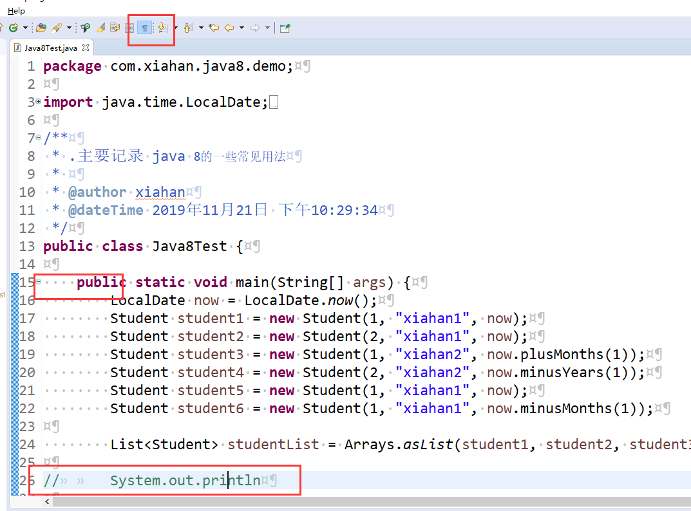

# eclipse 设置

# 一：空格替换TAB

1. 阿里强制：四个空格代替tab
2. Tips：编码过程可能出现使用空格去对齐代码，而不同的编译器、机器会出现对于 tab 处理方式不同。导致代码排版乱，不整洁。使用空格代替 TAB即可解决这个问题
3. 使用后 即使使用  ctrl + shift + f 也会使用空格代替 tab

* window -> preferences -> general -> editors ->  text editors -> 勾选 inssert space for tabs

  

  * window -> preferences -> general -> java -> code style -> ormatter

    

    

    * 如果 apply 按钮为灰色，然后修改里面即可

      
      
      * 修改完后重启即可
      
      * 修改效果
      
        