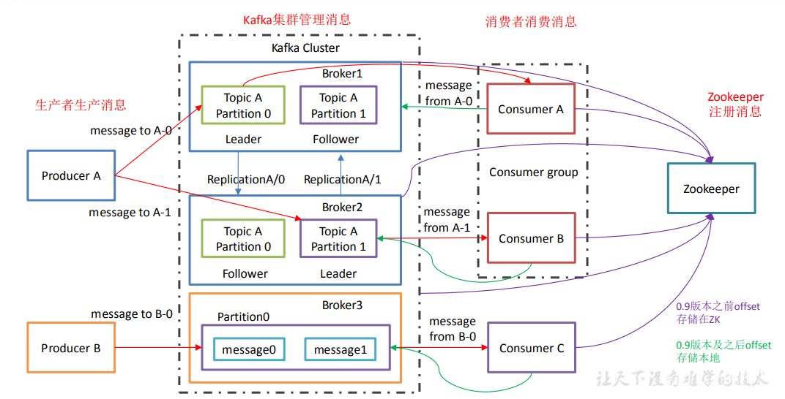
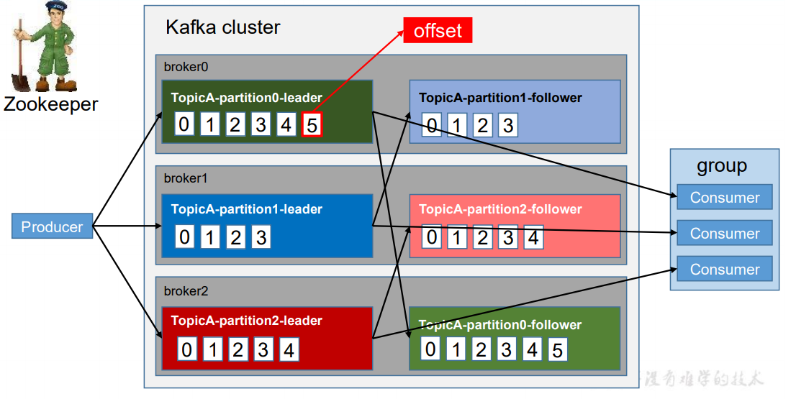
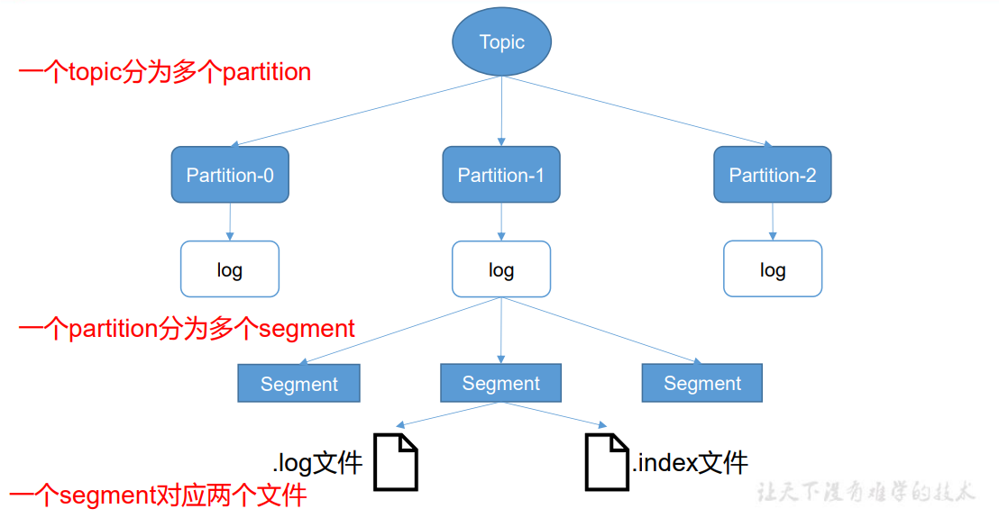
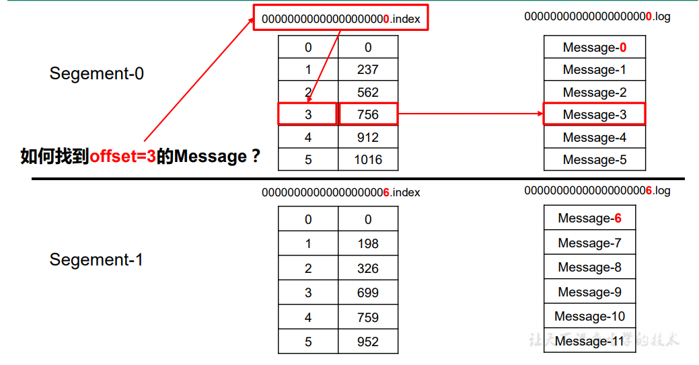
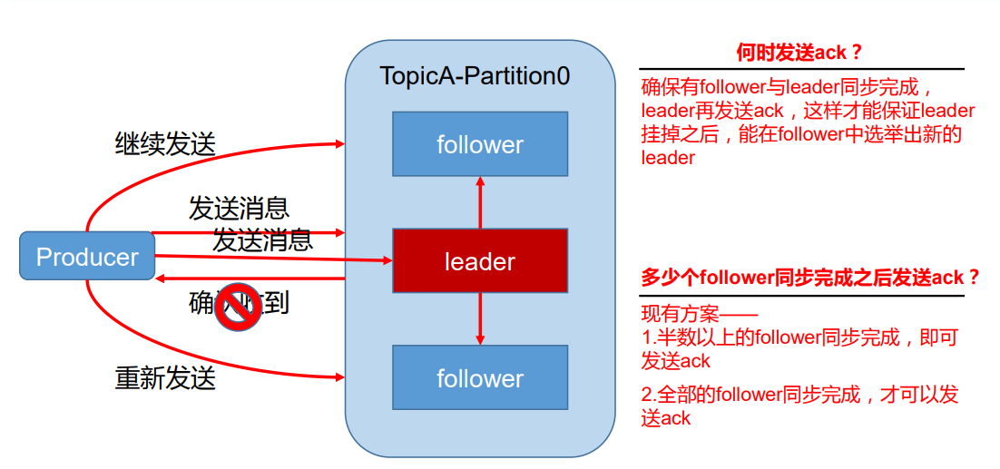
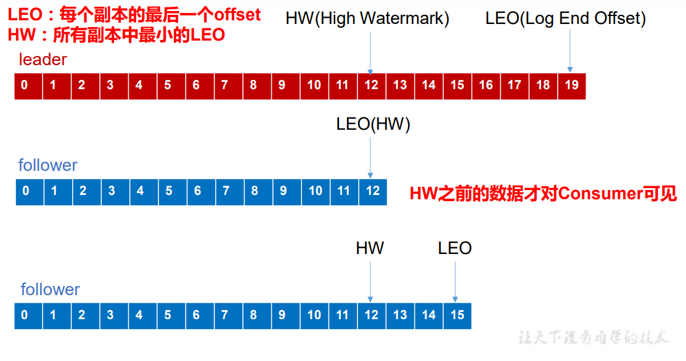
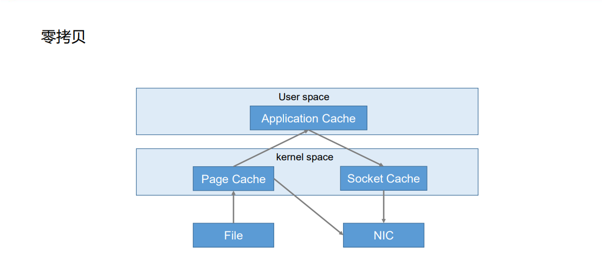
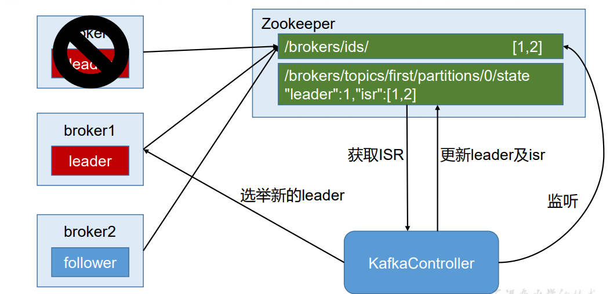
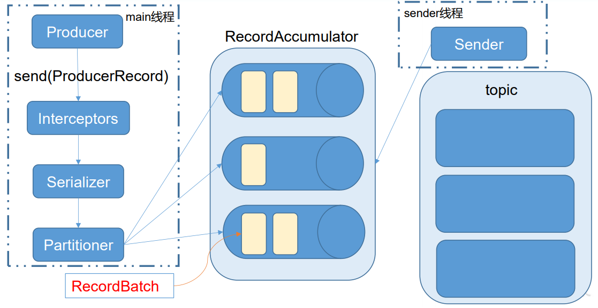
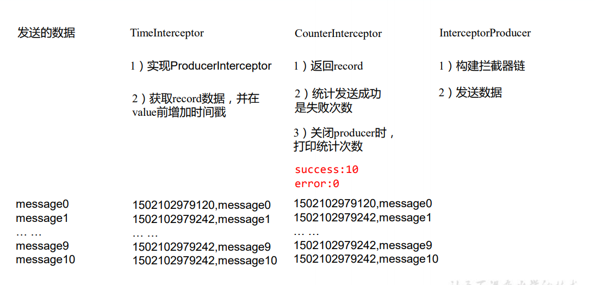

# 一：kafka架构



# 二：安装

## 1.  jar 包下载 

>  http://kafka.apache.org/downloads.html 

## 2.  集群部署 

1)  

```shell
## 解压安装包
[root@hadoop0-110 backup]# tar -zxvf kafka_2.11-0.11.0.0.tgz -C /opt/

## 在/opt/kafka_2.11-0.11.0.0 目录下创建 data 文件夹,用于存储数据
[root@hadoop0-110 kafka_2.11-0.11.0.0]# mkdir data

## 修改配置文件
[root@hadoop0-110 kafka_2.11-0.11.0.0]# cd config/
[root@hadoop0-110 config]# vim server.properties
	#broker 的全局唯一编号，不能重复
    broker.id=0
    #删除 topic 功能使能
    delete.topic.enable=true
    #数据存储于kafka日志不是一个东西
    log.dirs=/opt/kafka_2.11-0.11.0.0/data
    #配置连接 Zookeeper 集群地址
	zookeeper.connect=hadoop0-110:2181,hadoop1-111:2181,hadoop2-112:2181

## 配置环境变量
[root@hadoop0-110 config]# vim /etc/profile
	#KAFKA_HOME
    export KAFKA_HOME=/opt/kafka_2.11-0.11.0.0
    export PATH=$PATH:$KAFKA_HOME/bin
[root@hadoop0-110 kafka_2.11-0.11.0.0]# source /etc/profile

## 分发安装包
[root@hadoop0-110 kafka_2.11-0.11.0.0]# xsync /opt/kafka_2.11-0.11.0.0/
	## 注意：分发之后记得配置其他机器的环境变量
## ）分别在 hadoop1-110 和 hadoop2-112 上修改配置文件/opt/kafka_2.11-0.11.0.0//config/server.properties 中的 broker.id=1、broker.id=2
```

## 3.  启动集群

```shell
## 启动zk
[root@hadoop0-110 bin]# /opt/zookeeper-3.4.10/bin/zkServer.sh start
[root@hadoop1-111 bin]# /opt/zookeeper-3.4.10/bin/zkServer.sh start
[root@hadoop2-112 bin]# /opt/zookeeper-3.4.10/bin/zkServer.sh start

## 启动 kafka，-daemon后台进程启动，不加会阻塞
[root@hadoop0-110 kafka_2.11-0.11.0.0]# bin/kafka-server-start.sh -daemon config/server.properties
[root@hadoop1-111 kafka_2.11-0.11.0.0]# bin/kafka-server-start.sh -daemon config/server.properties
[root@hadoop2-112 kafka_2.11-0.11.0.0]# bin/kafka-server-start.sh -daemon config/server.properties
## 关闭集群
[root@hadoop0-110 kafka_2.11-0.11.0.0]# bin/kafka-server-stop.sh
[root@hadoop1-111 kafka_2.11-0.11.0.0]# bin/kafka-server-stop.sh
[root@hadoop2-112 kafka_2.11-0.11.0.0]# bin/kafka-server-stop.sh

## kafka 群起脚本
[root@hadoop0-110 bin]# vim mykafka.sh
#!/bin/bash
case $1 in

"start"){
    for i in 'hadoop0-110' 'hadoop1-111' 'hadoop2-112'
        do
            echo "*************$i****************"
            ssh $i /opt/kafka_2.11-0.11.0.0/bin/kafka-server-start.sh -daemon /opt/kafka_2.11-0.11.0.0/config/server.properties
        done
};;
"stop"){
    for i in 'hadoop0-110' 'hadoop1-111' 'hadoop2-112'
        do
            echo "*************$i****************"
            ssh $i /opt/kafka_2.11-0.11.0.0/bin/kafka-server-stop.sh
        done
};;
esac

```

## 4. 命令行操作 

```shell
## 查看当前服务器中的所有 topic
[root@hadoop0-110 kafka_2.11-0.11.0.0]# bin/kafka-topics.sh --zookeeper hadoop0-110:2181 --list
## 创建 topic
[root@hadoop0-110 kafka_2.11-0.11.0.0]# bin/kafka-topics.sh --zookeeper hadoop0-110:2181 --create --topic first --partitions 2 --replication-factor 2
	--topic 定义 topic 名
    --replication-factor 定义副本数
    --partitions 定义分区数
## 删除 topic
[root@hadoop0-110 kafka_2.11-0.11.0.0]# bin/kafka-topics.sh --delete --topic first --zookeeper hadoop0-110:2181
	#需要 server.properties 中设置 delete.topic.enable=true 否则只是标记删除。
## 发送消息
[root@hadoop0-110 kafka_2.11-0.11.0.0]# bin/kafka-console-producer.sh --broker-list hadoop0-110:9092 --topic first
## 接收消息
[root@hadoop1-111 kafka_2.11-0.11.0.0]# bin/kafka-console-consumer.sh --topic first --bootstrap-server hadoop0-110:9092
[root@hadoop1-111 kafka_2.11-0.11.0.0]# bin/kafka-console-consumer.sh --topic first --zookeeper hadoop0-110:2181 --from-beginning
[root@hadoop1-111 kafka_2.11-0.11.0.0]# bin/kafka-console-consumer.sh --topic first --bootstrap-server hadoop0-110:9092 --from-beginning

## 查看某个 Topic 的详情
[root@hadoop1-111 kafka_2.11-0.11.0.0]# bin/kafka-topics.sh --topic first --describe --zookeeper hadoop0-110:2181

## 修改分区数
[root@hadoop1-111 kafka_2.11-0.11.0.0]# bin/kafka-topics.sh --zookeeper hadoop102:2181 --alter --topic first --partitions 6
```

## 5. kafka架构

>  Kafka 中消息是以 topic 进行分类的，生产者生产消息，消费者消费消息，都是面向 topic 的。 
>
>  topic 是逻辑上的概念，而 partition 是物理上的概念，每个 partition 对应于一个 log 文 件，该 log 文件中存储的就是 producer 生产的数据。Producer 生产的数据会被不断追加到该 log 文件末端，且每条数据都有自己的 offset。消费者组中的每个消费者，都会实时记录自己 消费到了哪个 offset，以便出错恢复时，从上次的位置继续消费。 



>  由于生产者生产的消息会不断追加到 log 文件末尾，为防止 log 文件过大导致数据定位 效率低下，Kafka 采取了分片和索引机制，将每个 partition 分为多个 segment。每个 segment 对应两个文件——“.index”文件和“.log”文件。这些文件位于一个文件夹下，该文件夹的命名 规则为：topic 名称+分区序号。例如，first 这个 topic 有三个分区，则其对应的文件夹为 first0,first-1,first-2。 
>
>  00000000000000000000.index
> 00000000000000000000.log 
> 00000000000000170410.index
>  00000000000000170410.log 
> 00000000000000239430.index 
> 00000000000000239430.log 



>  index 和 log 文件以当前 segment 的第一条消息的 offset 命名。下图为 index 文件和 log 文件的结构示意图。 
>
> “.index”文件存储大量的索引信息，“.log”文件存储大量的数据，索引文件中的元 数据指向对应数据文件中 message 的物理偏移地址。  



## 6. Kafka 生产者 

>  分区的原因 
>
>  （1）方便在集群中扩展，每个 Partition 可以通过调整以适应它所在的机器，而一个 topic 又可以有多个 Partition 组成，因此整个集群就可以适应任意大小的数据了； 
>  （2）可以提高并发，因为可以以 Partition 为单位读写了。  


>  分区的原则 
>
>  ​	我们需要将 producer 发送的数据封装成一个 ProducerRecord 对象。 
>
>  （1）指明 partition 的情况下，直接将指明的值直接作为 partiton 值； 
>  （2）没有指明 partition 值但有 key 的情况下，将 key 的 hash 值与 topic 的 partition 数进行取余得到 partition 值； 
>  （3）既没有 partition 值又没有 key 值的情况下，第一次调用时随机生成一个整数（后 面每次调用在这个整数上自增），将这个值与 topic 可用的 partition 总数取余得到 partition 值，也就是常说的 round-robin 算法。 


>   数据可靠性保证  
>
>  ​	 为保证 producer 发送的数据，能可靠的发送到指定的 topic，topic 的每个 partition 收到 producer 发送的数据后，都需要向 producer 发送 ack（acknowledgement 确认收到），如果 producer 收到 ack，就会进行下一轮的发送，否则重新发送数据。 
>
>  
>
>   （1） 副本数据同步策略 :
>
>  | 方案                         | 优点                                                       | 缺点                                                        |
>  | ---------------------------- | ---------------------------------------------------------- | ----------------------------------------------------------- |
>  | 半数以上完成同步，就发送 ack | 延迟低                                                     | 选举新的 leader 时，容忍 n 台 节点的故障，需要 2n+1 个副 本 |
>  | 全部完成同步，才发送 ack     | 选举新的 leader 时，容忍 n 台 节点的故障，需要 n+1 个副 本 | 延迟高                                                      |
>
>   Kafka 选择了第二种方案，原因如下： 1.同样为了容忍 n 台节点的故障，第一种方案需要 2n+1 个副本，而第二种方案只需要 n+1 个副本，而 Kafka 的每个分区都有大量的数据，第一种方案会造成大量数据的冗余。 2.虽然第二种方案的网络延迟会比较高，但网络延迟对 Kafka 的影响较小。 
>
>   （2）ISR : Leader 维护了一个动态的 in-sync replica set (ISR)，意为和 leader 保持同步的 follower 集 合。当 ISR 中的 follower 完成数据的同步之后，leader 就会给 follower 发送 ack。如果 follower 长时间未向 leader 同步数据 ， 则该 follower 将被踢出ISR ，该时间阈值由replica.lag.time.max.ms 参数设定。Leader 发生故障之后，就会从 ISR 中选举新的 leader。 
>
>   （3） ack 应答机制 对于某些不太重要的数据，对数据的可靠性要求不是很高，能够容忍数据的少量丢失， 所以没必要等 ISR 中的 follower 全部接收成功。 所以 Kafka 为用户提供了三种可靠性级别，用户根据对可靠性和延迟的要求进行权衡， 选择以下的配置。  


>   acks：
>
>  ​	 0：producer 不等待 broker 的 ack，这一操作提供了一个最低的延迟，broker 一接收到还 没有写入磁盘就已经返回，当 broker 故障时有可能丢失数据； 
>
>  ​	1：producer 等待 broker 的 ack，partition 的 leader 落盘成功后返回 ack，如果在 follower 同步成功之前 leader 故障，那么将会丢失数据；  
>
>   	-1（all）：producer 等待 broker 的 ack，partition 的 leader 和 follower 全部落盘成功后才 返回 ack。但是如果在 follower 同步完成后，broker 发送 ack 之前，leader 发生故障，那么会 造成数据重复。 


>  故障处理细节 
>
>  
>
>  LEO：指的是每个副本最大的 offset； 
>  HW：指的是消费者能见到的最大的 offset，ISR 队列中最小的 LEO。  
>
>   follower 故障 ： follower 发生故障后会被临时踢出 ISR，待该 follower 恢复后，follower 会读取本地磁盘 记录的上次的 HW，并将 log 文件高于 HW 的部分截取掉，从 HW 开始向 leader 进行同步。 等该 follower 的 LEO 大于等于该 Partition 的 HW，即 follower 追上 leader 之后，就可以重 新加入 ISR 了。 
>
>   leader 故障 ： leader 发生故障之后，会从 ISR 中选出一个新的 leader，之后，为保证多个副本之间的 数据一致性，其余的 follower 会先将各自的 log 文件高于 HW 的部分截掉，然后从新的 leader 同步数据。 
>
>   注意：这只能保证副本之间的数据一致性，并不能保证数据不丢失或者不重复。 

## 7. Exactly Once 语义 

>  将服务器的 ACK 级别设置为-1，可以保证 Producer 到 Server 之间不会丢失数据，即 At Least Once 语义。相对的，将服务器 ACK 级别设置为 0，可以保证生产者每条消息只会被 发送一次，即 At Most Once 语义。 
>
>  At Least Once 可以保证数据不丢失，但是不能保证数据不重复；相对的，At Least Once 可以保证数据不重复，但是不能保证数据不丢失。但是，对于一些非常重要的信息，比如说 交易数据，下游数据消费者要求数据既不重复也不丢失，即 Exactly Once 语义。在 0.11 版 本以前的 Kafka，对此是无能为力的，只能保证数据不丢失，再在下游消费者对数据做全局 去重。对于多个下游应用的情况，每个都需要单独做全局去重，这就对性能造成了很大影响。 
>
>  0.11 版本的 Kafka，引入了一项重大特性：幂等性。所谓的幂等性就是指 Producer 不论 向 Server 发送多少次重复数据，Server 端都只会持久化一条。幂等性结合 At Least Once 语 义，就构成了 Kafka 的 Exactly Once 语义。即： At Least Once + 幂等性 = Exactly Once 要启用幂等性，只需要将 Producer 的参数中 enable.idompotence 设置为 true 即可。Kafka 的幂等性实现其实就是将原来下游需要做的去重放在了数据上游。开启幂等性的 Producer 在 初始化的时候会被分配一个 PID，发往同一 Partition 的消息会附带 Sequence Number。而 Broker 端会对做缓存，当具有相同主键的消息提交时，Broker 只 会持久化一条。  
>
>  但是 PID 重启就会变化，同时不同的 Partition 也具有不同主键，所以幂等性无法保证跨 分区跨会话的 Exactly Once。 

## 8.  Kafka 消费者 

>  消费方式 
>
>  consumer 采用 pull（拉）模式从 broker 中读取数据。 push（推）模式很难适应消费速率不同的消费者，因为消息发送速率是由 broker 决定的。 它的目标是尽可能以最快速度传递消息，但是这样很容易造成 consumer 来不及处理消息，  典型的表现就是拒绝服务以及网络拥塞。而 pull 模式则可以根据 consumer 的消费能力以适 当的速率消费消息。 
>
>  pull 模式不足之处是，如果 kafka 没有数据，消费者可能会陷入循环中，一直返回空数 据。针对这一点，Kafka 的消费者在消费数据时会传入一个时长参数 timeout，如果当前没有 数据可供消费，consumer 会等待一段时间之后再返回，这段时长即为 timeout。 

>  分区分配策略 
>
>  一个 consumer group 中有多个 consumer，一个 topic 有多个 partition，所以必然会涉及 到 partition 的分配问题，即确定那个 partition 由哪个 consumer 来消费。 Kafka 有两种分配策略，一是 RoundRobin，一是 Range。 

## 9. 消费者组案例 

>  需求：测试同一个消费者组中的消费者，同一时刻只能有一个消费者消费。 

```shell
## 在 hadoop1-111、hadoop2-112 上修改/opt/module/kafka/config/consumer.properties 配置文件中的 group.id 属性为任意组名。
[root@hadoop0-110 kafka_2.11-0.11.0.0]

[root@hadoop0-110 config]$ vi consumer.properties
group.id=xiahan

## 在 hadoop1-111、hadoop2-112 上分别启动消费者
[root@hadoop0-110 kafka]$ bin/kafka-console-consumer.sh --zookeeper hadoop102:2181 --topic first --consumer.config config/consumer.properties
[root@hadoop0-110 kafka]$ bin/kafka-console-consumer.sh --bootstrap-server hadoop102:9092 --topic first --consumer.config config/consumer.properties
## 在 hadoop0-110 上启动生产者
[root@hadoop0-110 kafka]$ bin/kafka-console-producer.sh --broker-list hadoop102:9092 --topic first 
>hello world
## 查看 hadoop102 和 hadoop103 的接收者。
## 同一时刻只有一个消费者接收到消息。
```

## 10.  Kafka 高效读写数据 

>  顺序写磁盘 
>
> Kafka 的 producer 生产数据，要写入到 log 文件中，写的过程是一直追加到文件末端， 为顺序写。官网有数据表明，同样的磁盘，顺序写能到 600M/s，而随机写只有 100K/s。这 与磁盘的机械机构有关，顺序写之所以快，是因为其省去了大量磁头寻址的时间。 

>  零复制技术 
>
> 

## 11. Zookeeper 在 Kafka 中的作用  

>  Kafka 集群中有一个 broker 会被选举为 Controller，负责管理集群 broker 的上下线，所 有 topic 的分区副本分配和 leader 选举等工作。 Controller 的管理工作都是依赖于 Zookeeper 的。 以下为 partition 的 leader 选举过程： 



## 12. Kafka 事务 

>  Kafka 从 0.11 版本开始引入了事务支持。事务可以保证 Kafka 在 Exactly Once 语义的基 础上，生产和消费可以跨分区和会话，要么全部成功，要么全部失败。 

>  Producer 事务 
>
>  为了实现跨分区跨会话的事务，需要引入一个全局唯一的 Transaction ID，并将 Producer 获得的PID 和Transaction ID 绑定。这样当Producer 重启后就可以通过正在进行的 Transaction ID 获得原来的 PID。 为了管理 Transaction，Kafka 引入了一个新的组件 Transaction Coordinator。Producer 就 是通过和 Transaction Coordinator 交互获得 Transaction ID 对应的任务状态。Transaction Coordinator 还负责将事务所有写入 Kafka 的一个内部 Topic，这样即使整个服务重启，由于 事务状态得到保存，进行中的事务状态可以得到恢复，从而继续进行。 

>  Consumer 事务 
>
>  上述事务机制主要是从 Producer 方面考虑，对于 Consumer 而言，事务的保证就会相对 较弱，尤其时无法保证 Commit 的信息被精确消费。这是由于 Consumer 可以通过 offset 访 问任意信息，而且不同的 Segment File 生命周期不同，同一事务的消息可能会出现重启后被 删除的情况。  

## 13.  Kafka Producer API  

>  Producer API 
>
>  Kafka 的 Producer 发送消息采用的是异步发送的方式。在消息发送的过程中，涉及到了 两个线程——main 线程和 Sender 线程，以及一个线程共享变量——RecordAccumulator。 main 线程将消息发送给 RecordAccumulator，Sender 线程不断从 RecordAccumulator 中拉取 消息发送到 Kafka broker。
>
>  相关参数：
>   batch.size：只有数据积累到 batch.size 之后，sender 才会发送数据。 
>  linger.ms：如果数据迟迟未达到 batch.size，sender 等待 linger.time 之后就会发送数据。  
>
>  


>  异步发送 API 
>
> 1. 导入依赖 
>
>    ```shell
>    <dependency>
>        <groupId>org.apache.kafka</groupId>
>        <artifactId>kafka-clients</artifactId>
>        <version>0.11.0.0</version>
>    </dependency>
>    ```
>
> 2.  编写代码 需要用到的类： 
>
>    KafkaProducer：需要创建一个生产者对象，用来发送数据 
>
>    ProducerConfig：获取所需的一系列配置参数 
>
>    ProducerRecord：每条数据都要封装成一个 ProducerRecord 对象 
>
>    ```java
>    // 不带回调函数的 API
>    package com.atguigu.kafka;
>    import org.apache.kafka.clients.producer.*;
>    import java.util.Properties;
>    import java.util.concurrent.ExecutionException;
>    public class CustomProducer {
>     public static void main(String[] args) throws ExecutionException,InterruptedException {
>     Properties props = new Properties();
>     //kafka 集群，broker-list
>     props.put("bootstrap.servers", "hadoop102:9092");
>     props.put("acks", "all");
>     //重试次数
>     props.put("retries", 1);
>     //批次大小
>     props.put("batch.size", 16384);
>     //等待时间
>     props.put("linger.ms", 1);
>     //RecordAccumulator 缓冲区大小
>     props.put("buffer.memory", 33554432);
>     props.put("key.serializer", "org.apache.kafka.common.serialization.StringSerializer");
>     props.put("value.serializer", "org.apache.kafka.common.serialization.StringSerializer");
>     Producer<String, String> producer = new KafkaProducer<>(props);
>     for (int i = 0; i < 100; i++) {
>     	producer.send(new ProducerRecord<String, String>("first", Integer.toString(i), Integer.toString(i)));
>     }
>     producer.close();
>     }
>    } 
>    ```
>
>    ```java
>    // .带回调函数的 API
>    /*
>    回调函数会在 producer 收到 ack 时调用，为异步调用，该方法有两个参数，分别是RecordMetadata 和 Exception，如果 Exception 为 null，说明消息发送成功，如果Exception 不为 null，说明消息发送失败。
>    
>    注意：消息发送失败会自动重试，不需要我们在回调函数中手动重试。
>    */
>    package com.atguigu.kafka;
>    import org.apache.kafka.clients.producer.*;
>    import java.util.Properties;
>    import java.util.concurrent.ExecutionException;
>    public class CustomProducer {
>    public static void main(String[] args) throws ExecutionException, InterruptedException {
>     Properties props = new Properties();
>     props.put("bootstrap.servers", "hadoop102:9092");//kafka 集群，broker-list
>     props.put("acks", "all");
>     props.put("retries", 1);//重试次数
>     props.put("batch.size", 16384);//批次大小
>     props.put("linger.ms", 1);//等待时间
>     props.put("buffer.memory", 33554432);//RecordAccumulator 缓冲区大小
>     props.put("key.serializer", "org.apache.kafka.common.serialization.StringSerializer");
>     props.put("value.serializer", "org.apache.kafka.common.serialization.StringSerializer");
>     Producer<String, String> producer = new KafkaProducer<>(props);
>     for (int i = 0; i < 100; i++) {
>     	producer.send(new ProducerRecord<String, String>("first",Integer.toString(i), Integer.toString(i)), new Callback() {
>     		//回调函数，该方法会在 Producer 收到 ack 时调用，为异步调用
>     		@Override
>     		public void onCompletion(RecordMetadata metadata, Exception exception) {
>     			if (exception == null) {
>     				System.out.println("success->" + metadata.offset());
>     			} else {
>     				exception.printStackTrace();
>     			}
>     		}
>     	});
>     }
>     producer.close();
>     }
>    }
>    ```
>
>    ```java
>    // 同步发送 API
>    /*
>    	同步发送的意思就是，一条消息发送之后，会阻塞当前线程，直至返回 ack。
>    	由于 send 方法返回的是一个 Future 对象，根据 Futrue 对象的特点，我们也可以实现同步发送的效果，只需在调用 Future 对象的 get 方发即可。
>    */
>    package com.atguigu.kafka;
>    import org.apache.kafka.clients.producer.KafkaProducer;
>    import org.apache.kafka.clients.producer.Producer;
>    import org.apache.kafka.clients.producer.ProducerRecord;
>    import java.util.Properties;
>    import java.util.concurrent.ExecutionException;
>    public class CustomProducer {
>    public static void main(String[] args) throws ExecutionException,
>    InterruptedException {
>     Properties props = new Properties();
>     props.put("bootstrap.servers", "hadoop102:9092");//kafka 集群，broker-list
>     props.put("acks", "all");
>     props.put("retries", 1);//重试次数
>     props.put("batch.size", 16384);//批次大小
>     props.put("linger.ms", 1);//等待时间
>     props.put("buffer.memory", 33554432);//RecordAccumulator 缓冲区大小
>     props.put("key.serializer","org.apache.kafka.common.serialization.StringSerializer");
>     props.put("value.serializer","org.apache.kafka.common.serialization.StringSerializer");
>     Producer<String, String> producer = new KafkaProducer<>(props);
>     for (int i = 0; i < 100; i++) {
>     	producer.send(new ProducerRecord<String, String>("first", Integer.toString(i), Integer.toString(i))).get();
>     }
>     producer.close();
>     }
>    }
>    ```

## 14. kafka  Consumer API 

>  Consumer 消费数据时的可靠性是很容易保证的，因为数据在 Kafka 中是持久化的，故 不用担心数据丢失问题。 
>
> 由于 consumer 在消费过程中可能会出现断电宕机等故障，consumer 恢复后，需要从故 障前的位置的继续消费，所以 consumer 需要实时记录自己消费到了哪个 offset，以便故障恢 复后继续消费。 
>
> 所以 offset 的维护是 Consumer 消费数据是必须考虑的问题。 

>  自动提交 offset 
>
> ```java
> // 导入依赖
> <dependency>
>     <groupId>org.apache.kafka</groupId>
>     <artifactId>kafka-clients</artifactId>
>     <version>0.11.0.0</version>
> </dependency>
> /*
> 编写代码
> 需要用到的类：
> KafkaConsumer：需要创建一个消费者对象，用来消费数据
> ConsumerConfig：获取所需的一系列配置参数
> ConsuemrRecord：每条数据都要封装成一个 ConsumerRecord 对象
> 为了使我们能够专注于自己的业务逻辑，Kafka 提供了自动提交 offset 的功能。
> 自动提交 offset 的相关参数：
> enable.auto.commit：是否开启自动提交 offset 功能
> auto.commit.interval.ms：自动提交 offset 的时间间隔
> */    
> package com.atguigu.kafka;
> import org.apache.kafka.clients.consumer.ConsumerRecord;
> import org.apache.kafka.clients.consumer.ConsumerRecords;
> import org.apache.kafka.clients.consumer.KafkaConsumer;
> import java.util.Arrays;
> import java.util.Properties;
> public class CustomConsumer {
> public static void main(String[] args) {
>  Properties props = new Properties();
>  props.put("bootstrap.servers", "hadoop102:9092");
>  props.put("group.id", "test");
>  props.put("enable.auto.commit", "true");
>  props.put("auto.commit.interval.ms", "1000");
>  props.put("key.deserializer", "org.apache.kafka.common.serialization.StringDeserializer");
>  props.put("value.deserializer", "org.apache.kafka.common.serialization.StringDeserializer");
>  KafkaConsumer<String, String> consumer = new KafkaConsumer<>(props);
>  consumer.subscribe(Arrays.asList("first"));
>  while (true) {
>  	ConsumerRecords<String, String> records = consumer.poll(100);
>  	for (ConsumerRecord<String, String> record : records)
>  		System.out.printf("offset = %d, key = %s, value = %s%n", record.offset(), record.key(), record.value());
>  	}
>  }
> }
>     
> ```

>  手动提交 offset 
>
>  虽然自动提交 offset 十分简介便利，但由于其是基于时间提交的，开发人员难以把握 offset 提交的时机。因此 Kafka 还提供了手动提交 offset 的 API。
>
> 手动提交 offset 的方法有两种：分别是 commitSync（同步提交）和 commitAsync（异步 提交）。两者的相同点是，都会将本次 poll 的一批数据最高的偏移量提交；不同点是， commitSync 阻塞当前线程，一直到提交成功，并且会自动失败重试（由不可控因素导致， 也会出现提交失败）；而 commitAsync 则没有失败重试机制，故有可能提交失败。 
>
> ```java
> //同步提交 offset 
> package com.atguigu.kafka.consumer;
> import org.apache.kafka.clients.consumer.ConsumerRecord;
> import org.apache.kafka.clients.consumer.ConsumerRecords;
> import org.apache.kafka.clients.consumer.KafkaConsumer;
> import java.util.Arrays;
> import java.util.Properties;
> public class CustomComsumer {
>  public static void main(String[] args) {
>  Properties props = new Properties();
> //Kafka 集群
>  props.put("bootstrap.servers", "hadoop102:9092");
> //消费者组，只要 group.id 相同，就属于同一个消费者组
>  props.put("group.id", "test");
>  props.put("enable.auto.commit", "false");//关闭自动提交 offset
>  props.put("key.deserializer", "org.apache.kafka.common.serialization.StringDeserializer");
>  props.put("value.deserializer", "org.apache.kafka.common.serialization.StringDeserializer");
>  KafkaConsumer<String, String> consumer = new KafkaConsumer<>(props);
>  consumer.subscribe(Arrays.asList("first"));//消费者订阅主题
>  while (true) {
> 	//消费者拉取数据
>  	ConsumerRecords<String, String> records = consumer.poll(100);
>  	for (ConsumerRecord<String, String> record : records) {
>  		System.out.printf("offset = %d, key = %s, value = %s%n", record.offset(), record.key(), record.value());
>  	}
> 	//同步提交，当前线程会阻塞直到 offset 提交成功
>  	consumer.commitSync();
>  }
>  }
> }
> ```
>
> ```java
> // 异步提交 offset
> /*
> 	虽然同步提交 offset 更可靠一些，但是由于其会阻塞当前线程，直到提交成功。因此吞吐量会收到很大的影响。因此更多的情况下，会选用异步提交 offset 的方式。
> */
> package com.atguigu.kafka.consumer;
> import org.apache.kafka.clients.consumer.*;
> import org.apache.kafka.common.TopicPartition;
> import java.util.Arrays;
> import java.util.Map;
> import java.util.Properties;
> public class CustomConsumer {
>  public static void main(String[] args) {
>  Properties props = new Properties();
>  //Kafka 集群
>  props.put("bootstrap.servers", "hadoop102:9092");
>  //消费者组，只要 group.id 相同，就属于同一个消费者组
>  props.put("group.id", "test");
>  //关闭自动提交 offset
>  props.put("enable.auto.commit", "false");
>  props.put("key.deserializer", "org.apache.kafka.common.serialization.StringDeserializer");
>  props.put("value.deserializer", "org.apache.kafka.common.serialization.StringDeserializer");
>  KafkaConsumer<String, String> consumer = new KafkaConsumer<>(props);
>  consumer.subscribe(Arrays.asList("first"));//消费者订阅主题
>  while (true) {
>  	ConsumerRecords<String, String> records = consumer.poll(100);//消费者拉取数据
>  	for (ConsumerRecord<String, String> record : records) {
>  		System.out.printf("offset = %d, key = %s, value = %s%n", record.offset(), record.key(), record.value());
>  	}
> 	//异步提交
>  	consumer.commitAsync(new OffsetCommitCallback() {
>  	@Override
>  	public void onComplete(Map<TopicPartition, OffsetAndMetadata> offsets, Exception exception) {
>  		if (exception != null) {
>  			System.err.println("Commit failed for" + offsets);
>  		}
>  	}
>  });
>  }
>  }
> }
> ```
>
> 
>
>   数据漏消费和重复消费分析 
>
>  无论是同步提交还是异步提交 offset，都有可能会造成数据的漏消费或者重复消费。先 提交 offset 后消费，有可能造成数据的漏消费；而先消费后提交 offset，有可能会造成数据 的重复消费 

## 15. 自定义存储 offset  

>  Kafka 0.9 版本之前，offset 存储在 zookeeper，0.9 版本及之后，默认将 offset 存储在 Kafka 的一个内置的 topic 中。除此之外，Kafka 还可以选择自定义存储 offset。
>  offset 的维护是相当繁琐的，因为需要考虑到消费者的 Rebalace。 
>  当有新的消费者加入消费者组、已有的消费者推出消费者组或者所订阅的主题的分区发 生变化，就会触发到分区的重新分配，重新分配的过程叫做 Rebalance。 
>  消费者发生 Rebalance 之后，每个消费者消费的分区就会发生变化。因此消费者要首先 获取到自己被重新分配到的分区，并且定位到每个分区最近提交的 offset 位置继续消费。
>  要实现自定义存储 offset，需要借助 ConsumerRebalanceListener，以下为示例代码，其 中提交和获取 offset 的方法，需要根据所选的 offset 存储系统自行实现。  
>
>  ```java
>  package com.atguigu.kafka.consumer;
>  import org.apache.kafka.clients.consumer.*;
>  import org.apache.kafka.common.TopicPartition;
>  import java.util.*;
>  public class CustomConsumer {
>   private static Map<TopicPartition, Long> currentOffset = new HashMap<>();
>  public static void main(String[] args) {
>  //创建配置信息
>   Properties props = new Properties();
>  //Kafka 集群
>   props.put("bootstrap.servers", "hadoop102:9092");
>  //消费者组，只要 group.id 相同，就属于同一个消费者组
>   props.put("group.id", "test");
>  //关闭自动提交 offset
>   props.put("enable.auto.commit", "false");
>   //Key 和 Value 的反序列化类
>   props.put("key.deserializer", "org.apache.kafka.common.serialization.StringDeserializer");
>   props.put("value.deserializer", "org.apache.kafka.common.serialization.StringDeserializer");
>   //创建一个消费者
>   KafkaConsumer<String, String> consumer = new KafkaConsumer<>(props);
>   //消费者订阅主题
>   consumer.subscribe(Arrays.asList("first"), new ConsumerRebalanceListener() {
>  
>   //该方法会在 Rebalance 之前调用
>   @Override
>   public void
>  onPartitionsRevoked(Collection<TopicPartition> partitions) {
>   commitOffset(currentOffset);
>   }
>   //该方法会在 Rebalance 之后调用
>   @Override
>   public void
>  onPartitionsAssigned(Collection<TopicPartition> partitions) {
>       currentOffset.clear();
>   for (TopicPartition partition : partitions) {
>   consumer.seek(partition, getOffset(partition));// 定位到最近提交的 offset 位置继续消费
>   }
>   }
>   });
>   while (true) {
>   ConsumerRecords<String, String> records = consumer.poll(100);//消费者拉取数据
>   for (ConsumerRecord<String, String> record : records) {
>   System.out.printf("offset = %d, key = %s, value = %s%n", record.offset(), record.key(), record.value());
>   currentOffset.put(new TopicPartition(record.topic(), record.partition()), record.offset());
>   }
>   commitOffset(currentOffset);//异步提交
>   }
>   }
>   //获取某分区的最新 offset
>   private static long getOffset(TopicPartition partition) {
>   return 0;
>   }
>   //提交该消费者所有分区的 offset
>   private static void commitOffset(Map<TopicPartition, Long> currentOffset) {
>   }
>  }
>  
>  ```
>
>  

## 16. 自定义 Interceptor 

>  Producer 拦截器(interceptor)是在 Kafka 0.10 版本被引入的，主要用于实现 clients 端的定 制化控制逻辑。 
>
> 对于 producer 而言，interceptor 使得用户在消息发送前以及 producer 回调逻辑前有机会 对消息做一些定制化需求，比如修改消息等。同时，producer 允许用户指定多个 interceptor 按序作用于同一条消息从而形成一个拦截链(interceptor chain)。Intercetpor 的实现接口是 org.apache.kafka.clients.producer.ProducerInterceptor，其定义的方法包括： 
>
> ​	（1）configure(configs) 获取配置信息和初始化数据时调用。 
>
> ​	（2）onSend(ProducerRecord)： 该方法封装进 KafkaProducer.send 方法中，即它运行在用户主线程中。Producer 确保在消息被序列化以及计算分区前调用该方法。用户可以在该方法中对消息做任何操作，但最好 保证不要修改消息所属的 topic 和分区，否则会影响目标分区的计算。 
>
> ​	（3）onAcknowledgement(RecordMetadata, Exception)： 该方法会在消息从 RecordAccumulator 成功发送到 Kafka Broker 之后，或者在发送过程 中失败时调用。并且通常都是在 producer 回调逻辑触发之前。onAcknowledgement 运行在 producer 的 IO 线程中，因此不要在该方法中放入很重的逻辑，否则会拖慢 producer 的消息 发送效率。 
>
> ​	（4）close： 关闭 interceptor，主要用于执行一些资源清理工作 如前所述，interceptor 可能被运行在多个线程中，因此在具体实现时用户需要自行确保 线程安全。另外倘若指定了多个 interceptor，则 producer 将按照指定顺序调用它们，并仅仅 是捕获每个 interceptor 可能抛出的异常记录到错误日志中而非在向上传递。这在使用过程中 要特别留意。  

>  拦截器案例  
>
>  需求： 实现一个简单的双 interceptor 组成的拦截链。第一个 interceptor 会在消息发送前将时间 戳信息加到消息 value 的最前部；第二个 interceptor 会在消息发送后更新成功发送消息数或 失败发送消息数。  
>
> 
>
> ```java
> // 增加时间戳拦截器
> package com.atguigu.kafka.interceptor;
> import java.util.Map;
> import org.apache.kafka.clients.producer.ProducerInterceptor;
> import org.apache.kafka.clients.producer.ProducerRecord;
> import org.apache.kafka.clients.producer.RecordMetadata;
> public class TimeInterceptor implements
> ProducerInterceptor<String, String> {
> @Override
> public void configure(Map<String, ?> configs) {
> }
> @Override
> public ProducerRecord<String, String> onSend(ProducerRecord<String, String> record) {
> // 创建一个新的 record，把时间戳写入消息体的最前部
> return new ProducerRecord(record.topic(), record.partition(), record.timestamp(), record.key(), System.currentTimeMillis() + "," + record.value().toString());
> }
> @Override
> public void onAcknowledgement(RecordMetadata metadata,
> Exception exception) {
> }
> @Override
> public void close() {
> }
> }
> ```
>
> ```java
> // 统计发送消息成功和发送失败消息数，并在 producer 关闭时打印这两个计数器
> package com.atguigu.kafka.interceptor;
> import java.util.Map;
> import org.apache.kafka.clients.producer.ProducerInterceptor;
> import org.apache.kafka.clients.producer.ProducerRecord;
> import org.apache.kafka.clients.producer.RecordMetadata;
> public class CounterInterceptor implements
> ProducerInterceptor<String, String>{
>  private int errorCounter = 0;
>  private int successCounter = 0;
> @Override
> public void configure(Map<String, ?> configs) {
> }
>     @Override
> public ProducerRecord<String, String> onSend(ProducerRecord<String, String> record) {
> return record;
> }
> @Override
> public void onAcknowledgement(RecordMetadata metadata, Exception exception) {
> // 统计成功和失败的次数
>  if (exception == null) {
>  successCounter++;
>  } else {
>  errorCounter++;
>  }
> }
> @Override
> public void close() {
>  // 保存结果
>  System.out.println("Successful sent: " + successCounter);
>  System.out.println("Failed sent: " + errorCounter);
> }
> }
> 
> ```
>
> ```java
> // producer 主程序
> package com.atguigu.kafka.interceptor;
> import java.util.ArrayList;
> import java.util.List;
> import java.util.Properties;
> import org.apache.kafka.clients.producer.KafkaProducer;
> import org.apache.kafka.clients.producer.Producer;
> import org.apache.kafka.clients.producer.ProducerConfig;
> import org.apache.kafka.clients.producer.ProducerRecord;
> public class InterceptorProducer {
> public static void main(String[] args) throws Exception {
> // 1 设置配置信息
> Properties props = new Properties();
> props.put("bootstrap.servers", "hadoop102:9092");
> props.put("acks", "all");
> props.put("retries", 3);
> props.put("batch.size", 16384);
> props.put("linger.ms", 1);
> props.put("buffer.memory", 33554432);
> props.put("key.serializer", "org.apache.kafka.common.serialization.StringSerializer");
> props.put("value.serializer", "org.apache.kafka.common.serialization.StringSerializer");
> // 2 构建拦截链
> List<String> interceptors = new ArrayList<>();
> interceptors.add("com.atguigu.kafka.interceptor.TimeInterceptor");
> interceptors.add("com.atguigu.kafka.interceptor.CounterInterceptor");
> props.put(ProducerConfig.INTERCEPTOR_CLASSES_CONFIG, interceptors);
> String topic = "first";
> Producer<String, String> producer = new KafkaProducer<>(props);
> // 3 发送消息
> for (int i = 0; i < 10; i++) {
>  ProducerRecord<String, String> record = new ProducerRecord<>(topic, "message" + i);
>  producer.send(record);
> }
> // 4 一定要关闭 producer，这样才会调用 interceptor 的 close 方法
> producer.close();
> }
> }
> ```
>
> 
>
>  测试 
>
>  在 kafka 上启动消费者，然后运行客户端 java 程序。 

## 17.  Kafka 监控 

>  修改 kafka 启动命令 
>
> ```shell
> ## 修改 kafka-server-start.sh 命令中
> if [ "x$KAFKA_HEAP_OPTS" = "x" ]; then
>  export KAFKA_HEAP_OPTS="-Xmx1G -Xms1G"
> fi
> ## 为
> if [ "x$KAFKA_HEAP_OPTS" = "x" ]; then
>  export KAFKA_HEAP_OPTS="-server -Xms2G -Xmx2G -XX:PermSize=128m -XX:+UseG1GC -XX:MaxGCPauseMillis=200 -XX:ParallelGCThreads=8 -XX:ConcGCThreads=5 -XX:InitiatingHeapOccupancyPercent=70"
>  export JMX_PORT="9999"
>  #export KAFKA_HEAP_OPTS="-Xmx1G -Xms1G"
> fi
> ```
>
>  注意：修改之后在启动 Kafka 之前要分发之其他节点 


> 上传压缩包 kafka-eagle-bin-1.3.7.tar.gz 到集群/opt/software 目录
>
> ```shell
> ## 解压到本地
> [root@hadoop0-110 backup]# tar -zxvf kafka-eagle-bin-1.3.7.tar.gz 
> [root@hadoop0-110 kafka-eagle-bin-1.3.7]# tar -zxvf kafka-eagle-web-1.3.7-bin.tar.gz -C /opt/
> ## 给启动文件执行权限
> [root@hadoop0-110 kafka-eagle-web-1.3.7]# cd bin/
> [root@hadoop0-110 bin]# ll
> total 12
> -rw-r--r--. 1 root root 1848 Aug 22  2017 ke.bat
> -rw-r--r--. 1 root root 7190 Jul 30  2019 ke.sh
> [root@hadoop0-110 bin]# chmod 777 ke.sh
> 
> 
> ## 修改配置文件
> ######################################
> # multi zookeeper&kafka cluster list
> ######################################
> kafka.eagle.zk.cluster.alias=cluster1
> cluster1.zk.list=hadoop0-110:2181,hadoop1-111:2181,hadoop2-112:2181
> 
> ######################################
> # zk client thread limit
> ######################################
> kafka.zk.limit.size=25
> 
> ######################################
> # kafka eagle webui port
> ######################################
> kafka.eagle.webui.port=8048
> 
> ######################################
> # kafka offset storage
> ######################################
> cluster1.kafka.eagle.offset.storage=kafka
> 
> ######################################
> # enable kafka metrics
> ######################################
> kafka.eagle.metrics.charts=true
> kafka.eagle.sql.fix.error=false
> 
> ######################################
> # kafka sql topic records max
> ######################################
> kafka.eagle.sql.topic.records.max=5000
> 
> kafka.eagle.metrics.charts=true
> kafka.eagle.sql.fix.error=false
> 
> ######################################
> # kafka sql topic records max
> ######################################
> kafka.eagle.sql.topic.records.max=5000
> 
> ######################################
> # alarm email configure
> ######################################
> kafka.eagle.mail.username=alert_sa@163.com
> kafka.eagle.mail.password=mqslimczkdqabbbh
> kafka.eagle.mail.server.host=smtp.163.com
> kafka.eagle.mail.server.port=25
> # alarm im configure
> ######################################
> #kafka.eagle.im.dingding.enable=true
> #kafka.eagle.im.dingding.url=https://oapi.dingtalk.com/robot/send?access_token=
> 
> #kafka.eagle.im.wechat.enable=true
> #kafka.eagle.im.wechat.token=https://qyapi.weixin.qq.com/cgi-bin/gettoken?corpid=xxx&corpsecret=xxx
> #kafka.eagle.im.wechat.url=https://qyapi.weixin.qq.com/cgi-bin/message/send?access_token=
> #kafka.eagle.im.wechat.touser=
> #kafka.eagle.im.wechat.toparty=
> #kafka.eagle.im.wechat.totag=
> #kafka.eagle.im.wechat.agentid=
> 
> ######################################
> # delete kafka topic token
> ######################################
> kafka.eagle.topic.token=keadmin
> 
> ######################################
> # kafka sasl authenticate
> ######################################
> cluster1.kafka.eagle.sasl.enable=false
> cluster1.kafka.eagle.sasl.protocol=SASL_PLAINTEXT
> cluster1.kafka.eagle.sasl.mechanism=PLAIN
> cluster1.kafka.eagle.sasl.jaas.config=org.apache.kafka.common.security.plain.PlainLoginModule required username="admin" password="kafka-eagle";
> 
> cluster2.kafka.eagle.sasl.enable=false
> cluster2.kafka.eagle.sasl.protocol=SASL_PLAINTEXT
> cluster2.kafka.eagle.sasl.mechanism=PLAIN
> cluster2.kafka.eagle.sasl.jaas.config=org.apache.kafka.common.security.plain.PlainLoginModule required username="admin" password="kafka-eagle";
> 
> ######################################
> # kafka jdbc driver address
> ######################################
> kafka.eagle.driver=com.mysql.jdbc.Driver
> kafka.eagle.url=jdbc:mysql://192.168.110.100:3306/ke?useUnicode=true&characterEncoding=UTF-8&zeroDateTimeBehavior=convertToNull
> kafka.eagle.username=root
> kafka.eagle.password=xiahan
> ```
>
> ```shell
> ## 添加环境变量
> [root@hadoop0-110 kafka-eagle-web-1.3.7]# vim /etc/profile
> export KE_HOME=/opt/kafka-eagle-web-1.3.7
> export PATH=$PATH:$KE_HOME/bin
> [root@hadoop0-110 kafka-eagle-web-1.3.7]# source /etc/profile
> ```
>
> ```shell
> ## 启动zookeeper
> [root@hadoop0-110 ~]# /opt/zookeeper-3.4.10/bin/zkServer.sh start
> [root@hadoop1-111 ~]# /opt/zookeeper-3.4.10/bin/zkServer.sh start
> [root@hadoop2-112 ~]# /opt/zookeeper-3.4.10/bin/zkServer.sh start
> ## 启动 kafka
> [root@hadoop0-110 ~]# /opt/kafka_2.11-0.11.0.0/bin/kafka-server-start.sh -daemon /opt/kafka_2.11-0.11.0.0/config/server.properties
> [root@hadoop1-111 ~]# /opt/kafka_2.11-0.11.0.0/bin/kafka-server-start.sh -daemon /opt/kafka_2.11-0.11.0.0/config/server.properties
> [root@hadoop2-112 ~]# /opt/kafka_2.11-0.11.0.0/bin/kafka-server-start.sh -daemon /opt/kafka_2.11-0.11.0.0/config/server.properties
> ## 启动监控
> [root@hadoop0-110 kafka-eagle-web-1.3.7]# /opt/kafka-eagle-web-1.3.7/bin/ke.sh start
> 
> ## 打开页面，http://192.168.110.110:8048/ke 查看监控
> ```
>
> 

## 99. 群起脚本

```shell
[root@hadoop0-110 bin]# cd 
[root@hadoop0-110 ~]# cd bin
[root@hadoop0-110 bin]# vim zoo.sh
    #!/bin/bash

    case $1 in
    "start"){

        for i in hadoop0-110 hadoop1-111 hadoop2-112
        do
            echo "*************$i****************"
            ssh $i "/opt/zookeeper-3.4.10/bin/zkServer.sh start"
        done
    };;
    "stop"){

        for i in hadoop0-110 hadoop1-111 hadoop2-112
        do
            echo "*************$i****************"
            ssh $i "/opt/zookeeper-3.4.10/bin/zkServer.sh stop"
        done
    };;
    esac
[root@hadoop0-110 bin]# chmod 777 zoo.sh     
```


