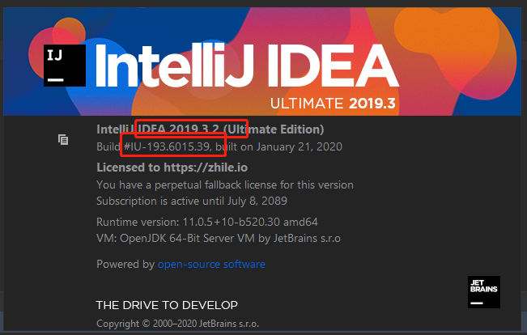
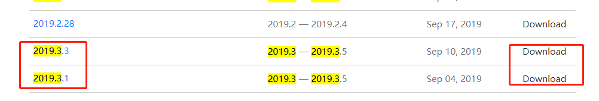
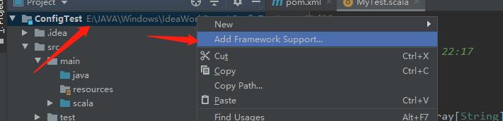
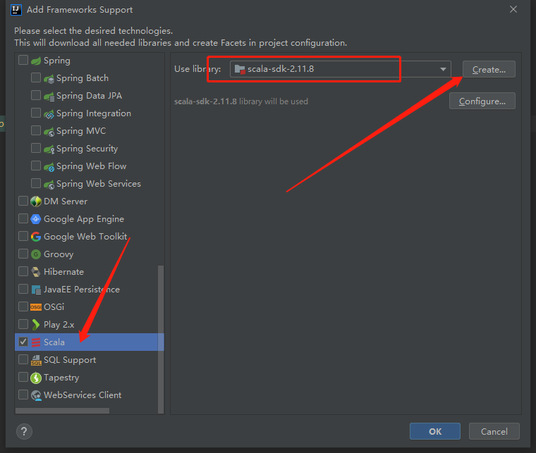
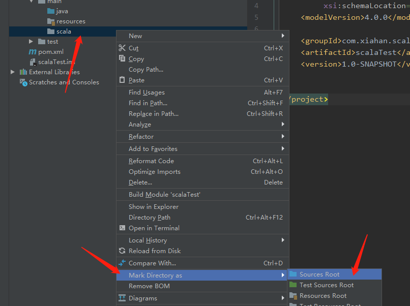
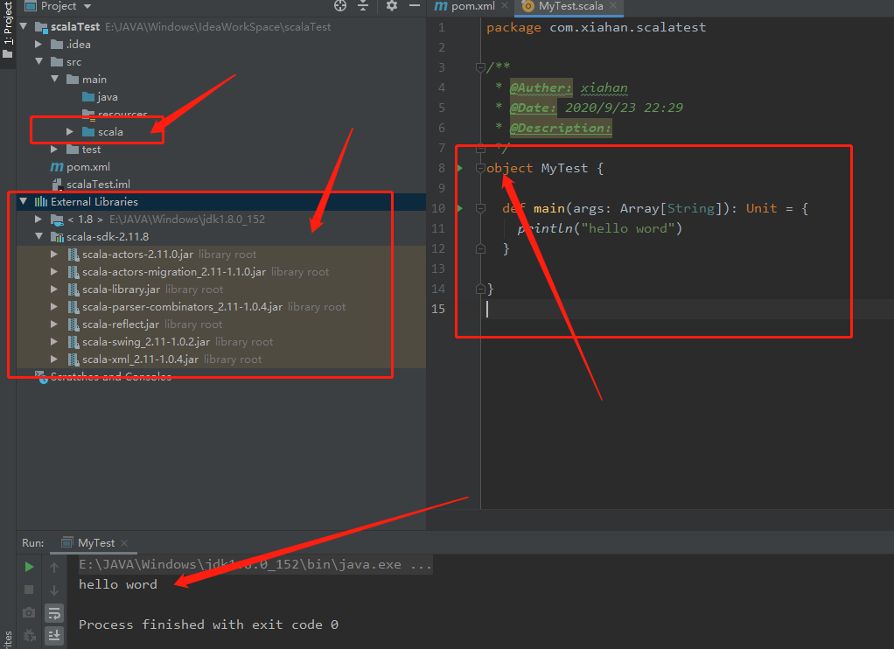

# 一：Scala 安装

## 1. 下载

>  http://www.scala-lang.org/download/  官网下载
>
> 首先安装JDK,略

###  1）. win 安装

> 安装与JDK 相似。
>
> 1. 解压 zip到：E:\JAVA\Windows\scala\scala-2.11.8
> 2. 新建环境变量 SCALA_HOME     E:\JAVA\Windows\scala\scala-2.11.8
> 3. 编辑path，添加：%SCALA_HOME%\bin
> 4. cmd直接输入 scala，查看信息

### 2）linux 安装

> 安装与JDK 相似。
>
> ```shell
> ## 1. 上传 tgz 到 /opt/Backup
> ## 2. 解压文件 
> [root@localhost Backup]# tar -zxvf scala-2.11.8.tgz
> ## 移动文件
> [root@localhost Backup]# mv scala-2.11.8 /opt/
> ## 配置/etc/profile
> [root@localhost Backup]# cd ../
> [root@localhost opt]# cd scala-2.11.8/
> [root@localhost scala-2.11.8]# pwd
> /opt/scala-2.11.8
> [root@localhost scala-2.11.8]# vim /etc/profile
> ## scala
> export SCALA_HOME=/opt/scala-2.11.8
> export PATH=$PATH:$SCALA_HOME/bin
> [root@localhost scala-2.11.8]# source /etc/profile
> ```

## 2. IDEA 插件安装

> 1. 关闭项目，直接到plugins下查看版本
>
> 2. 到  https://plugins.jetbrains.com/plugin/1347-scala  下载符合自己版本的插件使用<span style='color:red'>迅雷</span>下载，官网太慢了
>
>    <span style='color:red'>这里没找到 2019.3.2 只能找挨着最近的</span>
>
>    
>
>    
>
>    
>
> 3. 等待下载，然后重启
>
> 4. 验证插件
>
>    1. 新建maven项目
>
>    2. 关联scala
>
>       
>
>       
>
>    3. 添加一个scala （source）目录
>
>       
>
>    4. 在scala 目录下创建类并写 hello word 程序
>
>       
>
> 5. 


