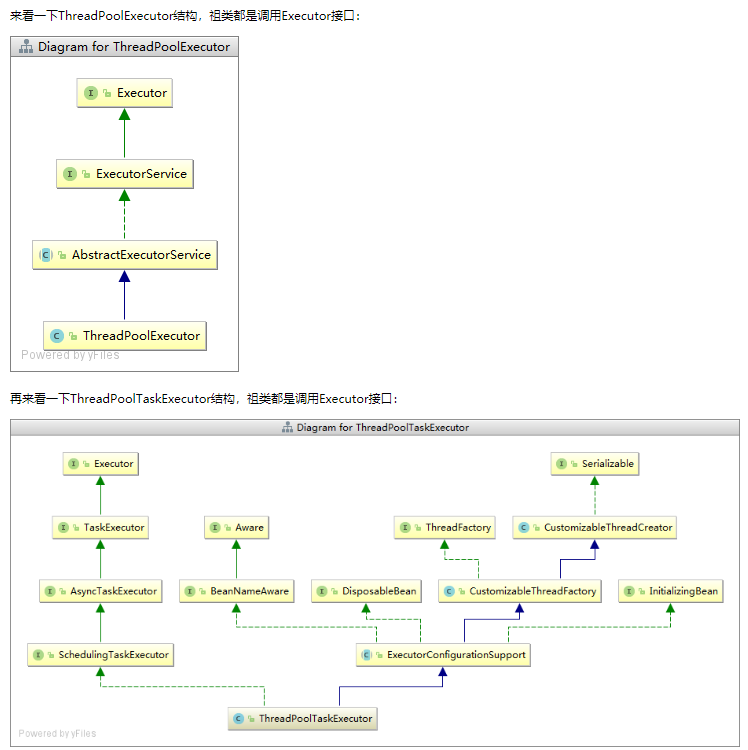

# 一：创建方式：

> 阿里推荐：不允许使用executors 去创建，而是通过 ThreadPoolExecutor的方式区创建。这样的处理方式让写的同学更加明确线程池的运行规则，规避资源耗尽的风险。
>
> 说明其他方式创建线程池的弊端：
>
> 	1. FixedThreadPool 和 SingleThreadPool： 允许的请求队列长度为： Integer.MAX_VALUE 可能会堆积大量的请求，OOM
>  	2. CachedThreadPool 允许创建的线程数量为：IntegerMAX_VALUE 可能会创建大量的线程，OOM

# 二：ThreadPoolTaskExecutor 和ThreadPoolExecutor 

> ThreadPoolTaskExecutor是spring core包中的，
>
> ThreadPoolExecutor是JDK中的JUC。ThreadPoolTaskExecutor是对ThreadPoolExecutor进行了封装处理。



.png)

# 三：源码解析

> int corePoolSize:线程池维护线程的最小数量. 　　
>
> int maximumPoolSize:线程池维护线程的最大数量. 　　
>
> long keepAliveTime:空闲线程的存活时间. 　　
>
> TimeUnit unit: 时间单位,现有纳秒,微秒,毫秒,秒枚举值. 　　
>
> BlockingQueue<Runnable> workQueue:持有等待执行的任务队列. 　　
>
> RejectedExecutionHandler handler: 用来拒绝一个任务的执行，有两种情况会发生这种情况。 　　
>
> ​	一是在execute方法中若addIfUnderMaximumPoolSize(command)为false，即线程池已经饱和； 　　
>
> ​	二是在execute方法中, 发现runState!=RUNNING || poolSize == 0,即已经shutdown,就调用ensureQueuedTaskHandled(Runnable command)，在该方法中有可能调用reject。
>
> ThreadPoolExecutor池子的处理流程如下：　　
>
> 1）当池子大小小于corePoolSize就新建线程，并处理请求
>
> 2）当池子大小等于corePoolSize，把请求放入workQueue中，池子里的空闲线程就去从workQueue中取任务并处理
>
> 3）当workQueue放不下新入的任务时，新建线程入池，并处理请求，如果池子大小撑到了maximumPoolSize就用RejectedExecutionHandler来做拒绝处理
>
> 4）另外，当池子的线程数大于corePoolSize的时候，多余的线程会等待keepAliveTime长的时间，如果无请求可处理就自行销毁
>
> 其会优先创建  CorePoolSiz 线程， 当继续增加线程时，先放入Queue中，当 CorePoolSiz  和 Queue 都满的时候，就增加创建新线程，当线程达到MaxPoolSize的时候，就会抛出错误org.springframework.core.task.TaskRejectedException
>
> 另外MaxPoolSize的设定如果比系统支持的线程数还要大时，会抛出java.lang.OutOfMemoryError: unable to create new native thread 异常。

.png)

```xml
<!-- 异步线程池 -->
    <bean id="threadPool"
        class="org.springframework.scheduling.concurrent.ThreadPoolTaskExecutor">
        <!-- 核心线程数，默认为1 -->
        <property name="corePoolSize" value="3" />
        <!-- 最大线程数，默认为Integer.Max_value -->
        <property name="maxPoolSize" value="10" />
        <!-- 队列最大长度 >=mainExecutor.maxSize -->
        <property name="queueCapacity" value="25" />
        <!-- 线程池维护线程所允许的空闲时间 -->
        <property name="keepAliveSeconds" value="300" />
        <!-- 线程池对拒绝任务(无线程可用)的处理策略 ThreadPoolExecutor.CallerRunsPolicy策略 ,调用者的线程会执行该任务,如果执行器已关闭,则丢弃.  -->
        <property name="rejectedExecutionHandler">
　　　　　　　　<!-- AbortPolicy:直接抛出java.util.concurrent.RejectedExecutionException异常 -->
　　　　　　　　<!-- CallerRunsPolicy:若已达到待处理队列长度，将由主线程直接处理请求 -->
　　　　　　　　<!-- DiscardOldestPolicy:抛弃旧的任务；会导致被丢弃的任务无法再次被执行 -->
　　　　　　　　<!-- DiscardPolicy:抛弃当前任务；会导致被丢弃的任务无法再次被执行 -->
            <bean class="java.util.concurrent.ThreadPoolExecutor$CallerRunsPolicy" />
        </property>
    </bean>
```

> Reject策略预定义有四种： 
>
> (1)ThreadPoolExecutor.AbortPolicy策略，是默认的策略,处理程序遭到拒绝将抛出运行时 RejectedExecutionException。 
>
> (2)ThreadPoolExecutor.CallerRunsPolicy策略 ,调用者的线程会执行该任务,如果执行器已关闭,则丢弃. 
>
> (3)ThreadPoolExecutor.DiscardPolicy策略，不能执行的任务将被丢弃. 
>
> (4)ThreadPoolExecutor.DiscardOldestPolicy策略，如果执行程序尚未关闭，则位于工作队列头部的任务将被删除，然后重试执行程序（如果再次失败，则重复此过程）.
>
> 关于callable回调方法（因为为队列阻塞，如果到取值某个执行的值会等待执行完成）

# 四： 使用注意

```shell
## 注解 @EnableAsync 使用！！！
```

