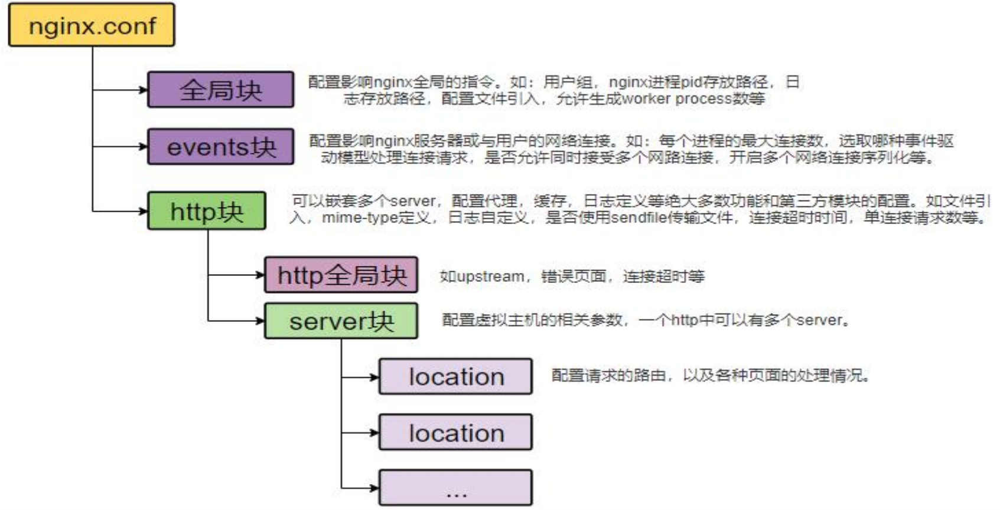
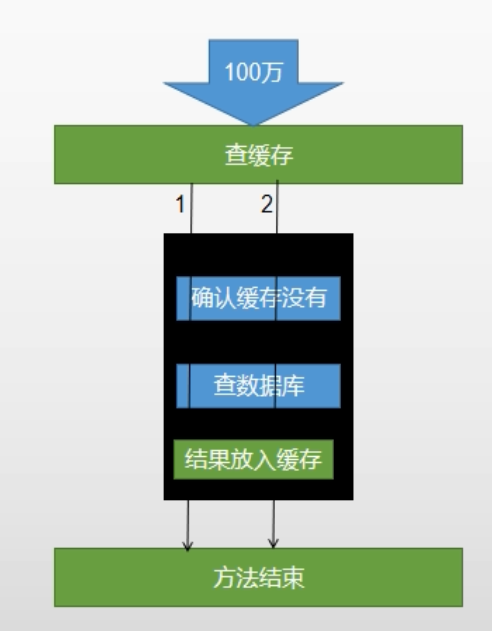
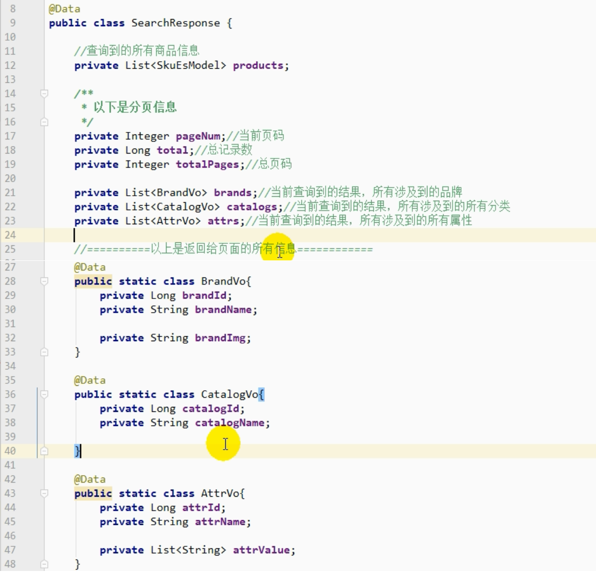
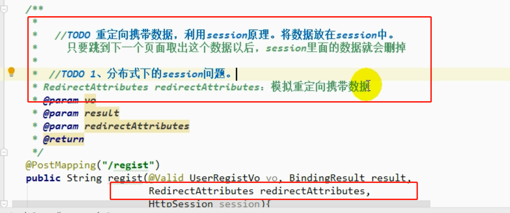
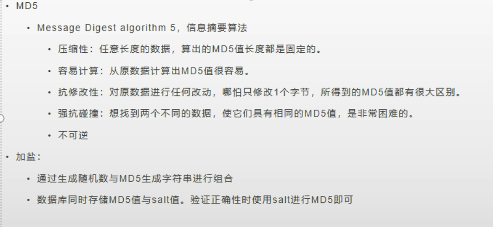

# 一. nginx 反向代理

> nginx 反向代理的时候回丢失掉很多东西，比如请求的域名、cookie等

.png)

反向代理 带上请求的 host信息

.png) 

## 1. 负载均衡

.png)

# 二. 网关路由规则

.png)

# 三. 压力测试

## 1.相关概念

```shell
响应时间：请求开始到返回响应结果，整个过程所消耗的时间。
HPS: 每秒单击次数（不太重要）
TPS：系统每秒处理次数（完成多少个事件）
QPS：每秒进行查询次数
## 对于互联网行业，如果有些业务有且只有一个请求连接，那么TPS=QPS=HPS。一般情况下用TPS衡量整个业务流程，用QPS衡量接口查询次数，用HPS表示对服务器单击请求
## 根据经验，一般情况下
	金融行业：1000 ~ 50000 TPS
	保险行业：100 ~ 100000 TPS
	制造行业：10 ~ 5000 TPS
	互联网电子商务：10000 ~ 1000000 TPS
	互联网中型网站：1000 ~ 50000 TPS
	互联网小型网站：500 ~ 10000 TPS
最大响应时间：指用户发出请求到系统做出反应的最大时间
最少响应时间：指用户发出请求到系统做出反应的最小时间
90%响应时间：指所有用户的响应时间进行排序，90%的响应时间
从外部看，性能测试主要关注如下三个指标
	吞吐量：每秒钟系统能够处理的请求数、任务数
	响应时间：服务器处理一个请求或一个任务的耗时
	错误率：一批请求中结果出错的请求所占的比例
```

## 2.一般使用

```shell
## 1. 创建一个测试计划。

## 2. 创建一个线程组

## 3. 线程组下创建 http 请求

## 4. 线程组下创建监控：查看结果树、汇总报告、聚合报告（主要看着三个）

## 5. 影响性能考虑点：数据库、应用程序、中间件（tomcat、nginx）、网络、操作系统

## 6.考虑自己应用是属于CPU 密集还是IO 密集型？针对性优化。
```

.png)

.png)

## 3. Jmeter Address Already in use 错误解决

```shell
## Win 本身提供的端口访问机制问题
## win 提供的 TCP/IP 链接的端口为 1024-5000 并且要四分钟来回收他们，导致短时间内跑大量的请求时将端口占满了。

## 解决方法
	## 1. cmd打开 regedit 打开注册表
    ## 2. 在 HKEY_LOCAL_MACHINE \ SYSTEM \ CurrControlSet \ Services \ Tcpip \ Parameters 下
    	## a) 右键parameter 添加一个新的 DWORD 名字为 MaxUserPort
    	## b) 然后双击 MaxuserPort 输入数据为 65534，基数选择十进制
    ## 同样操作添加 TCPTimeWaitDelay 值：30
```

.png)


.png)

.png)

# 四：性能检测

> jconsole 和 jvisualvm 都可以实现，但是推荐 jvisualvm。这两个都可以在 jdk1.8 bin中找到

```shell
## 插件无法连接到visualVM 插件中心。更换地址
https://visualvm.github.io/pluginscenters.html
## 在线安装 Visual GC
在线安装失败，可以去网页下载后。手动安装
```

.png)

```shell
运行：正在运行的
休眠：程序调用了 sleep
等待：程序调用了 wait
驻留：线程池俩面的空闲线程
监视：阻塞的线程，等在等待锁的释放
```

```shell
## 查看docker 内应用的内存使用
docker stats
```

```shell
## 优化方向
 ## 1.中间件越多，性能损失越大，大多都损失在网络交互了。
 ## 2. 业务
 	## a) DB (数据库服务器优化、索引优化) (一次性从DB 中读出数据，然后利用程序组装成目标数据)
 	## b) 模板渲染速度 (模板的缓存开启)
 	## c) tomcat 处理静态资源
 	## d) 日志级别打印耗时
 ## 3. JVM 参数调整(具体含义参考下文)
 	## -Xmx1024m -Xms1024m -Xmn512m
 	
```

```shell
## JVM 参数
## 1. 堆设置
    -Xms:初始堆大小
    -Xmx:最大堆大小
    -Xmn:新生代大小
    -XX:NewRatio:设置新生代和老年代的比值。如：为3，表示年轻代与老年代比值为1：3
    -XX:SurvivorRatio:新生代中Eden区与两个Survivor区的比值。注意Survivor区有两个。如：为3，表示Eden：Survivor=3：2，一个Survivor区占整个新生代的1/5  
    -XX:MaxTenuringThreshold:设置转入老年代的存活次数。如果是0，则直接跳过新生代进入老年代
    -XX:PermSize、-XX:MaxPermSize:分别设置永久代最小大小与最大大小（Java8以前）
    -XX:MetaspaceSize、-XX:MaxMetaspaceSize:分别设置元空间最小大小与最大大小（Java8以后）
## 2. 收集器设置
    -XX:+UseSerialGC:设置串行收集器
    -XX:+UseParallelGC:设置并行收集器
    -XX:+UseParalledlOldGC:设置并行老年代收集器
    -XX:+UseConcMarkSweepGC:设置并发收集器
## 3. 垃圾回收统计信息
    -XX:+PrintGC
    -XX:+PrintGCDetails
    -XX:+PrintGCTimeStamps
    -Xloggc:filename
## 4. 并行收集器设置
    -XX:ParallelGCThreads=n:设置并行收集器收集时使用的CPU数。并行收集线程数。
    -XX:MaxGCPauseMillis=n:设置并行收集最大暂停时间
    -XX:GCTimeRatio=n:设置垃圾回收时间占程序运行时间的百分比。公式为1/(1+n)
## 5. 并发收集器设置
    -XX:+CMSIncrementalMode:设置为增量模式。适用于单CPU情况。
    -XX:ParallelGCThreads=n:设置并发收集器新生代收集方式为并行收集时，使用的CPU数。并行收集线程数。
```


## 1. nginx 动静分离

```shell
## 所有的静态资源链接都已 /static 开头。然后在nginx 配置文件里面配置如下
## 这样所有的 以/static 开头的请求都会被nginx 处理。不会再次走 tomcat。
```


.png)

# 五：缓存

## 1.哪些数据适合放在缓存里

> 即时性、数据一致性要求不高的
> 访问量大且更新评率不高的数据(读多写少)
>
> 缓存都应该设置过期时间
>
> 多使用stringRedisTemplate
> **JSON 转换**：Map<String, List<Catelog2Vo>> result = JSON.parseObject(cateLogJson, new TypeReference<Map<String, List<Catelog2Vo>>>);

## 2. Springboot-redis 出错错误

> springboot 版本为 2.1.8

.png)

.jpg)

## 3. 缓存穿透

> 缓存穿透： 指查询一个一定不存在的数据，由于缓存是不命中，将去查询数据库，但是 数据库也无此记录，我们没有将这次查询的null写入缓存，这将导致这个不 存在的数据每次请求都要到存储层去查询，失去了缓存的意义 
>
> 风险： 利用不存在的数据进行攻击，数据库瞬时压力增大，最终导致崩溃 缓存 db 100 万 100 万 
>
> 解决： null结果缓存，并加入短暂过期时间

.png)

## 4. 缓存雪崩

> 缓存雪崩： 缓存雪崩是指在我们设置缓存时key采用了相同的过期时间， 导致缓存在某一时刻同时失效，请求全部转发到DB，DB瞬时 压力过重雪崩。
>
> 解决： 原有的失效时间基础上增加一个随机值，比如1-5分钟随机，这 样每一个缓存的过期时间的重复率就会降低，就很难引发集体 失效的事件。

.png)

## 5. 缓存击穿

> 缓存穿透： 
> • 对于一些设置了过期时间的key，如果这些key可能会在某些 时间点被超高并发地访问，是一种非常“热点”的数据。 • 如果这个key在大量请求同时进来前正好失效，那么所有对 这个key的数据查询都落到db，我们称为缓存击穿。
>
> 解决： 加锁 大量并发只让一个去查，其他人等待，查到以后释放锁，其他 人获取到锁，先查缓存，就会有数据，不用去db

.png)

# 六： 加锁

## 1. 本地锁

> 本地锁只能锁住该JVM ，不能锁住其他的JVM
>
> 本地锁，上锁的范围：必须保证查询数据库和结果放在缓存中是一个原子操作。这样才不会在高并发情况下发生多次查询数据库
>
> 第一张图会出现查询多次数据库。第二张图才能只查询一次




.png)

## 2. 分布式锁演进

.png)

.png)

.png)

.png)

.png)

.png)

## 3. redisson 分布式锁

### 1) 相关信息

> 官网文档： https://github.com/redisson/redisson/wiki/Table-of-Content
>
> 集群配置：
> ```java
> Config config = new Config();
> config.useClusterServers()
>  .setScanInterval(2000) // 集群状态扫描间隔时间，单位是毫秒
>  //可以用"rediss://"来启用SSL连接
>  .addNodeAddress("redis://127.0.0.1:7000", "redis://127.0.0.1:7001")
>  .addNodeAddress("redis://127.0.0.1:7002");
> 
> RedissonClient redisson = Redisson.create(config);
> 
> // yml
> replicatedServersConfig:
>   idleConnectionTimeout: 10000
>   connectTimeout: 10000
>   timeout: 3000
>   retryAttempts: 3
>   retryInterval: 1500
>   password: null
>   subscriptionsPerConnection: 5
>   clientName: null
>   loadBalancer: !<org.redisson.connection.balancer.RoundRobinLoadBalancer> {}
>   slaveSubscriptionConnectionMinimumIdleSize: 1
>   slaveSubscriptionConnectionPoolSize: 50
>   slaveConnectionMinimumIdleSize: 32
>   slaveConnectionPoolSize: 64
>   masterConnectionMinimumIdleSize: 32
>   masterConnectionPoolSize: 64
>   readMode: "SLAVE"
>   nodeAddresses:
>   - "redis://127.0.0.1:2812"
>   - "redis://127.0.0.1:2815"
>   - "redis://127.0.0.1:2813"
>   scanInterval: 1000
> threads: 0
> nettyThreads: 0
> codec: !<org.redisson.codec.JsonJacksonCodec> {}
> "transportMode":"NIO"
> ```
> 单节点配置：
> ```java
> Config config = new Config();
> config.useSingleServer().setAddress("redis://127.0.0.1:7000");
> RedissonClient redisson = Redisson.create(config);
> 
> // yml:
> singleServerConfig:
>   idleConnectionTimeout: 10000
>   connectTimeout: 10000
>   timeout: 3000
>   retryAttempts: 3
>   retryInterval: 1500
>   password: null
>   subscriptionsPerConnection: 5
>   clientName: null
>   address: "redis://127.0.0.1:6379"
>   subscriptionConnectionMinimumIdleSize: 1
>   subscriptionConnectionPoolSize: 50
>   connectionMinimumIdleSize: 32
>   connectionPoolSize: 64
>   database: 0
>   dnsMonitoringInterval: 5000
> threads: 0
> nettyThreads: 0
> codec: !<org.redisson.codec.JsonJacksonCodec> {}
> "transportMode":"NIO"
> ```

### 2) 分布式锁和同步器

> 官网文档： [https://github.com/redisson/redisson/wiki/8.-%E5%88%86%E5%B8%83%E5%BC%8F%E9%94%81%E5%92%8C%E5%90%8C%E6%AD%A5%E5%99%A8](https://github.com/redisson/redisson/wiki/8.-分布式锁和同步器)
>
> 锁的名字：锁的粒度，越细越快
>
> 锁的粒度：具体缓存的是某个数据，11号商品：product-11-lock  product-12-lock

### 3) 可重入锁

```java
RLock lock = redisson.getLock("anyLock");
// 最常见的使用方法
lock.lock();

// 加锁以后10秒钟自动解锁
// 无需调用unlock方法手动解锁
lock.lock(10, TimeUnit.SECONDS);

// 尝试加锁，最多等待100秒，上锁以后10秒自动解锁
boolean res = lock.tryLock(100, 10, TimeUnit.SECONDS);
if (res) {
   try {
     ...
   } finally {
       lock.unlock();
   }
}
```

.png)

### 4)  公平锁

```java
RLock fairLock = redisson.getFairLock("anyLock");
// 最常见的使用方法
fairLock.lock();

// 10秒钟以后自动解锁
// 无需调用unlock方法手动解锁
fairLock.lock(10, TimeUnit.SECONDS);

// 尝试加锁，最多等待100秒，上锁以后10秒自动解锁
boolean res = fairLock.tryLock(100, 10, TimeUnit.SECONDS);
...
fairLock.unlock();
```

### 5) 读写锁

> 基于Redis的Redisson分布式可重入读写锁[`RReadWriteLock`](http://static.javadoc.io/org.redisson/redisson/3.4.3/org/redisson/api/RReadWriteLock.html) Java对象实现了`java.util.concurrent.locks.ReadWriteLock`接口。其中读锁和写锁都继承了[RLock](https://github.com/redisson/redisson/wiki/8.-分布式锁和同步器#81-可重入锁reentrant-lock)接口。
>
> 分布式可重入读写锁允许同时有多个读锁和一个写锁处于加锁状态。
>
> 大家都知道，如果负责储存这个分布式锁的Redis节点宕机以后，而且这个锁正好处于锁住的状态时，这个锁会出现锁死的状态。为了避免这种情况的发生，Redisson内部提供了一个监控锁的看门狗，它的作用是在Redisson实例被关闭前，不断的延长锁的有效期。默认情况下，看门狗的检查锁的超时时间是30秒钟，也可以通过修改[Config.lockWatchdogTimeout](https://github.com/redisson/redisson/wiki/2.-配置方法#lockwatchdogtimeout监控锁的看门狗超时单位毫秒)来另行指定。

> 另外Redisson还通过加锁的方法提供了`leaseTime`的参数来指定加锁的时间。超过这个时间后锁便自动解开了。
>
> ```java
> // 10秒钟以后自动解锁
> // 无需调用unlock方法手动解锁
> rwlock.readLock().lock(10, TimeUnit.SECONDS);
> // 或
> rwlock.writeLock().lock(10, TimeUnit.SECONDS);
> 
> // 尝试加锁，最多等待100秒，上锁以后10秒自动解锁
> boolean res = rwlock.readLock().tryLock(100, 10, TimeUnit.SECONDS);
> // 或
> boolean res = rwlock.writeLock().tryLock(100, 10, TimeUnit.SECONDS);
> ...
> lock.unlock();
> ```
>
> 

.png)

.png)

### 6) 信行量

.png)

.png)

### 7) 闭锁（CountDownLatch）

.png)

### 8) 缓存一致性问题

.png)

.png)

.png)

.png)

# 七：SpringCache

> SpringCache 过期时间设置：spring.cache.redis.time-to-live: 200  单位毫秒
>
> cache SPEL 表达式 官方文档：https://docs.spring.io/spring-framework/docs/current/reference/html/integration.html#cache-annotation-stereotype

```yaml
## 使用 redis 缓存
spring.cache.type=redis

## 缓存 null 防止缓存穿透
spring.cache.redis.cache-null-values=true
## 缓存前缀 制定了就用指定的前缀，没有就用默认的缓存名字做前缀  推荐不用，效果会分层，便于观察
# spring.cache.redis.key-prefix=XIAHAN
## 过期时间单位毫秒
spring.cache.redis.time-to-live=3600000
## 使用前缀
spring.cache.redis.use-key-prefix=true

```


```java
import com.alibaba.fastjson.support.spring.GenericFastJsonRedisSerializer;
import org.springframework.boot.autoconfigure.cache.CacheProperties;
import org.springframework.boot.context.properties.EnableConfigurationProperties;
import org.springframework.cache.annotation.EnableCaching;
import org.springframework.context.annotation.Bean;
import org.springframework.context.annotation.Configuration;
import org.springframework.data.redis.cache.RedisCacheConfiguration;
import org.springframework.data.redis.serializer.RedisSerializationContext;
import org.springframework.data.redis.serializer.StringRedisSerializer;

/**
 * @Auther: xiahan
 * @Date: 2021/4/8 22:04
 * @Description:
 */
@Configuration
@EnableCaching
@EnableConfigurationProperties(CacheProperties.class)
public class MyRedisConfig {

//    @Autowired
//    CacheProperties cacheProperties;

    /**
     * @Author xiahan
     * @Description /
     * @Date 22:21 2021/4/8
     * @Param []
     * @return org.springframework.data.redis.cache.RedisCacheConfiguration
     *  @ConfigurationProperties( prefix = "spring.cache")
     *  public class CacheProperties {}
     *   需要用 @EnableConfigurationProperties(CacheProperties.class)
     *
     **/
    @Bean
    RedisCacheConfiguration redisCacheConfiguration(CacheProperties cacheProperties){

        RedisCacheConfiguration config = RedisCacheConfiguration.defaultCacheConfig();
        config = config.serializeKeysWith(RedisSerializationContext.SerializationPair.fromSerializer(new StringRedisSerializer()));
        config = config.serializeValuesWith(RedisSerializationContext.SerializationPair.fromSerializer(new GenericFastJsonRedisSerializer()));
//        config = config.serializeValuesWith(RedisSerializationContext.SerializationPair.fromSerializer(new GenericJackson2JsonRedisSerializer()));

        CacheProperties.Redis redisProperties = cacheProperties.getRedis();
        // 使配置文件生效
        if (redisProperties.getTimeToLive() != null) {
            config = config.entryTtl(redisProperties.getTimeToLive());
        }

        if (redisProperties.getKeyPrefix() != null) {
            config = config.prefixCacheNameWith(redisProperties.getKeyPrefix());
        }

        if (!redisProperties.isCacheNullValues()) {
            config = config.disableCachingNullValues();
        }

        if (!redisProperties.isUseKeyPrefix()) {
            config = config.disableKeyPrefix();
        }
        return config;
    }
}

```


.png)

.png)

.png)

.png)

.png)

.png)

# 八：页面检索

> 检索条件封装

.png)

> 查询ES 结果返回封装



> ES 语句: 模糊匹配、过滤（按照属性、分类、品牌、价格区间、库存），排序，分页，高亮，聚合分析（下图做）
>
> 如果是嵌入式的属性，查询，聚合，分析都应该用嵌入式的分析方式

.png)

>js URl 替换方法：
>
>```js
>function replaceParamVal(url, paramName, replaceValue){
>	var oURL = utl.toString()
>    // 如果有就添加，没有就替换
>    if(oURL.indexOf(paramName)!= -1){
>        var re = eval('/(' + paramName + '=)([^&]*)/gi')
>    	var nURL = oURL.replace(re, paramName + '=' + replaceValue)
>    	retrun nURL
>       }else{
>           var nURL = "";
>           if(oURL.index("?") != -1){
>             nURL = oURL + "&" +  paramName + '=' + replaceValue
>           }else{
>               nURL = oURL + "?" +  paramName + '=' + replaceValue
>           }
>       }
>    retrun nURL
>}
>```
>
>

# 九：异步和线程池

## 1. 多线程

> 1. 初始化线程的四种方式：
>
>    1）继承 Thread
>
>    2）实现Runnable
>
>    3）实现Callable接口 + FutureTask（可以拿到返回结果，可以处理异常）
>
>    4）线程池
>
>    注：方式1 和方式2 ：主进程无法获取线程的运行结果；方式3 可以获取线程的运行结果，但是不利于控制服务器中的线程资源，可能导致服务器资源耗尽
>
>    线程池可以通过如下两种方式初始化：
>
>    ```java
>    Executors.newFlexedThreadPool(3)
>    // 或者
>    new ThreadPoolExecutor(corePoolSize, maximumPoolSize, keepAliveTime, TimeUnit workQueue, threadFactory, handler)    
>        
>        new ThreadPoolExecutor(10,
>                               20,
>                               10,
>                               TimeUnit.SECONDS,
>                               new LinkedBlockingQueue<>(2000),
>                               Executors.defaultThreadFactory(),
>                               new ThreadPoolExecutor.AbortPolicy()
>                              );
>    ```
>
>    

> 线程池的七大参数：
>
> ```shell
>     public ThreadPoolExecutor(int corePoolSize,
>                               int maximumPoolSize,
>                               long keepAliveTime,
>                               TimeUnit unit,
>                               BlockingQueue<Runnable> workQueue,
>                               ThreadFactory threadFactory,
>                               RejectedExecutionHandler handler) {}
> ## corePoolSize： 核心线程数，[一直存在，除非设置allowCoreThreadTimeOut 为 true]。创建好猴就准备就绪的线程数量就等待异步任务去执行
> ## maximumPoolSize：最大线程数量，控制资源
> ## keepAliveTime： 存活时间。如果当前的线程数量大于 core数量。释放空闲的线程【currentPoolSize - corepoolSize】只要线程空闲时间大于指定的keepAliveTime
> ## unit： 时间单位
> ## BlockingQueue<Runnable> workQueue：阻塞队列。如果任务有很多，就会把目前多的任务放在队列里面。只要有空闲的线程就会去队列里面取出新的任务继续执行
> ## ThreadFactory：线程的创建工厂
> ## RejectedExecutionHandler：如果队列满了，就按照我们指定的拒绝策略拒绝执行任务
> 
> ## new LinkedBlockingQueue<>(), 默认是Integer.MAX_VALUE 必须要按照业务设置 
> new ThreadPoolExecutor(10,
>     20,
>     10,
>     TimeUnit.SECONDS,
>     new LinkedBlockingQueue<>(2000),
>     Executors.defaultThreadFactory(),
>     new ThreadPoolExecutor.AbortPolicy()
> );
> 
> ## 工作流程：
> 1. 线程池创建，准备好 core 数量的核心线程。准备接受任务
> 2. 新的任务进来，用core 准备好的空闲线程执行
> 	2.1 core 满了，就将进来的任务放在阻塞队列中，空闲的core 就会自己去阻塞队列获取任务执行
> 	2.2 阻塞队列满了，就直接开新的线程执行，最大只能开到max 指定的数量
> 	2.3 max 都执行好了。max-core 数量的空闲线程就会在keepAliveTime 指定的时间后自动销毁。最终保持到 core 大小
> 	2.4 如果线程数开到了 max 的数量，还有新任务进来。就会使用 reject 指定的拒绝策略进行处理
> 3. 所有的线程创建都是由指定的 factory 创建
> 
> ## 面试
> 一个线程池 core=7 max=20 queue=20 。100个并发进来会如何分配？
> 先有七个能直接得到执行，接下来50个进入到队列排队。在多开13 个继续执行、现在70 个被安排了，剩下的30 个使用拒绝策略拒绝
> ```
>
> 

## 2. ComplatetableFuture编排

> ComplatetableFuture：提供了四个方法来创建一个异步操作
>
> ```shell
> public static CompletableFuture<Void> runAsync(Runnable runnable)
> public static CompletableFuture<Void> runAsync(Runnable runnable, Executor executor)
> public static <U> CompletableFuture<U> supplyAsync(Supplier<U> supplier)
> public static <U> CompletableFuture<U> supplyAsync(Supplier<U> supplier, Executor executor)
> 
> 
> // 创建一个线程池 固定数量为 10
> public static ExecutorService service = Executors.newFixedThreadPool(10);
> 
> // CompletableFuture 异步编排
> public static void main(String[] args) throws ExecutionException, InterruptedException {
>  Runable01 runable01 = new Runable01();
> 
>  CompletableFuture.runAsync(runable01);
>  CompletableFuture.runAsync(runable01, service);
>  CompletableFuture.runAsync(() -> {
>      System.out.println("当前线程：" + Thread.currentThread().getId());
>      int result = 10 / 2;
>      System.out.println("Runable01 运行结果：" + result);
>  }, service);
> 
>  CompletableFuture<Integer> completableFuture = CompletableFuture.supplyAsync(() -> {
>      System.out.println("当前线程：" + Thread.currentThread().getId());
>      int result = 10 / 2;
>      return result;
>  }, service);
>  Integer integer = completableFuture.get();
>  System.out.println("Runable01 运行结果：" + integer);
> 
> }
> ```
>
> 计算完成时回调方法
>
> ```shell
> ## whenComplete可以处理正常和异常的计算结果，exceptionally处理异常情况
> ## whenComplete和whenCompleteAsync 区别：whenComplete是执行当前线程继续执行whenComplete方法。whenCompleteAsync是将任务提交给线程池执行
> ## 方法不以Async 结尾，以为着action 使用相同的线程执行，而 Async 可能会使用其他线程执行（相同的线程池，可能被同一个线程执行）
> public CompletableFuture<T> whenComplete(BiConsumer<? super T, ? super Throwable> action) 
> public CompletableFuture<T> whenCompleteAsync(BiConsumer<? super T, ? super Throwable> action)
> public CompletableFuture<T> whenCompleteAsync(BiConsumer<? super T, ? super Throwable> action, Executor executor)
> public CompletableFuture<T> exceptionally(Function<Throwable, ? extends T> fn)
> 
> 
> public <U> CompletableFuture<U> handle(BiFunction<? super T, Throwable, ? extends U> fn)
> 
> //        Runable01 runable01 = new Runable01();
> 
> //        CompletableFuture.runAsync(runable01);
> //        CompletableFuture.runAsync(runable01, service);
> //        CompletableFuture.runAsync(() -> {
> //            System.out.println("当前线程：" + Thread.currentThread().getId());
> //            int result = 10 / 2;
> //            System.out.println("Runable01 运行结果：" + result);
> //        }, service);
> 
> //        CompletableFuture<Integer> completableFuture = CompletableFuture.supplyAsync(() -> {
> //            System.out.println("当前线程：" + Thread.currentThread().getId());
> //            int result = 10 / 2;
> //            return result;
> //        }, service);
> //        Integer integer = completableFuture.get();
> 
> //        CompletableFuture<Integer> exceptionally = CompletableFuture.supplyAsync(() -> {
> //            System.out.println("当前线程：" + Thread.currentThread().getId());
> //            int result = 10 / 0;
> //            return result;
> //        }, service).whenComplete((result, exception) -> {
> //            // 虽然能获取到异常，但是没法修改返回数据
> //            System.out.println("异步任务完成……结果是：" + result + "；异常是：" + exception);
> //        }).exceptionally(throwable -> {  // 这里拦截了异常，handle 就不会感知到异常了
> //            // 可以感知异常，同时返回默认置
> //            return 10;
> //        }).handle((result, exception)->{
> //            if(result != null){
> //                return result;
> //            }
> //            if(exception != null){
> //                return 0;
> //            }
> //            return 3;
> //        });
> //        Integer integer = exceptionally.get();
> //        System.out.println("Runable01 运行结果：" + integer);
> ```
>
> 线程串行化
>
> ```shell
> ## thenApply: 当一个线程依赖另一个线程时，获取上一个任务返回结果，并返回当前任务的返回值
> public <U> CompletableFuture<U> thenApply(Function<? super T,? extends U> fn)
> public <U> CompletableFuture<U> thenApplyAsync(Function<? super T,? extends U> fn)
> public <U> CompletableFuture<U> thenApplyAsync(Function<? super T,? extends U> fn, Executor executor)
> 
> ## thenAccept：消费处理结果，接受上一个任务的返回结果，并消费处理，无返回结果
> public CompletableFuture<Void> thenAccept(Consumer<? super T> action)
> public CompletableFuture<Void> thenAcceptAsync(Consumer<? super T> action)
> public CompletableFuture<Void> thenAcceptAsync(Consumer<? super T> action, Executor executor)
> 
> ## thenRun：只要上一个任务执行完成就开始执行
> public CompletableFuture<Void> thenRun(Runnable action)
> public CompletableFuture<Void> thenRunAsync(Runnable action)
> public CompletableFuture<Void> thenRunAsync(Runnable action, Executor executor)
> 
> ## 所有带Async 的都是异步执行。同上
> 
>      /**
>          * @Author xiahan
>          * @Description
>          *      thenRun 不能获取上一个任务结果，无返回值
>          *      thenAccept 能获取上一个任务结果，无返回值
>          *      thenApply 能获取上一个任务结果，有返回值
>          *
>          * @Date 15:05 2021/4/17
>          * @Param [args]
>          * @return void
>          **/
> //        CompletableFuture.supplyAsync(() -> {
> //            System.out.println("当前线程：" + Thread.currentThread().getId());
> //            int result = 10 / 2;
> //            return result;
> //        }, service).thenRunAsync(() -> {
> //            System.out.println("第二个线程 thenRunAsync：" + Thread.currentThread().getId());
> //        }, service);
> 
> //        CompletableFuture.supplyAsync(() -> {
> //            System.out.println("当前线程：" + Thread.currentThread().getId());
> //            int result = 10 / 2;
> //            return result;
> //        }, service).thenAcceptAsync((res) -> {
> //            System.out.println("上一个结果为：" + res);
> //            System.out.println("第二个线程 thenAcceptAsync：" + Thread.currentThread().getId());
> //        }, service);
> 
>         CompletableFuture<Integer> integerCompletableFuture = CompletableFuture.supplyAsync(() -> {
>             System.out.println("当前线程：" + Thread.currentThread().getId());
>             int result = 10 / 2;
>             return result;
>         }, service).thenApplyAsync((res) -> {
>             System.out.println("上一个结果为：" + res);
>             System.out.println("第二个线程 thenAcceptAsync：" + Thread.currentThread().getId());
>             return 10;
>         }, service);
>         Integer integer = integerCompletableFuture.get();
>         System.out.println("返回结果：" + integer);
> 
>         System.out.println("main 运行结果：" );
> ```
>
> 两人任务组合-- 都要完成
>
> ```shell
> ## thenCombine：组合两个future，获取两个future返回结果，然后返回自己的结果值
> public <U,V> CompletableFuture<V> thenCombine(CompletionStage<? extends U> other, 
> 	BiFunction<? super T,? super U,? extends V> fn)
> public <U,V> CompletableFuture<V> thenCombineAsync(CompletionStage<? extends U> other,
> 	BiFunction<? super T,? super U,? extends V> fn)
> public <U,V> CompletableFuture<V> thenCombineAsync(CompletionStage<? extends U> other,
> 	BiFunction<? super T,? super U,? extends V> fn, Executor executor)
> 
> ## thenAcceptBoth：组合两个future，获取两个future 返回结果，然后处理任务。没有返回值
> public <U> CompletableFuture<Void> thenAcceptBoth(CompletionStage<? extends U> other, 
> 		BiConsumer<? super T, ? super U> action)
> public <U> CompletableFuture<Void> thenAcceptBothAsync(
>         CompletionStage<? extends U> other, BiConsumer<? super T, ? super U> action)
> public <U> CompletableFuture<Void> thenAcceptBothAsync(CompletionStage<? extends U> other,
>         BiConsumer<? super T, ? super U> action, Executor executor)    
> 
> # runAfterBoth：组合两个 future。不需要获取future 结果，只需要两个future处理完任务后处理该任务
> public CompletableFuture<Void> runAfterBoth(CompletionStage<?> other, Runnable action)
> public CompletableFuture<Void> runAfterBothAsync(CompletionStage<?> other, Runnable action)
> public CompletableFuture<Void> runAfterBothAsync(CompletionStage<?> other,
>         Runnable action, Executor executor)
>         
>         CompletableFuture<Integer> future01 = CompletableFuture.supplyAsync(() -> {
>             System.out.println("任务1 ：" + Thread.currentThread().getId());
>             int result = 10 / 2;
>             System.out.println("任务1 完成");
>             return result;
>         }, service);
> 
>         CompletableFuture<String> future02 = CompletableFuture.supplyAsync(() -> {
>             System.out.println("任务2 ：" + Thread.currentThread().getId());
>             System.out.println("任务2 完成");
>             return "任务 2";
>         }, service);
> 
> //        future01.runAfterBothAsync(future02, ()->{
> //            System.out.println("任务3 ……");
> //        }, service);
> 
> //        future01.thenAcceptBothAsync(future02, (result1, result2)->{
> //            System.out.println("任务 3 开始。之前结果为：" +result1 + "--->" + result2);
> //        }, service);
> 
> //        CompletableFuture<String> stringCompletableFuture = future01.thenCombineAsync(future02, (result1, result2) -> {
> //            System.out.println("任务 3 开始。之前结果为：" + result1 + "--->" + result2);
> //            return result1 + "--->" + result2;
> //        }, service);
> //        System.out.println("任务 3 返回结果:" + stringCompletableFuture.get());
> 
>         System.out.println("main 运行结果：" );        
> ```
>
> 两任务组合--一个完成
>
> ```shell
> ## applyToEither：两个任务有一个完成，获取future 返回结果，返回自己的返回值
> public <U> CompletableFuture<U> applyToEither(
>         CompletionStage<? extends T> other, Function<? super T, U> fn)
> public <U> CompletableFuture<U> applyToEitherAsync(
>         CompletionStage<? extends T> other, Function<? super T, U> fn)
> public <U> CompletableFuture<U> applyToEitherAsync(CompletionStage<? extends T> other, 
>         Function<? super T, U> fn,
>         Executor executor)        
> 
> ## acceptEither：两个任务有一个完成，获取future 返回结果，也没有返回值
> public CompletableFuture<Void> acceptEither(
>         CompletionStage<? extends T> other, Consumer<? super T> action)
> public CompletableFuture<Void> acceptEitherAsync(
>         CompletionStage<? extends T> other, Consumer<? super T> action)
> public CompletableFuture<Void> acceptEitherAsync(CompletionStage<? extends T> other, 
>         Consumer<? super T> action, Executor executor)        
> 
> ## runAfterEither：两个任务有一个完成，不需要获取future 返回结果，也没有返回值
> public CompletableFuture<Void> runAfterEither(CompletionStage<?> other, Runnable action)
> public CompletableFuture<Void> runAfterEitherAsync(CompletionStage<?> other, Runnable action)
> public CompletableFuture<Void> runAfterEitherAsync(CompletionStage<?> other,
> 	Runnable action, Executor executor) 
> 	
>         CompletableFuture<String> future01 = CompletableFuture.supplyAsync(() -> {
>             int result = 0;
>             System.out.println("任务1 ：" + Thread.currentThread().getId());
>             result = 10 / 2;
>             System.out.println("任务1 完成");
>             return result + "";
>         }, service);
> 
>         CompletableFuture<String> future02 = CompletableFuture.supplyAsync(() -> {
>             try {
>                 Thread.sleep(3000L);
>                 System.out.println("任务2 ：" + Thread.currentThread().getId());
>                 System.out.println("任务2 完成");
>             } catch (InterruptedException e) {
>                 e.printStackTrace();
>             }
>             return "任务 2";
>         }, service);
> 
> //        future01.runAfterEitherAsync(future02, ()->{
> //            System.out.println("任务3 ……");
> //        }, service);
> 
> //        future01.acceptEitherAsync(future02, (result)->{
> //            System.out.println("任务3 …… 之前结果：" +result);
> //        }, service);
> 
>         CompletableFuture<String> stringCompletableFuture = future01.applyToEitherAsync(future02, (result) -> {
>             System.out.println("任务3 …… 之前结果：" + result);
>             return "任务3 …… 之前结果：" + result;
>         }, service);
>         String str = stringCompletableFuture.get();
>         System.out.println(str);	
> ```
>
> 多任务组合
>
> ```shell
> ## 等所有的任务完成
> public static CompletableFuture<Void> allOf(CompletableFuture<?>... cfs)
> 
> ## 等待一个任务完成即可
> public static CompletableFuture<Object> anyOf(CompletableFuture<?>... cfs)
> 
>         System.out.println(LocalDateTime.now());
>         CompletableFuture<String> future01 = CompletableFuture.supplyAsync(() -> {
>             try {
>                 Thread.sleep(1000L);
>                 System.out.println("获取姓名");
>             } catch (InterruptedException e) {
>                 e.printStackTrace();
>             }
>             return "xiahan";
>         }, service);
> 
>         CompletableFuture<String> future02 = CompletableFuture.supplyAsync(() -> {
>             try {
>                 Thread.sleep(2000L);
>                 System.out.println("获取工资");
>             } catch (InterruptedException e) {
>                 e.printStackTrace();
>             }
>             return "￥2";
>         }, service);
> 
>         CompletableFuture<String> future03 = CompletableFuture.supplyAsync(() -> {
>             try {
>                 Thread.sleep(3000L);
>                 System.out.println("获取学历");
>             } catch (InterruptedException e) {
>                 e.printStackTrace();
>             }
>             return "学前班";
>         }, service);
> 
>         // 这样获取的是最长的时间 3000L
> //        future03.get();
> //        future02.get();
> //        future01.get();
> 
> //        CompletableFuture<Void> voidCompletableFuture = CompletableFuture.allOf(future01, future02, future03);
> //        future03.get();
> //        future02.get();
> //        future01.get();
> 
>         CompletableFuture<Object> objectCompletableFuture = CompletableFuture.anyOf(future01, future02, future03);
>         objectCompletableFuture.get();
> 
>         System.out.println(LocalDateTime.now());
>         System.out.println("main end");
> ```
>
>  

# 十：SpringBoot MVC 配置

> JDK 1.8 特性，只需要实现WebMvcConfigurer

# 十一：JSR 303验证

.jpg)

.png)

.png)



.png)



# 十二：SpringSession

> 使用springsession 接管session
>
> 作用域：当前域（修改，解决子域 session 共享）
>
> 序列化方式：默认使用JDK 序列化，需要实现接口。redis 不能直接观察（修改为json序列化）
>
> 原理：首先导入 RedisHttpSessionConfiguration 配置类
> 	这个类在容器中添加了 RedisIndexedSessionRepository 组件	这个组件就是用来存让装饰后的session的bean 相当于是redis操作session的dao[增删改查]
> 	同时它又继承了 SpringHttpSessionConfiguration 配置类 这个类对包装后的Cookie进行了初始化
> 	当服务启动的时候 这个类会自动注入	SessionRepository [我们自己写的配置文件就实现了这个接口]
> 	这个组件又在容器中注册了一个 springSessionRepositoryFilter 过滤器	;这个过滤器将原生的request、response、session包装成 SessionRepositoryRequestWrapper
> 	以后对session的操作都将在redis进行了
>
> 

```shell
## 1. 添加依赖
<dependency>
    <groupId>org.springframework.session</groupId>
    <artifactId>spring-session-data-redis</artifactId>
</dependency>
<dependency>
    <groupId>org.springframework.boot</groupId>
    <artifactId>spring-boot-starter-data-redis</artifactId>
</dependency>
## 2. 修改配置
spring.session.store-type=redis
spring.redis.host=127.0.0.1
server.servlet.session.timeout=30m

## 3. 启动类添加注解
@EnableRedisHttpSession

## 自定义相关配置
	@Bean
	public CookieSerializer cookieSerializer(){
		DefaultCookieSerializer cookieSerializer = new DefaultCookieSerializer();
		// 明确的指定Cookie的作用域
		cookieSerializer.setDomainName("xiahan.com");
		cookieSerializer.setCookieName("XIAHAN");
		return cookieSerializer;
	}

	/**
	 * 自定义序列化机制
	 * 这里方法名必须是：springSessionDefaultRedisSerializer
	 */
	@Bean
	public RedisSerializer<Object> springSessionDefaultRedisSerializer(){
		// return new GenericJackson2JsonRedisSerializer();
		return new GenericFastJsonRedisSerializer();
	}

```

# 十三： 购物车

> 购物车redis 数据结构设计

.png)