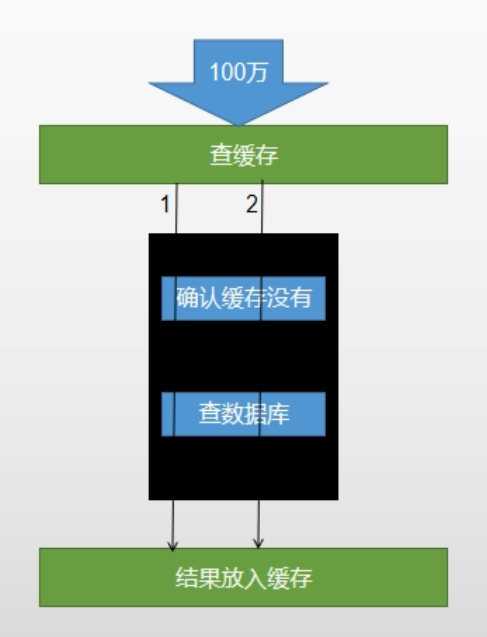

WebMvcAutoConfiguration  MVC 自动配置类


# 一. nginx 反向代理

> nginx 反向代理的时候回丢失掉很多东西，比如请求的域名、cookie等

.png)

反向代理 带上请求的 host信息

.png) 

## 1. 负载均衡

.png)

# 二. 网关路由规则

.png)

# 三. 压力测试

## 1.相关概念

```shell
响应时间：请求开始到返回响应结果，整个过程所消耗的时间。
HPS: 每秒单击次数（不太重要）
TPS：系统每秒处理次数（完成多少个事件）
QPS：每秒进行查询次数
## 对于互联网行业，如果有些业务有且只有一个请求连接，那么TPS=QPS=HPS。一般情况下用TPS衡量整个业务流程，用QPS衡量接口查询次数，用HPS表示对服务器单击请求
## 根据经验，一般情况下
	金融行业：1000 ~ 50000 TPS
	保险行业：100 ~ 100000 TPS
	制造行业：10 ~ 5000 TPS
	互联网电子商务：10000 ~ 1000000 TPS
	互联网中型网站：1000 ~ 50000 TPS
	互联网小型网站：500 ~ 10000 TPS
最大响应时间：指用户发出请求到系统做出反应的最大时间
最少响应时间：指用户发出请求到系统做出反应的最小时间
90%响应时间：指所有用户的响应时间进行排序，90%的响应时间
从外部看，性能测试主要关注如下三个指标
	吞吐量：每秒钟系统能够处理的请求数、任务数
	响应时间：服务器处理一个请求或一个任务的耗时
	错误率：一批请求中结果出错的请求所占的比例
```

## 2.一般使用

```shell
## 1. 创建一个测试计划。

## 2. 创建一个线程组

## 3. 线程组下创建 http 请求

## 4. 线程组下创建监控：查看结果树、汇总报告、聚合报告（主要看着三个）

## 5. 影响性能考虑点：数据库、应用程序、中间件（tomcat、nginx）、网络、操作系统

## 6.考虑自己应用是属于CPU 密集还是IO 密集型？针对性优化。
```

.png)

.png)

## 3. Jmeter Address Already in use 错误解决

```shell
## Win 本身提供的端口访问机制问题
## win 提供的 TCP/IP 链接的端口为 1024-5000 并且要四分钟来回收他们，导致短时间内跑大量的请求时将端口占满了。

## 解决方法
	## 1. cmd打开 regedit 打开注册表
    ## 2. 在 HKEY_LOCAL_MACHINE \ SYSTEM \ CurrControlSet \ Services \ Tcpip \ Parameters 下
    	## a) 右键parameter 添加一个新的 DWORD 名字为 MaxUserPort
    	## b) 然后双击 MaxuserPort 输入数据为 65534，基数选择十进制
    ## 同样操作添加 TCPTimeWaitDelay 值：30
```

.png)


.png)

.png)

# 四：性能检测

> jconsole 和 jvisualvm 都可以实现，但是推荐 jvisualvm。这两个都可以在 jdk1.8 bin中找到

```shell
## 插件无法连接到visualVM 插件中心。更换地址
https://visualvm.github.io/pluginscenters.html
## 在线安装 Visual GC
在线安装失败，可以去网页下载后。手动安装
```

.png)

```shell
运行：正在运行的
休眠：程序调用了 sleep
等待：程序调用了 wait
驻留：线程池俩面的空闲线程
监视：阻塞的线程，等在等待锁的释放
```

```shell
## 查看docker 内应用的内存使用
docker stats
```

```shell
## 优化方向
 ## 1.中间件越多，性能损失越大，大多都损失在网络交互了。
 ## 2. 业务
 	## a) DB (数据库服务器优化、索引优化) (一次性从DB 中读出数据，然后利用程序组装成目标数据)
 	## b) 模板渲染速度 (模板的缓存开启)
 	## c) tomcat 处理静态资源
 	## d) 日志级别打印耗时
 ## 3. JVM 参数调整(具体含义参考下文)
 	## -Xmx1024m -Xms1024m -Xmn512m
 	
```

```shell
## JVM 参数
## 1. 堆设置
    -Xms:初始堆大小
    -Xmx:最大堆大小
    -Xmn:新生代大小
    -XX:NewRatio:设置新生代和老年代的比值。如：为3，表示年轻代与老年代比值为1：3
    -XX:SurvivorRatio:新生代中Eden区与两个Survivor区的比值。注意Survivor区有两个。如：为3，表示Eden：Survivor=3：2，一个Survivor区占整个新生代的1/5  
    -XX:MaxTenuringThreshold:设置转入老年代的存活次数。如果是0，则直接跳过新生代进入老年代
    -XX:PermSize、-XX:MaxPermSize:分别设置永久代最小大小与最大大小（Java8以前）
    -XX:MetaspaceSize、-XX:MaxMetaspaceSize:分别设置元空间最小大小与最大大小（Java8以后）
## 2. 收集器设置
    -XX:+UseSerialGC:设置串行收集器
    -XX:+UseParallelGC:设置并行收集器
    -XX:+UseParalledlOldGC:设置并行老年代收集器
    -XX:+UseConcMarkSweepGC:设置并发收集器
## 3. 垃圾回收统计信息
    -XX:+PrintGC
    -XX:+PrintGCDetails
    -XX:+PrintGCTimeStamps
    -Xloggc:filename
## 4. 并行收集器设置
    -XX:ParallelGCThreads=n:设置并行收集器收集时使用的CPU数。并行收集线程数。
    -XX:MaxGCPauseMillis=n:设置并行收集最大暂停时间
    -XX:GCTimeRatio=n:设置垃圾回收时间占程序运行时间的百分比。公式为1/(1+n)
## 5. 并发收集器设置
    -XX:+CMSIncrementalMode:设置为增量模式。适用于单CPU情况。
    -XX:ParallelGCThreads=n:设置并发收集器新生代收集方式为并行收集时，使用的CPU数。并行收集线程数。
```


## 1. nginx 动静分离

```shell
## 所有的静态资源链接都已 /static 开头。然后在nginx 配置文件里面配置如下
## 这样所有的 以/static 开头的请求都会被nginx 处理。不会再次走 tomcat。
```


.png)

# 五：缓存

## 1.哪些数据适合放在缓存里

> 即时性、数据一致性要求不高的
> 访问量大且更新评率不高的数据(读多写少)
>
> 缓存都应该设置过期时间
>
> 多使用stringRedisTemplate
> **JSON 转换**：Map<String, List<Catelog2Vo>> result = JSON.parseObject(cateLogJson, new TypeReference<Map<String, List<Catelog2Vo>>>);

## 2. Springboot-redis 出错错误

> springboot 版本为 2.1.8

.png)

.jpg)

## 3. 缓存穿透

> 缓存穿透： 指查询一个一定不存在的数据，由于缓存是不命中，将去查询数据库，但是 数据库也无此记录，我们没有将这次查询的null写入缓存，这将导致这个不 存在的数据每次请求都要到存储层去查询，失去了缓存的意义 
>
> 风险： 利用不存在的数据进行攻击，数据库瞬时压力增大，最终导致崩溃 缓存 db 100 万 100 万 
>
> 解决： null结果缓存，并加入短暂过期时间

.png)

## 4. 缓存雪崩

> 缓存雪崩： 缓存雪崩是指在我们设置缓存时key采用了相同的过期时间， 导致缓存在某一时刻同时失效，请求全部转发到DB，DB瞬时 压力过重雪崩。
>
> 解决： 原有的失效时间基础上增加一个随机值，比如1-5分钟随机，这 样每一个缓存的过期时间的重复率就会降低，就很难引发集体 失效的事件。

.png)

## 5. 缓存击穿

> 缓存穿透： 
> • 对于一些设置了过期时间的key，如果这些key可能会在某些 时间点被超高并发地访问，是一种非常“热点”的数据。 • 如果这个key在大量请求同时进来前正好失效，那么所有对 这个key的数据查询都落到db，我们称为缓存击穿。
>
> 解决： 加锁 大量并发只让一个去查，其他人等待，查到以后释放锁，其他 人获取到锁，先查缓存，就会有数据，不用去db

.png)

# 六： 加锁

## 1. 本地锁

> 本地锁只能锁住该JVM ，不能锁住其他的JVM
>
> 本地锁，上锁的范围：必须保证查询数据库和结果放在缓存中是一个原子操作。这样才不会在高并发情况下发生多次查询数据库
>
> 第一张图会出现查询多次数据库。第二张图才能只查询一次




.png)


