# 一：静态IP

1. 修改虚拟机为静态ip地址

   1. 修改下面配置

   ```shell
   vi /etc/sysconfig/network-scripts/ifcfg-ens33
   ##修改前
   TYPE=Ethernet
   PROXY_METHOD=none
   BROWSER_ONLY=no
   BOOTPROTO=dhcp
   DEFROUTE=yes
   IPV4_FAILURE_FATAL=no
   IPV6INIT=yes
   IPV6_AUTOCONF=yes
   IPV6_DEFROUTE=yes
   IPV6_FAILURE_FATAL=no
   IPV6_ADDR_GEN_MODE=stable-privacy
   NAME=ens33
   UUID=15dc7bd9-275d-407d-98da-a66e4ec26aee
   DEVICE=ens33
   ONBOOT=no
   ##修改后
   TYPE=Ethernet
   PROXY_METHOD=none
   BROWSER_ONLY=no
   BOOTPROTO=static   ## 静态ip
   DEFROUTE=yes
   IPV4_FAILURE_FATAL=no
   IPV6INIT=yes
   IPV6_AUTOCONF=yes
   IPV6_DEFROUTE=yes
   IPV6_FAILURE_FATAL=no
   IPV6_ADDR_GEN_MODE=stable-privacy
   NAME=ens33
   UUID=15dc7bd9-275d-407d-98da-a66e4ec26aee
   DEVICE=ens33
   ONBOOT=yes  ##开机启动
   IPADDR=192.168.110.100  ##ip地址
   NETMASK=255.255.255.0  ##子网掩码
   GATEWAY=192.168.110.2 ##默认网关 一般尾数为：2
   DNS1=192.168.110.2  ##DNS  一般尾数为：2
   
   ```

   2. 上面ip、子网掩码、默认网关等相关数字需要保持和vm设置一致。

      VM设置：编辑-->虚拟网络编辑-->NTA模式 

      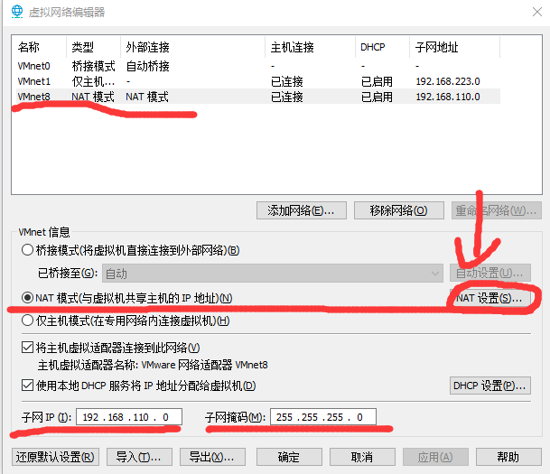

      

      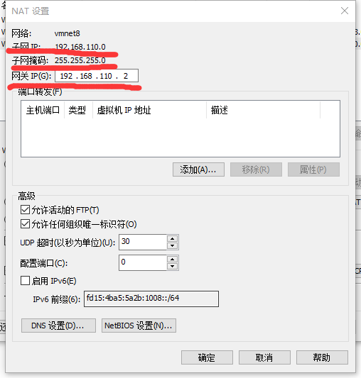

   3. 重新加载配置文件（修改后并没有立即生效，需要重新加载）

      ```shell
      service network restart
      Restarting network (via systemctl):                 [  OK  ]
      
      ```

   4. 测试

      ```shell
      [root@localhost ~]# ip addr
      1: lo: <LOOPBACK,UP,LOWER_UP> mtu 65536 qdisc noqueue state UNKNOWN group default qlen 1000
          link/loopback 00:00:00:00:00:00 brd 00:00:00:00:00:00
          inet 127.0.0.1/8 scope host lo
             valid_lft forever preferred_lft forever
          inet6 ::1/128 scope host 
             valid_lft forever preferred_lft forever
      2: ens33: <BROADCAST,MULTICAST,UP,LOWER_UP> mtu 1500 qdisc pfifo_fast state UP group default qlen 1000
          link/ether 00:0c:29:44:d7:d4 brd ff:ff:ff:ff:ff:ff
          inet 192.168.110.100/24 brd 192.168.110.255 scope global noprefixroute ens33
             valid_lft forever preferred_lft forever
          inet6 fe80::82f1:4bf9:b245:ba55/64 scope link noprefixroute 
             valid_lft forever preferred_lft forever
      [root@localhost ~]# ping www.baidu.com
      PING www.a.shifen.com (39.156.66.14) 56(84) bytes of data.
      64 bytes from 39.156.66.14 (39.156.66.14): icmp_seq=1 ttl=128 time=5.34 ms
      64 bytes from 39.156.66.14 (39.156.66.14): icmp_seq=2 ttl=128 time=5.05 ms
      64 bytes from 39.156.66.14 (39.156.66.14): icmp_seq=3 ttl=128 time=5.14 ms
      64 bytes from 39.156.66.14 (39.156.66.14): icmp_seq=4 ttl=128 time=4.45 ms
      64 bytes from 39.156.66.14 (39.156.66.14): icmp_seq=5 ttl=128 time=5.27 ms
      ^C
      --- www.a.shifen.com ping statistics ---
      5 packets transmitted, 5 received, 0% packet loss, time 4007ms
      rtt min/avg/max/mdev = 4.458/5.056/5.348/0.321 ms
      [root@localhost ~]# 
      
      ```

      

   5. 查看防火墙状态：Active: active (running)即为开启防火墙

      ```shell
      [root@localhost ~]# systemctl status firewalld
      ● firewalld.service - firewalld - dynamic firewall daemon
         Loaded: loaded (/usr/lib/systemd/system/firewalld.service; disabled; vendor preset: enabled)
         Active: active (running) since Mon 2019-10-21 07:07:57 CST; 1s ago
           Docs: man:firewalld(1)
       Main PID: 7433 (firewalld)
         CGroup: /system.slice/firewalld.service
                 └─7433 /usr/bin/python -Es /usr/sbin/firewalld --nofork --nopid
      
      Oct 21 07:07:57 localhost.localdomain systemd[1]: Starting firewalld - dynamic firewall daemon...
      Oct 21 07:07:57 localhost.localdomain systemd[1]: Started firewalld - dynamic firewall daemon.
      [root@localhost ~]# 
      
      
      ```

   6. 关闭防火墙：Active: inactive (dead)只是当前关闭，开机仍会启动防火墙

      ```shell
      [root@localhost ~]# systemctl stop firewalld
      [root@localhost ~]# systemctl status firewalld
      ● firewalld.service - firewalld - dynamic firewall daemon
         Loaded: loaded (/usr/lib/systemd/system/firewalld.service; disabled; vendor preset: enabled)
         Active: inactive (dead)
           Docs: man:firewalld(1)
      
      Oct 21 07:07:57 localhost.localdomain systemd[1]: Starting firewalld - dynamic firewall daemon...
      Oct 21 07:07:57 localhost.localdomain systemd[1]: Started firewalld - dynamic firewall daemon.
      Oct 21 07:10:19 localhost.localdomain systemd[1]: Stopping firewalld - dynamic firewall daemon...
      Oct 21 07:10:20 localhost.localdomain systemd[1]: Stopped firewalld - dynamic firewall daemon.
      [root@localhost ~]# 
      ```

   7. 关闭开机启动防火墙。重启检查防火墙状态

      ```shell
      [root@localhost ~]# systemctl disable firewalld
      
      ```

   8. 开放某一个发端口。**~~百度而来，并没有验证~~**

      ```shell
      firewall-cmd —list-ports  ##查看以开放端口命令
      firewall-cmd --zone=public --add-port=80/tcp --permanent  ## 开启端口
      命令含义：
      –zone #作用域
      –add-port=80/tcp #添加端口，格式为：端口/通讯协议
      –permanent #永久生效，没有此参数重启后失效
      
      #重启firewall  
      firewall-cmd --reload
      ```

    ## 9. 安装软件
   
      ```shell
   ## 更新yum
   [root@localhost ~]# yum update
   ## 安装 vim
   [root@localhost Backup]# yum install -y vim
   
   ## 安装 rsync
   [root@hadoop0-110 backup]# yum install -y rsync
   ## 查看状态
   [root@hadoop0-110 ~]# systemctl status rsyncd.service
      ```
   
      
   
   10. 开机多个选项删除
   
       ```shell
       [root@localhost ~]# uname -a  ##查看系统当前内核版本
       Linux localhost.localdomain 3.10.0-1062.1.2.el7.x86_64 #1 SMP Mon Sep 30 14:19:46 UTC 2019 x86_64 x86_64 x86_64 GNU/Linux
       [root@localhost ~]# rpm -q -a | grep kernel ## 查看系统中全部的内核RPM包
       kernel-3.10.0-1062.1.2.el7.x86_64
       kernel-3.10.0-957.el7.x86_64
       kernel-tools-3.10.0-1062.1.2.el7.x86_64
       kernel-tools-libs-3.10.0-1062.1.2.el7.x86_64
       [root@localhost ~]# yum remove kernel-3.10.0-957.el7.x86_64 ## 删除与内核不符合的版本
       ```
   
       
   
   11. 其他的后续再补充

# 二：JDK 安装

- 上传JDK1.8 到/opt/Backup

- tar -zxvf 解压JDK 到 /opt

  ```shell
  [root@localhost Backup]# tar -zxvf jdk-8u201-linux-x64.tar.gz -C /opt
  ```

- 配置环境变量

  ```shell
  [root@localhost Backup]# vim /etc/profile  ##里面：set nu开启行号
  
  ## 末尾添加如下
  ##JDK
  export JAVA_HOME=/opt/jdk1.8.0_201
  export CLASSPATH=$:CLASSPATH:$JAVA_HOME/lib/ 
  export PATH=$PATH:$JAVA_HOME/bin
  
  ##重启profile文件
  [root@localhost ~]# source /etc/profile
  
  ##验证JDK
  [root@localhost Backup]# java -version
  java version "1.8.0_201"
  Java(TM) SE Runtime Environment (build 1.8.0_201-b09)
  Java HotSpot(TM) 64-Bit Server VM (build 25.201-b09, mixed mode)
  [root@localhost Backup]# 
  ```

# 三：docker安装

  ## 1. YUM安装docker

```shell
[root@localhost ~]# yum install docker -y

##验证docker是否安装
[root@localhost ~]# docker version
Client:
 Version:         1.13.1
 API version:     1.26
 Package version: 
Cannot connect to the Docker daemon at unix:///var/run/docker.sock. Is the docker daemon running?
[root@localhost ~]# 

```

## 2. 启动docker

```shell
systemctl start docker  #启动docker
systemctl enable docker #开机启动docker
systemctl status docker #查看docker状态

```

## 3. 修改docker源

```shell
[root@localhost ~]# vim /etc/docker/daemon.json

##添加：DaoCloud 加速器  （百度来的，不知道啥玩意测试还挺不错的）
{
    "registry-mirrors": [
        "http://95822026.m.daocloud.io"
    ],
    "insecure-registries": []
}

## 阿里源
{
  "registry-mirrors": ["https://72idtxd8.mirror.aliyuncs.com"]
}


##修改后
systemctl daemon-reload  ## 重启daemon
systemctl  restart docker  ##重启docker服务；
```

# 四：docker常用命令

```shell
docker version ##查看docker版本

systemctl status docker ## 查看docker运行状态
systemctl start docker ## 启动docker
systemctl stop docker ## 停止docker
systemctl enable docker ## 开机启动docker，并不会立即启动docker

docker images ## 查看镜像
docker search redis ## 查看redis
docker pull redis ## 拉取redis
docker rmi <image id> ## 删除镜像
docker ps ## 查看运行中的容器
docker ps -a ## 查看所有的容器，包括停止

docker run ## 启动一个新容器
docker start <CONTAINER ID> ## 启动某个停止运行的容器
docker stop <CONTAINER ID> ## 停止容器
docker rm <CONTAINER ID> ## 删除容器
docker ps -q ## 查看运行中的 CONTAINER ID
docker ps -a -q ## 查看所有的 CONTAINER ID
docker stop $(docker ps -a -q) ## 停止所有的容器

docker logs <CONTAINER ID> ## 查看docker容器运行日志
docker exec -it containerID /bin/bash  ## 进入容器交互  containerID:镜像ID

## mysql为例
docker run -p 3306:3306 --name mysql -v /opt/mysql/data:/var/lib/mysql -e MYSQL_ROOT_PASSWORD=xiahan -d --privileged=true mysql:5.7

## 解释命令
-p 3306:3306：将容器3306映射到主机3306
--name mysql：容器取名
-v /opt/mysql/data:/var/lib/mysql：将主机的/opt/mysql/data挂载到容器/var/lib/mysql中
-e MYSQL_ROOT_PASSWORD=xiahan：root用户密码
-d：后台启动
--privileged=true：提高权限文件挂载的时候报错可以添加这个。据说有危险性
--restart=always：开机就启动
mysql:5.7：启动的是哪个mysql(5.7是这次的版本)


```

> 1. docker save和docker export的区别
>    对于Docker Save方法，会保存该镜像的所有历史记录
>    对于Docker Export 方法，不会保留历史记录，即没有commit历史
>    docker save保存的是镜像（image），docker export保存的是容器（container）；
>    docker load用来载入镜像包，docker import用来载入容器包，但两者都会恢复为镜像；
>    docker load不能对载入的镜像重命名，而docker import可以为镜像指定新名称。
>
> ```shell
> ## save命令 
> docker save -o nginx.tar nginx:latest 
> ## 或 
> docker save > nginx.tar nginx:latest 
> ## 其中-o和>表示输出到文件，nginx.tar为目标文件，nginx:latest是源镜像名（name:tag）
> 
> ## load命令
> docker load -i nginx.tar
> ## 或
> docker load < nginx.tar
> ## 其中-i和<表示从文件输入。会成功导入镜像及相关元数据，包括tag信息
> 
> ## export命令
> docker export -o nginx-test.tar nginx-test
> ## 导出为tar
> docker export #ID or #Name > /home/export.tar
> ## 其中-o表示输出到文件，nginx-test.tar为目标文件，nginx-test是源容器名（name）
> 
> ## import命令
> docker import nginx-test.tar nginx:imp
> ## 或
> cat nginx-test.tar | docker import - nginx:imp
> ```
>
> 

# 五：docker安装mysql 5.7

```shell
[root@localhost ~]# docker search mysql  ##查询mysql
[root@localhost ~]# docker pull mysql:5.7  ##拉取mysql 5.7
[root@localhost ~]# docker images  ##查询本地下载所有镜像
REPOSITORY          TAG                 IMAGE ID            CREATED             SIZE
docker.io/mysql     5.7                 cd3ed0dfff7e        4 days ago          437 MB

 docker run --name mysql -p 3306:3306 -v /mysql/datadir:/var/lib/mysql -e MYSQL_ROOT_PASSWORD=123456  -d mysql
 
 # 建立挂载的数据卷
mkdir -p /opt/mysql/data

# 虚拟机 3306 端口和容器里的3306端口对应，虚拟机路径和容器里路径（下图，来自头部参考地址）对应
docker run -p 3306:3306 --name mysql --restart=always -v /opt/mysql/data:/var/lib/mysql -e MYSQL_ROOT_PASSWORD=xiahan -d --privileged=true mysql:5.7

##解释命令
-p 3306:3306：将容器3306映射到主机3306
--name mysql：容器取名
-v /opt/mysql/data:/var/lib/mysql：将主机的/opt/mysql/data挂载到容器/var/lib/mysql中
-e MYSQL_ROOT_PASSWORD=xiahan：root用户密码
-d：后台启动
--privileged=true：提高权限文件挂载的时候报错可以添加这个。据说有危险性
--restart=always：开机就启动
mysql:5.7：启动的是哪个mysql(5.7是这次的版本)


-------------------------------------------------------------------------
## mysql之前并不是docker自启。通过命令修改
$ docker update mysql --restart=always
-------------------------------------------------------------------------
## 以下未验证
docker run -p 3306:3306 --name mysql \ 
-v /mydata/mysql/log:/var/log/mysql \ 
-v /mydata/mysql/data:/var/lib/mysql \ 
-v /mydata/mysql/conf:/etc/mysql \ 
-e MYSQL_ROOT_PASSWORD=root \ 
-d mysql:5.7
## 解释命令
将日志、配置、数据挂载
## mysql 配置
[client]
default-character-set=utf8
[mysql]
default-character-set=utf8
[mysqld]
init_connect='SET'

[client]
# 设置mysql客户端默认字符集
default-character-set=utf8 
[mysqld]
character-set-server=utf8
default-storage-engine=INNODB
skip-name-resolve ## 可以解决mysql连接慢的问题，跳过域名解析
```


# 六：docker安装 Redis

## 1. 命令
```shell
[root@localhost ~]# docker search redis
[root@localhost ~]# docker pull redis
[root@localhost ~]# docker images
REPOSITORY          TAG                 IMAGE ID            CREATED             SIZE
docker.io/mysql     5.7                 cd3ed0dfff7e        2 weeks ago         437 MB
docker.io/redis     latest              de25a81a5a0b        2 weeks ago         98.2 MB
[root@localhost ~]# docker run -p 6379:6379 -v /opt/redis/redis.conf:/etc/redis/redis.conf -v /opt/redis/redis-6379:/data --privileged=true --name redis_6379 -d redis redis-server /etc/redis/redis.conf --appendonly yes --requirepass root

不开机启动：
[root@localhost ~]# docker run -p 6379:6379 -v /opt/redis/redis.conf:/etc/redis/redis.conf -v /opt/redis/redis-6379:/data --privileged=true --name redis_6379 --restart=always -d redis redis-server /etc/redis/redis.conf --appendonly yes --requirepass root
## --appendonly yes 持久化
## --requirepass root 密码为:root
## -p 6379:6379  端口映射
## -v /opt/redis/redis.conf:/etc/redis/redis.conf		配置文件挂载
## -v /opt/redis/redis-6379:/data		数据文件夹挂载
## --privileged=true		提升权限
## --name redis_6379		别名
## -d redis		后台启动
## redis-server /etc/redis/redis.conf		以配置文件启动
## --restart=always		开机启动
## -d redis redis-server /etc/redis/redis.conf  -d redis在/etc/redis/redis.conf前面，在后面可能会出错

## 关于持久化
## 可以在启动命令不加--appendonly yes，直接在配置文件 conf 添加一行：appendonly yes 即可
```
## 2. redis.conf文件修改

这是使用的是redis-5.0.5.tar.gz版本的redis里面的config配置文件

```conf
1. bind 127.0.0.1  		70行左右，注释掉
2. protected-mode yes     90行左右，改为：protected-mode no
	开启了 protected-mode 时，如果你既没有显示的定义了 bind,监听的地址，同时又没有设置 auth 密码。那你只能通过 127.0.0.1 来访问 redis 服务
3. appendonly no         702行左右 持久化改为：appendonly yes
4. #requirepass foobared   510行左右，设置redis密码
5. daemonize:yes		redis后台运行，改为no，退出界面就kill掉进程
```
## 3. tar.gz安装redis

```shell
参考秒杀项目第一天的安装redis

后面有时间补齐这个文档
```


# 七：docker 安装 nginx

```shell
## 查询docker nginx
[root@localhost ~]# docker search nginx
## 拉取最新的nginx
[root@localhost ~]# docker pull nginx
## 查看下载镜像
[root@localhost ~]# docker images
REPOSITORY           TAG                 IMAGE ID            CREATED             SIZE
docker.io/nginx      latest              2073e0bcb60e        2 weeks ago         127 MB
docker.io/rabbitmq   management          8bdbe10dc73e        3 months ago        180 MB
docker.io/mysql      5.7                 cd3ed0dfff7e        4 months ago        437 MB
docker.io/redis      latest              de25a81a5a0b        4 months ago        98.2 MB
## 运行nginx
[root@localhost ~]# docker run -p 8083:80 -d --name nginx --privileged=true nginx
cf68f099af75587247c70b63b50c767f0632d7fb3a1f616224619ac2dc631644
## 浏览器访问 http://192.168.110.100:8083/
效果如下图

## 创建nginx文件夹  -p 创建多个文件夹
[root@localhost ~]# mkdir -p /opt/nginx/conf
[root@localhost ~]# mkdir -p /opt/nginx/www
[root@localhost ~]# mkdir -p /opt/nginx/logs
## 复制配置文件 /etc/nginx/. 文件夹下的所有，但不会复制nginx这个文件夹   docker exec -it containerID /bin/bash  ## 进入容器交互  containerID:镜像ID
[root@localhost nginx]# docker cp -a nginx:/etc/nginx/. /opt/nginx/conf/
cp -a 保留原文件属性的前提下复制文件,使得复制之后的目录和原目录完全一样包括文件权限
## 修改配置文件
## 修改 http 设置
[root@localhost conf]# vim /opt/nginx/conf/nginx.conf  
## 修改 server 设置
[root@localhost conf]# vim /opt/nginx/conf/conf.d/default.conf
#再启动
[root@localhost conf]# docker run -p 8083:80 --name nginx --privileged=true -v /opt/nginx/www:/usr/share/nginx/html -v /opt/nginx/conf/:/etc/nginx -v /opt/nginx/logs:/var/log/nginx -d nginx

#-p 8083:80：将容器的80端口映射到主机的8083端口
#--name nginx：将容器命名为nginx
#-v /home/nginx/www:/usr/share/nginx/html：将主机中当前目录下的www挂载到容器的/usr/share/nginx/html
#-v /opt/nginx/conf/:/etc/nginx：将主机中当前目录下的nginx.conf挂载到容的/etc/nginx/nginx.conf
#-v /opt/nginx/logs:/var/log/nginx：将主机中当前目录下的logs挂载到容器的/var/log/nginx

## 修改主机域名映射
C:\Windows\System32\drivers\etc 添加 IP URL

```

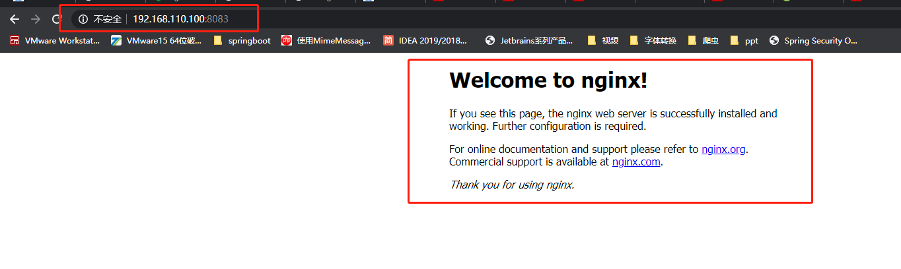

```shell
## vim /opt/nginx/conf/nginx.conf  

user  nginx;
worker_processes  1;

error_log  /var/log/nginx/error.log warn;
pid        /var/run/nginx.pid;


events {
    worker_connections  1024;
}


http {
    include       /etc/nginx/mime.types;
    default_type  application/octet-stream;

    log_format  main  '$remote_addr - $remote_user [$time_local] "$request" '
                      '$status $body_bytes_sent "$http_referer" '
                      '"$http_user_agent" "$http_x_forwarded_for"';

    access_log  /var/log/nginx/access.log  main;

    sendfile        on;
    #tcp_nopush     on;

    keepalive_timeout  65;

    #gzip  on;

    include /etc/nginx/conf.d/*.conf;
}
# vim /opt/nginx/conf/conf.d/default.conf
server {
    listen       80;
    server_name  localhost;

    ssi on;  ## 开启 SSI 服务
    ssi_silent_errors on;   ## SSI 不输出找不到页面错误信息 


    #charset koi8-r;
    #access_log  /var/log/nginx/host.access.log  main;

    location / {
        root   /usr/share/nginx/html;
        index  index.html index.htm;
    }

    #error_page  404              /404.html;

    # redirect server error pages to the static page /50x.html
    #
    error_page   500 502 503 504  /50x.html;
    location = /50x.html {
        root   /usr/share/nginx/html;
    }

    # proxy the PHP scripts to Apache listening on 127.0.0.1:80
    #
    #location ~ \.php$ {
    #    proxy_pass   http://127.0.0.1;
    #}

    # pass the PHP scripts to FastCGI server listening on 127.0.0.1:9000
    #
    #location ~ \.php$ {
    #    root           html;
    #    fastcgi_pass   127.0.0.1:9000;
    #    fastcgi_index  index.php;
    #    fastcgi_param  SCRIPT_FILENAME  /scripts$fastcgi_script_name;
    #    include        fastcgi_params;
    #}

    # deny access to .htaccess files, if Apache's document root
    # concurs with nginx's one
    #
    #location ~ /\.ht {
    #    deny  all;
    #}
}


```

# 八：docker  安装  mongo

```shell
## docker 查询 mongo 
[root@localhost /]# docker search mongo
## docker 拉取 mongo
[root@localhost /]# docker pull mongo
## 创建 mongo 所需文件夹
## 存放数据
[root@localhost opt]# mkdir -p /opt/mongo/data
## 日志
[root@localhost data]# mkdir -p /opt/mongo/logs
## 配置文件
[root@localhost data]# mkdir -p /opt/mongo/conf
## 
[root@localhost opt]# mkdir -p /opt/mongo/data/db
[root@localhost opt]# mkdir -p /opt/mongo/data/configdb

## docker 安装 mongo
[root@localhost mongo]# docker run --name mongo -p 27017:27017 --privileged=true -v /opt/mongo/data/db:/data/db -v /opt/mongo/data/configdb:/data/configdb -v /etc/localtime:/etc/localtime --restart=always -d mongo --auth
## 以 admin 用户身份进入mongo
[root@localhost mongo]# docker exec -it  90a330ba457e  mongo admin
## 创建一个 admin 管理员账号  在 admin 集合下创建
> db.createUser({ user: 'admin', pwd: 'xiahan...', roles: [ { role: "userAdminAnyDatabase", db: "admin" } ] });
Successfully added user: {
	"user" : "admin",
	"roles" : [
		{
			"role" : "userAdminAnyDatabase",
			"db" : "admin"
		}
	]
}
> exit


docker run --name mongo -p 27018:27017 --privileged=true -v /opt/mongo/data/db:/data/db -v /opt/mongo/data/configdb:/data/configdb -v /etc/localtime:/etc/localtime --restart=always -d mongo


```

## mongo 常见指令

```shell
## 查看所有的集合
> show dbs	
admin   0.000GB
config  0.000GB
local   0.000GB
## 切换数据库/创建数据库  新创建的数据库不显示，需要至少包括一个集合。
use mongo 
## 显示当前的数据库
> db
switched to db mongo
## 创建集合 student
## db.createCollection(name, options)
## name: 新创建的集合名称
## options: 创建参数(可缺少)
> db.createCollection("student")
{ "ok" : 1 }
## 删除数据库，先切换数据库 use DATABASE_NAME
> use mongo 
> db.dropDatabase() 
## 删除集合
db.collection.drop()
例子：
db.student.drop() ## 删除student集合
## 创建角色  角色是基于数据库，所以创建的时候在对应的数据库下创建
> use admin
> db.auth('admin', 'xiahan...')
> use mongo
> db.createUser({ user: 'mongo', pwd: 'mongo', roles: [ { role: "root", db: "mongo" } ] });
Successfully added user: {
	"user" : "mongo",
	"roles" : [
		{
			"role" : "readWrite",
			"db" : "mongo"
		}
	]
}
## 删除用户 mongo （删除用户必须由账号管理员来删，所以，切换到admin角色）
db.system.users.remove({user:"mongo"})  ## 目前并没有成功，不知为啥

## 创建集合、文档等
show dbs
use mongo 
db.auth('mongo', 'mongo')
db.createCollection('student')
db.student.insert({'name':'xiahan', 'age':'110'})
db.student.insert({'name':'小名', 'age':'11'})
db.student.insert({'name':'小刚', 'age':'10'})
db.student.insert({'name':'小红', 'age':'119'})

## 查找所有
> db.getCollection("student").find({})
{ "_id" : ObjectId("5e4d2bb94fe62b01d0640196"), "name" : "xiahan", "age" : "110" }
{ "_id" : ObjectId("5e4d2ea81ce67b0699054611"), "name" : "小名", "age" : "11" }
{ "_id" : ObjectId("5e4d2ea91ce67b0699054612"), "name" : "小刚", "age" : "10" }
{ "_id" : ObjectId("5e4d2eb41ce67b0699054613"), "name" : "小红", "age" : "119" }
## 更新某一条
> db.student.update({"name":"小名"},{"name":"北京小名","age":10})
WriteResult({ "nMatched" : 1, "nUpserted" : 0, "nModified" : 1 })
> db.getCollection("student").find({})
{ "_id" : ObjectId("5e4d2bb94fe62b01d0640196"), "name" : "xiahan", "age" : "110" }
{ "_id" : ObjectId("5e4d2ea81ce67b0699054611"), "name" : "北京小名", "age" : 10 }
{ "_id" : ObjectId("5e4d2ea91ce67b0699054612"), "name" : "小刚", "age" : "10" }
{ "_id" : ObjectId("5e4d2eb41ce67b0699054613"), "name" : "小红", "age" : "119" }


```

```shell
5.1 内置角色
数据库用户角色
read: 只读数据权限
readWrite:学些数据权限
数据库管理角色
dbAdmin: 在当前db中执行管理操作的权限
dbOwner: 在当前db中执行任意操作
userADmin: 在当前db中管理user的权限
备份和还原角色
backup
restore
夸库角色
readAnyDatabase: 在所有数据库上都有读取数据的权限
readWriteAnyDatabase: 在所有数据库上都有读写数据的权限
userAdminAnyDatabase: 在所有数据库上都有管理user的权限
dbAdminAnyDatabase: 管理所有数据库的权限
集群管理
clusterAdmin: 管理机器的最高权限
clusterManager: 管理和监控集群的权限
clusterMonitor: 监控集群的权限
hostManager: 管理Server
超级权限
root: 超级用户

作者：yandaren
链接：https://www.jianshu.com/p/62736bff7e2e
来源：简书
著作权归作者所有。商业转载请联系作者获得授权，非商业转载请注明出处。
```


# 九： node win安装

```shell
## 官网地址，下载 LTS 稳定版本 zip
https://nodejs.org/en/download/
## 解压 ZIP
## 新建两个目录
	node-npm-global :npm全局安装位置
	node-npm-cache：npm 缓存路径
## 添加 node.exe 所在的目录到 环境变量
## 检测版本安装

## 查看 npm 配置
## npm：远程下载所依赖的 js
 npm config ls
## npm 默认管理包路径：C:/用户/[用户名]/AppData/Roming/npm/node_meodules


## 那么node-npm-global :npm全局安装位置，node-npm-cache：npm 缓存路径 又是怎么与npm发生关系呢？
## 在 node.exe 所在的文件夹下之下下面的命令
	npm config set prefix "E:\JAVA\Windows\node\node-npm-global"
	npm config set cache "E:\JAVA\Windows\node\node-npm-cache"
	
## 安装 cnpm
## 在 node.exe 所在的文件夹下之下下面的命令
	npm install -g cnpm --registry=https://registry.npm.taobao.org
## 检测 cnmp 版本
	cnpm -v
## 安装 nrm
	cnpm install -g nrm
## 切换镜像到taobao
	nrm use taobao
## 安装 webpack
	全局安装：
		npm install webpack -g 或 cnpm install webpack -g
		npm install webpack@3.6.0 -g或 cnpm install webpack@3.6.0 -g
	本地安装：
		npm install --save-dev webpack 或 cnpm install --save-dev webpack
		npm install --save-dev webpack-cli (4.0以后的版本需要安装webpack-cli)
		cnpm install --save-dev webpack@3.6.0
		
```

## 1. win 下解压

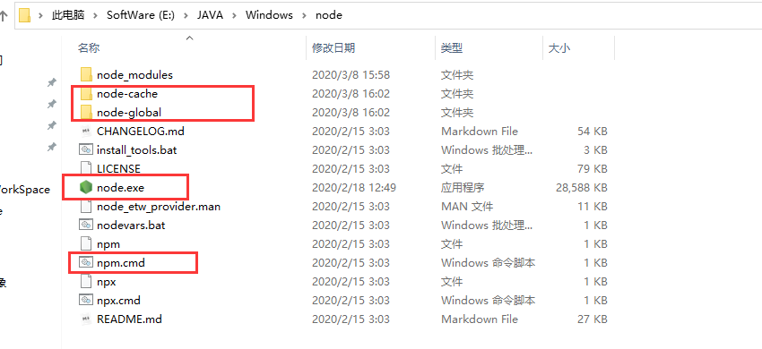

## 2. 环境变量

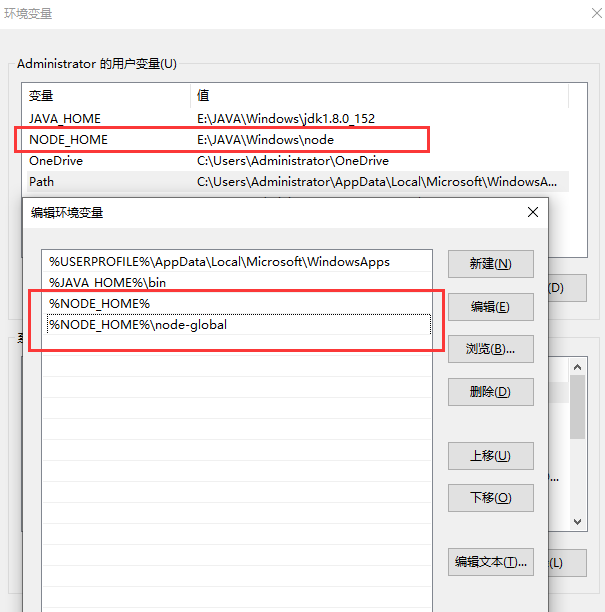

## 3. 检测安装

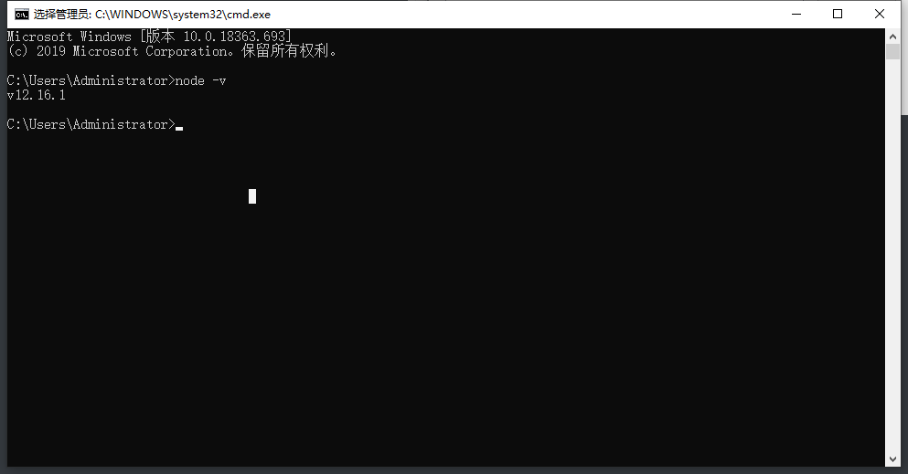

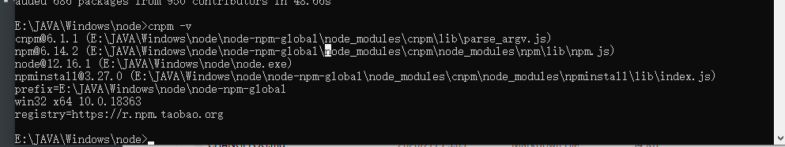

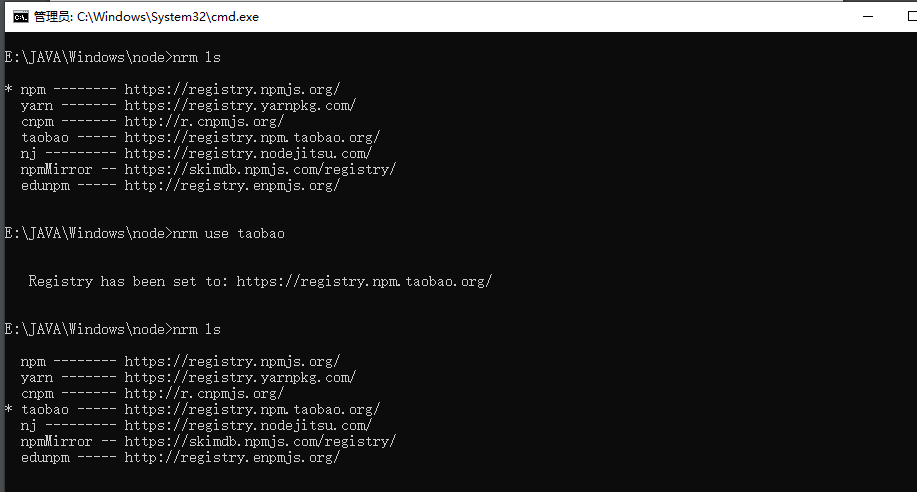

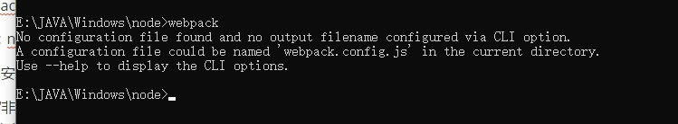


# 七：rabbitMQ安装

```shell
不带web页面
[root@localhost ~]# docker pull rabbitmq
[root@localhost ~]# docker run -p 5672:5672 -p 15672:15672 -d --name rabbitmq --privileged=true -v /opt/rabbitmq/data:/var/lib/rabbitmq --hostname myRabbit -e RABBITMQ_DEFAULT_VHOST=my_vhost  -e RABBITMQ_DEFAULT_USER=admin -e RABBITMQ_DEFAULT_PASS=admin rabbitmq

带web页面：
[root@localhost ~]# docker pull rabbitmq:management
[root@localhost ~]# docker run -p 5672:5672 -p 15672:15672 -d --name rabbitmq --privileged=true -v /opt/rabbitmq/data:/var/lib/rabbitmq --hostname myRabbit -e RABBITMQ_DEFAULT_VHOST=/  -e RABBITMQ_DEFAULT_USER=admin -e RABBITMQ_DEFAULT_PASS=admin rabbitmq:management

docker run -p 5672:5672 -p 15672:15672 -d --name rabbitmq --privileged=true -v /opt/rabbitmq/data:/var/lib/rabbitmq --hostname myRabbit -e RABBITMQ_DEFAULT_USER=admin -e RABBITMQ_DEFAULT_PASS=admin rabbitmq:management

##命令解说
-d 后台运行容器；

--name 指定容器名；

-p 指定服务运行的端口（5672：应用访问端口；15672：控制台Web端口号）；

-v 映射目录或文件；

--hostname  主机名（RabbitMQ的一个重要注意事项是它根据所谓的 “节点名称” 存储数据，默认为主机名）；

-e 指定环境变量；（RABBITMQ_DEFAULT_VHOST：默认虚拟机名；RABBITMQ_DEFAULT_USER：默认的用户名；RABBITMQ_DEFAULT_PASS：默认用户名的密码）

```

# 八： contos 常见命令

```shell
## 修改背景
cat /etc/motd

## top 监控linux的性能，cpu、内存
top

## 运行 springboot 命令
nohup java -jar xxx.jar &

## 修改使用者和使用者组
语法：chown [-cfhvR] [--help] [--version] user[:group] file...
chown runoob:runoobgroup file1 -R ## 将文件 file1.txt 的拥有者设为 runoob，群体的使用者 runoobgroup : -r 递归文件

```


## 开源国内镜像

```shell
## mysql国内镜像下载网址
http://mirrors.sohu.com/mysql/
http://mirrors.ustc.edu.cn/mysql-ftp/Downloads/

## 开源镜像站点汇总
http://segmentfault.com/a/1190000000375848
http://mirrors.ustc.edu.cn/
```


# 九： 安装hadoop

## 1. 解压 hadoop

```shell
## 解压
[root@localhost opt]# tar -zxvf /opt/backup/hadoop-2.7.2.tar.gz -C /opt/
## 获取路径
[root@localhost hadoop-2.7.2]# pwd
/opt/hadoop-2.7.2
## 修改环境变量
[root@localhost jdk1.8.0_201]# vim /etc/profile
## 追加
## hadoop
export HADOOP_HOME=/opt/hadoop-2.7.2
export PATH=$PATH:$HADOOP_HOME/bin
export PATH=$PATH:$HADOOP_HOME/sbin
## 配置立即生效
[root@localhost jdk1.8.0_201]# source /etc/profile
## 查看 hadoop 是否安装成功
[root@localhost jdk1.8.0_201]# hadoop version
Hadoop 2.7.2
Subversion https://git-wip-us.apache.org/repos/asf/hadoop.git -r b165c4fe8a74265c792ce23f546c64604acf0e41
Compiled by jenkins on 2016-01-26T00:08Z
Compiled with protoc 2.5.0
From source with checksum d0fda26633fa762bff87ec759ebe689c
This command was run using /opt/hadoop-2.7.2/share/hadoop/common/hadoop-common-2.7.2.jar
## 如果不能用 重启试试
[root@localhost jdk1.8.0_201]# reboot

## 重要目录
（1）bin目录：存放对Hadoop相关服务（HDFS,YARN）进行操作的脚本
（2）etc目录：Hadoop的配置文件目录，存放Hadoop的配置文件
（3）lib目录：存放Hadoop的本地库（对数据进行压缩解压缩功能）
（4）sbin目录：存放启动或停止Hadoop相关服务的脚本
（5）share目录：存放Hadoop的依赖jar包、文档、和官方案例


```

## 2. 克隆 Linux

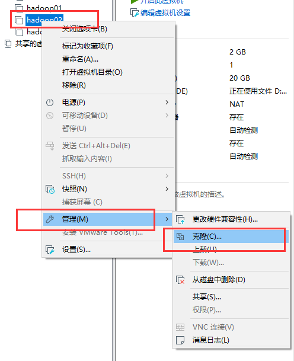

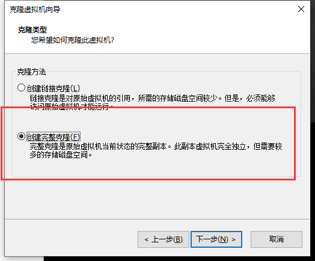


```shell
## 修改相关配置
## 获取uuid
[root@localhost ~]# uuidgen ens33
5b8bba98-3972-4f85-9937-c32771901823
[root@localhost rules.d]# vim /etc/sysconfig/network-scripts/ifcfg-ens33
UUID=5b8bba98-3972-4f85-9937-c32771901823  ## 修改之前生成的uuid
IPADDR=192.168.110.111  ## 修改ip地址

## 修改主机名
[root@localhost rules.d]# vim /etc/hostname 
## 修改为
hadoop1-111

## hots 追加
[root@xiahan ~]# vim /etc/hosts
192.168.110.110 hadoop0-110
192.168.110.111 hadoop1-111
192.168.110.112 hadoop2-112

```

## 3. 本地模式

> ​         官方Grep案例  

1. 创建在hadoop-2.7.2文件下面创建一个input文件夹

   ```shell
   [root@hadoop0-110 hadoop-2.7.2]# mkdir input
   ```

2. 将Hadoop的xml配置文件复制到input  

   ```shell
   [root@hadoop0-110 hadoop-2.7.2]# cp etc/hadoop/*.xml input/
   ```

3. 执行share目录下的MapReduce程序  

   ```shell
   [root@hadoop0-110 hadoop-2.7.2]# hadoop jar share/hadoop/mapreduce/hadoop-mapreduce-examples-2.7.2.jar grep input output 'dfs[a-z.]+'
   ```

4. 查看输出结果  

   ```shell
   [root@hadoop0-110 hadoop-2.7.2]# cd output/
   ```

> ​         官方WordCount案例  

1. 创建在hadoop-2.7.2文件下面创建一个wcinput文件夹    

2. 在wcinput文件下创建一个wc.input文件  

3. 编辑wc.input文件  

   ```shell
   [root@hadoop0-110 hadoop-2.7.2]# mkdir wcinput
   [root@hadoop0-110 hadoop-2.7.2]# cd wcinput
   [root@hadoop0-110 wcinput]# touch wc.input
   [root@hadoop0-110 wcinput]# vim wc.input
   ```

4. 执行程序  
   ```shell
   [root@hadoop0-110 hadoop-2.7.2]# hadoop jar share/hadoop/mapreduce/hadoop-mapreduce-examples-2.7.2.jar wordcount wcinput/ wcoutput
   ```

5. 查看结果  

   ```shell
   [root@hadoop0-110 hadoop-2.7.2]# cd wcoutput/
   [root@hadoop0-110 wcoutput]# ll
   total 0
   -rw-r--r--. 1 root root 0 Mar 31 06:07 part-r-00000
   -rw-r--r--. 1 root root 0 Mar 31 06:07 _SUCCESS
   ```

## 4. 伪分布式模式

   ### 1. 配置集群

   1. 配置：hadoop-env.sh  

      ```shell
      [root@hadoop0-110 hadoop]# pwd
      /opt/hadoop-2.7.2/etc/hadoop
      [root@hadoop0-110 hadoop]# echo $JAVA_HOME
      /opt/jdk1.8.0_201
      [root@hadoop0-110 hadoop]# vim hadoop-env.sh
      ## 25行左右 修改JAVA_HOME 路径
      	 25 export JAVA_HOME=/opt/jdk1.8.0_201
      ```

   2. 配置：core-site.xml  

      ```shell
      [root@hadoop0-110 hadoop]# pwd
      /opt/hadoop-2.7.2/etc/hadoop
      [root@hadoop0-110 hadoop]# vim core-site.xml 
      	## <configuration> </configuration> 之间增加配置
      	<!-- 指定HDFS中NameNode的地址 -->
          <property>
          <name>fs.defaultFS</name>
              <value>hdfs://hadoop0-110:9000</value>
          </property>
      
          <!-- 指定Hadoop运行时产生文件的存储目录 -->
          <property>
              <name>hadoop.tmp.dir</name>
              <value>/opt/hadoop-2.7.2/data</value>
          </property>
      ```
    
      ```shell
      [root@hadoop1-111 ~]# vim /etc/hosts
          127.0.0.1   localhost localhost.localdomain localhost4 localhost4.localdomain4
          ::1         localhost localhost.localdomain localhost6 localhost6.localdomain6
          192.168.110.110 hadoop0-110
          192.168.110.111 hadoop1-111
          192.168.110.112 hadoop2-112
      ```

   3. 配置：hdfs-site.xml  

      ```shell
      [root@hadoop0-110 hadoop]# pwd
      /opt/hadoop-2.7.2/etc/hadoop
      [root@hadoop0-110 hadoop]# vim hdfs-site.xml
      	## <configuration> </configuration>之间增加 
      	<!-- 指定HDFS副本的数量 -->
          <property>
              <name>dfs.replication</name>
              <value>1</value>
          </property>
      ```

### 2. 启动集群  

   1. **格式化NameNode**（第一次启动时格式化，以后就不要总格式化）  

      ```shell
        [root@hadoop0-110 hadoop-2.7.2]# bin/hdfs namenode -format
      ```

   2. 启动NameNode  

      ```shell
      [root@hadoop0-110 hadoop-2.7.2]# sbin/hadoop-daemon.sh start namenode
      starting namenode, logging to /opt/hadoop-2.7.2/logs/hadoop-root-namenode-hadoop0-110.out
      ```

   3. 启动DataNode  

      ```shell
      [root@hadoop0-110 hadoop-2.7.2]# sbin/hadoop-daemon.sh start datanode
      starting datanode, logging to /opt/hadoop-2.7.2/logs/hadoop-root-datanode-hadoop0-110.out
      ```

3. 查看集群  

   1. 查看是否启动成功  
   
      ```shell
      ## 注意：jps是JDK中的命令，不是Linux命令。不安装JDK不能使用jps
      [root@hadoop0-110 hadoop-2.7.2]# jps
      2406 Jps
      2255 NameNode
      2335 DataNode
      ```
   
   2. web端查看HDFS文件系统  
   
      ```shell
      http://192.168.110.110:50070/dfshealth.html#tab-overview
      ## 注意：如果不能查看，看如下帖子处理
      ## http://www.cnblogs.com/zlslch/p/6604189.html
      ```
   
   3. 查看产生的Log日志  
   
      ```shell
      [root@hadoop0-110 logs]# pwd
      /opt/hadoop-2.7.2/logs
      [root@hadoop0-110 logs]# ll
      total 60
      -rw-r--r--. 1 root root 22588 Mar 31 06:57 hadoop-root-datanode-hadoop0-110.log
      -rw-r--r--. 1 root root   714 Mar 31 06:57 hadoop-root-datanode-hadoop0-110.out
      -rw-r--r--. 1 root root 26317 Mar 31 06:57 hadoop-root-namenode-hadoop0-110.log
      -rw-r--r--. 1 root root   714 Mar 31 06:56 hadoop-root-namenode-hadoop0-110.out
      -rw-r--r--. 1 root root     0 Mar 31 06:56 SecurityAuth-root.audit
      ```
   
   4. **思考：为什么不能一直格式化NameNode，格式化NameNode，要注意什么？**  
   
      ```shell
      [root@hadoop0-110 current]# pwd
      /opt/hadoop-2.7.2/data/dfs/name/current
      [root@hadoop0-110 current]# cat VERSION
          #Tue Mar 31 06:54:59 CST 2020
          namespaceID=1822204006
          clusterID=CID-7dd224f3-74d0-4d19-b837-b4129a970fc7
          cTime=0
          storageType=NAME_NODE
          blockpoolID=BP-314196685-192.168.110.110-1585608899840
          layoutVersion=-63
      ```
   
   > 注意：格式化NameNode，会产生新的集群id,导致NameNode和DataNode的集群id不一致，集群找不到已往数据。所以，格式NameNode时，一定要先删除data数据和log日志，然后再格式化NameNode。 
   
4. 操作集群 

   1. 在HDFS文件系统上**创建**一个input文件夹  

      ```shell
      [root@hadoop0-110 hadoop-2.7.2]# bin/hdfs dfs -mkdir -p /user/atguigu/input
      ```

   2. 将测试文件内容**上传**到文件系统上  

      ```shell
      [root@hadoop0-110 hadoop-2.7.2]# bin/hdfs dfs -put wcinput/wc.input  /user/atguigu/input/
      ```

   3. **查看**上传的文件是否正确  

      ```shell
      [root@hadoop0-110 hadoop-2.7.2]# bin/hdfs dfs -ls  /user/atguigu/input/
      Found 1 items
      -rw-r--r--   1 root supergroup         76 2020-04-01 05:48 /user/atguigu/input/wc.input
      [root@hadoop0-110 hadoop-2.7.2]# bin/hdfs dfs -cat  /user/atguigu/input/wc.input
      xiahan gouzi renshang huawei
      xiaomi gaotong mayun
      mayun gouzi qiuhan
      qiuhan
      ```

   4. 运行MapReduce程序

      ```shell
      [root@hadoop0-110 hadoop-2.7.2]# bin/hadoop jar share/hadoop/mapreduce/hadoop-mapreduce-examples-2.7.2.jar wordcount /user/atguigu/input/ /user/atguigu/output
      
      ```

   5. 查看输出结果

      1. 命令行查看

         ```shell
         [root@hadoop0-110 hadoop-2.7.2]# bin/hdfs dfs -cat /user/atguigu/output/*
         gaotong	1
         gouzi	2
         huawei	1
         mayun	2
         qiuhan	2
         renshang	1
         xiahan	1
         xiaomi	1
         ```

      2. 网页查看

         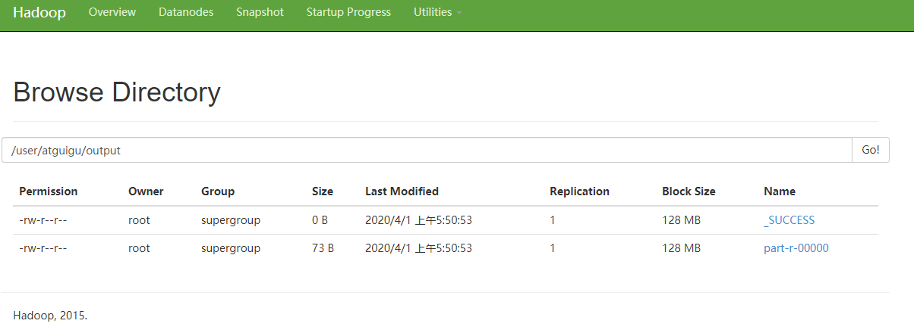
      
      3. 将测试文件内容**下载**到本地  

      ```shell
      [root@hadoop0-110 hadoop-2.7.2]# mkdir wcoutput1
      [root@hadoop0-110 hadoop-2.7.2]# hdfs dfs -get /user/atguigu/output/part-r-00000 ./wcoutput1/
      ```

      4. **删除**输出结果 

            ```shell
         [root@hadoop0-110 hadoop-2.7.2]# hdfs dfs -rm -r /user/atguigu/output
            20/04/01 05:56:30 INFO fs.TrashPolicyDefault: Namenode trash configuration: Deletion interval = 0 minutes, Emptier interval = 0 minutes.
            Deleted /user/atguigu/output
         ```
   
      5. 第二次格式化NameNode
   
         ```shell
         ## 1. 查看JPS进程，停止 NameNode和 DataNode
         ## 2. 删除 /opt/hadoop-2.7.2/data 和 /opt/hadoop-2.7.2/logs 目录
         ## 3. 在进行格式化
         ```

### 6. 启动YARN并运行MapReduce程序 

1. 分析  

> （1）配置集群在YARN上运行MR
>
> （2）启动、测试集群增、删、查
>
> （3）在YARN上执行WordCount案例

2.  执行步骤

   1. 配置集群

      1. 配置         yarn-env.sh  

         ```shell
         ## [root@hadoop0-110 hadoop]# pwd
         ## /opt/hadoop-2.7.2/etc/hadoop
         export JAVA_HOME=/opt/jdk1.8.0_201
         ```

      2. 配置         yarn-site.xml  

         ```shell
         <!-- Reducer获取数据的方式 -->
         <property>
          		<name>yarn.nodemanager.aux-services</name>
          		<value>mapreduce_shuffle</value>
         </property>
         
         <!-- 指定YARN的ResourceManager的地址 -->
         <property>
         <name>yarn.resourcemanager.hostname</name>
         <value>hadoop0-110</value>
         </property>
         ```

      3. ​         配置：mapred-env.sh  

         ```shell
         export JAVA_HOME=/opt/jdk1.8.0_201
         ```

      4. ​         配置： (对mapred-site.xml.template重新命名为) mapred-site.xml  

         ```shell
         [root@hadoop0-110 hadoop]# cp -p mapred-site.xml.template mapred-site.xml
         
         <!-- 指定MR运行在YARN上 -->
         <property>
         		<name>mapreduce.framework.name</name>
         		<value>yarn</value>
         </property>
         ```

      5. ​         启动集群  

         ```shell
         ## 启动前必须保证NameNode和DataNode已经启动
         ## 启动ResourceManager
         [root@hadoop0-110 hadoop-2.7.2]# sbin/yarn-daemon.sh start resourcemanager
         ## 启动NodeManager
         [root@hadoop0-110 hadoop-2.7.2]# sbin/yarn-daemon.sh start nodemanager
         ```

      6. ​         集群操作  

         1. ​         YARN的浏览器页面查看  :

            > http://192.168.110.110:8088

### 7. 配置历史服务器

1. ​         配置mapred-site.xml  

   ```shell
   [root@hadoop0-110 hadoop]# pwd
   /opt/hadoop-2.7.2/etc/hadoop
   [root@hadoop0-110 hadoop]# vim mapred-site.xml
   
   
   <!-- 历史服务器端地址 -->
   <property>
   <name>mapreduce.jobhistory.address</name>
   <value>hadoop0-110:10020</value>
   </property>
   <!-- 历史服务器web端地址 -->
   <property>
       <name>mapreduce.jobhistory.webapp.address</name>
       <value>hadoop0-110:19888</value>
   </property>
   
   ```

2. ​         启动历史服务器  

   ```shell
   [root@hadoop0-110 hadoop-2.7.2]# sbin/mr-jobhistory-daemon.sh start historyserver
   ```

3. ​         查看历史服务器是否启动  

   ```shell
   [root@hadoop0-110 hadoop-2.7.2]# sbin/mr-jobhistory-daemon.sh start historyserver
   starting historyserver, logging to /opt/hadoop-2.7.2/logs/mapred-root-historyserver-hadoop0-110.out
   [root@hadoop0-110 hadoop-2.7.2]# jps
   2851 JobHistoryServer
   2887 Jps
   1547 NameNode
   1611 DataNode
   2717 NodeManager
   2479 ResourceManager
   ```

4. ​         查看JobHistory  

   > ​         http://192.168.110.110:19888  

### 8.         配置日志的聚集  

> 日志聚集概念：应用运行完成以后，将程序运行日志信息上传到HDFS系统上。
>
> 日志聚集功能好处：可以方便的查看到程序运行详情，方便开发调试。
>
> 注意：开启日志聚集功能，需要重新启动NodeManager 、ResourceManager和HistoryManager。

1.   配置yarn-site.xml,增加下面的配置

   ```shell
   [root@hadoop0-110 hadoop-2.7.2]# vim etc/hadoop/yarn-site.xml 
   
   <!-- 日志聚集功能使能 -->
   <property>
   <name>yarn.log-aggregation-enable</name>
   <value>true</value>
   </property>
   
   <!-- 日志保留时间设置7天 , 单位 秒-->
   <property>
   <name>yarn.log-aggregation.retain-seconds</name>
   <value>604800</value>
   </property>
   
   ```

   2. 关闭NodeManager 、ResourceManager和HistoryManager  

      ```shell
      [root@hadoop0-110 hadoop-2.7.2]# sbin/yarn-daemon.sh stop resourcemanager
      stopping resourcemanager
      [root@hadoop0-110 hadoop-2.7.2]# sbin/yarn-daemon.sh stop nodemanager
      stopping nodemanager
      [root@hadoop0-110 hadoop-2.7.2]# sbin/mr-jobhistory-daemon.sh stop historyserver
      stopping historyserver
      
      ```

   3.  启动NodeManager 、ResourceManager和HistoryManager

      ```shell
      [root@hadoop0-110 hadoop-2.7.2]# sbin/yarn-daemon.sh start resourcemanager
      
      [root@hadoop0-110 hadoop-2.7.2]# sbin/yarn-daemon.sh start nodemanager
      
      [root@hadoop0-110 hadoop-2.7.2]# sbin/mr-jobhistory-daemon.sh start historyserver
      
      ```

   
### 9.          配置文件说明  

> ​		Hadoop配置文件分两类：默认配置文件和自定义配置文件，只有用户想修改某一默认配置值时，才需要修改自定义配置文件，更改相应属性值  .

    1. 默认配置文件  
       
       | 要获取的默认文件     | 文件存放在Hadoop的jar包中的位置                             |
       | -------------------- | ----------------------------------------------------------- |
       | [core-default.xml]   | hadoop-common-2.7.2.jar/  core-default.xml                  |
       | [hdfs-default.xml]   | hadoop-hdfs-2.7.2.jar/  hdfs-default.xml                    |
       | [yarn-default.xml]   | hadoop-yarn-common-2.7.2.jar/  yarn-default.xml             |
       | [mapred-default.xml] | hadoop-mapreduce-client-core-2.7.2.jar/  mapred-default.xml |
       
    2. ​         自定义配置文件  
       
       > ​         **core-site.xml、hdfs-site.xml、yarn-site.xml、mapred-site.xml**四个配置文件存放在$HADOOP_HOME/etc/hadoop这个路径上，用户可以根据项目需求重新进行修改配置。  

## 5. 集群分发脚本

### 1）scp: 安全拷贝	

```shell
scp    -r          $pdir/$fname              $user@hadoop$host:$pdir/$fname

命令   递归       要拷贝的文件路径/名称    目的用户@主机:目的路径/名称

scp -r /opt/module  root@hadoop102:/opt/module

## 反过来，在112上拷贝111的文件也行
[root@hadoop1-111 opt]# scp -r root@hadoop0-110:/opt/backup /opt/backup/
## 中间者，在111上拷贝110的文件到112上
[root@hadoop1-111 backup]# scp -r root@hadoop0-110:/opt/backup/temp root@hadoop2-112:/opt/backup/

```

### 2) 	rsync   :         远程同步工具  

>rsync主要用于备份和镜像。具有速度快、避免复制相同内容和支持符号链接的优点。
>
>rsync和scp区别：用rsync做文件的复制要比scp的速度快，rsync只对差异文件做更新。scp是把所有文件都复制过去。

（1）基本语法

>rsync   -rvl    $pdir/$fname        $user@hadoop$host:$pdir/$fname
>
>命令  选项参数  要拷贝的文件路径/名称  目的用户@主机:目的路径/名称

选项参数说明
| 选项 | 功能         |
| ---- | ------------ |
| -r   | 递归         |
| -v   | 显示复制过程 |
| -l   | 拷贝符号连接 |

```shell
[root@hadoop0-110 backup]# rsync temp root@hadoop1-111:/opt/backup/
```

### 3）群发脚本

```shell
## 创建文件
[root@hadoop0-110 ~]# mkdir bin
[root@hadoop0-110 ~]# cd bin/
[root@hadoop0-110 bin]# touch xsync
[root@hadoop0-110 bin]# vim xsync
## 修改权限
[root@hadoop0-110 bin]# chmod 777 xsync
[root@hadoop0-110 bin]# ll
total 4
-rwxrwxrwx. 1 root root 514 Nov 29 05:12 xsync

## 使用
[root@hadoop0-110 ~]# xsync bin/ 
fname=bin
pdir=/root
------------------- hadoop111 --------------
root@hadoop1-111's password: 
sending incremental file list
bin/
bin/xsync

sent 638 bytes  received 39 bytes  150.44 bytes/sec
total size is 514  speedup is 0.76
------------------- hadoop112 --------------
root@hadoop2-112's password: 
sending incremental file list
bin/
bin/xsync

sent 638 bytes  received 39 bytes  270.80 bytes/sec
total size is 514  speedup is 0.76


## xsync 脚本

#!/bin/bash
#1 获取输入参数个数，如果没有参数，直接退出
pcount=$#
if((pcount==0)); then
echo no args;
exit;
fi

#2 获取文件名称
p1=$1
fname=`basename $p1`
echo fname=$fname

#3 获取上级目录到绝对路径
pdir=`cd -P $(dirname $p1); pwd`
echo pdir=$pdir

#4 获取当前用户名称
user=`whoami`

#5 循环
for((host=111, i =1; host<113; host++, i++)); do
        echo ------------------- hadoop$host --------------
        rsync -rvl $pdir/$fname $user@hadoop$i-$host:$pdir
done

```

>如果部分不能全局使用 xsync，输入：echo $PATH
>
>
>
>[root@hadoop1-111 bin]# echo $PATH
>/usr/local/sbin:/usr/local/bin:/usr/sbin:/usr/bin:/opt/jdk1.8.0_201/bin:/opt/hadoop-2.7.2/bin:/opt/hadoop-2.7.2/sbin:/root/bin
>
>将 xsync 移动到上面的一个文件夹即可使用

### 4)          集群配置  

 1. 集群部署规划  

    |      | hadoop0-110              | hadoop1-111                        | hadoop2-112                       |
    | ---- | ------------------------ | ---------------------------------- | --------------------------------- |
    | HDFS | NameNode<br />  DataNode | DataNode                           | SecondaryNameNode <br /> DataNode |
    | YARN | NodeManager              | ResourceManager  <br />NodeManager | NodeManager                       |

 2. ​         配置集群  

     1. ​         核心配置文件 

        配置core-site.xml 

        ```shell
        [root@hadoop0-110 hadoop]# pwd
        /opt/hadoop-2.7.2/etc/hadoop
        [root@hadoop0-110 hadoop]# vim core-site.xml 
        ## 在该文件中编写如下配置
        <!-- 指定HDFS中NameNode的地址 -->
        <property>
        		<name>fs.defaultFS</name>
              <value>hdfs://hadoop0-110:9000</value>
        </property>
        
        <!-- 指定Hadoop运行时产生文件的存储目录 -->
        <property>
        		<name>hadoop.tmp.dir</name>
        		<value>/opt/module/hadoop-2.7.2/data/tmp</value>
        </property>
        ```

     2. ​          HDFS配置文件  

         1. ​         配置hadoop-env.sh  

            ```shell
            [root@hadoop0-110 hadoop]# pwd
            /opt/hadoop-2.7.2/etc/hadoop
            [root@hadoop0-110 hadoop]# vim hadoop-env.sh
            export JAVA_HOME=/opt/jdk1.8.0_201
            ```

         2. 配置hdfs-site.xml

            ```shell
            [root@hadoop0-110 hadoop]# pwd
            /opt/hadoop-2.7.2/etc/hadoop
            [root@hadoop0-110 hadoop]# vim hdfs-site.xml
            ##  在该文件中编写如下配置
            <property>
            		<name>dfs.replication</name>
            		<value>3</value>
            </property>
            
            <!-- 指定Hadoop辅助名称节点主机配置 -->
            <property>
                  <name>dfs.namenode.secondary.http-address</name>
                  <value>hadoop2-112:50090</value>
            </property>
            
            ```

     3. YARN配置文件

         1. 配置yarn-env.sh

            ```shell
            [root@hadoop0-110 hadoop]# pwd
            /opt/hadoop-2.7.2/etc/hadoop
            [root@hadoop0-110 hadoop]# vim yarn-env.sh
            ## 修改JAVA_HOME
            export JAVA_HOME=/opt/jdk1.8.0_201
            ```

         2. 配置yarn-site.xml

            ```shell
            <!-- Reducer获取数据的方式 -->
            <property>
                <name>yarn.nodemanager.aux-services</name>
                <value>mapreduce_shuffle</value>
            </property>
            
            <!-- 指定YARN的ResourceManager的地址 -->
            <property>
                <name>yarn.resourcemanager.hostname</name>
                <value>hadoop1-111</value>
            </property>
            	
            <!-- 日志聚集功能使能 -->
            <property>
            <name>yarn.log-aggregation-enable</name>
            <value>true</value>
            </property>
            
            <!-- 日志保留时间设置7天 , 单位 秒-->
            <property>
                <name>yarn.log-aggregation.retain-seconds</name>
                <value>604800</value>
            </property>
            
            ```

         3. MapReduce配置文件

            配置mapred-env.sh

            ```shell
            [root@hadoop0-110 hadoop]# pwd
            /opt/hadoop-2.7.2/etc/hadoop
            [root@hadoop0-110 hadoop]# vim mapred-env.sh
            ## 修改JAVA_HOME
            export JAVA_HOME=/opt/jdk1.8.0_201
            ```

            配置mapred-site.xml

            ```shell
            [root@hadoop0-110 hadoop]# cp -p mapred-site.xml.template mapred-site.xml
            ## 添加下面的
            <!-- 指定MR运行在YARN上 -->
            <property>
                            <name>mapreduce.framework.name</name>
                            <value>yarn</value>
            </property>
            
            
            <!-- 历史服务器端地址 -->
            <property>
            <name>mapreduce.jobhistory.address</name>
            <value>hadoop0-110:10020</value>
            </property>
            <!-- 历史服务器web端地址 -->
            <property>
                <name>mapreduce.jobhistory.webapp.address</name>
                <value>hadoop0-110:19888</value>
            </property>
            
            ```

 3. ​         在集群上分发配置好的Hadoop配置文件  

    ```shell
    [root@hadoop0-110 opt]# xsync /opt/hadoop-2.7.2/
    ```

 4. ​         查看文件分发情况  

 ### 5) 集群单点启动

 1. 如果集群不是第一次启动，需要进行如下操作：

     1. 停止集群所有的hadoop相关服务 即JSP查询只有JPS服务

     2. 删除集群的data和logs文件

        ```shell
        [root@hadoop0-110 hadoop-2.7.2]# pwd
        /opt/hadoop-2.7.2
        [root@hadoop0-110 hadoop-2.7.2]# rm -rf logs/
        [root@hadoop0-110 hadoop-2.7.2]# rm -rf data/
        ```

 2. ​         如果集群是第一次启动，需要**格式化NameNode**  

     ```shell
     ## 在root@hadoop0-110上格式化NameNode
     [root@hadoop0-110 hadoop-2.7.2]# hadoop namenode -format
     ## 在root@hadoop0-110上启动NameNode
     [root@hadoop0-110 hadoop-2.7.2]# sbin/hadoop-daemon.sh start namenode
     ## 在hadoop102、hadoop103以及hadoop104上分别启动DataNode
     [root@hadoop0-110 hadoop-2.7.2]# sbin/hadoop-daemon.sh start datanode
     [root@hadoop1-111 hadoop-2.7.2]# sbin/hadoop-daemon.sh start datanode
     [root@hadoop2-112 hadoop-2.7.2]# sbin/hadoop-daemon.sh start datanode
     
     ```

 3. 检查是否启动成功：（hadoop0-110:50070）192.168.110.110:50070

     .png)

### 6) SSH无密登录配置  

 1. 配置ssh  

     1. 基本用法

        > ssh另一台电脑的ip地址

     2. ssh连接时出现Host key verification failed的解决方法

         	1.          解决方案如下：直接输入yes

        ```shell
        [root@hadoop0-110 .ssh]# ssh hadoop1-111
        
        The authenticity of host '192.168.1.103 (192.168.1.103)' can't be established.
        
        RSA key fingerprint is cf:1e:de:d7:d0:4c:2d:98:60:b4:fd:ae:b1:2d:ad:06.
        
        Are you sure you want to continue connecting (yes/no)? 
        
        Host key verification failed.
        ```
        
        

 2. 无密钥配置

     1. 生成公钥和私钥：

        ```shell
        [root@hadoop0-110 .ssh]# cd 
        [root@hadoop0-110 ~]# pwd
        /root
        [root@hadoop0-110 ~]# cd .ssh/
        [root@hadoop0-110 .ssh]# pwd
        /root/.ssh
        [root@hadoop0-110 .ssh]# ssh-keygen -t rsa
        
        ## 然后敲（三个回车），就会生成两个文件id_rsa（私钥）、id_rsa.pub（公钥)
        
        [root@hadoop0-110 .ssh]# ll
        total 12
        -rw-------. 1 root root 1675 Apr  3 05:05 id_rsa
        -rw-r--r--. 1 root root  398 Apr  3 05:05 id_rsa.pub
      -rw-r--r--. 1 root root  378 Nov 29 04:38 known_hosts
        ```

        
     
     2. 将公钥拷贝到要免密登录的目标机器上
     
        ```shell
      [root@hadoop0-110 .ssh]# ssh-copy-id hadoop0-110
        
        ```

   [root@hadoop0-110 .ssh]# ssh-copy-id hadoop1-111
        
        [root@hadoop0-110 .ssh]# ssh-copy-id hadoop2-112
        ```


​        
​     
​     3. 剩余操作
​    
​       ```shell
   <span style="color:red">注意：</span>
​       
   hadoop0-110 上有namenode	hadoop1-111 上有resourceManager
​       
​       还需要在 hadoop0-110 上采用root账号，配置一下无密登录到 hadoop0-110、hadoop1-111、hadoop2-112；
​       
​       还需要在 hadoop1-111 上采用atguigu账号配置一下无密登录到 hadoop0-110、hadoop1-111、hadoop2-112 服务器上。
​       ```


​       
​    
​    4. .ssh文件夹下（~/.ssh）的文件功能解释
​    
​       	| known_hosts     | 记录ssh访问过计算机的公钥(public  key) |
​    | --------------- | -------------------------------------- |
​        | id_rsa          | 生成的私钥                             |
​        | id_rsa.pub      | 生成的公钥                             |
​        | authorized_keys | 存放授权过得无密登录服务器公钥         |

### 7）群起集群

 1. 配置slaves

    ```shell
    [root@hadoop0-110 hadoop]# pwd
    /opt/hadoop-2.7.2/etc/hadoop
    [root@hadoop0-110 hadoop]# vim slaves
    	## 在该文件中增加如下内容：
    	## 注意：该文件中添加的内容结尾不允许有空格，文件中不允许有空行。
        hadoop0-110
        hadoop1-111
        hadoop2-112
    [root@hadoop0-110 hadoop]# cat slaves 
    hadoop0-110
    hadoop1-111
    hadoop2-112
    ## 同步所有节点配置文件
    [root@hadoop0-110 hadoop]# xsync slaves 
    ```

 2. 启动集群

     1. ​         如果集群是第一次启动，需要格式化NameNode（注意格式化之前，一定要先停止上次启动的所有namenode和datanode进程，然后再删除data和log数据）  

        ```shell
        [root@hadoop0-110 hadoop-2.7.2]# pwd
        /opt/hadoop-2.7.2
        [root@hadoop0-110 hadoop-2.7.2]# bin/hdfs namenode -format
        ```

     2. 启动HDFS.

        ```shell
        ## NameNode在 hadoop0-110 所以在这上面启动HDFS
        [root@hadoop0-110 hadoop-2.7.2]# sbin/start-dfs.sh 
        Starting namenodes on [hadoop0-110]
        hadoop0-110: starting namenode, logging to /opt/hadoop-2.7.2/logs/hadoop-root-namenode-hadoop0-110.out
        hadoop2-112: starting datanode, logging to /opt/hadoop-2.7.2/logs/hadoop-root-datanode-hadoop2-112.out
        hadoop0-110: starting datanode, logging to /opt/hadoop-2.7.2/logs/hadoop-root-datanode-hadoop0-110.out
        hadoop1-111: starting datanode, logging to /opt/hadoop-2.7.2/logs/hadoop-root-datanode-hadoop1-111.out
        Starting secondary namenodes [hadoop2-112]
        hadoop2-112: starting secondarynamenode, logging to /opt/hadoop-2.7.2/logs/hadoop-root-secondarynamenode-hadoop2-112.out
        [root@hadoop0-110 hadoop-2.7.2]# jps
        2418 NameNode
        2546 DataNode
        2747 Jps
        ```

     3. 启动YARN

        ```shell
        ## NameNode在 hadoop1-111 所以在这上面启动YARN
        [root@hadoop1-111 hadoop-2.7.2]# sbin/start-yarn.sh 
        starting yarn daemons
        starting resourcemanager, logging to /opt/hadoop-2.7.2/logs/yarn-root-resourcemanager-hadoop1-111.out
        hadoop2-112: starting nodemanager, logging to /opt/hadoop-2.7.2/logs/yarn-root-nodemanager-hadoop2-112.out
        hadoop0-110: starting nodemanager, logging to /opt/hadoop-2.7.2/logs/yarn-root-nodemanager-hadoop0-110.out
        hadoop1-111: starting nodemanager, logging to /opt/hadoop-2.7.2/logs/yarn-root-nodemanager-hadoop1-111.out
        [root@hadoop1-111 hadoop-2.7.2]# jps
        1974 DataNode
        2215 NodeManager
        2474 Jps
        2107 ResourceManager
        ```

        <span style="color:red">注意：NameNode和ResourceManger如果不是同一台机器，不能在NameNode上启动 YARN，应该在ResouceManager所在的机器上启动YARN。</span>

     4. Web端查看SecondaryNameNode

         	1. 浏览器中输入： http://192.168.110.112:50090/ 

### 8) 集群启动/停止方式总结

 1. 各个服务组件逐一启动/停止

     1. 分别启动/停止HDFS组件

        ```shell
        hadoop-daemon.sh  start / stop  namenode / datanode / secondarynamenode
        ```

     2. 启动/停止YARN

        ```shell
        yarn-daemon.sh  start / stop  resourcemanager / nodemanager
        ```

	2. 各个模块分开启动/停止（配置ssh是前提）<span style="color:red">常用</span>

        	1. 整体启动/停止HDFS

        ```sjell
        start-dfs.sh   /  stop-dfs.sh
        ```

        	2. 整体启动/停止YARN

        ```shell
        start-yarn.sh  /  stop-yarn.sh
        ```

     ### 9）集群时间同步

> 时间同步的方式：找一个机器，作为时间服务器，所有的机器与这台集群时间进行定时的同步，比如，每隔十分钟，同步一次时间。

**配置时间同步具体实操：**

  1. 时间服务器配置（必须root用户）

       1. 检查ntp是否安装

          ```shell
          
          [root@hadoop0-110 hadoop-2.7.2]# yum -y install ntp /*yum安装NTP服务*/
          [root@hadoop0-110 hadoop-2.7.2]# chkconfig ntpd on /*开机自启动NTP*/
          ```

       2. 修改ntp配置文件

          ```shell
          [root@hadoop0-110 hadoop-2.7.2]# vi /etc/ntp.conf
          ## 修改1（授权192.168.1.0-192.168.1.255网段上的所有机器可以从这台机器上查询和同步时间）
          #restrict 192.168.110.0 mask 255.255.255.0 nomodify notrap为 restrict 192.168.1.0 mask 255.255.255.0 nomodify notrap
          ## 修改2（集群在局域网中，不使用其他互联网上的时间）
          server 0.centos.pool.ntp.org iburst
          server 1.centos.pool.ntp.org iburst
          server 2.centos.pool.ntp.org iburst
          server 3.centos.pool.ntp.org iburst为
          #server 0.centos.pool.ntp.org iburst
          #server 1.centos.pool.ntp.org iburst
          #server 2.centos.pool.ntp.org iburst
          #server 3.centos.pool.ntp.org iburst
          ## 添加3（当该节点丢失网络连接，依然可以采用本地时间作为时间服务器为集群中的其他节点提供时间同步）
          server 127.127.1.0
          fudge 127.127.1.0 stratum 10
          ```

       3. 修改/etc/sysconfig/ntpd 文件

          ```shell
          [root@hadoop0-110 hadoop-2.7.2]# vim /etc/sysconfig/ntpd
          ## 增加内容如下（让硬件时间与系统时间一起同步）
          SYNC_HWCLOCK=yes
          ```

       4. 重新启动ntpd服务

          ```shell
          ## 查看状态
          [root@hadoop0-110 hadoop-2.7.2]# service ntpd status
          ## 启动
          [root@hadoop0-110 hadoop-2.7.2]# service ntpd start
          ## 开机自启
          [root@hadoop0-110 hadoop-2.7.2]# chkconfig ntpd on
          ```

  2. 其他机器配置（必须root用户）

       1. 

          ```shell
          ## 在其他机器配置10分钟与时间服务器同步一次
          [root@hadoop1-111 hadoop-2.7.2]# crontab -e
          ## 增加
          */10 * * * * /usr/sbin/ntpdate hadoop0-110
          ## 修改任意机器时间
          [root@hadoop1-111 hadoop-2.7.2]# date -s "2017-9-11 11:11:11"
          ## 十分钟后查看机器是否与时间服务器同步
          ## 首先确保已经安装 ntp 服务
          [root@hadoop1-111 hadoop-2.7.2]# date
          ```

### 10）crond

  1. 重新启动crond服务

     ```shell
     [root@hadoop2-112 ~]# service crond restart
     ```

  2. ### crontab 定时任务设置

       1. 基本语法

          > crontab [选项]

       2. 选项说明

          | 选项 | 功能                          |
          | ---- | ----------------------------- |
          | -e   | 编辑crontab定时任务           |
          | -l   | 查询crontab任务               |
          | -r   | 删除当前用户所有的crontab任务 |

       3. 参数说明

          ```shell
          ## * * * * * 执行的任务
          ```

          | 项目      | 含义                 | 范围                    |
          | --------- | -------------------- | ----------------------- |
          | 第一个“*” | 一小时当中的第几分钟 | 0-59                    |
          | 第二个“*” | 一天当中的第几小时   | 0-23                    |
          | 第三个“*” | 一个月当中的第几天   | 1-31                    |
          | 第四个“*” | 一年当中的第几月     | 1-12                    |
          | 第五个“*” | 一周当中的星期几     | 0-7（0和7都代表星期日） |

### 11）Hadoop编译源码（面试重点）

  1. 前期准备工作

       1. CentOS联网 

          > 配置CentOS能连接外网。Linux虚拟机ping [www.baidu.com](http://www.baidu.com) 是畅通的
          >
          > <span style="color:red">注意</span>：采用root角色编译，减少文件夹权限出现问题

       2. jar包准备(hadoop源码、JDK8、maven、ant 、protobuf)
       
          > （1）hadoop-2.7.2-src.tar.gz
          >
          > （2）jdk-8u144-linux-x64.tar.gz
          >
          > （3）apache-ant-1.9.9-bin.tar.gz（build工具，打包用的）
          >
          > （4）apache-maven-3.0.5-bin.tar.gz
          >
          > （5）protobuf-2.5.0.tar.gz（序列化的框架）
       
       3. jar包安装
       
          > <span style="color:red">注意：所有操作必须在root用户下完成</span>
          >
          > [root@hadoop3-103 Backup]# tar -zxf jdk-8u144-linux-x64.tar.gz -C /opt/
          >
          > [root@hadoop3-103 Backup]# vim /etc/profile
          >
          > --追加
          >
          > ##JDK
          > export JAVA_HOME=/opt/jdk1.8.0_201
          > export CLASSPATH=$:CLASSPATH:$JAVA_HOME/lib/
          > export PATH=$PATH:$JAVA_HOME/bin
          >
          > [root@hadoop3-103 conf]# source /etc/profile
          > [root@hadoop3-103 conf]# java -version
       
       4. Maven解压、配置  MAVEN_HOME和PATH
       
          > [root@hadoop3-103 Backup]# tar -zxvf apache-maven-3.0.5-bin.tar.gz -C /opt/
          >
          > [root@hadoop3-103 conf]# pwd
          > /opt/apache-maven-3.0.5/conf
          > [root@hadoop3-103 conf]# vim settings.xml 
          >
          > -- 换上阿里镜像
          >
          >   <mirror>
          >
          > ​        <id>nexus-aliyun</id>
          >
          > ​        <mirrorOf>central</mirrorOf>
          >
          > ​        <name>Nexus aliyun</name>
          >
          > ​        <url>http://maven.aliyun.com/nexus/content/groups/public</url>
          >
          > ​    </mirror>
          >
          > 
          >
          > [root@hadoop3-103 conf]# vim /etc/profile
          >
          > -- 追加
          >
          > ##MAVEN_HOME
          >
          > export MAVEN_HOME=/opt/apache-maven-3.0.5
          > export PATH=$PATH:$MAVEN_HOME/bin
          >
          > 
          >
          > [root@hadoop3-103 conf]# source /etc/profile
          > [root@hadoop3-103 conf]# mvn -v
       
       5. ant解压、配置  ANT _HOME和PATH
       
          > [root@hadoop3-103 Backup]# tar -zxvf apache-ant-1.9.9-bin.tar.gz -C /opt/
          >
          > [root@hadoop3-103 Backup]# vim /etc/profile
          >
          > --追加
          >
          > ##ANT_HOME
          > export ANT_HOME=/opt/apache-ant-1.9.9
          > export PATH=$PATH:$ANT_HOME/bin
          >
          > 
          >
          > [root@hadoop3-103 Backup]# source /etc/profile
          > [root@hadoop3-103 Backup]# ant -version
       
       6. 安装  glibc-headers 和  g++  命令如下
       
          > [root@hadoop3-103 Backup]# yum -y install glibc-headers
          >
          > [root@hadoop3-103 Backup]# yum -y install gcc-c++
       
       7. 安装make和cmake
       
          > [root@hadoop3-103 Backup]# yum -y install make
          >
          > [root@hadoop3-103 Backup]# yum -y install cmake
       
       8. 解压protobuf ，进入到解压后protobuf主目录，/opt/module/protobuf-2.5.0，然后相继执行命令
       
          > [root@hadoop3-103 Backup]# tar -zxvf protobuf-2.5.0.tar.gz -C /opt/
          > [root@hadoop3-103 protobuf-2.5.0]# cd /opt/protobuf-2.5.0/
          >
          > [root@hadoop3-103 protobuf-2.5.0]# ./configure
          >
          > [root@hadoop3-103 protobuf-2.5.0]# make 
          >
          > [root@hadoop3-103 protobuf-2.5.0]# make check 
          >
          > [root@hadoop3-103 protobuf-2.5.0]# make install 
          >
          > [root@hadoop3-103 protobuf-2.5.0]# ldconfig
          >
          > [root@hadoop3-103 protobuf-2.5.0]# vim /etc/profile
          >
          > --追加
          >
          > #LD_LIBRARY_PATH
          > export LD_LIBRARY_PATH=/opt/protobuf-2.5.0
          > export PATH=$PATH:$LD_LIBRARY_PATH
          >
          > [root@hadoop3-103 protobuf-2.5.0]# source /etc/profile
          >
          > [root@hadoop3-103 protobuf-2.5.0]# protoc --version
       
       9.  安装openssl库
       
          > [root@hadoop3-103 protobuf-2.5.0]# yum -y install openssl-devel
       
       10. 安装 ncurses-devel库
       
           > [root@hadoop3-103 protobuf-2.5.0]# yum -y install ncurses-devel

#### 1. 编译源码

 1. 解压源码到/opt/目录

    > [root@hadoop3-103 Backup]# tar -zxvf hadoop-2.7.2-src.tar.gz -C /opt/
    >
    > [root@hadoop3-103 Backup]# cd /opt/hadoop-2.7.2-src/
    > [root@hadoop3-103 hadoop-2.7.2-src]# pwd
    > /opt/hadoop-2.7.2-src
    >
    > [root@hadoop3-103 hadoop-2.7.2-src]# mvn package -Pdist,native -DskipTests -Dtar


### 12） 常见HDFS命令

  1. 基本语法

     > bin/hadoop fs 具体命令  OR bin/hdfs dfs 具体命令
     >
     > dfs是fs的实现类。

  2. 命令大全

     > [root@hadoop0-110 hadoop-2.7.2]# bin/hadoop fs
     > Usage: hadoop fs [generic options]
     > 	[-appendToFile <localsrc> ... <dst>]
     > 	[-cat [-ignoreCrc] <src> ...]
     > 	[-checksum <src> ...]
     > 	[-chgrp [-R] GROUP PATH...]
     > 	[-chmod [-R] <MODE[,MODE]... | OCTALMODE> PATH...]
     > 	[-chown [-R] [OWNER][:[GROUP]] PATH...]
     > 	[-copyFromLocal [-f] [-p] [-l] <localsrc> ... <dst>]
     > 	[-copyToLocal [-p] [-ignoreCrc] [-crc] <src> ... <localdst>]
     > 	[-count [-q] [-h] <path> ...]
     > 	[-cp [-f] [-p | -p[topax]] <src> ... <dst>]
     > 	[-createSnapshot <snapshotDir> [<snapshotName>]]
     > 	[-deleteSnapshot <snapshotDir> <snapshotName>]
     > 	[-df [-h] [<path> ...]]
     > 	[-du [-s] [-h] <path> ...]
     > 	[-expunge]
     > 	[-find <path> ... <expression> ...]
     > 	[-get [-p] [-ignoreCrc] [-crc] <src> ... <localdst>]
     > 	[-getfacl [-R] <path>]
     > 	[-getfattr [-R] {-n name | -d} [-e en] <path>]
     > 	[-getmerge [-nl] <src> <localdst>]
     > 	[-help [cmd ...]]
     > 	[-ls [-d] [-h] [-R] [<path> ...]]
     > 	[-mkdir [-p] <path> ...]
     > 	[-moveFromLocal <localsrc> ... <dst>]
     > 	[-moveToLocal <src> <localdst>]
     > 	[-mv <src> ... <dst>]
     > 	[-put [-f] [-p] [-l] <localsrc> ... <dst>]
     > 	[-renameSnapshot <snapshotDir> <oldName> <newName>]
     > 	[-rm [-f] [-r|-R] [-skipTrash] <src> ...]
     > 	[-rmdir [--ignore-fail-on-non-empty] <dir> ...]
     > 	[-setfacl [-R] [{-b|-k} {-m|-x <acl_spec>} <path>]|[--set <acl_spec> <path>]]
     > 	[-setfattr {-n name [-v value] | -x name} <path>]
     > 	[-setrep [-R] [-w] <rep> <path> ...]
     > 	[-stat [format] <path> ...]
     > 	[-tail [-f] <file>]
     > 	[-test -[defsz] <path>]
     > 	[-text [-ignoreCrc] <src> ...]
     > 	[-touchz <path> ...]
     > 	[-truncate [-w] <length> <path> ...]
     > 	[-usage [cmd ...]]

  3. 常用命令实操

     > 1. 启动Hadoop集群（方便后续的测试）
     >
     >    [root@hadoop0-110 hadoop-2.7.2]# sbin/start-dfs.sh
     >
     >    [root@hadoop0-110 hadoop-2.7.2]# sbin/start-yarn.sh
     >
     > 2. -help：输出这个命令参数
     >
     >    [root@hadoop0-110 hadoop-2.7.2]# hadoop fs -help rm
     >
     > 3. -ls: 显示目录信息
     >
     >    [root@hadoop0-110 hadoop-2.7.2]# hadoop fs -ls /
     >
     > 4. -mkdir：在HDFS上创建目录
     >
     >    [root@hadoop0-110 hadoop-2.7.2]# hadoop fs -mkdir -p /sanguo/shuguo
     >
     > 5. -moveFromLocal：从本地剪切粘贴到HDFS
     >
     >    [root@hadoop0-110 hadoop-2.7.2]# touch kongming.txt
     >
     >    [root@hadoop0-110 hadoop-2.7.2]#  hadoop fs -moveFromLocal ./kongming.txt /sanguo/shuguo
     >
     > 6. -appendToFile：追加一个文件到已经存在的文件末尾
     >
     >    [root@hadoop0-110 hadoop-2.7.2]#  touch liubei.txt
     >
     >    [root@hadoop0-110 hadoop-2.7.2]#  vim liubei.txt
     >
     >    输入：san gu mao lu
     >
     >    [root@hadoop0-110 hadoop-2.7.2]#  hadoop fs -appendToFile liubei.txt /sanguo/shuguo/kongming.txt
     >
     > 7. -chgrp 、-chmod、-chown：Linux文件系统中的用法一样，修改文件所属权限
     >
     >    [root@hadoop0-110 hadoop-2.7.2]#  hadoop fs -chmod 666 /sanguo/shuguo/kongming.txt
     >
     >    [root@hadoop0-110 hadoop-2.7.2]#  hadoop fs -chown atguigu:atguigu  /sanguo/shuguo/kongming.txt
     >
     > 8. -getmerge：合并下载多个文件，比如HDFS的目录 /user/atguigu/test下有多个文件:log.1, log.2,log.3,...
     >
     >    [root@hadoop0-110 hadoop-2.7.2]#  hadoop fs -getmerge /user/atguigu/test/* ./zaiyiqi.txt
     >
     > 9. -tail：显示一个文件的末尾
     >
     >    [root@hadoop0-110 hadoop-2.7.2]# hadoop fs -tail /sanguo/shuguo/kongming.txt
     >
     > 10. -du统计文件夹的大小信息
     >
     >     [root@hadoop0-110 hadoop-2.7.2]# hadoop fs -du -s -h /user/atguigu/test
     >
     >     2.7 K /user/atguigu/test
     >
     >      
     >
     >     [root@hadoop0-110 hadoop-2.7.2]# hadoop fs -du -h /user/atguigu/test
     >
     >     1.3 K /user/atguigu/test/README.txt
     >
     >     15   /user/atguigu/test/jinlian.txt
     >
     >     1.4 K /user/atguigu/test/zaiyiqi.txt
     >
     > 11. -setrep：设置HDFS中文件的副本数量
     >
     >     [root@hadoop0-110 hadoop-2.7.2]# hadoop fs -setrep 10 /sanguo/shuguo/kongming.txt

  4. ```shell
     [root@hadoop0-110 hadoop-2.7.2]# cd /opt/backup/
     [root@hadoop0-110 backup]# xsync ./
     
     ```
     
## 6. Hadoop-HA

### 1. 配置HDFS-HA集群

```shell
## 在opt目录下创建一个ha-hadoop文件夹
mkdir ha-hadoop
## 将/opt下的 hadoop-2.7.2拷贝到/opt/ha-hadoop目录下
[root@hadoop0-110 opt]# cp -r /opt/hadoop-2.7.2 ha-hadoop/
## 配置hadoop-env.sh
export JAVA_HOME=/opt/jdk1.8.0_201
## 配置core-site.xml
<configuration>
<!-- 指定HDFS中NameNode的地址 -->
<property>
    <name>fs.defaultFS</name>
    <value>hdfs://mycluster</value>
</property>
<!-- 指定Hadoop运行时产生文件的存储目录 -->
<property>
        <name>hadoop.tmp.dir</name>
        <value>/opt/hadoop-2.7.2/data</value>
</property>
</configuration>

## 配置hdfs-site.xml
<configuration>
        <!-- 指定HDFS副本的数量 -->
        <property>
            <name>dfs.replication</name>
            <value>1</value>
        </property>
        
        <!-- 完全分布式集群名称 -->
        <property>
                <name>dfs.nameservices</name>
                <value>mycluster</value>
        </property>
        <!-- 集群中NameNode节点都有哪些 -->
        <property>
                <name>dfs.ha.namenodes.mycluster</name>
                <value>nn1,nn2</value>
        </property>
        <!-- nn1的RPC通信地址 -->
        <property>
                <name>dfs.namenode.rpc-address.mycluster.nn1</name>
                <value>hadoop0-110:8082</value>
        </property>
        <!-- nn2的RPC通信地址 -->
        <property>
                <name>dfs.namenode.rpc-address.mycluster.nn2</name>
                <value>hadoop1-111:8082</value>
        </property>
        <!-- nn1的http通信地址 -->
        <property>
                <name>dfs.namenode.http-address.mycluster.nn1</name>
                <value>hadoop0-110:50070</value>
        </property>
        <!-- nn2的http通信地址 -->
        <property>
                <name>dfs.namenode.http-address.mycluster.nn2</name>
                <value>hadoop1-111:50070</value>
        </property>
        <!-- 指定NameNode元数据在JournalNode上的存放位置 -->
        <property>
                <name>dfs.namenode.shared.edits.dir</name>
        <value>qjournal://hadoop0-110:8485;hadoop1-111:8485;hadoop2-112:8485/mycluster</value>
        </property>
        <!-- 配置隔离机制，即同一时刻只能有一台服务器对外响应 -->
        <property>
                <name>dfs.ha.fencing.methods</name>
                <value>sshfence</value>
        </property>
        <!-- 使用隔离机制时需要ssh无秘钥登录-->
        <property>
                <name>dfs.ha.fencing.ssh.private-key-files</name>
                <value>/root/.ssh/id_rsa</value>
        </property>
        <!-- 声明journalnode服务器存储目录-->
        <property>
                <name>dfs.journalnode.edits.dir</name>
                <value>/opt/ha-hadoop/hadoop-2.7.2/data/jn</value>
        </property>
        <!-- 关闭权限检查-->
        <property>
                <name>dfs.permissions.enable</name>
                <value>false</value>
        </property>
        <!-- 访问代理类：client，mycluster，active配置失败自动切换实现方式-->
        <property>
                <name>dfs.client.failover.proxy.provider.mycluster</name>
        <value>org.apache.hadoop.hdfs.server.namenode.ha.ConfiguredFailoverProxyProvider</value>
        </property>
</configuration>
## 分发

## 启动HDFS-HA集群
## 在各个JournalNode节点上，输入以下命令启动journalnode服务
[root@hadoop0-110 hadoop-2.7.2]# sbin/hadoop-daemon.sh start journalnode
[root@hadoop1-111 hadoop-2.7.2]# sbin/hadoop-daemon.sh start journalnode
[root@hadoop2-112 hadoop-2.7.2]# sbin/hadoop-daemon.sh start journalnode
## jps查看
[root@hadoop2-112 hadoop-2.7.2]# jps
3812 JournalNode
3864 Jps
## 在[nn1]上，对其进行格式化，并启动
[root@hadoop0-110 hadoop-2.7.2]# bin/hdfs namenode -format
[root@hadoop0-110 hadoop-2.7.2]# sbin/hadoop-daemon.sh start namenode
## 在[nn2]上，同步nn1的元数据信息
[root@hadoop1-111 hadoop-2.7.2]# bin/hdfs namenode -bootstrapStandby
[root@hadoop1-111 hadoop-2.7.2]# sbin/hadoop-daemon.sh start namenode
## 查看web页面显示：都是 standby
192.168.110.110:50070
192.168.110.111:50070
## 在[nn1]上，启动所有datanode
[root@hadoop0-110 hadoop-2.7.2]# sbin/hadoop-daemons.sh start datanode
## 将[nn1]切换为Active
[root@hadoop0-110 hadoop-2.7.2]# bin/hdfs haadmin -transitionToActive nn1
## 查看是否Active
bin/hdfs haadmin -getServiceState nn1
```

### 2. 配置HDFS-HA自动故障转移

```shell
## 在hdfs-site.xml中增加
<property>
	<name>dfs.ha.automatic-failover.enabled</name>
	<value>true</value>
</property>
## 在core-site.xml文件中增加
<property>
	<name>ha.zookeeper.quorum</name>
	<value>hadoop0-110:2181,hadoop1-111:2181,hadoop2-112:2181</value>
</property>

## 启动
## 关闭所有HDFS服务
[root@hadoop0-110 hadoop-2.7.2]# sbin/stop-dfs.sh
## 启动Zookeeper集群：
[root@hadoop2-112 zookeeper-3.4.10]# bin/zkServer.sh start
## 初始化HA在Zookeeper中状态
[root@hadoop0-110 hadoop-2.7.2]# bin/hdfs zkfc -formatZK
[root@hadoop1-111 hadoop-2.7.2]# bin/hdfs zkfc -formatZK
## 启动HDFS服务
[root@hadoop0-110 hadoop-2.7.2]# sbin/start-dfs.sh
## 在各个NameNode节点上启动DFSZK Failover Controller，先在哪台机器启动，哪个机器的NameNode就是Active NameNode  未成功？但是有cative
[root@hadoop0-110 hadoop-2.7.2]# sbin/hadoop-daemin.sh start zkfc
## 验证
## 将Active NameNode进程kill
[root@hadoop0-110 hadoop-2.7.2]# jps
2273 QuorumPeerMain
3458 NameNode
3933 DFSZKFailoverController
4014 Jps
3759 JournalNode
[root@hadoop0-110 hadoop-2.7.2]# kill -9 3458
```


# 十：HiVE

## 1.hive安装

```shell
## 上传文件
## 解压
[root@hadoop0-110 backup]# tar -zxvf apache-hive-1.2.1-bin.tar.gz  -C /opt/
## 配置 hive-env.sh 文件
[root@hadoop0-110 conf]# pwd
/opt/apache-hive-1.2.1-bin/conf
## 复制
[root@hadoop0-110 conf]# cp hive-env.sh.template hive-env.sh
## 修改配置
[root@hadoop0-110 conf]# vim hive-env.sh
# Set HADOOP_HOME to point to a specific hadoop install directory
HADOOP_HOME=/opt/hadoop-2.7.2

# Hive Configuration Directory can be controlled by:
export HIVE_CONF_DIR=/opt/apache-hive-1.2.1-bin/conf
## 启动hive
[root@hadoop0-110 apache-hive-1.2.1-bin]# pwd
/opt/apache-hive-1.2.1-bin
[root@hadoop0-110 apache-hive-1.2.1-bin]# bin/hive
Logging initialized using configuration in jar:file:/opt/apache-hive-1.2.1-bin/lib/hive-common-1.2.1.jar!/hive-log4j.properties
hive>

```

## 2.hive常见命令
```shell
##启动 hive
[root@hadoop0-110 apache-hive-1.2.1-bin]# bin/hive
## 显示数据库
hive> show databases;
## 使用 default 数据库
hive> use default;
## 显示 default 数据库中的表
hive> show tables;
## 删除已创建的 student 表
hive> drop table student;
## 创建 student 表, 并声明文件分隔符’\t’
hive> create table student(id int, name string) row format delimited fields terminated by '\t';
## 加载/opt/apache-hive-1.2.1-bin/hive-data/student.txt 文件到 student 数据库表中。
## load 命令相当于 hadoop put命令
hive> load data local inpath '/opt/apache-hive-1.2.1-bin/hive-data/student.txt' into table student;
## Hive 查询结果
hive> select * from student;
OK
1	xiahan
2	qiuhan
3	mayun
4	alibaba
5	meituan
Time taken: 0.345 seconds, Fetched: 5 row(s)
## hive命令存储在hdfs 位置
/user/hive/warehouse/
## 加载 hdfs文件 /student.txt 数据到hive student 中
[root@hadoop0-110 hadoop-2.7.2]# bin/hadoop dfs  -ls /
DEPRECATED: Use of this script to execute hdfs command is deprecated.
Instead use the hdfs command for it.

Found 3 items
-rw-r--r--   3 root supergroup         46 2020-04-23 06:02 /student.txt
drwx-wx-wx   - root supergroup          0 2020-04-23 05:38 /tmp
drwxr-xr-x   - root supergroup          0 2020-04-23 05:55 /user
	## 切回hive
hive> load data inpath '/student.txt' into table student;
	##查看数据是否增加
hive> select * from student;
OK
1	xiahan
2	qiuhan
3	mayun
4	alibaba
5	meituan
1	xiahan
2	qiuhan
3	mayun
4	alibaba
5	meituan
	## 查看hdfs 文件， 之前的student.txt文件不见了，其实被移动到/user/hive/warehouse/student/student_copy_1.txt
	## 每增加一个文件，后缀都是 XXX_copy_XXX.txt
[root@hadoop0-110 hadoop-2.7.2]# bin/hadoop dfs  -ls /
DEPRECATED: Use of this script to execute hdfs command is deprecated.
Instead use the hdfs command for it.

Found 2 items
drwx-wx-wx   - root supergroup          0 2020-04-23 05:38 /tmp
drwxr-xr-x   - root supergroup          0 2020-04-23 05:55 /user
## 再打开一个客户端窗口启动 hive，会产生 java.sql.SQLException 异常。
原因：hive自带的数据库不支持多用户
	hive自带的数据库，在哪启动，就在启动目录创建数据库

## hive 使用mysql
## 复制 jar到hive lib
[root@hadoop0-110 mysql-connector-java-5.1.27]# cp mysql-connector-java-5.1.27-bin.jar /opt/apache-hive-1.2.1-bin/lib
## 创建 配置文件，参考hive-default.xml.template
[root@hadoop0-110 conf]# pwd
/opt/apache-hive-1.2.1-bin/conf
[root@hadoop0-110 conf]# touch hive-site.xml
[root@hadoop0-110 conf]# vim hive-site.xml 
## 增加下面类容
<?xml version="1.0"?>
<?xml-stylesheet type="text/xsl" href="configuration.xsl"?>
<configuration>
<property>
 <name>javax.jdo.option.ConnectionURL</name>
<value>jdbc:mysql://192.168.110.100:3306/metastore?createDatabaseIfNotExist=true</value>
 <description>JDBC connect string for a JDBCmetastore</description>
</property>
<property>
<name>javax.jdo.option.ConnectionDriverName</name>
 <value>com.mysql.jdbc.Driver</value>
 <description>Driver class name for a JDBCmetastore</description>
</property>
<property>
 <name>javax.jdo.option.ConnectionUserName</name>
 <value>root</value>
 <description>username to use against metastoredatabase</description>
</property>
<property>
 <name>javax.jdo.option.ConnectionPassword</name>
 <value>xiahan</value>
 <description>password to use against metastoredatabase</description>
</property>
</configuration>

## 查看在 hive 中输入的所有历史命令
## 进入到当前用户的根目录
[root@hadoop0-110 ~]# cd ~
[root@hadoop0-110 ~]# ls -la
total 48
dr-xr-x---.  5 root root  210 Apr 24 04:33 .
dr-xr-xr-x. 17 root root  224 Nov 28 05:03 ..
-rw-------.  1 root root 1259 Nov 28 05:04 anaconda-ks.cfg
-rw-------.  1 root root 9709 Apr 23 07:48 .bash_history   ## 所有 linux 命令
-rw-r--r--.  1 root root   18 Dec 29  2013 .bash_logout
-rw-r--r--.  1 root root  176 Dec 29  2013 .bash_profile
-rw-r--r--.  1 root root  176 Dec 29  2013 .bashrc
drwxr-xr-x.  2 root root   21 Apr 24 04:45 .beeline
drwxr-xr-x.  2 root root   19 Apr  2 05:56 bin
-rw-r--r--.  1 root root  100 Dec 29  2013 .cshrc
-rw-r--r--.  1 root root  546 Apr 24 04:54 .hivehistory  ## 所有 hive 命令
drwx------.  2 root root   80 Apr  3 05:07 .ssh
-rw-r--r--.  1 root root  129 Dec 29  2013 .tcshrc
-rw-------.  1 root root 7236 Apr 23 07:45 .viminfo

```

## 3. 离线安装mysql（失败）

```shell
## yum rpm 命令
yum -y install 包名（支持*） ：自动选择y，全自动
yum install 包名（支持*） ：手动选择y or n
yum remove 包名（不支持*）
rpm -ivh 包名（支持*）：安装rpm包
rpm -e 包名（不支持*）：卸载rpm包

## 查看 mysql 是否安装，如果安装了，卸载 mysql
[root@hadoop0-110 backup]# rpm -qa|grep mysql
mysql-libs-5.1.73-7.el6.x86_64
## 卸载 mysql  参数：--nodeps去除依赖卸载
[root@hadoop0-110 backup]# rpm -e --nodeps mysql-libs-5.1.73-7.el6.x86_64
## 安装 unzip
[root@hadoop0-110 backup]# yum install -y unzip zip
## 解压 mysql-libs.zip 文件到当前目录
[root@hadoop0-110 backup]# unzip mysql-libs.zip -d /opt/
[root@hadoop0-110 mysql-libs]# cd /opt/mysql-libs/
[root@hadoop0-110 mysql-libs]# ll
total 76048
-rw-r--r--. 1 root root 18509960 Mar 26  2015 MySQL-client-5.6.24-1.el6.x86_64.rpm
-rw-r--r--. 1 root root  3575135 Dec  1  2013 mysql-connector-java-5.1.27.tar.gz
-rw-r--r--. 1 root root 55782196 Mar 26  2015 MySQL-server-5.6.24-1.el6.x86_64.rpm

## 开始安装
## 安装 mysql 服务端
[root@hadoop0-110 mysql-libs]# rpm -ivh MySQL-server-5.6.24-1.el6.x86_64.rpm
	## 报错error: Failed dependencies: net-tools is needed by MySQL-server-5.6.24-1.el6.x86_64
	## 查看net-tools
	[root@hadoop0-110 mysql-libs]# yum list|grep -i net-tools
	net-tools.x86_64                            2.0-0.25.20131004git.el7   base 
	## 安装 net-tools
	[root@hadoop0-110 mysql-libs]# yum install -y net-tools.x86_64
## 查看产生的随机密码
cat /root/.mysql_secret
```

## 4.  HiveJDBC 访问 

```shell
## 启动 hiveserver2 服务,会阻塞，所以后面的操作需要另开一个窗口
[root@hadoop0-110 apache-hive-1.2.1-bin]# pwd
/opt/apache-hive-1.2.1-bin
[root@hadoop0-110 apache-hive-1.2.1-bin]# bin/hiveserver2
## 启动 beeline，另开一个窗口
[root@hadoop0-110 apache-hive-1.2.1-bin]# bin/beeline
beeline> !connect jdbc:hive2://hadoop0-110:10000
Enter username for jdbc:hive2://hadoop0-110:10000: root
Enter password for jdbc:hive2://hadoop0-110:10000: # 直接回车

jdbc:hive2://hadoop0-110:10000> show databases;
+----------------+--+
| database_name  |
+----------------+--+
| default        |
+----------------+--+

```

## 5.  Hive 常用交互命令 

```shell
## help
[root@hadoop0-110 apache-hive-1.2.1-bin]# bin/hive -help
usage: hive
 -d,--define <key=value>          Variable subsitution to apply to hive
                                  commands. e.g. -d A=B or --define A=B
    --database <databasename>     Specify the database to use
 -e <quoted-query-string>         SQL from command line
 -f <filename>                    SQL from files
 -H,--help                        Print help information
    --hiveconf <property=value>   Use value for given property
    --hivevar <key=value>         Variable subsitution to apply to hive
                                  commands. e.g. --hivevar A=B
 -i <filename>                    Initialization SQL file
 -S,--silent                      Silent mode in interactive shell
 -v,--verbose                     Verbose mode (echo executed SQL to the
                                  console)
## “-e”不进入 hive 的交互窗口执行 sql 语句
[root@hadoop0-110 apache-hive-1.2.1-bin]# bin/hive -e "select id from student;"

## “-f”执行脚本中 sql 语句
[root@hadoop0-110 apache-hive-1.2.1-bin]# touch hivef.sql
	## 文件中写入正确的 sql 语句
	select * from student;
## 执行文件中的 sql 语句
[root@hadoop0-110 apache-hive-1.2.1-bin]# bin/hive -f /opt/module/datas/hivef.sql
## 执行文件中的 sql 语句并将结果写入文件中
[root@hadoop0-110 apache-hive-1.2.1-bin]# bin/hive -f /opt/module/datas/hivef.sql > /opt/module/datas/hive_result.txt
```

## 6.  Hive 其他命令操作 

```shell
## 在 hive cli 命令窗口中如何查看 hdfs 文件系统
hive> dfs -ls /;
## 在 hive cli 命令窗口中如何查看本地文件系统
hive> ! ls /opt/module/datas;
## 查看在 hive 中输入的所有历史命令
  ## 进入到当前用户的根目录/root 或/home/atguigu
  ## 查看. hivehistory 文件
[root@hadoop0-110 apache-hive-1.2.1-bin]# cat .hivehistory
```

## 7.  Hive 常见属性配置 

```shell
## 1. Hive 数据仓库位置配置
	## Default 数据仓库的最原始位置是在 hdfs 上的：/user/hive/warehouse 路径下。	
	## 在仓库目录下，没有对默认的数据库 default 创建文件夹。如果某张表属于 default 数据库，直接在数据仓库目录下创建一个文件夹。
	## 修改 default 数据仓库原始位置（将 hive-default.xml.template 如下配置信息拷贝到hive-site.xml 文件中）。
	<property>
        <name>hive.metastore.warehouse.dir</name>
        <value>/user/hive/warehouse</value>
        <description>location of default database for the warehouse</description>
    </property>
    ## 配置同组用户有执行权限
    bin/hdfs dfs -chmod g+w /user/hive/warehouse
## 2. 查询后信息显示配置
	## 在 hive-site.xml 文件中添加如下配置信息，就可以实现显示当前数据库，以及查询表的头信息配置。
	## 表名
	<property>
        <name>hive.cli.print.header</name> 
        <value>true</value>
    </property>
    ## 当前 DB 名 
    <property>
        <name>hive.cli.print.current.db</name>
        <value>true</value>
    </property>
    ## 重新启动 hive，对比配置前后差异。
##  3.Hive 运行日志信息配置
	## Hive 的 log 默认存放在/tmp/root/hive.log 目录下（当前用户名下）
	## 修改 hive 的 log 存放日志到/opt/apache-hive-1.2.1-bin/logs
		## 复制/opt/module/hive/conf/hive-log4j.properties.template 文件名称为 hive-log4j.properties
		[root@hadoop0-110 conf]# pwd
         /opt/apache-hive-1.2.1-bin/conf
         [root@hadoop0-110 conf]# cp hive-log4j.properties.template hive-log4j.properties
         ## 在 hive-log4j.properties 文件中修改 log 存放位置
         hive.log.dir=/opt/apache-hive-1.2.1-bin/logs
 ## 4. 参数配置方式
 	## 查看当前所有的配置信息
 	hive>set;
 	## 1）参数的配置三种方式
 		配置文件方式
 		默认配置文件：hive-default.xml
 		用户自定义配置文件：hive-site.xml
 		## 注意：用户自定义配置会覆盖默认配置。另外，Hive 也会读入 Hadoop 的配置，因为 Hive 是作为 Hadoop 的客户端启动的，Hive 的配置会覆盖 Hadoop 的配置。配置文件的设定对本机启动的所有 Hive 进程都有效。
 	## 2）命令行参数方式
 		## 启动 Hive 时，可以在命令行添加-hiveconf param=value 来设定参数。
 			## 注意：仅对本次 hive 启动有效
 			[root@hadoop0-110 apache-hive-1.2.1-bin]# bin/hive -hiveconf mapred.reduce.tasks=10;
 			## 查看参数设置：
 			hive (default)> set mapred.reduce.tasks;
 	## 3）参数声明方式
 		## 可以在 HQL 中使用 SET 关键字设定参数
 			hive (default)> set mapred.reduce.tasks=100;
 			## 注意：仅对本次 hive 启动有效	
 			## 查看参数设置
 			hive (default)> set mapred.reduce.tasks;
 ## 上述三种设定方式的优先级依次递增。即配置文件<命令行参数<参数声明。注意某些系统级的参数，例如 log4j 相关的设定，必须用前两种方式设定，因为那些参数的读取在会话建立以前已经完成了。
```

## 8.  Hive 数据类型 操作

```shell
## 案例实操
## 假设某表有如下一行，我们用 JSON 格式来表示其数据结构。在 Hive 下访问的格式为
{
 "name": "songsong",
 "friends": ["bingbing" , "lili"] , //列表 Array,
 "children": { //键值 Map,
             "xiao song": 18 ,
             "xiaoxiao song": 19
             }
 "address": { //结构 Struct,
             "street": "hui long guan" ,
             "city": "beijing"
             }
}
## 基于上述数据结构，我们在 Hive 里创建对应的表，并导入数据。
## 创建本地测试文件 test.txt
songsong,bingbing_lili,xiao song:18_xiaoxiao song:19,hui long
guan_beijing
yangyang,caicai_susu,xiao yang:18_xiaoxiao yang:19,chao
yang_beijing
## 注意：MAP，STRUCT 和 ARRAY 里的元素间关系都可以用同一个字符表示，这里用“_”。

## Hive 上创建测试表 test
create table test(
name string,
friends array<string>,
children map<string, int>,
address struct<street:string, city:string>
)
row format delimited
fields terminated by ','
collection items terminated by '_'
map keys terminated by ':'
lines terminated by '\n';
## 字段解释：
row format delimited fields terminated by ',' -- 列分隔符
collection items terminated by '_' --MAP STRUCT 和 ARRAY 的分隔符(数据分割符号)
map keys terminated by ':' -- MAP 中的 key 与 value 的分隔符
lines terminated by '\n'; -- 行分隔符
## 导入文本数据到测试表
hive (default)> load data local inpath "/opt/module/datas/test.txt" into table test;
## 访问三种集合列里的数据，以下分别是 ARRAY，MAP，STRUCT 的访问方式
hive (default)> select friends[1],children['xiao song'],address.city from test where name="songsong";
OK
_c0 _c1 city
lili 18 beijing
Time taken: 0.076 seconds, Fetched: 1 row(s)
```

## 8. DDL 数据定义 

```shell
## ddl操作的都是元数据，mysql里面的数据
## 1.创建数据库
	## 1)创建一个数据库，数据库在 HDFS 上的默认存储路径是/user/hive/warehouse/*.db。
	hive (default)> create database hive;
	## 2)避免要创建的数据库已经存在错误，增加 if not exists 判断。（标准写法）
	hive (default)> create database if not exists hive;
	## 3)创建一个数据库，指定数据库在 HDFS 上存放的位置, 此时库名（hive1）和路径（/hivedb）不一样,有点像默认的库名（default）
	hive (default)> create database if not exists hive1 location '/hivedb';
## 2. 查询数据库
	## 1)显示数据库
	hive (hive1)> show databases;
	## 2)过滤显示查询的数据库
	hive (hive1)> show databases like 'hi*';
	## 3)显示数据库信息
	hive (hive1)> desc database hive;
	## 4)显示数据库详细信息，extended(增加了新的属性，会显示)
	hive (hive1)> desc database extended hive;
	## 5）切换当前数据库
	hive (hive)> use hive;
	## 6）修改数据库，用户可以使用 ALTER DATABASE 命令为某个数据库的 DBPROPERTIES 设置键-值对属性值，来描述这个数据库的属性信息。数据库的其他元数据信息都是不可更改的，包括数据库名和数据库所在的目录位置。即：只能修改后面追加的属性，默认的属性不能更改
	hive (hive)> alter database hive set dbproperties('createtime'='2020-04-25');
		## 查看
		hive (hive)> desc database extended hive;
        OK
        db_name	comment	location	owner_name	owner_type	parameters
        hive		hdfs://hadoop0-110:9000/user/hive/warehouse/hive.db	root	USER	{createtime=2020-04-25}
    ## 7）删除空数据库   空！！！
    hive (hive1)> drop database hive;
    ## 9）如果删除的数据库不存在，最好采用 if exists 判断数据库是否存在
    hive (hive1)> drop database hive;
    FAILED: SemanticException [Error 10072]: Database does not exist: hive
    hive (hive1)> drop database if exists hive;
    ## 8) 强制删除数据库  强制  cascade
    hive (default)> drop database hive1 cascade;
    ## 9）查看创建表的详细信息
    hive (default)> show create table hive;
    OK
    createtab_stmt
    CREATE TABLE `hive`(
      `name` int)
    ROW FORMAT SERDE 
      'org.apache.hadoop.hive.serde2.lazy.LazySimpleSerDe' 
    STORED AS INPUTFORMAT 
      'org.apache.hadoop.mapred.TextInputFormat' 
    OUTPUTFORMAT 
      'org.apache.hadoop.hive.ql.io.HiveIgnoreKeyTextOutputFormat'
    LOCATION
      'hdfs://hadoop0-110:9000/user/hive/warehouse/hive'
    TBLPROPERTIES (
      'transient_lastDdlTime'='1587835820')
    ## 10创建表
    	## 1）语法
    	CREATE [EXTERNAL] TABLE [IF NOT EXISTS] table_name
        [(col_name data_type [COMMENT col_comment], ...)]
        [COMMENT table_comment]
        [PARTITIONED BY (col_name data_type [COMMENT col_comment], ...)]
        [CLUSTERED BY (col_name, col_name, ...)
        [SORTED BY (col_name [ASC|DESC], ...)] INTO num_buckets BUCKETS]
        [ROW FORMAT row_format]
        [STORED AS file_format]
        [LOCATION hdfs_path]
        （1）CREATE TABLE 创建一个指定名字的表。如果相同名字的表已经存在，则抛出异常；用户可以用 IF NOT EXISTS 选项来忽略这个异常。
        （2）EXTERNAL 关键字可以让用户创建一个外部表，在建表的同时指定一个指向实际数据的路径（LOCATION），Hive 创建内部表时，会将数据移动到数据仓库指向的路径；若创建外部表，仅记录数据所在的路径，不对数据的位置做任何改变。在删除表的时候，内部表的元数据和数据会被一起删除，而外部表只删除元数据，不删除数据。
        （3）COMMENT：为表和列添加注释。
        （4）PARTITIONED BY 创建分区表
        （5）CLUSTERED BY 创建分桶表
        （6）SORTED BY 不常用
        （7）ROW FORMAT DELIMITED [FIELDS TERMINATED BY char] [COLLECTION ITEMS TERMINATED BY char] [MAP KEYS TERMINATED BY char] [LINES TERMINATED BY char] | SERDE serde_name [WITH SERDEPROPERTIES (property_name=property_value, property_name=property_value, ...)]用户在建表的时候可以自定义 SerDe 或者使用自带的 SerDe。如果没有指定 ROW FORMAT 或者 ROW FORMAT DELIMITED，将会使用自带的 SerDe。在建表的时候，用户还需要为表指定列，用户在指定表的列的同时也会指定自定义的 SerDe，Hive 通过 SerDe 确定表的具体的列的数据。SerDe 是 Serialize/Deserilize 的简称，目的是用于序列化和反序列化。
        （8）STORED AS 指定存储文件类型常用的存储文件类型：SEQUENCEFILE（二进制序列文件）、TEXTFILE（文本）、RCFILE（列式存储格式文件）如果文件数据是纯文本，可以使用 STORED AS TEXTFILE。如果数据需要压缩，使用 STORED AS SEQUENCEFILE。
        （9）LOCATION ：指定表在 HDFS 上的存储位置。
        （10）LIKE 允许用户复制现有的表结构，但是不复制数据。
        ## 2）管理表：默认创建的表都是所谓的管理表，有时也被称为内部表。因为这种表，Hive 会（或多或少地）控制着数据的生命周期。Hive 默认情况下会将这些表的数据存储在由配置项hive.metastore.warehouse.dir(例如，/user/hive/warehouse)所定义的目录的子目录下。当我们删除一个管理表时，Hive 也会删除这个表中数据。管理表不适合和其他工具共享数据。
        	## 普通创建表
        	create table if not exists student2(
            id int, name string
            )
            row format delimited fields terminated by '\t'
            stored as textfile
            location '/user/hive/warehouse/student2';
            ## 根据查询结果创建表（查询的结果会添加到新创建的表中）
            create table if not exists student3 as select id, name from student;
            ## 根据已经存在的表结构创建表
            create table if not exists student4 like student;
            ## 查询表的类型
             desc formatted student2;
        ## 3）外部表：因为表是外部表，所以 Hive 并非认为其完全拥有这份数据。删除该表并不会删除掉这份数据，不过描述表的元数据信息会被删除掉
        	## 管理表和外部表的使用场景:每天将收集到的网站日志定期流入 HDFS 文本文件。在外部表（原始日志表）的基础上做大量的统计分析，用到的中间表、结果表使用内部表存储，数据通过 SELECT+INSERT进入内部表。 
        	## external 增加一个关键字即可
        	create external table if not exists default.dept(
            deptno int,
            dname string,
            loc int
            )
            row format delimited fields terminated by '\t';
        ## 4）管理表与外部表的互相转换
        	## 查询表的类型 MANAGED_TABLE:管理表（内部表）
        	hive (default)> desc formatted hive;
        	Table Type:         	MANAGED_TABLE 
        	## 修改内部表 hive 为外部表 EXTERNAL_TABLE：外部表
        	hive (default)> alter table hive set tblproperties('EXTERNAL'='TRUE');
        	## 修改外部表 hive 为内部表
        	hive (default)> alter table hive set tblproperties('EXTERNAL'='FALSE');
        	
        	## 注意：('EXTERNAL'='TRUE')和('EXTERNAL'='FALSE')为固定写法，区分大小写！
    ## 11. 分区表基本操作
    	## 1) 创建分区表语法: partitioned by (month string)
    	hive (default)> create table dept_partition(
        deptno int, dname string, loc string
        )
        partitioned by (month string)
        row format delimited fields terminated by '\t';
        ## 2) 加载数据到分区表中
        hive (default)> load data local inpath '/opt/module/datas/dept.txt' into table default.dept_partition partition(month='201709');
        hive (default)> load data local inpath '/opt/module/datas/dept.txt' into table default.dept_partition       partition(month='201708');
        hive (default)> load data local inpath '/opt/module/datas/dept.txt' into table default.dept_partition        partition(month='201707’);
        ## 3) 查询分区表中数据
        hive (default)> select * from dept_partition where month='201709';
        ## 4) 多分区联合查询 union关键字
        hive (default)> select * from dept_partition where
        month='201709'
         union
         select * from dept_partition where month='201708'
         union
         select * from dept_partition where month='201707';
         ## 5） 增加分区
         	## a.创建单个分区
         	hive (default)> alter table dept_partition add partition(month='201706') ;
         	## b.同时创建多个分区
         	hive (default)> alter table dept_partition add partition(month='201705') partition(month='201704');
         ## 6) 删除分区
         	## a. 删除单个分区
         	hive (default)> alter table dept_partition drop partition (month='201704');
         	## b. 同时删除多个分区
         	hive (default)> alter table dept_partition drop partition (month='201705'), partition (month='201706');
         ## 7) 查看分区表有多少分区
         hive> show partitions dept_partition;
         ## 8) 查看分区表结构
         hive> desc formatted dept_partition;
         ## 9) 创建二级分区表
         	## a. 语法
             hive (default)> create table dept_partition2(deptno int, dname string, loc string)
             partitioned by (month string, day string)
             row format delimited fields terminated by '\t';
             ## b. 加载数据到二级分区表中
             hive (default)> load data local inpath
            '/opt/module/datas/dept.txt' into table
            default.dept_partition2 partition(month='201709', day='13');
            ## c. 查询分区数据
            hive (default)> select * from dept_partition2 where month='201709' and day='13';
         ## 10) 把数据直接上传到分区目录上，让分区表和数据产生关联的三种方式
         	## 方式一：上传数据后修复,hdfs里面有，但是数据库没有元数据。 hive> msck repair table dept_partition2;
         		## 上传数据
         		hive (default)> dfs -mkdir -p /user/hive/warehouse/dept_partition2/month=201709/day=12;
                 hive (default)> dfs -put /opt/module/datas/dept.txt /user/hive/warehouse/dept_partition2/month=201709/day=12;
                 ## 查询数据（查询不到刚上传的数据）
                 hive (default)> select * from dept_partition2 where month='201709' and day='12';
                 ## 执行修复命令
                 hive> msck repair table dept_partition2;
                 ## 再次查询数据
             ## 方式二：上传数据后添加分区
             	 ## 上传数据
             	 hive (default)> dfs -mkdir -p /user/hive/warehouse/dept_partition2/month=201709/day=11;
				hive (default)> dfs -put /opt/module/datas/dept.txt /user/hive/warehouse/dept_partition2/month=201709/day=11;
				## 执行添加分区
				hive (default)> alter table dept_partition2 add partition(month='201709', day='11');
				## 查询数据
				hive (default)> select * from dept_partition2 where month='201709' and day='11';
			## 方式三：创建文件夹后 load 数据到分区
				## 创建目录
				hive (default)> dfs -mkdir -p /user/hive/warehouse/dept_partition2/month=201709/day=10;
				## 上传数据
				hive (default)> load data local inpath '/opt/module/datas/dept.txt' into table dept_partition2 partition(month='201709',day='10');
				## 查询数据
				hive (default)> select * from dept_partition2 where month='201709' and day='10';
		## 11.修改表
			## 1） 重命名表
				ALTER TABLE table_name RENAME TO new_table_name
				hive (default)> alter table dept_partition2 rename to dept_partition3;
			## 2）增加/修改/替换列信息
				## a. 更新列  CHANGE  COLUMN 单数
				ALTER TABLE table_name CHANGE [COLUMN] col_old_name col_new_name column_type [COMMENT col_comment] [FIRST|AFTER column_name]
				## b. 增加和替换列 ADD|REPLACE COLUMNS 复数
				ALTER TABLE table_name ADD|REPLACE COLUMNS (col_name data_type [COMMENT col_comment], ...) 
				## 注：ADD 是代表新增一字段，字段位置在所有列后面(partition 列前)，REPLACE 则是表示替换表中所有字段。
				## c.实操案例
					## 查询表结构
					hive> desc dept_partition;
					## 添加列
					hive (default)> alter table dept_partition add columns(deptdesc string);
					## 查询表结构
					hive> desc dept_partition;
					## 更新列
					hive (default)> alter table dept_partition change column deptdesc desc int;
					## 查询表结构
					hive> desc dept_partition;
					## 替换列
					hive (default)> alter table dept_partition replace columns(deptno string, dname string, loc string);
					## 查询表结构
					hive> desc dept_partition;
					## 删除表
					hive (default)> drop table dept_partition;
```

## 9.  DML 数据操作 

```shell
## 1.数据导入
	## 1) 向表中装载数据（Load）
	hive> load data [local] inpath '/opt/module/datas/student.txt' [overwrite] | into table student
    [partition (partcol1=val1,…)];
    （1）load data:表示加载数据
    （2）local:表示从本地加载数据到 hive 表；否则从 HDFS 加载数据到 hive 表
    （3）inpath:表示加载数据的路径
    （4）overwrite:表示覆盖表中已有数据，否则表示追加
    （5）into table:表示加载到哪张表
    （6）student:表示具体的表
    （7）partition:表示上传到指定分区
    	## 实操案例
    		## a.创建一张表
    		hive (default)> create table student(id string, name string) row format delimited fields terminated by '\t';
    		## b.加载本地文件到 hive
    		hive (default)> load data local inpath '/opt/module/datas/student.txt' into table default.student;
    		## c.加载 HDFS 文件到 hive 中
    			## 上传文件到 HDFS
    			hive (default)> dfs -put /opt/module/datas/student.txt /user/atguigu/hive;
    			## 加载 HDFS 上数据
    			hive (default)> load data inpath '/user/atguigu/hive/student.txt' into table default.student;
    		## d.加载数据覆盖表中已有的数据
    			## 上传文件到 HDFS
    			hive (default)> dfs -put /opt/module/datas/student.txt /user/atguigu/hive;
    			## 加载数据覆盖表中已有的数据  overwrite into
    			hive (default)> load data inpath '/user/atguigu/hive/student.txt' overwrite into table default.student;
    ## 2)通过查询语句向表中插入数据（Insert）
    	## a.创建一张分区表
    	hive (default)> create table student(id int, name string) partitioned by (month string) row format delimited fields terminated by '\t';
    	## b. 基本插入数据
    	hive (default)> insert into table student partition(month='201709') values(1,'wangwu');
    	## c.基本模式插入（根据单张表查询结果） overwrite 没有 into
    	hive (default)> insert overwrite table student partition(month='201708')
         select id, name from student where month='201709';
         ## d.多插入模式（根据多张表查询结果） 用的很少，将公共部分（from）提出在外面
         hive (default)> from student
         insert overwrite table student
        partition(month='201707')
         select id, name where month='201709'
         insert overwrite table student
        partition(month='201706')
         select id, name where month='201709';
    ## 3）查询语句中创建表并加载数据（As Select）：根据查询结果创建表（查询的结果会添加到新创建的表中）
    create table if not exists student3 as select id, name from student;
    ## 4）创建表时通过 Location 指定加载数据路径
    	## a.创建表，并指定在 hdfs 上的位置
    	hive (default)> create table if not exists student5(
         id int, name string
         )
         row format delimited fields terminated by '\t'
         location '/user/hive/warehouse/student5';
         ## b.上传数据到 hdfs 上
         hive (default)> dfs -put /opt/module/datas/student.txt /user/hive/warehouse/student5;
         ## c.查询数据
         hive (default)> select * from student5;
    ## 5) Import 数据到指定 Hive 表中  注意：先用 export 导出后，再将数据导入。
    hive (default)> import table student2 partition(month='201709') from '/user/hive/warehouse/export/student';
## 2.数据导出
	## 1) Insert 导出
		## a.将查询的结果导出到本地
		hive (default)> insert overwrite local directory '/opt/module/datas/export/student'  select * from student;
		## b.将查询的结果格式化导出到本地
		hive(default)>insert overwrite local directory '/opt/module/datas/export/student1' ROW FORMAT DELIMITED FIELDS TERMINATED BY '\t' select * from student;
		## c.将查询的结果导出到 HDFS 上(没有 local)
		hive (default)> insert overwrite directory '/user/atguigu/student2'  ROW FORMAT DELIMITED FIELDS TERMINATED BY '\t' select * from student;
		## d. Hadoop 命令导出到本地
		hive (default)> dfs -get /user/hive/warehouse/student/month=201709/000000_0 /opt/module/datas/export/student3.txt;
		## e. Hive Shell 命令导出:基本语法：（hive -f/-e 执行语句或者脚本 > file）
		[atguigu@hadoop102 hive]$ bin/hive -e 'select * from default.student;' > /opt/module/datas/export/student4.txt;
		## f.Export 导出到 HDFS 上
		(defahiveult)> export table default.student to '/user/hive/warehouse/export/student';
		## g.清除表中数据（Truncate）:注意：Truncate 只能删除管理表，不能删除外部表中数据
		hive (default)> truncate table student;
```

## 10.查询

```shell
##  官网文档：https://cwiki.apache.org/confluence/display/Hive/LanguageManual+Select

## 1.查询语句语法：
[WITH CommonTableExpression (, CommonTableExpression)*] (Note: Only available starting with Hive 0.13.0)
SELECT [ALL | DISTINCT] select_expr, select_expr, ...
FROM table_reference
[WHERE where_condition]
[GROUP BY col_list]
[ORDER BY col_list]
[CLUSTER BY col_list | [DISTRIBUTE BY col_list] [SORT BY col_list]]
[LIMIT number]
## 2.基本查询
	## 1）全表查询
	hive (default)> select * from emp;
	## 2）选择特定列查询
	hive (default)> select empno, ename from emp;
	注意：
    （1）SQL 语言大小写不敏感。
    （2）SQL 可以写在一行或者多行
    （3）关键字不能被缩写也不能分行
    （4）各子句一般要分行写。
    （5）使用缩进提高语句的可读性。
    ## 3）列别名  紧跟列名 （啥子也不写，空格隔开），也可以在列名和别名之间加入关键字‘AS’
    hive (default)> select ename AS name, deptno dn from emp;
    ## 4）常用函数
    	## a. 求总行数（count）
    	hive (default)> select count(*) cnt from emp;
    	## b.求工资的最大值（max）
    	hive (default)> select max(sal) max_sal from emp;
    	## c.求工资的最小值（min）
    	hive (default)> select min(sal) min_sal from emp;
    	## d.求工资的总和（sum）
    	hive (default)> select sum(sal) sum_sal from emp; 
    	## e.求工资的平均值（avg）
    	hive (default)> select avg(sal) avg_sal from emp;
    ## 5) limit 语句:典型的查询会返回多行数据。LIMIT 子句用于限制返回的行数。
    hive (default)> select * from emp limit 5;
    ## 6) Where 语句
    	## a. 查询出薪水大于 1000 的所有员工
    	hive (default)> select * from emp where sal >1000;
    	## b. 查询出薪水等于 5000 的所有员工
    	hive (default)> select * from emp where sal =5000;
    	## c.查询工资在 500 到 1000 的员工信息
    	hive (default)> select * from emp where sal between 500 and 1000;
    	## d.查询 comm 为空的所有员工信息
    	hive (default)> select * from emp where comm is null;
    	## e.查询工资是 1500 或 5000 的员工信息
    	hive (default)> select * from emp where sal IN (1500, 5000);
    ## 7)Like 和 RLike
    	## a.使用 LIKE 运算选择类似的值
    	## b.选择条件可以包含字符或数字:
    		## % 代表零个或多个字符(任意个字符)。
    		## _ 代表一个字符。
    	## c.RLIKE 子句是 Hive 中这个功能的一个扩展，其可以通过 Java 的正则表达式这个更强大的语言来指定匹配条件。
    	## d.案例实操
    		## 查找薪水中含有 2 的员工信息 正则实现
    		hive (default)> select * from emp where sal RLIKE '[2]';
        ## e. 逻辑运算符（And/Or/Not）
        	## 查询薪水大于 1000，部门是 30
        	hive (default)> select * from emp where sal>1000 and deptno=30;
        	## 查询薪水大于 1000，或者部门是 30
        	hive (default)> select * from emp where sal>1000 or deptno=30;
        	## 查询除了 20 部门和 30 部门以外的员工信息
        	hive (default)> select * from emp where deptno not IN(30, 20);
        ## f.  Group By 语句
        	## 计算 emp 表每个部门的平均工资
        	hive (default)> select t.deptno, avg(t.sal) avg_sal from emp t group by t.deptno;
        	## 计算 emp 每个部门中每个岗位的最高薪水
        	hive (default)> select t.deptno, t.job, max(t.sal) max_sal from emp t group by t.deptno, t.job;
        ## g. Having 语句
        	## having 与 where 不同点
        		where 针对表中的列发挥作用，查询数据；having 针对查询结果中的列发挥作用，筛选数据。
        		where 后面不能写聚合函数，而 having 后面可以使用聚合函数。
        		having 只用于 group by 分组统计语句。
        	## 求每个部门的平均薪水大于 2000 的部门
        	hive (default)> select deptno, avg(sal) avg_sal from emp group by deptno having avg_sal > 2000;
        ## h. Join 语句
        	## Hive 支持通常的 SQL JOIN 语句，但是只支持等值连接，不支持非等值连接。
        	## 根据员工表和部门表中的部门编号相等，查询员工编号、员工名称和部门名称；
        	hive (default)> select e.empno, e.ename, d.deptno, d.dname from emp e join dept d on e.deptno = d.deptno;
            ## 表的别名
                ## 1．好处
                ## （1）使用别名可以简化查询。
                ## （2）使用表名前缀可以提高执行效率。  多个表的时候，不用再去查询是哪个表中的数据
            ## 内连接：只有进行连接的两个表中都存在与连接条件相匹配的数据才会被保留下来
            	hive (default)> select e.empno, e.ename, d.deptno from emp e join dept d on e.deptno = d.deptno;
            ## 左外连接：JOIN 操作符左边表中符合 WHERE 子句的所有记录将会被返回。
            	hive (default)> select e.empno, e.ename, d.deptno from emp e left join dept d on e.deptno = d.deptno;
            ## 右外连接：JOIN 操作符右边表中符合 WHERE 子句的所有记录将会被返回。
            	hive (default)> select e.empno, e.ename, d.deptno from emp e right join dept d on e.deptno = d.deptno;
            ## 满外连接：将会返回所有表中符合 WHERE 语句条件的所有记录。如果任一表的指定字段没有符合条件的值的话，那么就使用 NULL 值替代。
                hive (default)> select e.empno, e.ename, d.deptno from emp e full join dept d on e.deptno = d.deptno;
            ## 多表连接：连接 n 个表，至少需要 n-1 个连接条件。例如：连接三个表，至少需要两个连接条件。
            	hive (default)>SELECT e.ename, d.deptno, l.loc_name
                FROM emp e
                JOIN dept d
                ON d.deptno = e.deptno
                JOIN location l
                ON d.loc = l.loc;
                ## 大多数情况下，Hive 会对每对 JOIN 连接对象启动一个 MapReduce 任务。本例中会首先启动一个 MapReduce job 对表 e 和表 d 进行连接操作，然后会再启动一个 MapReduce job将第一个 MapReduce job 的输出和表 l;进行连接操作。注意：为什么不是表 d 和表 l 先进行连接操作呢？这是因为 Hive 总是按照从左到右的顺序执行的。
            ## 连接谓词中不支持 or
            hive (default)> select
             > e.empno,
             > e.ename,
             > d.deptno
             > from
             > emp e
             > join
             > dept d
             > on
             > e.deptno=d.deptno or e.ename=d.dname;
            FAILED: SemanticException [Error 10019]: Line 10:3 OR not supported in JOIN currently 'dname'
        ## i.排序
        	## 全局排序（Order By）全局排序，一个 Reducer.ASC（ascend）: 升序（默认）DESC（descend）: 降序
        	## 查询员工信息按工资升序排列
        	hive (default)> select * from emp order by sal;
        	## 查询员工信息按工资降序排列
        	hive (default)> select * from emp order by sal desc;
        	## 按照员工薪水的 2 倍排序
        	hive (default)> select ename, sal*2 twosal from emp order by twosal;
        	## 按照部门和工资升序排序
        	hive (default)> select ename, deptno, sal from emp order by deptno, sal ;
        	
        	## 每个 MapReduce 内部排序（Sort By）：每个 Reducer 内部进行排序，对全局结果集来说不是排序。
        		## 设置 reduce 个数
        		hive (default)> set mapreduce.job.reduces=3;
        		## 查看设置 reduce 个数
        		hive (default)> set mapreduce.job.reduces;
        		## 根据部门编号降序查看员工信息,看不出结果，将其导入文件查看非常直观
        		hive (default)> select * from emp sort by empno desc;
        		## 将查询结果导入到文件中（按照部门编号降序排序）
        		hive (default)> insert overwrite local directory '/opt/module/datas/sortby-result' select * from emp sort by deptno desc;
            ## 分区排序（Distribute By）类似 MR 中 partition，进行分区，结合 sort by 使用。Hive 要求 DISTRIBUTE BY 语句要写在 SORT BY 语句之前。对于 distribute by 进行测试，一定要分配多 reduce 进行处理，否则无法看到 distribute by 的效果。
            ## 先按照部门编号分区，再按照员工编号降序排序。
            hive (default)> set mapreduce.job.reduces=3;
            hive (default)> insert overwrite local directory '/opt/module/datas/distribute-result' select * from emp distribute by deptno sort by empno desc;
            
            ##  Cluster By；当 distribute by 和 sorts by 字段相同时，可以使用 cluster by 方式。
            ## cluster by 除了具有 distribute by 的功能外还兼具 sort by 的功能。但是排序只能是升序排序，不能指定排序规则为 ASC 或者 DESC。
            ## 以下两种写法等价
            hive (default)> select * from emp cluster by deptno;
            hive (default)> select * from emp distribute by deptno sort by deptno;
            ## 注意：按照部门编号分区，不一定就是固定死的数值，可以是 20 号和 30 号部门分到一个分区里面去
		## j.分桶及抽样查询
			## 分桶表数据存储:分区针对的是数据的存储路径；分桶针对的是数据文件。
				## 1.创建分桶表
				create table stu_buck(id int, name string)
                  clustered by(id) into 4 buckets
                  row format delimited fields terminated by '\t';
                  ## 2.查看表结构
                  hive (default)> desc formatted stu_buck;
				Num Buckets: 4 
				## 3.导入数据到分桶表中，需要设置下面的属性才行。分桶需要输出多个文件，所以需要让reduces为 分桶列 的数量
				hive (default)> set hive.enforce.bucketing=true;
				hive (default)> set mapreduce.job.reduces=-1;
				hive (default)> load data local inpath '/opt/module/datas/student.txt' into table stu_buck; ## 相当于put，并不会分桶，走 MR 才会分桶
				hive (default)> insert into table stu_buck select id, name from stu;
			## 分桶抽样查询：对于非常大的数据集，有时用户需要使用的是一个具有代表性的查询结果而不是全部结果。Hive 可以通过对表进行抽样来满足这个需求。
			hive (default)> select * from stu_buck tablesample(bucket 1 out of 4 on id);
			## 注：tablesample 是抽样语句，语法：TABLESAMPLE(BUCKET x OUT OF y) 。y 必须是 table 总 bucket 数的倍数或者因子。hive 根据 y 的大小，决定抽样的比例。例如，table 总共分了 4 份，当 y=2 时，抽取(4/2=)2 个 bucket 的数据，当 y=8 时，抽取(4/8=)1/2个 bucket 的数据。
			## x 表示从哪个 bucket 开始抽取，如果需要取多个分区，以后的分区号为当前分区号加上y。例如，table 总 bucket 数为 4，tablesample(bucket 1 out of 2)，表示总共抽取（4/2=）2 个bucket 的数据，抽取第 1(x)个和第 3(x+y)个 bucket 的数据。注意：x 的值必须小于等于 y 的值，否则FAILED: SemanticException [Error 10061]: Numerator should not be bigger than denominator in sample clause for table stu_buck
		## k.其他常用查询函数
		## NVL：给值为 NULL 的数据赋值，它的格式是 NVL( string1, replace_with)。它的功能是如果string1 为 NULL，则 NVL 函数返回 replace_with 的值，否则返回 string1 的值，如果两个参数都为 NULL ，则返回 NULL。
			## 例子：
				## 查询：如果员工的 comm 为 NULL，则用-1 代替
				hive (default)> select nvl(comm,-1) from emp;
				## 查询：如果员工的 comm 为 NULL，则用领导 id 代替
				hive (default)> select nvl(comm,mgr) from emp;
		
		## date_format:格式化时间
		hive (default)> select date_format('2019-06-29','yyyy-MM-dd');
        OK
        _c0
        2019-06-29
        ## date_add:时间跟天数相加
        hive (default)> select date_add('2019-06-29',5);
        OK
        _c0
        2019-07-04
        hive (default)> select date_add('2019-06-29',-5);
        OK
        _c0
        2019-06-24
        ## date_sub:时间跟天数相减
        hive (default)> select date_sub('2019-06-29',5);
        OK
        _c0
        2019-06-24
        hive (default)> select date_sub('2019-06-29 12:12:12',5);
        OK
        _c0
        2019-06-24
        hive (default)> select date_sub('2019-06-29',-5);
        OK
        _c0
        2019-07-04
        ## datediff:两个时间相减
        hive (default)> select datediff('2019-06-29','2019-06-24');
        OK
        _c0
        5
        hive (default)> select datediff('2019-06-24','2019-06-29');
        OK
        _c0
        -5
        hive (default)> select datediff('2019-06-24 12:12:12','2019-06-29');
        OK
        _c0
        -5
        hive (default)> select datediff('2019-06-24 12:12:12','2019-06-29
        13:13:13');
        OK
        _c0
        -5
	## 求出不同部门男女各多少人。结果如下：
	select
     dept_id,
     sum(case sex when '男' then 1 else 0 end) male_count,
     sum(case sex when '女' then 1 else 0 end) female_count
    from
     emp_sex
    group by
     dept_id;
     
     ## 行转列
     ## CONCAT(string A/col, string B/col…)：返回输入字符串连接后的结果，支持任意个输入字符串;
     ## CONCAT_WS(separator, str1, str2,...)：它是一个特殊形式的 CONCAT()。第一个参数剩余参数间的分隔符。分隔符可以是与剩余参数一样的字符串。如果分隔符是 NULL，返回值也将为 NULL。这个函数会跳过分隔符参数后的任何 NULL 和空字符串。分隔符将被加到被连接的字符串之间;
     ## COLLECT_SET(col)：函数只接受基本数据类型，它的主要作用是将某字段的值进行去重汇总，产生 array 类型字段。
     select
     t1.base,
     concat_ws('|', collect_set(t1.name)) name
    from
     (select
     name,
     concat(constellation, ",", blood_type) base
     from
     person_info) t1
    group by
     t1.base;
     
     ## 列转行
     ## EXPLODE(col)：将 hive 一列中复杂的 array 或者 map 结构拆分成多行。
     ## LATERAL VIEW用法：LATERAL VIEW udtf(expression) tableAlias AS columnAlias
     ## 解释：用于和 split, explode 等 UDTF 一起使用，它能够将一列数据拆成多行数据，在此基础上可以对拆分后的数据进行聚合。
     select
     movie,
     category_name
    from
     movie_info lateral view explode(category) table_tmp as
    category_name;
    
    ## 窗口函数
    OVER()：指定分析函数工作的数据窗口大小，这个数据窗口大小可能会随着行的变化而变化；
    CURRENT ROW：当前行；
    n PRECEDING：往前 n 行数据;
    n FOLLOWING：往后 n 行数据；
    UNBOUNDED：起点，UNBOUNDED PRECEDING 表示从前面的起点，UNBOUNDED
    FOLLOWING 表示到后面的终点；
    LAG(col,n)：往前第 n 行数据；
    LEAD(col,n)：往后第 n 行数据；
    NTILE(n)：把有序分区中的行分发到指定数据的组中，各个组有编号，编号从 1 开始，对于每一行，NTILE 返回此行所属的组的编号。注意：n 必须为 int 类型。
    
    ## 查询在 2017 年 4 月份购买过的顾客及总人数
    select name,count(*) over ()
    from business
    where substring(orderdate,1,7) = '2017-04'
    group by name;
    ## 查询顾客的购买明细及月购买总额
    select name,orderdate,cost,sum(cost) over(partition by
    month(orderdate)) from
    business;
    ## 上述的场景,要将 cost 按照日期进行累加
    select name,orderdate,cost,
    sum(cost) over() as sample1,--所有行相加
    sum(cost) over(partition by name) as sample2,--按 name 分组，组内数据相加
    sum(cost) over(partition by name order by orderdate) as sample3,--按 name 分组，组内数据累加
    sum(cost) over(partition by name order by orderdate rows between
    UNBOUNDED PRECEDING and current row ) as sample4 ,--和 sample3 一样,由起点到当前行的聚合
    sum(cost) over(partition by name order by orderdate rows between
    1 PRECEDING and current row) as sample5, --当前行和前面一行做聚合
    sum(cost) over(partition by name order by orderdate rows between
    1 PRECEDING AND 1 FOLLOWING ) as sample6,--当前行和前边一行及后面一行
    sum(cost) over(partition by name order by orderdate rows between
    current row and UNBOUNDED FOLLOWING ) as sample7 --当前行及后面所有行
    from business;
    ## 查看顾客上次的购买时间
    select name,orderdate,cost,
    lag(orderdate,1,'1900-01-01') over(partition by name order by
    orderdate ) as time1, lag(orderdate,2) over (partition by name
    order by orderdate) as time2
    from business;
    ## 查询前 20%时间的订单信息
    select * from (
     select name,orderdate,cost, ntile(5) over(order by orderdate)
    sorted
     from business
    ) t
    where sorted = 1;
    
    ## Rank
    RANK() 排序相同时会重复，总数不会变
    DENSE_RANK() 排序相同时会重复，总数会减少
    ROW_NUMBER() 会根据顺序计算
    
    ## select name,
    subject,
    score,
    rank() over(partition by subject order by score desc) rp,
    dense_rank() over(partition by subject order by score desc) drp,
    row_number() over(partition by subject order by score desc) rmp
    from score;
    
    name subject score rp drp rmp
    孙悟空 数学 95 1 1 1
    宋宋 数学 86 2 2 2
    婷婷 数学 85 3 3 3
    大海 数学 56 4 4 4
    宋宋 英语 84 1 1 1
    大海 英语 84 1 1 2
    婷婷 英语 78 3 2 3
    孙悟空 英语 68 4 3 4
    大海 语文 94 1 1 1
    孙悟空 语文 87 2 2 2
    婷婷 语文 65 3 3 3
    宋宋 语文 64 4 4 4
```

## 11.比较运算符

| 操作符                  | 支持的数据类型 | 描述                                                         |
| ----------------------- | -------------- | ------------------------------------------------------------ |
| A=B                     | 基本数据类型   | 如果 A 等于 B 则返回 TRUE，反之返回 FALSE                    |
| A<=>B                   | 基本数据类型   | 如果 A 和 B 都为 NULL，则返回 TRUE，其他的和等号（=）操作 符的结果一致，如果任一为 NULL 则结果为 NULL |
| A<>B, A!=B              | 基本数据类型   | A 或者 B 为 NULL 则返回 NULL；如果 A 不等于 B，则返回 TRUE， 反之返回 FALSE |
| A<B                     | 基本数据类型   | A 或者 B 为 NULL，则返回 NULL；如果 A 小于 B，则返回 TRUE， 反之返回 FALSE |
| A<=B                    | 基本数据类型   | A 或者 B 为 NULL，则返回 NULL；如果 A 小于等于 B，则返回 TRUE，反之返回 FALSE |
| A>B                     | 基本数据类型   | A 或者 B 为 NULL，则返回 NULL；如果 A 大于 B，则返回 TRUE， 反之返回 FALSE |
| A>=B                    | 基本数据类型   | A 或者 B 为 NULL，则返回 NULL；如果 A 大于等于 B，则返回 TRUE， 反之返回 FALSE |
| A [NOT] BETWEEN B AND C | 基本数据类型   | 如果 A，B 或者 C 任一为 NULL，则结果为 NULL。如果 A 的值大 于等于 B 而且小于或等于 C，则结果为 TRUE，反之为 FALSE。如 果使用 NOT 关键字则可达到相反的效果。 |
| A IS NULL               | 所有数据类型   | 如果 A 等于 NULL，则返回 TRUE，反之返回 FALSE                |
| A IS NOT NULL           | 所有数据类型   | 如果 A 不等于 NULL，则返回 TRUE，反之返回 FALSE              |
| IN(数值 1, 数值 2)      | 所有数据类型   | 使用 IN 运算显示列表中的值                                   |
| A [NOT] LIKE B          | STRING 类型    | B 是一个 SQL 下的简单正则表达式，如果 A 与其匹配的话，则返 回 TRUE；反之返回 FALSE。B 的表达式说明如下：‘x%’表示 A 必须以字母‘x’开头，‘%x’表示 A 必须以字母’x’结尾，而 ‘%x%’表示 A 包含有字母’x’,可以位于开头，结尾或者字符 串中间。如果使用 NOT 关键字则可达到相反的效果。 |
| A RLIKE B, A REGEXP B   | STRING 类型    | B 是一个正则表达式，如果 A 与其匹配，则返回 TRUE；反之返回 FALSE。匹配使用的是 JDK 中的正则表达式接口实现的，因为正则 也依据其中的规则。例如，正则表达式必须和整个字符串 A 相匹 配，而不是只需与其字符串匹配。 |

# 十一：Zookeeper  

> 集群规划  :在hadoop0-110 、hadoop1-111 和hadoop2-112 三个节点上部署Zookeeper。

## 1.  解压安装  


```shell
## 解压Zookeeper安装包到/opt目录下
[root@hadoop0-110 opt]# tar -zxvf zookeeper-3.4.10.tar.gz -C /opt/
## 在/opt/zookeeper-3.4.10/这个目录下创建zkData
[root@hadoop0-110 zookeeper-3.4.10]# mkdir zkData
## 重命名/opt/zookeeper-3.4.10/conf这个目录下的zoo_sample.cfg为zoo.cfg
[root@hadoop0-110 conf]# cp -p zoo_sample.cfg zoo.cfg
[root@hadoop0-110 conf]# vim zoo.cfg
## 修改
dataDir=/opt/zookeeper-3.4.10/zkData
## 增加
#######################cluster##########################
server.2=hadoop0-110:2888:3888
server.3=hadoop1-111:2888:3888
server.4=hadoop2-112:2888:3888
##（2）配置参数解读
## Server.A=B:C:D。
## A是一个数字，表示这个是第几号服务器；
## B是这个服务器的IP地址；
## C是这个服务器与集群中的Leader服务器交换信息的端口；
## D是万一集群中的Leader服务器挂了，需要一个端口来重新进行选举，选出一个新的Leader，而这个端口就是用来执行选举时服务器相互通信的端口。
## 集群模式下配置一个文件myid，这个文件在dataDir目录下，这个文件里面有一个数据就是A的值，Zookeeper启动时读取此文件，拿到里面的数据与zoo.cfg里面的配置信息比较从而判断到底是哪个server。

## 集群操作
## 在/opt/zookeeper-3.4.10/zkData目录下创建一个myid的文件
[root@hadoop0-110 zkData]# vim myid
2
## 分发
[root@hadoop0-110 opt]# xsync /opt/zookeeper-3.4.10/
## 分别修改myid文件中内容为3、4，与上面conf中的配置对应来着的
[root@hadoop1-111 zkData]# vim myid   ## 3
[root@hadoop2-112 zkData]# vim myid   ## 4
## 分别启动zookeeper
[root@hadoop0-110 zookeeper-3.4.10]# bin/zkServer.sh start
[root@hadoop1-111 zookeeper-3.4.10]# bin/zkServer.sh start
[root@hadoop2-112 zookeeper-3.4.10]# bin/zkServer.sh start
## 查看状态
[root@hadoop0-110 zookeeper-3.4.10]# bin/zkServer.sh status
[root@hadoop1-111 zookeeper-3.4.10]# bin/zkServer.sh status
[root@hadoop2-112 zookeeper-3.4.10]# bin/zkServer.sh status
```


```shell
## 事务使用 service 调用，而非 dao
## 数据冗余。为了速度快。缺点就是更新需要级联更新
## VO 1）接受页面传递来的数据，封装对象。2）将业务处理完成的对象，封装成页面要用的数据

## VUE、Ailibaba、JSR303、参数自动绑定到（）里面、404页面、500页面
```


